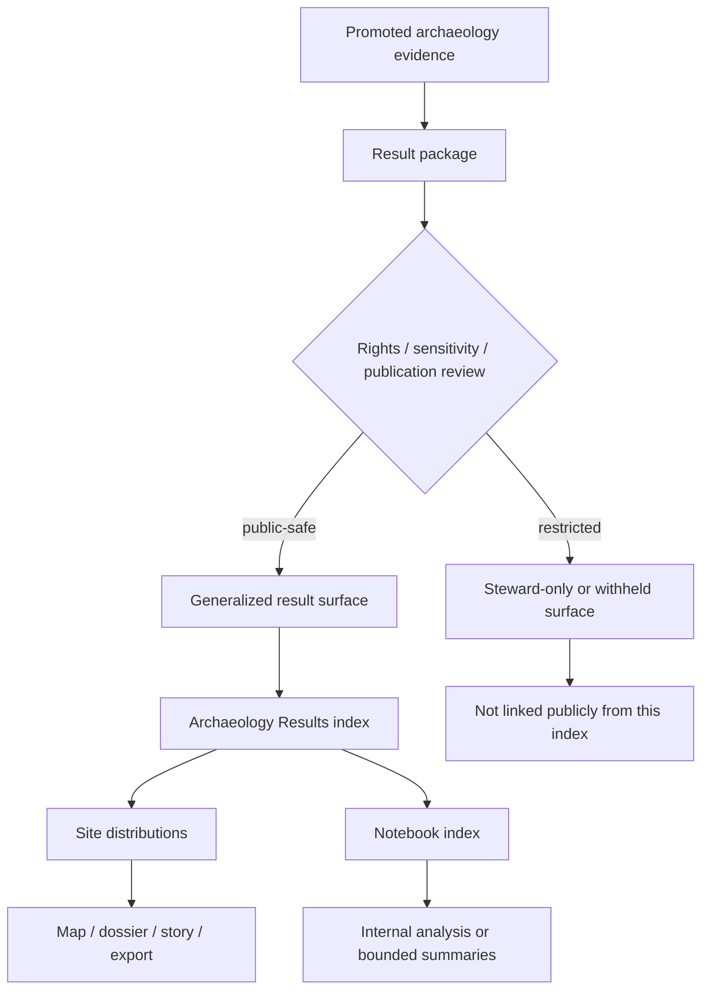

<!-- [KFM_META_BLOCK_V2]
doc_id: kfm://doc/<REVIEW-REQUIRED-UUID>
title: Archaeology Results
type: standard
version: v1
status: draft
owners: <REVIEW-REQUIRED: archaeology stewards>
created: <REVIEW-REQUIRED>
updated: <REVIEW-REQUIRED>
policy_label: <REVIEW-REQUIRED: public|restricted|mixed>
related: [<REVIEW-REQUIRED: ../README.md>, <REVIEW-REQUIRED: ./site-distributions/README.md>, <REVIEW-REQUIRED: ./notebooks/README.md>]
tags: [kfm, archaeology, results]
notes: [Mounted repo not directly inspected in this session; child paths, owners, and dates require verification before commit.]
[/KFM_META_BLOCK_V2] -->

<a id="top"></a>

# Archaeology Results

Public-safe index for promoted archaeology result surfaces, their publication boundaries, and their governed use inside KFM.

| Field | Value |
| --- | --- |
| Status | `experimental` |
| Owners | `<REVIEW-REQUIRED>` |
| Badges |      |
| Quick jump | [Scope](#scope) · [Repo fit](#repo-fit) · [Inputs](#inputs) · [Exclusions](#exclusions) · [Directory tree](#directory-tree) · [Quickstart](#quickstart) · [Usage](#usage) · [Flow](#flow) · [Reference tables](#reference-tables) · [Task list](#task-list) · [FAQ](#faq) · [Appendix](#appendix) |

> [!IMPORTANT]
> This README is doctrine-grounded, but **mounted repository verification was not available in this session**. Treat child paths, owners, identifiers, and timestamps marked `REVIEW-REQUIRED`, `INFERRED`, or `UNKNOWN` as commit-review items rather than settled repo fact.

## Scope

This directory is the results-layer landing zone for **promoted archaeology outputs** that are safe to index, describe, compare, and route onward into governed KFM surfaces.

At this layer, archaeology is not treated as a loose bundle of maps, notebooks, or illustrations. Results are expected to remain downstream of evidence, provenance, policy, review, and release state. This README therefore acts as an index and a guardrail, not as a substitute for canonical records, EvidenceBundles, or steward review.

### Status posture used here

| Layer | Status | Meaning |
| --- | --- | --- |
| Governing archaeology publication doctrine | `CONFIRMED` | Supported by the visible KFM corpus |
| Results-root child structure | `INFERRED` | Strongly suggested by archaeology planning material, but not repo-verified here |
| Mounted repo topology and neighboring files | `UNKNOWN` | Not directly inspectable in this session |
| Placeholder metadata values in the KFM meta block | `NEEDS VERIFICATION` | Must be filled from mounted repo truth before commit |

[Back to top](#top)

## Repo fit

**Path:** `docs/analyses/archaeology/results/README.md`

**Upstream:** `../README.md` — `NEEDS VERIFICATION`

**Downstream:**  
- `./site-distributions/README.md` — `INFERRED` from archaeology planning material  
- `./notebooks/README.md` — `INFERRED` from archaeology planning material

### What this README does in the repo

- gives maintainers a stable entry point for archaeology result surfaces
- distinguishes what belongs in public-safe result docs from what belongs in steward-only or pre-release layers
- keeps precision, provenance, and publication burdens visible at the point of navigation
- prevents result summaries from quietly replacing governed evidence objects

[Back to top](#top)

## Inputs

### Accepted inputs

This directory may contain or index:

- promoted archaeology result summaries
- generalized spatial pattern outputs
- public-safe distribution analyses
- release-backed result notes with provenance context
- result-level README files for cleared child modules
- notebook indexes **only when their exposure class is explicit**
- links to related schemas, manifests, or proof artifacts **once verified in the mounted repo**

### Minimum expectations for anything linked here

Any child result surface should make these items inspectable:

1. what the result represents
2. what publication class applies
3. what precision controls were applied
4. what provenance or evidence path supports it
5. whether the result is observational, analytical, modeled, or interpretive
6. what remains withheld, generalized, or unavailable

[Back to top](#top)

## Exclusions

This directory is **not** the place for:

- RAW, WORK, or QUARANTINE archaeology material
- exact find spots or precision that exceeds the approved publication class
- unpublished candidate analyses
- unreviewed notebook snapshots
- excavation working notes
- derived narratives without evidence linkage
- AI-generated interpretation that adds speculation, re-attribution, or unverified claims
- 3D outputs published merely because they are visually impressive

### Put these elsewhere instead

| Material | Keep out of `results/` because... | Put it in... |
| --- | --- | --- |
| Raw field captures, trench logs, ingestion outputs | not yet publication-safe | upstream intake / working lanes |
| Precise sensitive coordinates | may create site, rights, or stewardship risk | steward-restricted surfaces |
| Candidate notebooks and intermediate models | not yet governed outputs | internal analysis or methods lanes |
| Release evidence, manifests, receipts | trust objects, not result prose | release / catalog / proof-pack surfaces |
| Public stories or map apps | downstream delivery surfaces | governed product surfaces |

[Back to top](#top)

## Directory tree

```text
docs/analyses/archaeology/results/
├── README.md                         # this file
├── site-distributions/               # INFERRED; verify mounted path
│   └── README.md                     # generalized site-distribution results
└── notebooks/                        # INFERRED; verify mounted path
    └── README.md                     # index for archaeology analysis notebooks
```

> [!NOTE]
> The two child modules above are included because archaeology planning material names them explicitly. Their **mounted existence, exact path spelling, and local section conventions still need repo verification**.

[Back to top](#top)

## Quickstart

### Add a new result module safely

1. Confirm the source output is **promoted**, not merely generated.
2. Confirm the publication class and precision controls are explicit.
3. Create or update the child README for the result family.
4. Add the child module to the table in [Known result modules](#known-result-modules).
5. State what was generalized, withheld, or left unresolved.
6. Link outward only to governed, reviewable artifacts.

### Review this root README before commit

```bash
# Review checklist (illustrative; adjust to mounted repo reality)
# 1. Replace REVIEW-REQUIRED placeholders
# 2. Verify upstream/downstream relative links
# 3. Confirm child directories actually exist
# 4. Confirm exposure class for each child module
# 5. Confirm this README does not imply exact locations are public
```

[Back to top](#top)

## Usage

### For maintainers

Use this README as the first stop when adding a new archaeology result surface. The goal is to decide whether the material is:

- ready for public-safe indexing,
- only fit for steward or internal use,
- still a candidate output,
- or blocked pending rights, sensitivity, or provenance review.

### For reviewers

Review this directory as a **publication boundary**, not just a documentation folder. A good review asks:

- Is the result clearly downstream of governed evidence?
- Is the precision appropriate to the publication class?
- Is the exposure class obvious?
- Does the doc distinguish observed findings from modeled or interpretive outputs?
- Does it avoid letting convenience layers become sovereign truth?

### For product and UX work

Treat this directory as a content registry for archaeology result surfaces that may later appear in map, dossier, story, compare, or export contexts. The README should make those surfaces easier to govern, not easier to overstate.

[Back to top](#top)

## Flow



[Back to top](#top)

## Reference tables

### Results-layer rules

| Rule | Why it matters |
| --- | --- |
| Results stay downstream of governed evidence | prevents summary prose from replacing canonical truth |
| Public-safe archaeology outputs must tolerate precision reduction | protects sensitive locations and stewardship obligations |
| Generalization must be visible, not implied away | keeps users from mistaking redacted outputs for exact records |
| Notebook indexes need an explicit exposure class | avoids accidental publication through documentation |
| 2D remains the default explanatory surface | keeps visual escalation proportional to actual analytical need |
| 3D requires burden-bearing justification | avoids conflating spectacle with evidence |

### Known result modules

| Module | Intended role | Exposure | Status in this draft | Notes |
| --- | --- | --- | --- | --- |
| `site-distributions/` | generalized spatial distributions, clusters, density patterns, interaction zones | public-safe | `INFERRED` | archaeology planning material suggests public/generalized use |
| `notebooks/` | index of archaeology analysis notebooks | mixed / likely internal-first | `INFERRED` | planning material suggests a notebook index with stronger restrictions |
| additional result families | future promoted result sets | TBD | `UNKNOWN` | do not add ad hoc; verify against mounted repo and publication burden |

### Result-doc content expectations

| Section | Keep it concise | Why it belongs |
| --- | --- | --- |
| Purpose | yes | tells readers what the result is actually for |
| Method / basis | yes | distinguishes observed vs modeled vs interpretive |
| Publication limits | yes | makes redaction and withholding visible |
| Provenance / evidence hooks | yes | keeps inspectability alive |
| Status / review state | yes | shows whether the result is stable, draft, or pending |
| Related modules | yes | helps GitHub navigation without duplicating evidence objects |

[Back to top](#top)

## Task list

- [ ] Verify whether `docs/analyses/archaeology/results/README.md` already exists in the mounted repo.
- [ ] Confirm the exact upstream archaeology README path.
- [ ] Confirm whether `site-distributions/` exists and is still the preferred public-safe result module name.
- [ ] Confirm whether `notebooks/` belongs under `results/` in the mounted repo, and whether its exposure class is internal.
- [ ] Replace all `REVIEW-REQUIRED` placeholders in the KFM meta block.
- [ ] Confirm owners, dates, UUID, and policy label from mounted repo truth.
- [ ] Add verified links to manifests, schemas, or proof artifacts only after path confirmation.
- [ ] Confirm whether this root README should be `public`, `restricted`, or `mixed`.
- [ ] Check neighboring docs for local badge, heading, and metadata conventions.
- [ ] Run commit review for terminology drift: `generalized`, `withheld`, `promoted`, `publication class`, `steward review`.

[Back to top](#top)

## FAQ

### Why are generalized results acceptable here, but exact records are not?

Because archaeology publication burden is not only technical. It includes rights, sensitivity, and location-risk considerations. This directory should therefore favor public-safe, generalized result surfaces over precise disclosures.

### Do notebooks belong in `results/`?

Sometimes. A notebook **index** may belong here if its exposure class is explicit and its linked artifacts are publication-safe. Unreviewed notebooks or sensitive notebook outputs should not be indexed here.

### When should a result use 3D?

Only when 2D is materially insufficient and the additional governance burden has been accepted. The default posture remains 2D-first.

### Can this README link directly to maps, stories, or exports?

Yes, but only when those surfaces are governed, reviewable, and consistent with the same publication class and precision rules described here.

[Back to top](#top)

## Appendix

<details>
<summary><strong>Publication checklist for archaeology result docs</strong></summary>

### Before a child result README is added here

- publication class is explicit
- precision policy is explicit
- result type is explicit: observational / analytical / modeled / interpretive
- provenance or evidence route is named
- withheld or generalized material is declared
- links do not bypass governed surfaces
- status language does not imply mounted implementation that has not been verified

### Language to avoid

- “authoritative map” for a derived result surface
- “complete” when coverage is partial
- “exact” when coordinates were generalized
- “verified” when only planning material is visible
- “safe to publish” without a stated publication basis

</details>

<details>
<summary><strong>Status vocabulary used in this README</strong></summary>

| Label | Use here |
| --- | --- |
| `CONFIRMED` | directly supported by the visible KFM corpus |
| `INFERRED` | strongly suggested by project planning material, but not mounted-path verified |
| `PROPOSED` | recommended structure or workflow shape |
| `UNKNOWN` | not directly verified in this session |
| `NEEDS VERIFICATION` | must be checked against the mounted repo before commit |

</details>

---

Built for a KFM review posture: doctrine first, precision visible, and publication claims kept proportional to evidence.

[Back to top](#top)
