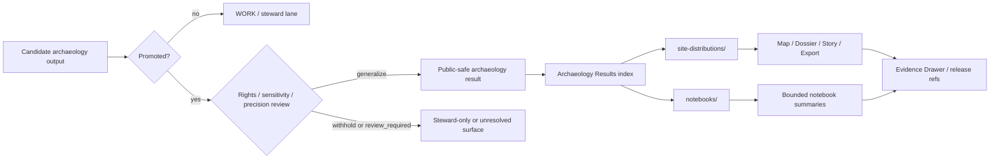

<!-- [KFM_META_BLOCK_V2]
doc_id: kfm://doc/<REVIEW-REQUIRED-UUID>
title: Archaeology Results
type: standard
version: v1
status: draft
owners: <REVIEW-REQUIRED: archaeology stewards>
created: <REVIEW-REQUIRED>
updated: <REVIEW-REQUIRED>
policy_label: <REVIEW-REQUIRED: public|restricted|mixed>
related: [<REVIEW-REQUIRED: ../README.md>, <REVIEW-REQUIRED: ./site-distributions/README.md>, <REVIEW-REQUIRED: ./notebooks/README.md>]
tags: [kfm, archaeology, results]
notes: [Mounted repo paths, owners, dates, and related links were not directly visible in this session; keep placeholders until commit review resolves them.]
[/KFM_META_BLOCK_V2] -->

<a id="top"></a>

# Archaeology Results

Public-safe index for promoted archaeology result surfaces and their governed publication boundaries inside KFM.

| Field | Value |
| --- | --- |
| Status | `experimental` |
| Owners | `<REVIEW-REQUIRED: archaeology stewards>` |
| Repo fit | `docs/analyses/archaeology/results/README.md` — `INFERRED` |
| Badges |      |
| Quick jump | [Scope](#scope) · [Repo fit](#repo-fit) · [Inputs](#inputs) · [Exclusions](#exclusions) · [Directory tree](#directory-tree) · [Quickstart](#quickstart) · [Architecture fit](#architecture-fit) · [Diagram](#diagram) · [Reference tables](#reference-tables) · [Task list](#task-list) · [FAQ](#faq) · [Appendix](#appendix) |

> [!IMPORTANT]
> This README is doctrine-grounded, but mounted repository verification was not available in this session. Treat every path, owner, date, and child-module detail marked `INFERRED`, `UNKNOWN`, `NEEDS VERIFICATION`, or `REVIEW-REQUIRED` as a commit-review item, not as settled repo fact.

## Scope

This directory is the results-layer landing zone for archaeology outputs that are **already promoted**, **public-safe enough to index**, and **still traceable back to governed evidence**.

In the visible KFM corpus, archaeology is confirmed mainly through burden-bearing governance rules rather than through a fully surfaced standalone lane. The corpus explicitly treats archaeology as part of the rights/sensitivity/exact-location review problem, and it also treats archives, heritage, and public-memory material as provenance-heavy, rights-bearing sources. This README therefore stays narrow on purpose: it governs **how archaeology results may appear here**, not a broader claim that the mounted repo already contains a fully implemented archaeology lane.

### Archaeology fit in the visible corpus

| Area | Status | What that means here |
| --- | --- | --- |
| Rights / sensitivity workflow for archaeology and exact-location cases | `CONFIRMED` | archaeology results may require generalization, withholding, or steward review before outward use |
| Provenance burden for archives / heritage / public-memory material | `CONFIRMED` | narrative convenience must not erase source basis, rights posture, or cultural sensitivity |
| 2D as the default public reasoning surface | `CONFIRMED` | archaeology results should default to 2D unless 3D clearly carries real explanatory burden |
| Controlled 3D with Evidence Drawer parity | `CONFIRMED` | any 3D result must preserve the same evidence, audit, policy, and correction cues as 2D surfaces |
| Archaeology as a separately mounted repo lane | `UNKNOWN` | not directly verified from visible repo/workspace evidence in this session |
| Exact README path, upstream link, and child-module topology | `INFERRED` | strongly suggested by the uploaded baseline, but not mounted-path verified |

### What belongs here, in one sentence

**Promoted, public-safe, evidence-linked archaeology result surfaces** belong here.

[Back to top](#top)

## Repo fit

**Path:** `docs/analyses/archaeology/results/README.md` — `INFERRED`

**Upstream:** `../README.md` — `NEEDS VERIFICATION`  
**Downstream:** `./site-distributions/README.md`, `./notebooks/README.md` — `INFERRED`

### Role in the repository

This README should help maintainers and reviewers answer four questions quickly:

1. Is this archaeology output **promoted** or still a working candidate?
2. Is it safe to expose at this results layer, or does it belong in a steward-restricted lane?
3. Is the result **generalized, partial, modeled, interpretive, conflicted, or withdrawn** in a way that must remain visible?
4. Does the result link onward to governed evidence, rather than quietly replacing it?

### What this README is not

This is not the archaeology datasets lane, not a proof-pack directory, and not a substitute for source descriptors, dataset versions, release manifests, EvidenceBundles, or correction notices. It is a **navigation and boundary document** for outward-facing result surfaces.

[Back to top](#top)

## Inputs

### Accepted inputs

This directory may contain or index:

- promoted archaeology result summaries
- generalized site-distribution outputs
- public-safe density, cluster, or pattern surfaces
- result-level README files for steward-cleared child modules
- notebook indexes **only when their exposure class is explicit**
- links to release-backed manifests, proofs, or evidence hooks **once mounted paths are verified**
- bounded 2.5D / 3D result surfaces **only when 2D is materially insufficient and the same evidence, policy, and correction burdens still apply**

### Minimum expectations for anything linked here

| Expectation | Why it matters |
| --- | --- |
| What the result represents | prevents vague or decorative publication |
| Whether it is observational, analytical, modeled, or interpretive | keeps method and claim type visible |
| What publication class applies | avoids accidental exposure drift |
| What precision controls were used | especially important for archaeology sensitivity |
| What was generalized, withheld, or omitted | prevents exactness from being implied |
| What evidence / provenance route supports it | keeps inspectability alive |
| What review or release state applies | shows whether the result is stable, draft, partial, or withdrawn |

### Typical input examples

- generalized density or distribution outputs
- result notes derived from steward-reviewed trench, site, or survey material
- publication-safe figures or derivative rasters
- bounded notebook indexes pointing to released analysis artifacts

[Back to top](#top)

## Exclusions

This directory is **not** the place for:

- RAW, WORK, or QUARANTINE archaeology material
- exact site coordinates or other precision beyond the approved publication class
- unreviewed notebooks or exploratory scratch outputs
- unpublished candidate interpretations
- raw trench photography or raw geophysics deliverables awaiting steward review
- direct dumps of derived AI output without evidence linkage and review context
- spectacle-first 3D scenes published merely because they are visually impressive

### Put these elsewhere instead

| Material | Keep it out of `results/` because... | Put it in... |
| --- | --- | --- |
| RAW captures, field notes, trench logs, draft ingest outputs | not publication-safe | upstream intake / working lanes |
| Exact locations and other sensitive coordinates | may create stewardship or exposure risk | steward-restricted surfaces |
| Unreviewed notebooks and intermediate models | not yet promoted | internal analysis or methods lanes |
| Release proofs, manifests, receipts, and correction artifacts | these are trust objects, not result prose | release / catalog / proof-pack surfaces |
| Public stories, civic explainers, or app views | they are downstream publication surfaces, not the result index itself | governed product surfaces |
| Human remains or otherwise restricted materials without explicit steward clearance | sensitivity and rights burden is higher | steward-only review lanes |

[Back to top](#top)

## Directory tree

```text
docs/analyses/archaeology/results/
├── README.md                         # this file
├── site-distributions/               # INFERRED; verify mounted path
│   └── README.md                     # generalized distributions, clusters, density surfaces
└── notebooks/                        # INFERRED; verify mounted path
    └── README.md                     # index of publication-safe or explicitly bounded notebooks
```

> [!NOTE]
> The tree above reflects only the child modules named in the uploaded baseline draft. Treat it as a conservative starter shape until the mounted repo confirms what is actually present nearby.

[Back to top](#top)

## Quickstart

### Add a new archaeology result module safely

1. Confirm the source output is **promoted**, not merely generated.
2. Confirm the publication class and precision controls are explicit.
3. Decide whether the result belongs here or in a steward-restricted lane.
4. Create or update the child README for that result family.
5. State whether the result is observational, analytical, modeled, interpretive, or mixed.
6. Declare what was generalized, withheld, partial, or still unresolved.
7. Link only to governed, reviewable artifacts.
8. Add or update the module entry in [Named result modules](#named-result-modules).

### Minimal child README pattern

```md
# <Result family title>

One-line purpose.

- Publication class: `public-safe|mixed|restricted`
- Result type: `observational|analytical|modeled|interpretive`
- Precision policy: `generalized|withheld|review-required`
- Evidence route: `<release ref / manifest / EvidenceBundle / catalog link>`
- Review state: `promoted|partial|conflicted|withdrawn`
```

### Commit-review checklist

```text
1. Replace `REVIEW-REQUIRED` placeholders in the meta block.
2. Verify upstream/downstream relative links.
3. Confirm child directories actually exist.
4. Confirm policy label and exposure class.
5. Confirm no exact-location disclosure is implied.
6. Confirm modeled / generalized / partial / withdrawn states are labeled in-place.
7. Remove or add child-module rows to match mounted repo truth.
```

[Back to top](#top)

## Architecture fit

This README is small, but it still sits inside KFM's larger doctrine.

| KFM doctrine | Result-layer consequence here |
| --- | --- |
| Canonical truth path | nothing belongs here unless it is already downstream of governed promotion and release state |
| Trust membrane | this index links to governed surfaces; it does not create a bypass around evidence or policy |
| Evidence Drawer / inspectable claim | every consequential result should remain one hop from evidence and review context |
| Rights / sensitivity workflow | archaeology and exact-location cases may need `generalize`, `withhold`, or `review_required` handling |
| 2D-by-default reasoning | 2D is the default explanatory surface for archaeology results |
| Controlled 3D | 3D is acceptable only when it materially improves reasoning and keeps Evidence Drawer parity |
| Correction visibility | narrowed, superseded, conflicted, or withdrawn result states should stay visible rather than vanish |

[Back to top](#top)

## Diagram



[Back to top](#top)

## Reference tables

### Results-layer rules

| Rule | Why it matters |
| --- | --- |
| Results stay downstream of evidence and release state | prevents summaries from replacing canonical support |
| Promotion is required; generation alone is not enough | generated output is not automatically publishable |
| Generalization must be visible, not implied away | readers should not mistake safe outputs for exact records |
| Notebook indexes need an explicit exposure class | avoids accidental publication through documentation |
| 2D remains the default explanatory surface | lowers governance burden for public reasoning |
| 3D or 2.5D must justify itself | archaeology volumetrics should improve reasoning, not just presentation |
| Exact-location risk must fail closed | archaeology sensitivity is not a cosmetic concern |

### Surface-state cues

| Surface cue | Use it when... | Reader takeaway |
| --- | --- | --- |
| `promoted` | the result passed its release boundary | safe to treat as governed output within stated scope |
| `generalized` | precision was intentionally reduced | do not treat as exact location or exact geometry |
| `partial` | coverage or interpretation is incomplete | absence may reflect incomplete scope, not nonexistence |
| `modeled` | the output is analytical or simulated | useful, but not a direct observation |
| `source-dependent` | the result relies on still-bounded support | confidence and reuse should stay proportional |
| `conflicted` | evidence or interpretation is unresolved | read with explicit caution |
| `withdrawn` | the result should no longer be treated as current | follow replacement or correction linkage |
| `restricted / withheld` | public exposure would be unsafe or unresolved | steward review is still carrying the burden |

### Reason and obligation cues that fit archaeology

| Cue | When it applies | Expected result-layer behavior |
| --- | --- | --- |
| `generalize` | exactness would create location or stewardship risk | serve only the reduced-precision form |
| `withhold` | publication would be unsafe | do not list or render on public-safe surfaces |
| `review_required` | support, rights, or interpretation remain unresolved | escalate before outward use |
| `disclose_partial` | coverage or interpretation is incomplete | label incompleteness in-place |
| `disclose_modeled` | the result is analytical or simulated | keep modeled status visible |
| `cite` | a result claim is consequential | attach inspectable evidence or fail closed |

### Named result modules

| Module | Intended role | Exposure | Status in this draft | Notes |
| --- | --- | --- | --- | --- |
| `site-distributions/` | generalized site distributions, clusters, density, probability-style surfaces | public-safe / generalized | `INFERRED` | named in the uploaded baseline draft; mounted repo verification pending |
| `notebooks/` | index of archaeology notebooks or notebook-backed outputs | mixed / likely internal-first | `INFERRED` | named in the uploaded baseline draft; only publication-safe notebook indexes should appear here |
| additional result families | future promoted archaeology result sets | TBD | `UNKNOWN` | verify mounted repo before adding them to the main tree |

### Child result-doc content expectations

| Section | Keep it concise | Why it belongs |
| --- | --- | --- |
| Purpose | yes | clarifies what the result is actually for |
| Method / basis | yes | distinguishes observed vs modeled vs interpretive |
| Publication limits | yes | makes generalization and withholding visible |
| Evidence / provenance hooks | yes | preserves inspectability |
| Status / review state | yes | avoids false finality |
| Related modules | yes | helps GitHub navigation without duplicating canonical records |

[Back to top](#top)

## Task list

- [ ] Verify whether `docs/analyses/archaeology/results/README.md` already exists in the mounted repo.
- [ ] Confirm the exact upstream archaeology README path.
- [ ] Confirm whether `site-distributions/` exists and is still the preferred public-safe result module name.
- [ ] Confirm whether `notebooks/` belongs under `results/` in the mounted repo, and whether its exposure class is internal, mixed, or public-safe.
- [ ] Replace all `REVIEW-REQUIRED` placeholders in the KFM meta block.
- [ ] Confirm owners, dates, UUID, and policy label from mounted repo truth.
- [ ] Add verified links to manifests, schemas, or proof artifacts only after path confirmation.
- [ ] Remove or add module rows so this README matches mounted repo reality.
- [ ] Confirm whether this root README should be labeled `public`, `restricted`, or `mixed`.
- [ ] Check neighboring docs for local badge, heading, metadata, and README conventions.

[Back to top](#top)

## FAQ

### Why are generalized results acceptable here, but exact records are not?

Because archaeology publication burden is not only technical. It includes rights, sensitivity, precision, and stewardship risk. This layer should therefore prefer generalized, public-safe results over exact disclosures.

### Do notebooks belong in `results/`?

Sometimes. A notebook **index** may belong here if its exposure class is explicit and the linked artifacts are publication-safe. Unreviewed notebooks or sensitive notebook outputs should not be indexed here.

### When should a result use 3D?

Only when 2D is materially insufficient and the additional governance burden has been accepted. Archaeology can justify 3D for trench, stratigraphic, or subsurface reasoning, but that does not relax evidence, policy, or correction requirements.

### Can this README link directly to maps, stories, or exports?

Yes, but only when those surfaces are governed, reviewable, and consistent with the same publication class and precision rules described here.

### Is this directory the same thing as the archaeology datasets lane?

No. Datasets, evidence objects, manifests, and proofs remain distinct from result-oriented navigation. This README should point toward them, not absorb their role.

[Back to top](#top)

## Appendix

<details>
<summary><strong>Publication checklist for archaeology result docs</strong></summary>

### Before a child result README is added here

- publication class is explicit
- precision policy is explicit
- result type is explicit: observational / analytical / modeled / interpretive
- provenance or evidence route is named
- generalized or withheld material is declared
- linked surfaces do not bypass governed publication surfaces
- status language does not imply mounted implementation that has not been verified
- any 3D / 2.5D reasoning burden is explained

### Language to avoid

- `authoritative map` for a derived result surface
- `complete` when coverage is partial
- `exact` when coordinates were generalized
- `verified` when only planning or doctrine material is visible
- `safe to publish` without a stated publication basis

</details>

<details>
<summary><strong>Status vocabulary used in this README</strong></summary>

| Label | Use here |
| --- | --- |
| `CONFIRMED` | directly supported by visible KFM corpus evidence |
| `INFERRED` | strongly suggested by the visible corpus or uploaded baseline, but not mounted-path verified |
| `PROPOSED` | recommended structure or future-safe packaging move |
| `UNKNOWN` | not directly verified in this session |
| `NEEDS VERIFICATION` | must be checked against the mounted repo before commit |

</details>

---

Built for a KFM archaeology review posture: doctrine first, precision visible, and public-safe result claims kept proportional to evidence.

[Back to top](#top)
