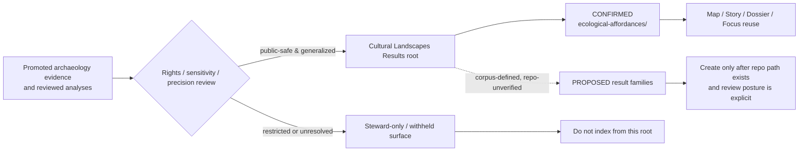

<!-- [KFM_META_BLOCK_V2]
doc_id: kfm://doc/<REVIEW-REQUIRED-UUID>
title: Cultural Landscapes Results
type: standard
version: v1
status: review
owners: <REVIEW-REQUIRED: archaeology stewards>
created: <REVIEW-REQUIRED: YYYY-MM-DD>
updated: <REVIEW-REQUIRED: YYYY-MM-DD>
policy_label: <REVIEW-REQUIRED: public|restricted|mixed>
related: [../README.md, ../../README.md, ./ecological-affordances/README.md]
tags: [kfm]
notes: [Current public repo tree at this path is verified; owners, dates, policy label, and corpus-described expansion modules still need merge-time verification.]
[/KFM_META_BLOCK_V2] -->

# Cultural Landscapes Results

Public-safe index for generalized cultural-landscape result surfaces and their governed publication boundaries inside KFM.

> **Status:** experimental  
> **Owners:** `NEEDS VERIFICATION`  
>       
> **Quick jumps:** [Scope](#scope) · [Repo fit](#repo-fit) · [Accepted inputs](#accepted-inputs) · [Exclusions](#exclusions) · [Current verified baseline](#current-verified-baseline) · [Directory tree](#directory-tree) · [Quickstart](#quickstart) · [Usage](#usage) · [Diagram](#diagram) · [Reference tables](#reference-tables) · [Task list](#task-list) · [FAQ](#faq) · [Appendix](#appendix)  
> **Evidence posture:** `CONFIRMED` current public repo path + local tree · `CONFIRMED` KFM doctrine on evidence / release / sensitivity · `PROPOSED` expansion candidates from archaeology design docs · `NEEDS VERIFICATION` owners, dates, policy label, and any not-yet-created child modules

> [!IMPORTANT]
> This root README does two jobs at once:
> 1. preserve the **current checked-in directory reality**, and  
> 2. keep the **broader cultural-landscape design direction** visible without pretending that every corpus-described module already exists in the repo.  
> The main tree below therefore lists only confirmed local paths. Expansion families from the archaeology corpus are staged separately and clearly labeled.

## Scope

`docs/analyses/archaeology/results/cultural-landscapes/` is the result-layer landing zone for **promoted, public-safe, generalized cultural-landscape outputs** inside KFM.

At this layer, cultural landscapes are not a loose pile of maps, notebooks, figures, tiles, or atmospheric narrative. They remain downstream of:

- evidence and release state
- rights, sensitivity, and precision review
- provenance and correction lineage
- visible method and uncertainty limits

In practical terms, this README should make five things easy to answer:

1. What kind of cultural-landscape result is being indexed here?
2. What is **confirmed in the current repo tree** versus only described in supporting archaeology materials?
3. What precision, redaction, or withholding posture qualifies reuse?
4. Which child modules are actually present today?
5. What should reviewers verify before broadening the lane?

This README should behave as an **index of bounded result surfaces**, not as a sovereign source of archaeological truth.

## Repo fit

| Item | Value |
| --- | --- |
| Path | `docs/analyses/archaeology/results/cultural-landscapes/README.md` |
| Role | Root index and publication-boundary README for cultural-landscape result surfaces |
| Upstream | [`../README.md`](../README.md) · [`../../README.md`](../../README.md) |
| Confirmed downstream | [`./ecological-affordances/README.md`](./ecological-affordances/README.md) |
| Adjacent sibling lanes | [`../geophysics/`](../geophysics/) · [`../notebooks/`](../notebooks/) · [`../paleoenvironment/`](../paleoenvironment/) |
| Owning non-result surfaces | route methods, contracts, schemas, policy, release artifacts, and proof objects to their owning repo layers rather than absorbing them here |
| Corpus-described but not current-tree-confirmed children | `interaction-spheres/`, `corridors/`, `settlement-patterns/`, `temporal/`, `predictive/`, `stac/`, `metadata/`, `provenance/` |

### Why this lane exists

The cultural-landscapes lane is where archaeology-facing synthesis becomes navigable **after** it is safe enough to index. That makes it narrower than an archaeology research notebook lane and broader than a single result-family README.

[Back to top](#cultural-landscapes-results)

## Accepted inputs

This directory may contain or index:

- promoted child result-family READMEs
- generalized cultural-landscape outputs that describe broad spatial tendencies rather than exact sites
- ecological affordance summaries and similarly bounded environmental-context surfaces
- result-level STAC, DCAT, or PROV links **when those supporting paths actually exist**
- uncertainty notes, masking notes, and reuse limits
- public-safe figures, maps, tiles, or exports that stay consistent with the same sensitivity posture
- Focus / Story / Dossier support summaries **only when they remain evidence-linked and non-speculative**
- 2.5D or 3D result surfaces **only when they carry real reasoning burden and do not relax sensitivity rules**

### What a child result surface should make easy to inspect

| Expectation | Why it matters |
| --- | --- |
| What the result represents | avoids decorative or vague publication |
| Whether it is observational, analytical, modeled, or interpretive | keeps claim type visible |
| What precision controls were applied | archaeology sensitivity is often a location problem |
| What was generalized, withheld, or excluded | prevents safe outputs from being mistaken for exact records |
| What evidence / provenance route supports it | preserves inspectability |
| What review or release state applies | prevents false finality |

## Exclusions

This directory is **not** the place for:

- RAW, WORK, or QUARANTINE archaeology material
- exact site coordinates or other precision beyond the approved publication class
- sacred or otherwise restricted cultural geographies
- tribal, ethnic, or cultural-ownership attribution derived from generalized landscape outputs
- speculative ethnogenesis, unreviewed cultural-boundary reconstruction, or exact travel-route reconstruction
- unreviewed notebooks, scratch analyses, or unpublished candidate models
- direct dumps of AI output without evidence linkage and review context
- operational methods, schema contracts, policy bundles, manifests, or release proofs that belong in their owning repo surfaces
- spectacle-first 3D scenes published because they are impressive rather than necessary

> [!CAUTION]
> Public-safe does **not** mean precision-safe by default.  
> Cultural-landscape outputs should fail closed whenever reuse could imply exact locations, restricted boundaries, sacred landscapes, or culturally sensitive inference.

## Current verified baseline

| Item | Status | Notes |
| --- | --- | --- |
| `docs/analyses/archaeology/results/cultural-landscapes/README.md` exists | **CONFIRMED** | current checked-in file is still extremely thin |
| `ecological-affordances/` exists beneath this path | **CONFIRMED** | the only confirmed child module in the current local tree |
| `ecological-affordances/README.md` depth | **CONFIRMED** | currently placeholder-level and still needs a governed lane README |
| broader cultural-landscape family in archaeology design corpus | **PROPOSED** | attached archaeology materials describe additional modules and registries |
| owners, created date, updated date, policy label, UUID | **NEEDS VERIFICATION** | not carried with enough certainty in the checked-in file to present as settled repo truth |
| machine-readable support registries (`stac/`, `metadata/`, `provenance/`) under this path | **PROPOSED** | strong corpus fit, but not current-tree fact here |

### Reading rule for this directory

Use **confirmed local tree** for navigation. Use **corpus-described candidates** only as staged expansion guidance until corresponding repo paths actually exist.

## Directory tree

### Confirmed current tree

```text
docs/analyses/archaeology/results/cultural-landscapes/
├── README.md
└── ecological-affordances/
    └── README.md
```

> [!NOTE]
> Keep this section exact to the current tree.  
> Do **not** silently add corpus-proposed modules here until the repo actually contains them.

[Back to top](#cultural-landscapes-results)

## Quickstart

### Revise this root index safely

1. Verify the local directory inventory before changing path claims.
2. Replace merge-time placeholders in the KFM meta block.
3. Keep the confirmed tree exact.
4. Move any broader expansion idea into the staged tables or appendix unless the path now exists.
5. Check that every new link stays consistent with the lane’s public-safe / generalized posture.
6. Confirm that nothing here quietly upgrades modeled or interpretive outputs into canonical truth.

### Add a new child module

```bash
# Inspect the live local tree first
ls docs/analyses/archaeology/results/cultural-landscapes

# Copy the checked-in analysis template when a new child module is approved
cp docs/analyses/_templates/analysis_readme.md \
  docs/analyses/archaeology/results/cultural-landscapes/<module>/README.md
```

Then, before linking that module from this root README:

1. confirm the module path exists,
2. declare whether it is public-safe, mixed, or steward-restricted,
3. make its generalization / withholding posture explicit,
4. add evidence and provenance hooks,
5. mark any unresolved metadata as `NEEDS VERIFICATION`.

## Usage

### For maintainers

Use this README as the first stop when deciding whether a cultural-landscape output belongs here or somewhere else. The main question is not only “is this useful?” but also:

- is it promoted,
- is it generalized enough for this lane,
- does it stay downstream of evidence,
- and does it avoid accidental precision drift?

### For reviewers

Review this directory as a **publication boundary**, not as a neutral docs folder.

Good review questions include:

- Does the module distinguish environmental affordance from cultural attribution?
- Does any modeled surface say so plainly?
- Is uncertainty visible enough to prevent over-reading?
- Are missing child modules being described as future work rather than current inventory?
- Are exact-location, route-reconstruction, or identity-inference risks handled fail-closed?

### For downstream product surfaces

Story, Focus, Dossier, Compare, or Export surfaces may reuse outputs indexed here only when they preserve the same public-safe, generalized, evidence-linked posture. This README should increase clarity, not widen permission silently.

## Diagram



## Reference tables

### Module matrix

| Module | Intended role | Current repo status | Publication posture |
| --- | --- | --- | --- |
| `ecological-affordances/` | environmental opportunity / constraint summaries across soils, hydrology, vegetation, terrain, climate, or seasonality | **CONFIRMED** local child | generalized / public-safe |
| `interaction-spheres/` | generalized cultural interaction regions or landscape-scale affinity surfaces | **PROPOSED** from archaeology design docs | generalized / review-bearing |
| `corridors/` | environmentally grounded movement or corridor affordance models, not exact historical trails | **PROPOSED** from archaeology design docs | generalized / public-safe |
| `settlement-patterns/` | landscape-scale settlement density, persistence, and environmental correlation summaries | **PROPOSED** from archaeology design docs | generalized / public-safe |
| `temporal/` | OWL-Time-aligned cultural-landscape sequences and phase transitions | **PROPOSED** from archaeology design docs | generalized / public-safe |
| `predictive/` | environmental-only predictive cultural-landscape models with uncertainty | **PROPOSED** from archaeology design docs | generalized / review-bearing |
| `stac/` | machine-readable spatiotemporal registry for result assets | **PROPOSED** from archaeology design docs | mixed / verify before exposure |
| `metadata/` | DCAT / JSON-LD and related crosswalk material | **PROPOSED** from archaeology design docs | mixed / verify before exposure |
| `provenance/` | PROV-O lineage, transformation trace, masking lineage, and audit hooks | **PROPOSED** from archaeology design docs | mixed / likely review-bearing |

### Minimum content for any child result README

| Section | Keep it concise | Why it belongs |
| --- | --- | --- |
| Purpose | yes | tells readers what the result family is for |
| What it represents | yes | separates landscape tendency from exact record |
| Inputs / basis | yes | avoids mystery evidence |
| Method / derivation | yes | keeps analytical vs interpretive state visible |
| Generalization / withholding | yes | preserves archaeology safety posture |
| Evidence / provenance links | yes | keeps results reconstructable |
| Status / review state | yes | avoids overclaiming maturity |
| Downstream reuse limits | yes | prevents Story / Focus / Export drift |

### Interpretation cues worth keeping visible

| Cue | Use it when | Reader takeaway |
| --- | --- | --- |
| `generalized` | spatial precision was intentionally reduced | do not treat as exact location or boundary |
| `modeled` | output is analytical or predictive | useful, but not a direct observation |
| `partial` | coverage, chronology, or method is incomplete | absence is not proof of nonexistence |
| `review-bearing` | steward or FAIR+CARE review still matters | reuse should stay cautious |
| `withheld` | public exposure would be unsafe or unresolved | this root should not imply public availability |

[Back to top](#cultural-landscapes-results)

## Task list

- [ ] Replace meta-block placeholders with repo-verified values.
- [ ] Confirm owners from the live repo’s ownership surface before merge.
- [ ] Expand `ecological-affordances/README.md` beyond placeholder status.
- [ ] Decide whether any corpus-described module should be created now, or remain staged only.
- [ ] Verify whether machine-readable registries (`stac/`, `metadata/`, `provenance/`) belong under this path or elsewhere in the repo.
- [ ] Add evidence / provenance / manifest links only after those local paths exist.
- [ ] Confirm whether any cultural-landscape 2.5D / 3D outputs belong here or should stay in a sibling archaeology lane.
- [ ] Recheck all relative links after any new child module is added.

## FAQ

### Why does this README only show one confirmed child module when the archaeology corpus describes many more?
Because this root index should reflect the **current tree first**. Broader cultural-landscape families are real design signals, but they remain staged until the repo actually contains them.

### Are corridor outputs historical trails?
No. Any corridor family routed from this root should be described as **environmental or analytical affordance models**, not exact reconstructed routes.

### Can this root README link directly to Story or Focus surfaces?
Yes, but only when those downstream surfaces preserve the same public-safe, generalized, evidence-linked posture.

### Does “public-safe” mean “publicly precise”?
No. Public-safe outputs may still require masking, smoothing, withholding, or uncertainty labeling to prevent location leakage or cultural misinterpretation.

## Appendix

<details>
<summary><strong>Corpus-described expansion candidates (not current-tree fact)</strong></summary>

These module families are strong archaeology-lane candidates from the attached design corpus, but they are **not** part of the confirmed current tree at this path.

### Interaction spheres
Generalized representations of broad cultural interaction regions, exchange zones, and affinity surfaces. These should stay H3-generalized and avoid cultural-identity attribution.

### Corridors
Environmentally favorable movement or travel tendency models derived from cost-distance, hydrology, terrain, vegetation, and similar drivers. These are not exact trails.

### Settlement patterns
Landscape-scale density, clustering, persistence, and environmental settlement-correlation summaries. These should remain generalized, uncertainty-labeled, and non-site-specific.

### Temporal landscapes
Time-sliced or interval-aware cultural-landscape summaries aligned to explicit chronology. These should make temporal scope and incompleteness visible.

### Predictive models
Environmental-only predictive surfaces and uncertainty layers. These should not infer cultural ownership, site-level certainty, or precise settlement placement.

### STAC / metadata / provenance registries
Machine-readable catalog, crosswalk, and lineage surfaces that make results discoverable and auditable. Keep them here only if the repo decides that this lane owns those registries locally.

</details>

[Back to top](#cultural-landscapes-results)
