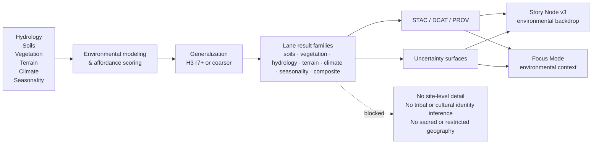

<!-- [KFM_META_BLOCK_V2]
doc_id: kfm://doc/NEEDS-VERIFICATION
title: Cultural Landscapes — Ecological Affordance Results
type: standard
version: v1
status: review
owners: Archaeology WG · Paleoenvironment WG · FAIR+CARE Council
created: YYYY-MM-DD
updated: YYYY-MM-DD
policy_label: NEEDS VERIFICATION
related: [../README.md, ../predictive/README.md, ../settlement-patterns/README.md, ../stac/README.md, ../provenance/README.md]
tags: [kfm, archaeology, cultural-landscapes, ecological-affordances, fair-care]
notes: [Owners, lane role, and directory logic are grounded in attached archaeology corpus; doc_id, dates, exact policy label, and mounted inventory need repo verification.]
[/KFM_META_BLOCK_V2] -->

<a id="top"></a>

# 🌿🌾 Cultural Landscapes — Ecological Affordance Results

Environmental-only results surface for generalized landscape usability, constraints, and long-horizon ecological potentials within KFM’s cultural-landscapes lane.

> [!NOTE]
> **Status:** stable  
> **Owners:** Archaeology WG · Paleoenvironment WG · FAIR+CARE Council  
>      
> **Quick jumps:** [Scope](#scope) · [Repo fit](#repo-fit) · [Inputs](#inputs) · [Exclusions](#exclusions) · [Directory tree](#directory-tree) · [Quickstart](#quickstart) · [Usage](#usage) · [Diagram](#diagram) · [Tables](#tables) · [Task list](#task-list--definition-of-done) · [FAQ](#faq) · [Appendix](#appendix)  
> **Repo fit:** `docs/analyses/archaeology/results/cultural-landscapes/ecological-affordances/` → upstream: [`../README.md`](../README.md), [`../stac/README.md`](../stac/README.md), [`../provenance/README.md`](../provenance/README.md), [`../predictive/README.md`](../predictive/README.md), [`../settlement-patterns/README.md`](../settlement-patterns/README.md) · downstream: [`./soils/`](./soils/), [`./vegetation/`](./vegetation/), [`./hydrology/`](./hydrology/), [`./terrain/`](./terrain/), [`./climate/`](./climate/), [`./seasonality/`](./seasonality/), [`./composite/`](./composite/), [`./uncertainty/`](./uncertainty/), [`./stac/`](./stac/), [`./metadata/`](./metadata/), [`./provenance/`](./provenance/)

> [!IMPORTANT]
> This lane documents **environmental affordances**, not cultural attribution. Use it to describe how hydrology, soils, vegetation, terrain, climate, and seasonal conditions shape broad landscape usability over time — **never** to infer identity, sovereignty, tribal territory, sacred geography, or site-level behavior.

> [!WARNING]
> Current-session verification for this task is **PDF-only**. The directory logic below is grounded in the archaeology corpus as the intended lane shape, but the exact mounted repository inventory of folders, files, schemas, and generated assets remains **NEEDS VERIFICATION** until the repo is directly inspected.

> [!TIP]
> When a result becomes primarily predictive, settlement-pattern oriented, or corridor/reconstruction oriented, route it to the sibling lane instead of stretching this directory into a catch-all archaeology modeling notebook.

## Scope

This directory groups **ecological affordance results** used within KFM cultural-landscape analysis.

Here, an *ecological affordance* means a generalized environmental opportunity, constraint, or potential that may shape long-horizon landscape usability. In this lane, affordances are derived from combinations of:

- hydrology
- soils
- vegetation
- terrain
- climate
- seasonal conditions

The point of the lane is not to tell a cultural story by itself. The point is to preserve a disciplined environmental basis that can support broader, governed cultural-landscape interpretation without collapsing environmental proxies into cultural claims.

**Back to top:** [↑](#top)

## Repo fit

This README is the local routing surface for ecological-affordance outputs inside the broader cultural-landscapes results subtree.

| Path | Role | Relationship |
| --- | --- | --- |
| `docs/analyses/archaeology/results/cultural-landscapes/README.md` | parent results hub | defines the broader cultural-landscape lane and sibling result families |
| `docs/analyses/archaeology/results/cultural-landscapes/ecological-affordances/README.md` | this file | local README for environmental affordance outputs |
| `../predictive/README.md` | predictive sibling | use when the work is model-forward, explainability-heavy, or explicitly predictive |
| `../settlement-patterns/README.md` | interpretive sibling | use when the work describes generalized settlement tendencies rather than raw affordance surfaces |
| `../stac/README.md` | metadata registry sibling | use for cross-lane STAC structure and publication shape |
| `../provenance/README.md` | lineage registry sibling | use for cross-lane provenance, transforms, and review traceability |
| `./stac/` · `./metadata/` · `./provenance/` | local support surfaces | keep affordance-specific STAC/DCAT/PROV assets close to this lane |

## Inputs

Accepted inputs for this lane include:

- generalized hydrology, soils, vegetation, terrain, climate, and seasonality layers
- paleoenvironmental reconstructions used as environmental context
- aggregated or generalized environmental suitability surfaces
- multi-factor environmental composites
- uncertainty, variance, disagreement, or confidence layers
- lane-specific STAC, DCAT, and PROV artifacts
- review-safe summaries used by Story Node or Focus Mode surfaces
- transformation notes that clarify how raw environmental signals became generalized affordance outputs

## Exclusions

Do **not** place the following here:

- exact archaeological site coordinates or proximity surfaces
- cultural or tribal identity inference
- sovereignty claims, sacred-landscape inference, or restricted ecological knowledge
- reconstructed historical routes or corridor claims that belong in [`../corridors/`](../corridors/)
- generalized settlement tendency outputs that belong in [`../settlement-patterns/README.md`](../settlement-patterns/README.md)
- model-first predictive packages that belong in [`../predictive/README.md`](../predictive/README.md)
- precise boundary products or anything that could be reverse-engineered into sensitive geography
- provenance detail that exposes restricted inputs beyond the publication-safe level
- unsupported statements that a mounted repo, schema, workflow, or published asset already exists when that state has not been directly verified

## Directory tree

> [!NOTE]
> The tree below is a **corpus-grounded intended layout** for this lane. Treat exact mounted file presence as **NEEDS VERIFICATION** until the repository is directly inspected.

```text
docs/analyses/archaeology/results/cultural-landscapes/ecological-affordances/
├── README.md
├── soils/
├── vegetation/
├── hydrology/
├── terrain/
├── climate/
├── seasonality/
├── composite/
├── uncertainty/
├── stac/
├── metadata/
└── provenance/
```

## Quickstart

A minimal, reviewable addition to this lane should stay narrow and environmental.

1. Place the result in the most specific local subdirectory.
2. State the environmental basis plainly.
3. Record the generalization level used for publication.
4. Attach or link an uncertainty surface if the result is interpretive rather than purely descriptive.
5. Add or update the lane-facing metadata in `./stac/`, `./metadata/`, and `./provenance/` as applicable.
6. Make sure the summary language remains environmental-only and does not drift into cultural attribution.

Illustrative starter record:

```yaml
id: eco-affordance-example-central-kansas-hydrology-v1
result_family: hydrology
generalization:
  method: H3
  resolution: r7
environmental_basis:
  - hydrology
  - terrain
  - seasonality
outputs:
  primary_surface: ./hydrology/example-surface.tif
  uncertainty_surface: ./uncertainty/example-uncertainty.tif
metadata:
  stac_item: ./stac/example-item.json
  dcat_record: ./metadata/example-dataset.json
  prov_bundle: ./provenance/example-prov.jsonld
publication_guardrails:
  environmental_only: true
  no_site_level_detail: true
  no_identity_inference: true
```

## Usage

### Soil affordance results (`soils/`)

Use this folder for soil-linked environmental affordances such as:

- drainage classes
- fertility indices
- pedogenic stability
- resource-gathering suitability
- soil–hydrology interaction models

Keep the interpretation at the level of **landscape condition**, not cultural use.

### Vegetation affordances (`vegetation/`)

Use this folder for generalized vegetation-linked affordances such as:

- ecozone boundaries
- productivity surfaces
- vegetation stability zones
- forage potential layers

Avoid species-to-culture claims, harvested-resource inference, or any narrative that turns vegetation proxies into social certainty.

### Hydrology affordances (`hydrology/`)

Use this folder for hydrology-linked environmental affordances such as:

- perennial or ephemeral water proximity
- floodplain stability
- terrace accessibility
- seasonal water availability

This is a strong environmental basis for landscape interpretation, but it is still not a cultural claim by itself.

### Terrain affordances (`terrain/`)

Use this folder for terrain-linked affordances such as:

- slope-grade potential
- ruggedness vs mobility cost
- elevation-linked opportunities or constraints
- terrain variability surfaces

These layers can clarify broad mobility or landscape suitability, but they should remain framed as generalized environmental structure.

### Climate affordances (`climate/`)

Use this folder for climate-linked environmental affordances such as:

- long-term climate suitability
- moisture balance
- drought/wet-cycle influence
- seasonally stable regions

Keep the language bounded to environmental context and long-range landscape conditions.

### Seasonal affordance layers (`seasonality/`)

Use this folder for time-aware environmental affordances such as:

- winter mobility barriers
- summer resource windows
- seasonal hydrology patterns
- climatic extremes relevant to landscape use

This is the right place for environmental seasonality. It is not the right place for deterministic seasonal behavior claims about specific communities.

### Composite affordance models (`composite/`)

Use this folder for aggregated environmental models combining multiple drivers, for example:

- hydrology + soils
- terrain + climate
- seasonality + vegetation
- broader multi-factor affordance composites

Composite surfaces should always expose what was combined and where the uncertainty enters.

### Uncertainty layers (`uncertainty/`)

Use this folder for the uncertainty surfaces that keep the lane honest, including:

- proxy disagreement
- model variability
- confidence surfaces
- environmental support gaps

If the affordance layer is interpretive enough to be arguable, uncertainty should be visible in the same release package.

### Metadata and provenance (`stac/`, `metadata/`, `provenance/`)

Keep publication-safe metadata and lineage close to the lane:

- `stac/` for affordance items and collections
- `metadata/` for DCAT or JSON-LD dataset descriptions
- `provenance/` for PROV-O bundles, modeling logs, and generalization traceability

Treat these support objects as part of the result, not as afterthought paperwork.

**Back to top:** [↑](#top)

## Diagram



## Tables

### Result families and minimum expectations

| Folder | What belongs here | Must state at release time | Route elsewhere when… |
| --- | --- | --- | --- |
| `soils/` | soil-linked affordance layers | basis, generalization, uncertainty posture | the output becomes settlement-pattern interpretation |
| `vegetation/` | biomass/ecozone/productivity affordances | basis, generalization, no species-to-culture leap | the output becomes ecological prediction |
| `hydrology/` | water-linked affordance surfaces | basis, temporal support, uncertainty | the output becomes corridor or route reconstruction |
| `terrain/` | slope/ruggedness/elevation affordances | basis, scale, mobility-language bounds | the output becomes explicit least-cost routing |
| `climate/` | long-horizon climate context layers | basis, time window, uncertainty | the output becomes forecast- or model-forward prediction |
| `seasonality/` | seasonal environmental windows/constraints | basis, seasonality logic, support period | the output becomes behavioral certainty |
| `composite/` | multi-factor affordance surfaces | component list, weighting/logic, uncertainty | the output becomes a predictive model package |
| `uncertainty/` | disagreement/variance/confidence layers | uncertainty method and interpretation rules | it is only an internal notebook and not a release-ready layer |
| `stac/` / `metadata/` / `provenance/` | publication-safe metadata and lineage | identifiers, release-safe geometry, distribution refs, lineage | the artifact is cross-lane and belongs in the parent registry |

### Trust-bearing checks before publication

| Check | Why it matters | Minimum outcome |
| --- | --- | --- |
| Generalization documented | prevents precision drift | H3 r7+ or clearly justified equivalent/coarser publication grain |
| Environmental basis visible | keeps the lane interpretable | source drivers named plainly |
| Uncertainty present where needed | prevents false certainty | visible uncertainty layer, note, or explicit non-applicability |
| STAC / DCAT / PROV linked | keeps outputs discoverable and traceable | outward metadata and lineage refs present |
| Cultural-safety review completed | protects sensitive archaeology contexts | no identity, territory, sacred-knowledge, or site-proximity leakage |
| Routed to correct sibling lane | prevents scope sprawl | predictive / settlement / corridor work moved when it becomes the dominant mode |

## Task list — Definition of done

- [ ] Result is placed in the correct local subdirectory.
- [ ] The README or local record states the environmental basis clearly.
- [ ] Publication geometry is generalized to H3 r7+ or an equally conservative release form.
- [ ] Any interpretive layer includes visible uncertainty, disagreement, or confidence handling.
- [ ] STAC, DCAT, and PROV support objects are added or updated at the lane-safe level.
- [ ] Summary language remains environmental-only and does not infer identity, territory, or exact site behavior.
- [ ] Any predictive, settlement-pattern, or corridor-heavy output is routed to the sibling lane instead of being stretched to fit here.
- [ ] Mounted repo inventory claims are checked before this README is used as exact file truth.

## FAQ

### Are ecological affordance results cultural claims?

No. They are environmental descriptions of landscape opportunity, constraint, and potential. They may support later interpretation, but they are not themselves cultural attribution.

### Why is H3 generalization called out so prominently?

Because this lane sits near sensitive archaeology interpretation. Publication-safe geometry must stay generalized enough that the README cannot become an accidental precision leak.

### Where do model-heavy predictive outputs go?

Use [`../predictive/README.md`](../predictive/README.md) when the main value is predictive modeling, explainability, or non-deterministic environmental forecast-style output rather than a bounded affordance surface.

### Where do generalized settlement tendency outputs go?

Use [`../settlement-patterns/README.md`](../settlement-patterns/README.md) when the output is explicitly about broad settlement distributions, density tendencies, or settlement-environment correlations.

### Can this lane discuss mobility?

Yes, but only in generalized environmental terms such as terrain cost, water access, or seasonal barriers. It should not turn those conditions into reconstructed historic routes or culturally specific movement narratives.

### What should happen if an affordance layer feels culturally sensitive after review?

Mask it, narrow it, generalize it further, or hold it back. Do not smooth that concern away in prose.

**Back to top:** [↑](#top)

## Appendix

<details>
<summary><strong>Status vocabulary used in this README</strong></summary>

| Label | Meaning here |
| --- | --- |
| **CONFIRMED** | Directly supported by the attached archaeology or KFM corpus used for this rewrite |
| **INFERRED** | Small structural completion strongly implied by the corpus, but not directly surfaced in mounted repo evidence |
| **PROPOSED** | Recommended improvement or handling rule added to make the README more usable |
| **UNKNOWN** | Not verified strongly enough in the current session |
| **NEEDS VERIFICATION** | A visible review flag for repo inventory, dates, labels, ownership, or implementation state |

</details>

<details>
<summary><strong>Open verification items</strong></summary>

- Exact mounted file inventory beneath this directory
- Current repo dates for `created` and `updated`
- Final `doc_id` value for Meta Block v2
- Exact policy label used by the mounted repo for this lane
- Whether local subdirectories already contain leaf READMEs, schemas, fixtures, or generated artifacts
- Whether this subtree has shifted fully from older archaeology YAML metadata blocks to KFM Meta Block v2

</details>

<details>
<summary><strong>Illustrative release-safe lane checklist</strong></summary>

```text
1. Environmental basis named
2. Generalization stated
3. Uncertainty visible
4. STAC/DCAT/PROV linked
5. Cultural-safety review completed
6. Sibling-lane routing checked
7. Mounted repo claims re-verified
```

</details>

---

**Back to parent lane:** [`../README.md`](../README.md)  
**See also:** [`../predictive/README.md`](../predictive/README.md) · [`../settlement-patterns/README.md`](../settlement-patterns/README.md) · [`../stac/README.md`](../stac/README.md) · [`../provenance/README.md`](../provenance/README.md)
