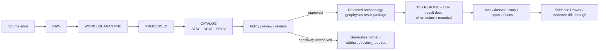

<!-- [KFM_META_BLOCK_V2]
doc_id: kfm://doc/<NEEDS-UUID>
title: Archaeology Geophysics Results
type: standard
version: v1
status: review
owners: <NEEDS VERIFICATION>
created: YYYY-MM-DD
updated: 2026-03-26
policy_label: <NEEDS VERIFICATION>
related: [docs/analyses/archaeology/results/]
tags: [kfm, archaeology, geophysics, results, fair-care, sensitive-surface]
notes: [Current workspace confirms this directory and README, but not child result packages, owners, doc_id, or policy label. Parent directory exists; parent README and method-specific subtrees remain unverified in the mounted slice., Historical adjacent KFM archaeology geophysics materials are used only as style and expansion hints here, not as proof of current repo state.]
[/KFM_META_BLOCK_V2] -->

# Archaeology Geophysics Results
Root README for release-safe, evidence-linked archaeology geophysics result documentation in Kansas Frontier Matrix.

| Status | Owners | Path | Upstream | Downstream | Truth posture |
| --- | --- | --- | --- | --- | --- |
| `experimental` *(directory maturity; INFERRED from the current minimal slice)* | `<NEEDS VERIFICATION>` | `docs/analyses/archaeology/results/geophysics/README.md` | `../` *(parent directory context is present; parent README remains unverified)* | No child result packages confirmed in the current slice | `CONFIRMED doctrine + explicit UNKNOWNs` |

    

**Quick jump:** [Scope](#scope) · [Repo fit](#repo-fit) · [Inputs](#inputs) · [Exclusions](#exclusions) · [Directory tree](#directory-tree) · [Quickstart](#quickstart) · [Usage](#usage) · [Diagram](#diagram) · [Tables](#tables) · [Task list](#task-list) · [FAQ](#faq) · [Appendix](#appendix)

**Legend:** `CONFIRMED` = directly supported in the current task context or attached corpus · `INFERRED` = corpus-supported but not mounted path proof · `UNKNOWN / NEEDS VERIFICATION` = not directly verified in this session.

> [!IMPORTANT]
> In the current slice available for this revision, this directory is represented by **this root README only**. This file therefore sets the shared trust posture for archaeology geophysics **without inventing child packages, sibling READMEs, schemas, workflows, or ownership values that are not directly verified here**.

## Scope

This directory sits at the **results** end of an archaeology-facing analysis path. Its job is narrow, governance-bearing, and intentionally release-aware: it defines how archaeology geophysics results should be documented **once they are suitable for review-facing or release-facing use**.

That means this README is about **result surfaces**, not raw survey capture, not unrestricted subsurface interpretation, and not direct client access to canonical or sensitive stores.

### Current-session evidence map

| Observation | Status | Why it matters here |
| --- | --- | --- |
| `docs/analyses/archaeology/results/geophysics/README.md` is the target path for this revision | **CONFIRMED** | The document has a concrete repo role and location. |
| The current revision context treats the `geophysics/` directory as **README-only** | **CONFIRMED in the current slice** | The doc must not link to child result families as though they are already mounted. |
| Historical adjacent archaeology geophysics materials in the attached corpus show a method-split local pattern | **INFERRED reference only** | Useful for future expansion cues, but not proof of current repo topology. |
| KFM public reading is reconstructed from released scope through governed interfaces, not direct raw-store access | **CONFIRMED doctrine** | Anything documented here must stay downstream of release, evidence resolution, and policy gates. |
| Archaeology, rare-location, and culturally sensitive lanes require review-bearing publication behavior | **CONFIRMED doctrine** | Sensitivity handling is mandatory here, not stylistic. |
| Archaeology / heritage 2.5D and 3D work must inherit the same evidence, policy, and correction model | **CONFIRMED doctrine** | Heavier visualization does not relax governance burden. |
| Owners, policy label, UUID, created date, parent README, contracts, schemas, tests, CI, and method-specific subtrees | **UNKNOWN / NEEDS VERIFICATION** | Keep the gaps visible instead of smoothing them away. |

### What this README governs

This root README exists to:

- define what belongs in this directory **today**;
- keep future child result docs aligned to KFM’s release, evidence, sensitivity, and correction posture;
- stop local documentation drift from outrunning the current verified tree; and
- make archaeology-specific caution visible **before** this directory grows.

### Release-safe interpretation rule

Anything surfaced from this directory must be read as a **bounded, release-backed interpretation layer**. It may describe signal, pattern, uncertainty, aggregation, and correlation. It may **not** silently escalate into site identification, burial inference, structure naming, or any other canonical archaeological claim without separately visible evidence, review, and release artifacts.

[Back to top](#archaeology-geophysics-results)

## Repo fit

### Path and relationships

| Direction | Link | Status | Notes |
| --- | --- | --- | --- |
| Current file | `docs/analyses/archaeology/results/geophysics/README.md` | **CONFIRMED** | Mounted target file for this revision. |
| Current directory | [`./`](./) | **CONFIRMED in path context** | Directory role is established even though no child result packages are confirmed in the current slice. |
| Upstream directory | [`../`](../) | **CONFIRMED in path context** | Parent directory exists by path context, but its own README remains unverified here. |
| Downstream child docs | _None confirmed in the current slice_ | **CONFIRMED for this revision context** | Add links only after child paths are directly visible. |

### How this directory fits KFM

In KFM terms, anything that eventually lands here should remain:

- **derived**, not sovereign truth;
- **release-aware**, not free-floating prose;
- **evidence-linked**, not detached summary text; and
- **public-safe or reviewer-safe by design**, with exact-location and archaeology sensitivity handled before outward use.

> [!NOTE]
> KFM’s truth path runs from source edge through `RAW -> WORK / QUARANTINE -> PROCESSED -> CATALOG -> PUBLISHED`. This directory belongs at the **documentation and outward-result end** of that chain, never as a shortcut around it.

[Back to top](#archaeology-geophysics-results)

## Inputs

### Accepted inputs

Use this directory for documentation artifacts such as the following when they are actually present and evidence-backed:

| Belongs here | Status | Why it fits |
| --- | --- | --- |
| The root governance README for archaeology geophysics results | **CONFIRMED mounted** | Current file. |
| Child result READMEs or result-package notes for released or review-bearing archaeology geophysics outputs | **INFERRED** | Fits the path role, but no child docs are confirmed in the current slice. |
| Links or references to `CatalogClosure`-style metadata (`STAC`, `DCAT`, `PROV`) | **CONFIRMED doctrine** | KFM treats outward metadata closure as part of the canonical publication path. |
| Links or references to `EvidenceBundle`, `ReviewRecord`, `DecisionEnvelope`, and `ReleaseManifest / ReleaseProofPack` artifacts | **CONFIRMED doctrine** | Result docs should remain reconstructible, reviewable, and release-backed. |
| Visible uncertainty, generalization, redaction, access, or withholding notes | **CONFIRMED doctrine** | Public-safe archaeology publication needs explicit sensitivity posture. |
| Public-safe narrative summaries that can feed map, dossier, story, export, or Focus surfaces without pretending to be canonical truth | **INFERRED from doctrine** | KFM surfaces stay evidence-linked and trust-visible. |

### Minimum package posture

A future child result package should make these things easy to find:

- what the result is and is **not** claiming;
- what release or review scope it belongs to;
- what evidence or metadata closure backs it;
- what uncertainty remains visible; and
- what has been generalized, withheld, or escalated for review.

[Back to top](#archaeology-geophysics-results)

## Exclusions

| Does **not** belong here | Why | Put it instead |
| --- | --- | --- |
| Raw instrument captures, traverse logs, calibration dumps, unreviewed field notes, or source-native binaries | This directory is results-facing, not source-edge | Source intake / `RAW` / `WORK` / `QUARANTINE` paths and their governing contracts |
| Exact site coordinates, precise subsurface exposures, or high-resolution outputs whose public use would outrun sensitivity review | Archaeology and exact-location cases are review-bearing | Generalize, withhold, or route through steward review before outward use |
| Definitive feature detection claims, burial claims, structure naming, or other canonical archaeological assertions | Result surfaces remain derived and bounded | Canonical review-bearing lanes with explicit evidence, support, and decision artifacts |
| UI implementation details, frontend route claims, or runtime wiring assertions | The current slice does not show that stack here | App/runtime/docs closer to the implementation boundary |
| Links to imagined child folders or method-specific READMEs | The current mounted slice does not prove them | Add them only when the paths are real |
| Decorative certainty or prose that strips uncertainty, review state, or provenance | Violates KFM trust posture | Keep uncertainty visible or fail closed |

> [!CAUTION]
> “Generalized” is not a style preference. In this lane, it is a **sensitivity-control decision**.

[Back to top](#archaeology-geophysics-results)

## Directory tree

### Current mounted tree

```text
docs/analyses/archaeology/results/geophysics/
└── README.md
```

### What is still undecided

<details>
<summary><strong>Open structure questions for future expansion</strong></summary>

The current workspace does **not** settle whether future child material should be organized by:

- geophysics method family;
- campaign or project;
- release window or publication class;
- site / place / dossier anchor; or
- reviewer-only vs public-safe split.

Choose a shape only when the mounted tree, contracts, and review posture are visible enough to support it.

</details>

<details>
<summary><strong>Historical adjacent pattern in the attached corpus (INFERRED only)</strong></summary>

A historical archaeology geophysics README in the attached corpus shows a method-oriented subtree under `geophysics/`:

```text
magnetometry/
gpr/
resistivity/
electromagnetic/
clustering/
predictive/
stac/
metadata/
provenance/
```

Treat that as a **style and expansion cue only**. Do **not** add links or assert those paths as current until the live repo tree confirms them.

</details>

[Back to top](#archaeology-geophysics-results)

## Quickstart

### Safe revision flow for this directory

1. Confirm that you are editing a **results-facing documentation surface**, not a raw or working artifact.
2. Keep the directory tree section synchronized with the **actual mounted tree**, not a hoped-for future tree.
3. State uncertainty, generalization, redaction, or withholding posture explicitly.
4. Link to release, metadata, review, and evidence artifacts when they exist; otherwise keep the gap visible.
5. Remove any sentence that upgrades a derived result into canonical archaeological truth.
6. For 2.5D or 3D material, explain why 2D is insufficient before implying a heavier visualization burden.

### Illustrative child-package stub

```md
# <Result Package Title>
One-line public-safe purpose.

## Scope
- Result type:
- Spatial granularity:
- Time basis:
- Surface state: generalized | partial | promoted | withheld

## Evidence & release links
- ReleaseManifest / ReleaseProofPack: <TODO or relative link>
- Catalog closure (STAC / DCAT / PROV): <TODO or relative link>
- EvidenceBundle / audit ref: <TODO or relative link>
- Review posture: <TODO or relative link>

## Sensitivity & uncertainty
- Public-safe representation:
- What was generalized or withheld:
- What the result must not be used to claim:
```

> [!TIP]
> Keep the first sentence of any future child README at the level of **result description**, not interpretation theater.

[Back to top](#archaeology-geophysics-results)

## Usage

| Audience | Use this README for | Do **not** use it for |
| --- | --- | --- |
| Maintainers | Keeping shared rules stable across future result docs | Pretending the mounted tree is richer than it is |
| Reviewers / stewards | Checking release posture, sensitivity handling, and evidence visibility | Treating this README as a substitute for review artifacts |
| Researchers / analysts | Understanding how result docs should stay separate from canonical truth | Using a README as the only evidence basis |
| Story / dossier / Focus authors | Learning what can safely flow downstream | Turning bounded result text into unsupported archaeological certainty |

### Downstream surface reminder

KFM’s outward surfaces stay trust-visible: map, dossier, story, Evidence Drawer, export, and Focus all remain tied to evidence, review state, and policy context. Any future geophysics result documentation should be written as though a downstream reader will inspect it **next to** provenance, not instead of provenance.

[Back to top](#archaeology-geophysics-results)

## Diagram



[Back to top](#archaeology-geophysics-results)

## Tables

### Evidence basis used by this README

| Evidence layer | What it contributes here | Status |
| --- | --- | --- |
| Current task context and target path | Confirms the role of this file and the README-only shape used for this revision | **CONFIRMED for this draft** |
| March 2026 KFM doctrine manuals | Truth path, trust membrane, STAC/DCAT/PROV closure, Evidence Drawer, runtime obligations, and archaeology/3D burden | **CONFIRMED doctrine** |
| Historical adjacent archaeology geophysics materials in the attached corpus | Local style cues, sensitivity language, and a possible future method-split layout | **INFERRED reference only** |

### KFM objects and obligations that matter most here

| Object or obligation | What it means for this directory | Status |
| --- | --- | --- |
| `CatalogClosure` | Result docs should point to outward metadata closure when available | **CONFIRMED doctrine** |
| `EvidenceBundle` | A visible claim should be reconstructible from released scope | **CONFIRMED doctrine** |
| `DecisionEnvelope` | Policy results should be machine-readable somewhere, not only implied in prose | **CONFIRMED doctrine** |
| `ReviewRecord` | Human approval, denial, or escalation should remain inspectable where required | **CONFIRMED doctrine** |
| `ReleaseManifest / ReleaseProofPack` | Outward result documentation should remain release-backed | **CONFIRMED doctrine** |
| `generalize` | Serve only a generalized representation for the audience when needed | **CONFIRMED doctrine** |
| `withhold` | Do not publish or render the object on the requested surface | **CONFIRMED doctrine** |
| `review_required` | Escalate before outward use where sensitivity or rights demand it | **CONFIRMED doctrine** |
| `cite` | Evidence linkage is required; uncited smoothness is a failure mode | **CONFIRMED doctrine** |

### What a future result package should keep visible

| Requirement | Why it matters | Current workspace state |
| --- | --- | --- |
| Release state | Keeps docs downstream of promotion and correction | **UNKNOWN for child packages** |
| Evidence path | Prevents detached interpretation | **UNKNOWN for child packages** |
| Uncertainty | Prevents over-reading geophysics outputs | **UNKNOWN for child packages** |
| Sensitivity posture | Archaeology and exact-location cases are review-bearing | **CONFIRMED doctrine** |
| 2D vs 3D justification | 3D is burden-bearing, not default spectacle | **CONFIRMED doctrine** |
| Tree accuracy | Avoids broken links and invented repo shape | **CONFIRMED need in current slice** |

[Back to top](#archaeology-geophysics-results)

## Task list

### Definition of done for revising this directory

- [ ] The directory tree section matches the mounted workspace exactly.
- [ ] No child links point to docs or folders that are not mounted.
- [ ] The README keeps the directory at the **results** boundary and does not absorb source-edge concerns.
- [ ] Sensitivity language explicitly leaves room for `generalize`, `withhold`, or `review_required` outcomes.
- [ ] Any future child package template keeps release, metadata, review, and evidence links visible.
- [ ] Uncertainty remains visible instead of being flattened into confident prose.
- [ ] Any 2.5D / 3D note keeps the “2D first, heavier burden only when justified” rule intact.
- [ ] Historical pattern hints remain clearly labeled as **INFERRED** rather than current repo fact.
- [ ] Open unknowns stay visible in the appendix and notes rather than being harmonized away.

## FAQ

### Does this directory currently contain method-specific geophysics packages?
No. In the current slice used for this revision, it contains only this root README.

### Can future child folders be organized by method?
Possibly, but that structure is **not** confirmed by the current tree. Add it only when the folders are real and their role is evidence-backed.

### Why mention method-oriented expansion at all?
Because attached historical archaeology geophysics materials show that pattern as a plausible local direction. Here it is treated only as an **INFERRED design hint**, not as current repo fact.

### Can exact anomaly maps or precise subsurface interpretations live here?
Not as ordinary public-safe result documentation. This lane is review-bearing and may require generalization, withholding, or escalation.

### Is 3D ruled out?
No, but it carries extra burden. KFM doctrine says 3D should appear only when 2D is insufficient and the same evidence, policy, and correction model still holds.

### Why is this README so explicit about unknowns?
Because KFM doctrine treats visible unknowns as a strength. The current slice is thin, so the doc should stay truthful rather than decorative.

[Back to top](#archaeology-geophysics-results)

## Appendix

<details>
<summary><strong>Stable vocabulary for this directory</strong></summary>

| Prefer | Avoid drift toward |
| --- | --- |
| result surface | truth source |
| release-backed documentation | free-floating summary |
| generalized or withheld | “safe enough” without explanation |
| evidence-linked | citation-free confidence |
| review-bearing archaeology lane | casual publication lane |
| 2.5D / 3D with explicit burden | default spectacle |

</details>

<details>
<summary><strong>Verification backlog that should stay visible before merge</strong></summary>

- exact `doc_id` / UUID;
- owners and stewardship lane for this directory;
- policy label value;
- created date;
- whether the parent `results/` directory will gain its own README;
- whether child result docs will be organized by method, campaign, release scope, or another axis;
- whether contracts, schemas, fixtures, or workflow checks already exist elsewhere in the repo for archaeology geophysics outputs.

</details>

<details>
<summary><strong>Why this README is intentionally narrow</strong></summary>

The strongest evidence available in the current session is doctrinal: governed publication, release linkage, metadata closure, evidence resolution, sensitivity handling, and visible correction. The weakest evidence is local implementation detail for this exact directory. Keeping the README narrow preserves trust and still gives future contributors a solid, repo-native foundation to build on.

</details>

[Back to top](#archaeology-geophysics-results)