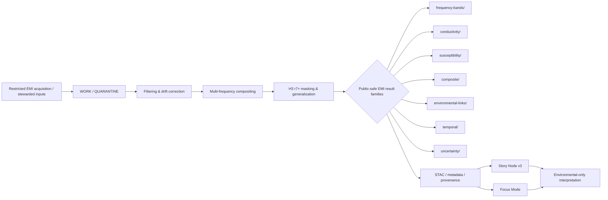

<!-- [KFM_META_BLOCK_V2]
doc_id: kfm://doc/NEEDS-VERIFICATION-UUID
title: Kansas Frontier Matrix — Geophysics Results — Electromagnetic Induction (EMI)
type: standard
version: v1
status: review
owners: NEEDS VERIFICATION — Geophysics WG · Archaeology WG · FAIR+CARE Council
created: YYYY-MM-DD
updated: YYYY-MM-DD
policy_label: NEEDS VERIFICATION — likely restricted / internal CARE-governed
related: [../README.md, frequency-bands/, conductivity/, susceptibility/, composite/, environmental-links/, temporal/, uncertainty/, NEEDS VERIFICATION: ../../../../../schemas/json/archaeology-geophysics-electromagnetic-results.schema.json, NEEDS VERIFICATION: ../../../../../schemas/shacl/archaeology-geophysics-electromagnetic-results-shape.ttl]
tags: [kfm, archaeology, geophysics, electromagnetic, emi, fair, care, h3]
notes: [Built upward from corpus-visible EMI and parent geophysics drafts; repo-visible identifiers, dates, hashes, and path parity still require direct verification before commit.]
[/KFM_META_BLOCK_V2] -->

# Kansas Frontier Matrix — Geophysics Results — Electromagnetic Induction (EMI)

_Public-safe, FAIR+CARE-governed registry for generalized electromagnetic induction (EMI) archaeological results in KFM._

> **Status:** active _(corpus baseline; mounted repo parity needs verification)_  
> **Owners:** Geophysics WG · Archaeology WG · FAIR+CARE Council _(needs repo-side verification)_  
>       
> **Quick jumps:** [Scope](#scope) · [Repo fit](#repo-fit) · [Accepted inputs](#accepted-inputs) · [Exclusions](#exclusions) · [Quickstart](#quickstart) · [Diagram](#diagram) · [Result matrix](#result-matrix) · [Task list](#task-list--definition-of-done) · [FAQ](#faq)

> [!IMPORTANT]
> **Evidence posture:** the doctrinal content below is grounded in the surfaced KFM corpus. Exact repo-side identifiers, hashes, adjacent-file existence, and current metadata parity remain **NEEDS VERIFICATION** until checked against the mounted repository.

> [!WARNING]
> This directory is for **environmental-only, generalized EMI results**. It is **not** a home for feature-level subsurface interpretation, burial or structure inference, exact anomaly-shape reconstruction, or culturally sensitive site revelation.

---

## Scope

This README defines the intended role of the `electromagnetic/` results surface inside the broader archaeology geophysics results lane.

It documents **generalized electromagnetic induction (EMI) outputs** used for archaeological landscape analysis in KFM, while preserving KFM’s stronger trust rule: public-facing results may describe **broad conductivity, susceptibility, moisture, terrain, and environmental patterning**, but may not collapse into site revelation or subsurface object claims.

In this directory, EMI is framed as a **contextual environmental signal family**. Its value is in pattern support, uncertainty-aware comparison, and safe multi-sensor synthesis with magnetometry, resistivity, and GPR—not in “finding” features.

---

## Repo fit

| Field | Value |
|---|---|
| Path | `docs/analyses/archaeology/results/geophysics/electromagnetic/README.md` |
| Local role | README-like registry and interpretation guide for EMI result families |
| Upstream | [`../README.md`](../README.md) — parent geophysics results index |
| Downstream | [`frequency-bands/`](frequency-bands/) · [`conductivity/`](conductivity/) · [`susceptibility/`](susceptibility/) · [`composite/`](composite/) · [`environmental-links/`](environmental-links/) · [`temporal/`](temporal/) · [`uncertainty/`](uncertainty/) · [`stac/`](stac/) · [`metadata/`](metadata/) · [`provenance/`](provenance/) |
| Adjacent trust objects | STAC items, DCAT/JSON-LD metadata, and PROV-O lineage records |
| Interpretation boundary | Public-safe, generalized, non-locational EMI results only |

---

## Accepted inputs

This directory accepts **release-ready, generalized** EMI result material such as:

| Input family | Belongs here when | Typical examples |
|---|---|---|
| Multi-frequency EMI responses | Already generalized and feature-safe | low/mid/high-frequency response envelopes, depth-proxied summaries |
| Conductivity surfaces | Framed as environmental variability, not archaeology claims | broad conductivity zones, moisture proxy surfaces |
| Magnetic susceptibility patterns | Spatially generalized and sensitivity-safe | susceptibility gradient blocks, environmental correlation surfaces |
| Composite multi-sensor models | Non-specific and interpretation-limited | EMI + magnetometry + resistivity + GPR anomaly tendency zones |
| Environmental relationship layers | Explicitly environmental-only | hydrology, soils, terrain, biomass, geomorphic linkages |
| Temporal summaries | OWL-Time aligned and non-chronological in cultural terms | long-window conductivity shifts, stability trends |
| Uncertainty layers | Required to keep interpretation bounded | drift, phase interference, disagreement, confidence surfaces |
| Metadata artifacts | Publishable, machine-readable companions | STAC, DCAT/JSON-LD, PROV-O |

---

## Exclusions

This directory is **not** the home for the following:

| Excluded material | Why it does not belong here | Put it instead |
|---|---|---|
| Raw EMI acquisition files | Too close to source-sensitive detail; not yet public-safe | restricted acquisition or steward-only processing surfaces |
| Exact anomaly shapes or raw slices | Can imply sensitive subsurface detail | WORK / QUARANTINE or equivalent controlled review path |
| Burial, structure, pit, enclosure, or sacred-site inference | Explicitly prohibited | nowhere in this public-safe result surface |
| Non-generalized geometries | Violates H3 masking and sovereignty protections | generalize further or remove |
| Culturally sensitive interpretation text | Violates CARE framing | steward review surfaces and governance workflows |
| Scratch notebooks or internal QC drafts | Not a release artifact | internal working notes, provenance attachments, or test-only surfaces |

---

## Directory tree

```text
docs/analyses/archaeology/results/geophysics/electromagnetic/
├── README.md
├── frequency-bands/        # Multi-frequency EMI responses (generalized)
├── conductivity/          # Conductivity envelope surfaces
├── susceptibility/        # Magnetic susceptibility clusters
├── composite/             # Combined EMI + other sensors (safe generalizations)
├── environmental-links/   # Hydrology / soil / terrain / environment relationships
├── temporal/              # OWL-Time aligned EMI environmental patterns
├── uncertainty/           # Sensor noise, phase interference, confidence metrics
├── stac/                  # STAC Items for EMI result layers
├── metadata/              # DCAT + JSON-LD EMI metadata
└── provenance/            # PROV-O lineage logs for all transformations
```

> [!NOTE]
> The directory names above are preserved from the strongest corpus-visible EMI draft. Confirm they match the mounted repo before commit.

---

## Quickstart

### Add a review-ready EMI result package

1. Start with an **environmental-only** EMI surface or summary.
2. Generalize it to **H3 r7+ or coarser** and remove any geometry that could imply a sensitive feature.
3. Add at least one **uncertainty companion** describing noise, drift, disagreement, or confidence.
4. Emit or update the matching **STAC**, **DCAT/JSON-LD**, and **PROV-O** records.
5. Verify the result can support **Focus Mode** or **Story Node** context without site-level revelation.
6. Route the package through **FAIR+CARE / sovereignty review** before publication.

### Minimal review-ready bundle

```text
electromagnetic/
├── conductivity/
│   └── conductivity-zones--<release-id>.<ext>
├── uncertainty/
│   └── conductivity-confidence--<release-id>.<ext>
├── stac/
│   └── conductivity-zones--<release-id>.json
├── metadata/
│   └── conductivity-zones--<release-id>.jsonld
└── provenance/
    └── conductivity-zones--<release-id>.prov.json
```

### Illustrative minimum metadata shape

```json
{
  "result_family": "conductivity",
  "spatial_generalization": "H3 r7+",
  "interpretation_frame": "environmental-only",
  "uncertainty_layers": true,
  "stac": true,
  "dcat": true,
  "prov": true
}
```

---

## Usage

### Reading this directory

Use this surface to understand:

- broad conductivity and susceptibility tendencies
- hydrology / soil / terrain correlations
- cross-sensor contextualization with magnetometry, resistivity, and GPR
- uncertainty-aware environmental pattern summaries
- safe narrative support for Story Node and Focus Mode

Do **not** use this surface to claim:

- exact cultural features
- graves, structures, pits, or enclosures
- ceremonial or sacred geographies
- site boundaries
- cultural chronology inferred from EMI alone

### Story Node & Focus Mode behavior

EMI results may support:

- environmental-only anomaly explanations
- contextual Story Node v3 environmental blocks
- narrative-safe multi-sensor overlays
- hydrology / soil correlation summaries

A compliant summary should read like this:

> **Example Focus summary**  
> EMI data reveals broad zones of conductivity and magnetic variation linked to hydrology and soils. All surfaces are generalized, feature-safe, and reviewed under FAIR+CARE governance.

---

## Diagram



---

## Result matrix

| Result family | What belongs here | What must stay out |
|---|---|---|
| `frequency-bands/` | generalized low/mid/high-frequency response envelopes; depth-proxied summaries; noise-filtered surfaces | raw or feature-resolution response maps |
| `conductivity/` | broad conductivity variability zones; environmental moisture proxies; soil/geomorphic sensitivity | archaeological feature claims |
| `susceptibility/` | generalized magnetic variation blocks; environmental-lens correlation summaries | sensitive magnetic signatures at revealing resolution |
| `composite/` | multi-sensor, non-specific anomaly tendency zones | object-level interpretations or exact anomaly reconstruction |
| `environmental-links/` | hydrology, soils, sediment, terrain, vegetation, biomass relationships | any text implying cultural confirmation |
| `temporal/` | OWL-Time aligned environmental variability windows and stability patterns | cultural chronology or occupation sequencing |
| `uncertainty/` | noise, drift, disagreement, confidence, cross-sensor variance | omitted or hidden uncertainty |

---

## Metadata spine

| Surface | Minimum expectations | Why it matters |
|---|---|---|
| **STAC** | H3-masked geometry, sensor-frequency metadata, environmental driver metadata, uncertainty layers, CARE classification, PROV references | keeps spatial assets discoverable without exposing sensitive geometry |
| **DCAT / JSON-LD** | dataset purpose, hydrology/soil/climate links, access/licensing, FAIR+CARE compliance | carries publication meaning and access posture |
| **PROV-O** | acquisition dataset refs, filtering, drift correction, compositing, H3 masking, uncertainty propagation, WAL → Retry → Rollback lineage | preserves explainability, correction, and auditability |

---

## Interpretation guardrails

> [!IMPORTANT]
> **EMI is environmental-only in this surface.** The question is “what broad environmental conductivity or susceptibility pattern is present?” — not “what archaeological object is here?”

| Allowed | Not allowed |
|---|---|
| hydrology-linked conductivity variation | feature-level interpretation |
| soil / sediment / terrain correlation | burial inference |
| moisture-proxy summaries | structure inference |
| generalized multi-sensor tendency zones | sacred-site detection |
| confidence-aware contextual narrative | exact anomaly-shape reconstruction |

---

## Task list — definition of done

A contribution to this directory is not done until all of the following are true:

- [ ] The result is generalized to **H3 r7+ or coarser**.
- [ ] The interpretation frame is explicitly **environmental-only**.
- [ ] No feature-level, burial, structure, or sacred-site inference remains.
- [ ] At least one **uncertainty layer or confidence summary** is present.
- [ ] Matching **STAC**, **DCAT/JSON-LD**, and **PROV-O** records exist.
- [ ] The package discloses environmental limitations and masking/generalization logic.
- [ ] FAIR+CARE / sovereignty review has been completed.
- [ ] The parent geophysics index (`../README.md`) still reflects this directory accurately.

---

## FAQ

### Why is EMI allowed here if the domain is sensitive?

Because this directory stores only **generalized, public-safe** results. The corpus baseline explicitly treats EMI here as environmentally grounded, non-feature-specific, and sovereignty-protected.

### Can EMI outputs here be used to identify archaeological sites?

No. This surface is not for site revelation. It is for pattern summary, environmental context, and uncertainty-aware multi-sensor explanation.

### What geometry is acceptable in published EMI result metadata?

Only **H3-masked / generalized geometry** should appear in this results surface.

### What should happen if a layer still risks sensitive inference?

It must be **generalized further or removed**.

---

## Appendix

<details>
<summary><strong>Machine-readable baseline values carried forward from the surfaced corpus draft</strong> <em>(verify against mounted repo before commit)</em></summary>

### Baseline machine fields preserved for verification

| Field | Corpus-visible value | Verification status |
|---|---|---|
| Draft version | `v11.0.0` | needs repo verification |
| Draft last updated | `2025-11-17` | needs repo verification |
| Review cycle | `Quarterly · Geophysics WG · Archaeology WG · FAIR+CARE Council` | corpus-visible |
| Semantic document ID | `kfm-arch-geophysics-electromagnetic-results` | needs repo verification |
| Draft UUID | `urn:kfm:doc:archaeology:geophysics:electromagnetic-results-v11.0.0` | needs repo verification |
| Draft role | `archaeology-geophysics-electromagnetic-root` | needs repo verification |
| JSON schema ref | `../../../../../schemas/json/archaeology-geophysics-electromagnetic-results.schema.json` | needs repo verification |
| SHACL ref | `../../../../../schemas/shacl/archaeology-geophysics-electromagnetic-results-shape.ttl` | needs repo verification |
| Telemetry schema ref | `../../../../../schemas/telemetry/archaeology-geophysics-electromagnetic-v1.json` | needs repo verification |
| AI transform permissions | `summaries`, `semantic-highlighting` | corpus-visible |
| AI transform prohibitions | `feature-level interpretation`, `burial-inference`, `sacred-site-detection` | corpus-visible |
| Lifecycle / TTL | `stable`; review every 6 months; superseded on next EMI-results update | needs repo verification |

### Preservation note

These values were strong enough to preserve as **machine-readable appendix material**, but not strong enough in this session to present as fully repo-verified current state.

</details>

<details>
<summary><strong>Interpretation vocabulary</strong></summary>

Use terms such as:

- conductivity variation
- susceptibility gradient
- anomaly tendency zone
- environmental relationship
- hydrology-linked pattern
- uncertainty surface
- drift-corrected summary
- generalized H3 envelope

Avoid terms such as:

- structure
- burial
- house
- pit
- enclosure
- ceremonial area
- exact anomaly
- identified site

</details>

---

[Back to top](#kansas-frontier-matrix--geophysics-results--electromagnetic-induction-emi)
