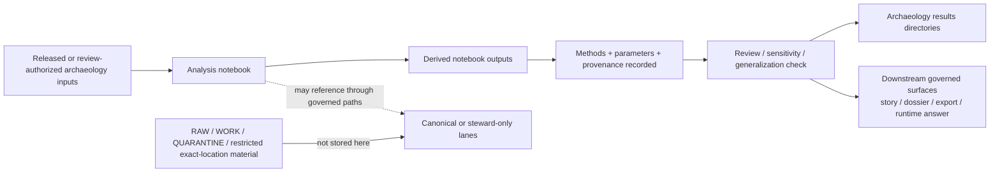

<!-- [KFM_META_BLOCK_V2]
doc_id: kfm://doc/NEEDS-VERIFICATION
title: Kansas Frontier Matrix — Archaeology Analysis Notebooks
type: standard
version: v1
status: draft
owners: NEEDS_VERIFICATION
created: YYYY-MM-DD
updated: YYYY-MM-DD
policy_label: NEEDS_VERIFICATION
related: [NEEDS_VERIFICATION]
tags: [kfm, archaeology, notebooks]
notes: [Target path, notebook-index role, and core notebook family layout are source-grounded in the attached KFM corpus; current owners, dates, policy label, related links, and live repo adjacency still need direct verification.]
[/KFM_META_BLOCK_V2] -->

<a id="top"></a>

# Kansas Frontier Matrix — Archaeology Analysis Notebooks

Central index and operating guide for archaeology analysis notebooks and their derived, reviewable outputs.

> [!IMPORTANT]
> **Status:** Draft  
> **Owners:** NEEDS VERIFICATION  
>      
> **Quick jump:** [Scope](#scope) · [Repo fit](#repo-fit) · [Accepted inputs](#accepted-inputs) · [Exclusions](#exclusions) · [Directory tree](#directory-tree) · [Quickstart](#quickstart) · [Notebook contract](#notebook-contract) · [Diagram](#diagram) · [Notebook families](#notebook-families) · [Review gates](#review-gates) · [FAQ](#faq)

> [!NOTE]
> This README preserves source-grounded archaeology notebook purpose and directory logic from the attached KFM corpus while keeping mounted-repo unknowns explicit. Current owners, dates, policy label, sibling README inventory, validation hooks, and live notebook counts still need direct repository verification before merge.

---

## Scope

This directory is for **archaeology analysis notebooks** that generate **derived** work products: spatial models, chronology tests, environmental correlations, artifact patterning, geophysics interpretations, and related notebook outputs.

It is **not** the canonical home of raw source captures, unpublished candidate data, or final public narrative surfaces.

Within KFM, archaeology notebooks should be treated as:

- **analysis surfaces**, not sovereign truth
- **evidence-linked**, not citation-free
- **reviewable**, not self-publishing
- **public-safe by default**, with precision, rights, and sensitivity handled explicitly
- **2D-first unless a 3D burden is justified**

### Truth posture used in this README

| Label | Meaning here |
|---|---|
| **CONFIRMED** | Directly supported by the attached KFM corpus available in this session |
| **INFERRED** | Strongly implied by attached source material, but not directly reverified in a mounted repo |
| **PROPOSED** | Starter structure or workflow guidance added to make this README commit-ready |
| **UNKNOWN** | Not directly verifiable in the current session |
| **NEEDS VERIFICATION** | A value that should be checked in the live repository before commit |

[Back to top](#top)

---

## Repo fit

| Item | Value |
|---|---|
| **Path** | `docs/analyses/archaeology/results/notebooks/README.md` |
| **Role** | README-like directory index for archaeology analysis notebooks |
| **Upstream** | [`../README.md`](../README.md) *(NEEDS VERIFICATION — expected parent results index, not directly mounted in this session)* |
| **Downstream** | [`./spatial/`](./spatial/) · [`./temporal/`](./temporal/) · [`./environmental/`](./environmental/) · [`./cultural-landscapes/`](./cultural-landscapes/) · [`./artifacts/`](./artifacts/) · [`./geophysics/`](./geophysics/) · [`./predictive/`](./predictive/) *(source-grounded legacy layout; live repo verification pending)* |

### Directory role in the larger KFM flow

This directory sits in the **derived analysis layer** of archaeology results.

It should help reviewers answer three questions quickly:

1. Which notebooks exist?
2. What kind of archaeology work does each notebook support?
3. What review, provenance, and public-safe controls apply before notebook outputs move outward?

> [!CAUTION]
> The path above is source-grounded, but the current session did **not** include a mounted repository tree. Relative links should be checked against the live repo before merge.

[Back to top](#top)

---

## Accepted inputs

This directory should contain materials that belong to the **analysis-notebook layer** of archaeology results, such as:

- Jupyter notebooks (`.ipynb`) used to produce archaeology result artifacts
- notebook-local markdown, diagrams, or image assets that explain method, assumptions, or output interpretation
- lightweight parameter snapshots, run notes, or result manifests that make a notebook rerunnable
- reviewable previews or summaries of notebook outputs
- notebook-side provenance notes linking outputs to source descriptors, dataset versions, or equivalent evidence references
- analysis-specific helper materials that are tightly coupled to notebook execution and not better housed in a shared library

### Minimum expectations for anything stored here

- clear purpose
- visible source basis
- method and parameter disclosure
- rerunnable execution posture
- public-safe sensitivity handling
- explicit derived-output labeling

---

## Exclusions

The following do **not** belong in this directory.

| Excluded material | Why it does not belong here | Where it should go instead |
|---|---|---|
| **RAW / WORK / QUARANTINE data** | This directory is for notebook analysis surfaces, not source-edge or candidate-state truth objects | Source-governed intake and canonical paths *(exact repo paths UNKNOWN)* |
| **Exact sensitive site coordinates** | Archaeology and exact-location cases require precision controls and review | Generalized or steward-only handling paths |
| **Raw human-remains datasets** | Too sensitive for public-safe notebook surfaces | Restricted stewardship lanes |
| **Restricted tribal or culturally sensitive knowledge** | CARE-style obligations remain first-class | Steward-reviewed, access-controlled lanes |
| **Canonical schemas, policy bundles, and proof objects** | Those are system-wide trust artifacts, not notebook-local convenience files | Contract / schema / policy areas *(exact paths NEED VERIFICATION)* |
| **Final story, dossier, export, or public release artifacts** | Those belong to downstream publication surfaces | Governed release / publication paths |
| **Ad hoc experiments with no provenance or review notes** | They weaken reproducibility and trust posture | Keep out of this tree until documented |

> [!WARNING]
> A notebook result is not automatically fit for public use simply because it runs. Outward-facing use still depends on evidence linkage, sensitivity handling, review state, and downstream release controls.

[Back to top](#top)

---

## Directory tree

Current attached archaeology notebook material supports the following internal layout:

```text
docs/analyses/archaeology/results/notebooks/
├── README.md
├── spatial/                  # Spatial notebooks: H3/KDE/GIS workflows and map analysis
├── temporal/                 # Chronology, interval reasoning, and sequence testing
├── environmental/            # Climate, hydrology, soils, and ecological correlation
├── cultural-landscapes/      # Corridor, interaction-sphere, and landscape modeling
├── artifacts/                # Lithic, ceramic, faunal, and related artifact analyses
├── geophysics/               # Magnetometry, GPR, resistivity, and anomaly review
└── predictive/               # Predictive modeling notebooks and validation runs
```

If the live repo differs, prefer the mounted repo over this draft structure and update this README accordingly.

---

## Quickstart

Use this directory when you need to **find**, **review**, **run**, or **audit** archaeology notebooks that produce derived results.

### Minimal operator sequence

1. Confirm that the notebook’s inputs are admissible for notebook use.
2. Confirm that the notebook’s sensitivity posture is explicit.
3. Run the notebook top-to-bottom in a clean environment.
4. Record methods, parameters, outputs, and any masking/generalization choices.
5. Keep derived outputs visibly separate from canonical truth objects.
6. Route outward-facing artifacts through the appropriate downstream review path.

### Illustrative launcher

```bash
# Illustrative only — replace with the project-approved environment / launcher
jupyter lab docs/analyses/archaeology/results/notebooks/
```

### Before you press “Run”

- Verify input data scope and time basis.
- Verify whether the notebook uses observed, interpreted, modeled, or mixed inputs.
- Verify whether any output needs masking, aggregation, redaction, or withholding.
- Verify whether the notebook is producing internal exploratory work or review-ready outputs.

[Back to top](#top)

---

## Usage

### Notebook contract

Every notebook in this directory should make these things easy to answer on inspection:

| Question | Minimum visible answer |
|---|---|
| **Why does this notebook exist?** | Clear purpose and research question |
| **What does it read?** | Input datasets, source references, and time scope |
| **What does it do?** | Method summary and major processing steps |
| **How was it configured?** | Parameters, thresholds, model settings, and assumptions |
| **What does it produce?** | Output inventory, paths, and formats |
| **What is its trust posture?** | Observed vs modeled vs interpreted vs derived |
| **What is its sensitivity posture?** | Redaction, masking, generalization, or withholding rules |
| **Can it be rerun?** | Environment notes, order of execution, and reproducibility cues |

### Suggested opening cell template *(PROPOSED)*

```markdown
# Notebook purpose

- **Notebook ID:** `NEEDS_VERIFICATION`
- **Lane:** `archaeology / <family>`
- **Status:** `draft | review | ready-for-review`
- **Purpose:** One-sentence statement of the notebook's job
- **Spatial scope:** Counties / basins / study area / generalized geography
- **Temporal scope:** Date range, phase range, or periodization used
- **Inputs:** Source descriptors, dataset versions, or equivalent references
- **Methods:** Major processing steps and analytical approach
- **Parameters:** Thresholds, buffers, model parameters, seeds, or weights
- **Outputs:** Files, tables, rasters, figures, or summaries produced
- **Sensitivity controls:** Masking, generalization, withholding, exclusions
- **Reviewer notes:** Open cautions, known gaps, and verification needs
```

### Reproducibility and evidence rules

A notebook in this directory should:

- run cleanly from top to bottom
- avoid hidden state
- declare parameters instead of burying them in opaque cells
- separate exploratory scratch work from reviewable results
- keep derived outputs traceable to inputs and methods
- label uncertainty instead of smoothing it away

---

## Diagram



### Reading the flow

- The notebook is a **derived analysis step**.
- Method and provenance recording are part of the notebook contract, not a later afterthought.
- Review and sensitivity handling sit **between** notebook output and outward use.
- Restricted or unpublished material should not quietly live in this directory as if it were ordinary results.

[Back to top](#top)

---

## Notebook families

| Family | Typical work | Typical outputs | Key caution |
|---|---|---|---|
| **Spatial** | Site clustering, density work, overlay analysis, proximity, terrain-aware correlation | GeoJSON, vectors, rasters, figures | Do not expose exact sensitive locations |
| **Temporal** | Chronology testing, phase sequencing, interval comparison, event ordering | Time tables, phase diagrams, comparison charts | Make time basis and uncertainty explicit |
| **Environmental** | Climate, hydrology, soils, vegetation, or paleoenvironment correlation | Correlation tables, overlay maps, raster products | Keep observed and modeled inputs distinct |
| **Cultural landscapes** | Movement, corridors, interaction spheres, territorial or settlement reconstruction | Route models, generalized polygons, map series | Do not drift into cultural-identity inference |
| **Artifacts** | Typology, patterning, temporal distribution, assemblage comparison | Charts, distributions, summary tables | Exclude restricted items and sensitive raw records |
| **Geophysics** | Magnetometry, GPR, resistivity, anomaly review, cross-sensor synthesis | Feature maps, slices, anomaly summaries | Avoid burial or structure claims beyond support |
| **Predictive** | Suitability, probability, GAM/ML experiments, validation runs | Probability surfaces, metrics tables, model summaries | No speculative certainty; keep validation visible |

### 3D and volumetric work

3D, stratigraphic-volume, or other volumetric notebooks may appear as **cross-cutting archaeology work**, but they are not the default posture for this directory.

A 3D notebook should state:

- why 2D was insufficient
- what additional review burden the notebook introduces
- how georeferencing, provenance, and correction visibility are preserved
- whether the result is interpretive, measured, or modeled

> [!NOTE]
> In KFM doctrine, 3D is conditional and burden-bearing. It inherits the same evidence, policy, and correction obligations as 2D surfaces and should never be used as default spectacle.

### Public-safe controls

| Control area | Expectation for notebook outputs |
|---|---|
| **Sensitive coordinates** | Remove, generalize, aggregate, or withhold |
| **Human remains** | Exclude from public-safe notebook outputs unless a steward-approved path says otherwise |
| **Restricted cultural knowledge** | Do not expose; escalate for review |
| **Modeled results** | Keep clearly labeled as modeled, inferred, or interpretive |
| **Observed vs interpreted data** | Do not blur the distinction |
| **AI-assisted interpretation** | Never use it to speculate beyond evidence or infer restricted site locations |
| **Derived status** | Do not let notebook outputs masquerade as canonical truth |

[Back to top](#top)

---

## Review gates

A notebook or notebook update is ready for review when all of the following are true:

- [ ] Purpose, scope, and notebook family are visible at the top of the notebook
- [ ] Inputs are identified with source references or equivalent provenance handles
- [ ] Methods and parameters are documented clearly enough to rerun
- [ ] The notebook executes cleanly in declared order
- [ ] Outputs are listed and written to the expected location
- [ ] Observed, modeled, interpreted, and derived states are not blurred together
- [ ] Sensitive locations are masked, generalized, or withheld as required
- [ ] Human-remains and restricted cultural data are excluded from public-safe outputs
- [ ] Any 3D or volumetric analysis explains why 2D was insufficient
- [ ] The notebook does not imply that its own outputs are final publication artifacts
- [ ] Open cautions and remaining verification items are visible

### Definition of done for this README

- [ ] Owners are verified
- [ ] Created / updated dates are verified
- [ ] Parent and sibling archaeology links are checked against the live repo
- [ ] Actual notebook inventory is reflected in the directory tree
- [ ] Any project-specific execution or validation hooks are added
- [ ] Policy label and related links are updated from placeholders

---

## FAQ

### Are notebooks in this directory authoritative truth objects?

No. They are derived analysis surfaces. They may support downstream KFM surfaces, but they do not become canonical truth merely by existing here.

### Can a notebook in this directory use unpublished candidate data?

Only through separately governed paths. This README assumes **results notebooks**, not a RAW / WORK / QUARANTINE bypass.

### When is 3D acceptable?

When 2D is materially insufficient and the notebook explicitly records the added review burden, provenance handling, and interpretive limits.

### What should never appear in public-safe notebook outputs?

At minimum: exact sensitive site coordinates, raw human-remains datasets, and restricted tribal or culturally sensitive knowledge.

### Can notebook outputs feed Focus, stories, dossiers, or export surfaces?

Yes, but only as downstream, reviewable, evidence-linked inputs. A notebook output is not an automatic publication event.

[Back to top](#top)

---

## Appendix

<details>
<summary><strong>Suggested notebook output inventory (PROPOSED starter)</strong></summary>

A review-ready archaeology notebook should usually make these artifacts discoverable:

- rendered figures used in the notebook
- export-ready tables or summaries
- generated rasters or vector layers
- parameter snapshot
- notebook execution date
- software / environment note
- redaction or generalization note
- short interpretation note that distinguishes evidence from inference

</details>

<details>
<summary><strong>Open verification items before merge</strong></summary>

The current session did **not** directly verify:

- mounted repo ownership for this directory
- the existing file, if any, at this exact path
- adjacent archaeology README files
- the real notebook subdirectory inventory
- any CI or lint rules that apply to notebook directories
- any mounted schema, telemetry, or manifest references
- exact classification / policy label for this README

These should be checked in the live repository before committing this file unchanged.

</details>

<details>
<summary><strong>Why this README is intentionally strict</strong></summary>

Archaeology notebooks can look deceptively harmless because they often feel like internal working artifacts. In KFM, that is not enough. Archaeology is a publication-burdened lane. Exact locations, subsurface interpretation, culturally sensitive material, and modeled reconstructions all require explicit handling. This README therefore optimizes for inspection, provenance, reviewability, and public-safe defaults.

</details>

---

[Back to top](#top)