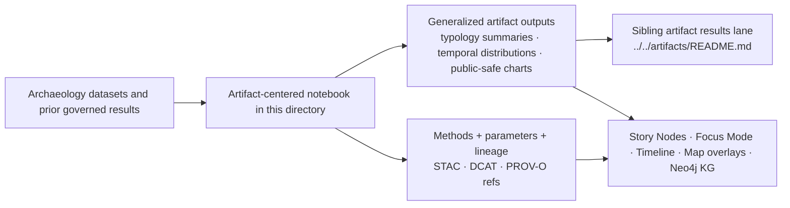

<!-- [KFM_META_BLOCK_V2]
doc_id: kfm://doc/NEEDS-VERIFICATION
title: Kansas Frontier Matrix — Artifact-Centered Archaeology Notebooks
type: standard
version: v1
status: draft
owners: NEEDS VERIFICATION
created: YYYY-MM-DD
updated: YYYY-MM-DD
policy_label: NEEDS VERIFICATION
related: [../README.md, ../../README.md, ../../../README.md, ../../artifacts/README.md]
tags: [kfm, archaeology, notebooks, artifacts]
notes: [Parent archaeology notebook and archaeology results lanes are corpus-confirmed; local child inventory, owners, dates, policy label, sibling artifact-results file path, and mounted repo proof remain NEEDS VERIFICATION.]
[/KFM_META_BLOCK_V2] -->

<a id="top"></a>

# 📓 Kansas Frontier Matrix — Artifact-Centered Archaeology Notebooks

Working lane for lithic, ceramic, faunal, and other artifact-centered archaeology notebooks that must remain public-safe, provenance-aware, and FAIR+CARE-governed.

> [!NOTE]
> **Status:** experimental  
> **Owners:** NEEDS VERIFICATION  
>      
> **Quick jumps:** [Scope](#scope) · [Repo fit](#repo-fit) · [Accepted inputs](#accepted-inputs) · [Exclusions](#exclusions) · [Current verified snapshot](#current-verified-snapshot) · [Directory tree](#directory-tree) · [Quickstart](#quickstart) · [Usage](#usage) · [Diagram](#diagram) · [Notebook class matrix](#notebook-class-matrix) · [Task list](#task-list--definition-of-done) · [FAQ](#faq)  
> **Repo fit:** `docs/analyses/archaeology/results/notebooks/artifacts/` → upstream: [`../README.md`](../README.md), [`../../README.md`](../../README.md), [`../../../README.md`](../../../README.md) · downstream: [`../../artifacts/README.md`](../../artifacts/README.md) **NEEDS VERIFICATION**

> [!IMPORTANT]
> This directory should behave as an **artifact-centered notebook lane**, not as a second public results registry, not as a precise provenience archive, and not as a catch-all archaeology workspace. Keep it narrow, routable, and explicit about masking, provenance, and ethics.

> [!WARNING]
> Current direct verification for this task is **PDF-visible corpus only**. Parent archaeology notebook and archaeology results roles are confirmed in the source corpus, but mounted child inventory, exact sibling file presence, owners, dates, CI hooks, and local metadata sidecar placement remain **NEEDS VERIFICATION**.

## Scope

This directory is for **artifact-centered analytical notebooks** inside the archaeology results notebook subtree.

**CONFIRMED** parent-lane coverage includes artifact-centered notebook work such as:

- lithic typology
- ceramic analysis
- faunal summaries
- generalized artifact distribution modeling

This lane is the right place for **notebook-stage analytical work** that is still close to methods, parameters, exploratory charts, and reproducible computation.

This lane is **not** the place for:

- exact or identifying spatial disclosure
- sovereign or restricted cultural knowledge
- final public results summaries that belong in a stabilized sibling results lane
- non-artifact notebook topics that have clearer homes elsewhere in the notebook tree

## Repo fit

| Path | Role | Relationship |
| --- | --- | --- |
| `../../../README.md` | archaeology analysis root | broadest local archaeology analysis context |
| `../../README.md` | archaeology results root | results-wide routing surface across archaeology lanes |
| `../README.md` | archaeology notebooks root | parent notebook index and notebook-lane conventions |
| `docs/analyses/archaeology/results/notebooks/artifacts/README.md` | this file | artifact-centered notebook lane |
| `../../artifacts/README.md` | stabilized artifact results surface | **INFERRED** downstream destination for reviewed, public-safe artifact result summaries |
| sibling notebook lanes such as `../spatial/`, `../temporal/`, `../environmental/`, `../cultural-landscapes/`, `../geophysics/`, `../predictive/`, `../explainability/` | non-artifact notebook homes | route work outward when the notebook stops being artifact-centered |

## Accepted inputs

| Input type | What belongs here | Evidence posture |
| --- | --- | --- |
| Artifact-centered notebooks | Jupyter notebooks focused on lithics, ceramics, faunal materials, or generalized artifact distribution patterns | **CONFIRMED** parent-lane fit |
| Companion method notes | Parameter choices, notebook execution notes, uncertainty notes, masking notes, and public-safe interpretation boundaries | **CONFIRMED** by archaeology reproducibility requirements |
| Public-safe preview outputs | Charts, generalized summaries, notebook-derived figures, and redacted notebook exports suitable for review | **INFERRED** from notebook/results governance pattern |
| Metadata and lineage references | STAC/DCAT references, PROV-O lineage references, run notes, and review context needed to reconstruct claims | **CONFIRMED** as required result packaging, exact local placement **NEEDS VERIFICATION** |
| Ethics and CARE review context | Narrative caution, masking decisions, sovereignty notes, and publication-safety notes | **CONFIRMED** |

## Exclusions

| Excluded material | Why it does not belong here | Where it should go instead |
| --- | --- | --- |
| Exact coordinates of sacred or protected sites | Forbidden by archaeology notebook/results safety rules | Restricted workflow outside this public-safe lane |
| Raw human-remains datasets | Explicitly excluded from notebook outputs | Restricted stewardship workflow |
| Restricted tribal knowledge or unapproved oral-history material | Not admissible as routine notebook output | Sovereignty-reviewed lane or steward-only process |
| Precise burial, ceremony, or sacred-landscape inference | Violates CARE and cultural safety constraints | Do not publish here |
| Non-artifact notebook work | Better routed to narrower sibling notebook lanes | `../spatial/`, `../temporal/`, `../environmental/`, `../cultural-landscapes/`, `../geophysics/`, `../predictive/`, `../explainability/` |
| Final public artifact results registry content | This lane is notebook-stage, not final public summary | `../../artifacts/README.md` **NEEDS VERIFICATION** |

## Current verified snapshot

| Status | Statement | Why it matters |
| --- | --- | --- |
| **CONFIRMED** | The archaeology notebooks parent lane includes an `artifacts/` notebook class alongside spatial, temporal, environmental, cultural-landscapes, geophysics, predictive, and explainability lanes. | This confirms that `notebooks/artifacts/` is consistent with the source corpus. |
| **CONFIRMED** | Artifact-centered notebooks cover lithic typology, ceramic analysis, faunal summaries, and generalized distribution modeling. | This defines what belongs here. |
| **CONFIRMED** | Notebook and result outputs are expected to carry data-source references, methods, parameters, code, PROV-O lineage, and ethics review context. | This makes reproducibility and provenance load-bearing, not optional. |
| **CONFIRMED** | Archaeology notebook outputs must not include exact coordinates of sacred/protected sites, raw human-remains datasets, or restricted tribal knowledge. | This sets the hard publication boundary for the lane. |
| **CONFIRMED** | Archaeology notebook/results work is governed by FAIR+CARE and uses masking/generalization plus WAL → Retry → Rollback lineage language. | This shapes both notebook content and outward routing. |
| **INFERRED** | This child README should act as a routing and conventions surface between exploratory artifact notebooks and more stable artifact results outputs. | The parent and sibling lane structure strongly imply this role, but mounted repo proof is still missing. |
| **UNKNOWN / NEEDS VERIFICATION** | Exact child notebook inventory, file naming convention, owners, policy label, local sidecar filenames, and CI/test wiring. | These should not be invented from corpus examples alone. |

## Directory tree

```text
docs/
└── analyses/
    └── archaeology/
        └── results/
            ├── README.md
            ├── artifacts/
            │   └── README.md                     # NEEDS VERIFICATION
            └── notebooks/
                ├── README.md
                └── artifacts/
                    └── README.md                 # this file
```

**NEEDS VERIFICATION:** any notebook leaves, subfolders, result manifests, or metadata/provenance sidecars that may live under `docs/analyses/archaeology/results/notebooks/artifacts/`.

## Quickstart

### Start a new artifact-centered notebook

1. Confirm the notebook’s central question is truly **artifact-centered**.
2. Confirm the output can remain **public-safe** after masking, generalization, and ethics review.
3. Record the notebook’s data sources, methods, parameters, code location, and provenance references.
4. State the notebook’s **uncertainty and interpretation limits** in plain language.
5. Route stabilized public-safe summaries outward to the artifact results lane rather than duplicating that role here.
6. Update this README when the verified inventory or local conventions materially change.

### Minimal notebook header pattern

Use a compact header block inside the notebook or a companion Markdown note.

```md
# Notebook intent

- Question:
- Artifact class:
- Public-safe output posture:
- Inputs (dataset / STAC / DCAT refs):
- Methods:
- Parameters:
- Provenance / run refs:
- CARE review notes:
- Uncertainty notes:
- Downstream results lane:
```

> [!TIP]
> Treat the notebook as a **reproducible method surface** first and a narrative surface second. If a later public summary cannot trace back to methods, parameters, and provenance, it is not ready to leave notebook-stage work.

## Usage

### Add or revise a notebook

1. Keep the notebook centered on artifact analysis rather than broad archaeology in general.
2. Preserve **public-safe** posture throughout the workflow.
3. Keep masking, redaction, and generalization visible rather than implied.
4. Link to source, method, and lineage material directly.
5. Route non-artifact or final-public-summary work to a better lane.

### Keep here vs. route elsewhere

| Case | Keep in this lane? | Route |
| --- | --- | --- |
| Lithic or ceramic analysis notebook still close to methods and iteration | Yes | Keep here |
| Faunal or artifact-distribution notebook with public-safe generalized outputs | Yes | Keep here |
| Notebook becomes a stable public summary page | No | Route to `../../artifacts/README.md` **NEEDS VERIFICATION** |
| Notebook is primarily temporal, environmental, cultural-landscape, geophysics, predictive, or explainability work | Usually no | Route to the matching sibling notebook lane |
| Work includes precise sensitive provenience, burial inference, sacred landscapes, or restricted knowledge | No | Restricted stewardship workflow, not this lane |

### Update this README when

- the mounted child inventory changes
- owners or metadata placeholders are resolved
- a stable file naming convention is agreed
- sibling routing boundaries change
- the lane gains enough depth to justify a registry table of verified notebook leaves

## Diagram



**NEEDS VERIFICATION:** exact downstream file inventory and whether `../../artifacts/README.md` is the mounted sibling target path in the current repo.

## Notebook class matrix

| Notebook class | Typical examples | Keep here | Guardrails |
| --- | --- | --- | --- |
| Lithic analysis | typology, reduction-stage summaries, generalized distribution charts | Yes | No precise site disclosure; provenance required |
| Ceramic analysis | ware/type comparisons, temporal distributions, generalized spatial summaries | Yes | No restricted provenance exposure; ethics review applies |
| Faunal analysis | taxonomic summaries, temporal comparisons, generalized pattern views | Yes | Avoid sensitive or identifying contextual disclosure |
| Generalized artifact distribution modeling | KDE, H3 summaries, broad pattern views | Yes | Must remain generalized and not imply exact locations |
| Human-remains analysis | skeletal or burial data work | No | Not admissible here |
| Restricted cultural interpretation | tribal knowledge, sacred or ceremony-linked notebooks | No | Stewarded restricted process only |
| Final public artifact results registry page | polished results-facing documentation | No | Route to sibling artifact results lane |

## Local conventions

### Artifact notebooks should emphasize

- methods clarity
- parameter transparency
- public-safe outputs
- provenance and review context
- uncertainty disclosure
- explicit routing to downstream results surfaces

### Artifact notebooks should avoid

- acting like final public registry pages
- mixing multiple notebook lanes into one catch-all document
- burying masking/generalization steps
- implying mounted CI, schema, or workflow coverage that has not been directly verified
- quietly escalating generalized pattern work into precise site claims

## Task list / definition of done

- [ ] The notebook’s central purpose is clearly artifact-centered.
- [ ] No exact sacred/protected coordinates appear.
- [ ] No raw human-remains data appears.
- [ ] No restricted tribal knowledge or unapproved oral-history content appears.
- [ ] Methods, parameters, code, and provenance references are present.
- [ ] STAC/DCAT/PROV references are present or explicitly marked **NEEDS VERIFICATION**.
- [ ] Masking/generalization decisions are documented.
- [ ] Uncertainty and interpretation limits are visible.
- [ ] Downstream routing to stabilized results is explicit.
- [ ] This README is updated if verified inventory or local conventions change.

## FAQ

### Is this the public artifact results registry?
No. This is the **artifact-centered notebook lane**. It should stay closer to computation, method, and notebook-stage reproducibility than the sibling artifact results surface.

### Can a notebook here include exact artifact or site locations?
No. Archaeology notebook/results guidance explicitly excludes exact sensitive location disclosure and requires public-safe generalization.

### Does this lane replace the parent archaeology notebook index?
No. The parent notebook README remains the notebook subtree index. This file narrows the scope to artifact-centered work only.

### Must STAC, DCAT, and PROV files live in this exact folder?
**NEEDS VERIFICATION.** The corpus confirms that archaeology notebooks/results require those references and lineage structures, but the exact mounted child-folder placement was not directly verified in this session.

### Can this lane hold non-artifact notebooks just because they mention artifacts?
Usually no. If the notebook’s primary burden is spatial, temporal, environmental, cultural-landscape, geophysics, predictive, or explainability work, route it to the more specific sibling lane.

<details>
<summary>Appendix — open verification backlog</summary>

### Highest-value direct verification items

| Verification item | Why it matters |
| --- | --- |
| Mounted child inventory under `docs/analyses/archaeology/results/notebooks/artifacts/` | Prevents invented file trees and lets this README link to real leaves |
| Actual owners / steward labels for this child lane | Needed to replace placeholders in the KFM meta block and impact block |
| Confirmed sibling path for stabilized artifact results | Prevents routing drift between notebook-stage and results-stage docs |
| Actual metadata sidecar locations | Needed before claiming exact STAC / DCAT / PROV placement |
| CI/test hooks affecting archaeology notebook outputs | Needed before making any enforcement claims |
| Policy label for this file | Needed to replace `NEEDS VERIFICATION` in the meta block |

### Conservative editing rule

Until those items are directly verified from the mounted repository, keep local inventory, ownership, and enforcement claims visibly provisional.

</details>

[Back to top](#top)
