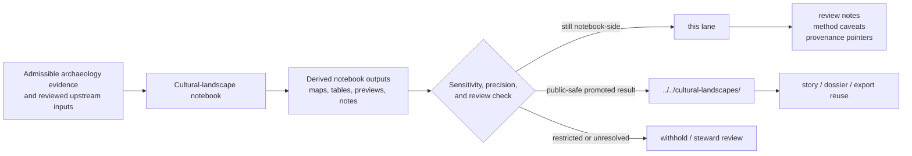

<!-- [KFM_META_BLOCK_V2]
doc_id: kfm://doc/NEEDS-VERIFICATION
title: KFM Archaeology Cultural-Landscape Notebooks
type: standard
version: v1
status: draft
owners: NEEDS VERIFICATION
created: YYYY-MM-DD
updated: YYYY-MM-DD
policy_label: NEEDS VERIFICATION
related: [../README.md, ../../README.md, ../../cultural-landscapes/README.md]
tags: [kfm, archaeology, notebooks, cultural-landscapes, analysis]
notes: [Current public repo verification confirms this path exists, but owners, dates, policy label, and any child inventory beyond README.md still need direct repo verification.]
[/KFM_META_BLOCK_V2] -->

# KFM Archaeology Cultural-Landscape Notebooks

Notebook-lane index for cultural-landscape analyses and their derived, reviewable outputs inside KFM.

> [!IMPORTANT]
> **Status:** experimental  
> **Owners:** NEEDS VERIFICATION  
>      
> **Quick jumps:** [Scope](#scope) · [Repo fit](#repo-fit) · [Accepted inputs](#accepted-inputs) · [Exclusions](#exclusions) · [Current verified baseline](#current-verified-baseline) · [Directory tree](#directory-tree) · [Quickstart](#quickstart) · [Usage](#usage) · [Diagram](#diagram) · [Reference tables](#reference-tables) · [Task list](#task-list--definition-of-done) · [FAQ](#faq) · [Appendix](#appendix)  
> **Repo fit:** `docs/analyses/archaeology/results/notebooks/cultural-landscapes/README.md` → upstream: [`../README.md`](../README.md), [`../../README.md`](../../README.md) · downstream: [`../../cultural-landscapes/README.md`](../../cultural-landscapes/README.md)

> [!NOTE]
> This directory is the **notebook lane** for cultural-landscape work. It is the place for notebook-side analysis, reviewable derived outputs, and lane guidance — not the final promoted results surface.

> [!WARNING]
> Current public-tree verification confirms only `README.md` at this path. Any staged notebook families, companion metadata, or deeper subdirectories described below are intentionally marked as **PROPOSED** or **NEEDS VERIFICATION**, not asserted as current tree fact.

## Scope

This directory exists for **cultural-landscape analysis notebooks and notebook-local companions** that still live in the derived, reviewable analysis layer.

Use this lane for work such as:

- corridor and movement-cost experiments
- generalized interaction-sphere analysis
- ecological affordance clustering tied to cultural-landscape questions
- cultural-region or settlement-tendency notebook work that remains generalized, reviewable, and non-publication-final

Keep the lane aligned to the stronger notebook-wide KFM posture already established upstream:

- **derived, not sovereign**
- **evidence-linked, not citation-free**
- **reviewable, not self-publishing**
- **public-safe by default**
- **2D-first unless a real 3D burden is shown**

## Repo fit

| Path | Role in the repo | Relationship |
| --- | --- | --- |
| `docs/analyses/archaeology/results/notebooks/README.md` | notebook family root | parent index and operating guide for archaeology notebooks |
| `docs/analyses/archaeology/results/notebooks/cultural-landscapes/README.md` | this file | notebook-lane README for cultural-landscape analysis |
| `docs/analyses/archaeology/results/cultural-landscapes/README.md` | promoted sibling results lane | use when an output is no longer notebook-side and is ready to behave like a public-safe result surface |
| `docs/analyses/archaeology/results/notebooks/spatial/README.md` | sibling notebook lane | style and structure reference for a lane-specific notebook README |
| `docs/analyses/archaeology/results/notebooks/environmental/` | adjacent notebook lane | route work here when the center of gravity is environmental analysis rather than cultural-landscape synthesis |
| `docs/analyses/archaeology/results/notebooks/predictive/` | adjacent notebook lane | route work here when the notebook is mainly predictive-model-centric rather than cultural-landscape-centric |

[Back to top](#kfm-archaeology-cultural-landscape-notebooks)

## Accepted inputs

This lane should contain **notebook-side materials**, not already-promoted publication artifacts.

| Accepted input | What belongs here | Notes |
| --- | --- | --- |
| Jupyter notebooks | `.ipynb` notebooks whose main analytical subject is cultural-landscape reasoning | Keep them generalized and reviewable |
| Notebook-local markdown | method notes, assumptions, modeling caveats, reviewer-facing narrative | Prefer short, inspectable companions over hidden notebook prose |
| Parameter snapshots | run parameters, notebook config exports, threshold notes | Useful for reproducibility and review |
| Reviewable previews | low-risk plots, generalized maps, comparison figures, residual plots | Must stay public-safe for this lane |
| Run notes and manifests | notebook run notes, lightweight manifests, reviewer notes | Do not treat these as canonical promotion artifacts unless separately governed |
| Provenance pointers | links or references to upstream evidence, inputs, and notebook outputs | Keep notebook lineage legible even before promotion |
| Public-safe derived outputs | generalized rasters, summary tables, map panels, chart exports | Still notebook-side unless promoted outward |

## Exclusions

This directory should **not** become a catch-all for archaeology outputs.

| Exclusion | Why it does not belong here | Route instead |
| --- | --- | --- |
| Final promoted result surfaces | This lane is notebook-side, not publication-final | [`../../cultural-landscapes/README.md`](../../cultural-landscapes/README.md) |
| RAW / WORK / QUARANTINE source data | This README is for results notebooks, not intake or controlled staging zones | governed data lanes and source-processing paths |
| Exact coordinates or precise route reconstructions | Cultural-landscape notebook work must remain generalized and public-safe here | stewarded restricted workflows |
| Restricted cultural knowledge or identity-bearing inference | Out of bounds for notebook lane publication posture | FAIR+CARE review / restricted documentation surfaces |
| Canonical policy bundles, contract schemas, release proof packs | Those are governance and release artifacts, not notebook-lane contents | governance / contracts / release lanes |
| AI-only speculative narrative | KFM notebook outputs must remain evidence-linked and reviewable | withhold until evidence and review catch up |
| Story / dossier / export-ready presentation packages | Those are downstream delivery surfaces | story, dossier, export, or promoted results lanes |

## Current verified baseline

| Item | Status | Meaning for this README |
| --- | --- | --- |
| `docs/analyses/archaeology/results/notebooks/cultural-landscapes/` exists | **CONFIRMED** | The directory is real and should have a lane-specific README |
| Only `README.md` is currently confirmed inside this path | **CONFIRMED** | The tree below stays exact and minimal |
| Parent archaeology notebook lane includes `cultural-landscapes/` as a child | **CONFIRMED** | This file should read like a notebook subtree, not a detached one-off |
| The checked-in file at this path currently reads like a copied results-lane README | **CONFIRMED** | The rewrite corrects scope, routing, and terminology drift |
| A separate sibling promoted results lane already exists at `../../cultural-landscapes/` | **CONFIRMED** | This file must keep notebook and results responsibilities separate |
| Path-local child notebook families under this directory | **UNKNOWN / NEEDS VERIFICATION** | Do not present staged leaves as current inventory |
| Owners, dates, policy label, and final doc ID | **NEEDS VERIFICATION** | Keep placeholders visible instead of inventing values |

## Directory tree

Current public-tree verification supports the following exact inventory:

```text
docs/analyses/archaeology/results/notebooks/cultural-landscapes/
└── README.md
```

### Staged notebook families (not current-tree fact)

The following are **PROPOSED** notebook-family patterns that fit this lane’s role, but they are **not** asserted here as currently mounted subdirectories:

- `corridors/`
- `interaction-spheres/`
- `ecological-affordances/`
- `cultural-regions/`
- `comparative/`
- `uncertainty/`

## Quickstart

### 1) Revise this lane safely

```bash
ls docs/analyses/archaeology/results/notebooks/cultural-landscapes
```

Check the actual path inventory first. As currently verified, this command should show only `README.md`.

### 2) Keep notebook and results lanes separate

Use this lane when the work is still:

- notebook-side
- review-bearing
- generalized
- method-forward
- not yet behaving like a promoted public-safe results surface

Move outward to [`../../cultural-landscapes/README.md`](../../cultural-landscapes/README.md) only when the artifact is ready to function as a stable result surface.

### 3) Add a new leaf only after lane-level review

```bash
mkdir -p docs/analyses/archaeology/results/notebooks/cultural-landscapes/<leaf>
```

Use this only after the repo owners decide that a new child lane is warranted. Do not pre-document unverified child paths as though they already exist.

## Usage

### When this lane is the right home

Use `notebooks/cultural-landscapes/` when a notebook’s center of gravity is one or more of the following:

- generalized movement or corridor experiments
- interaction-sphere affinity analysis
- eco-hydrological or terrain-linked cultural-landscape synthesis
- landscape-scale settlement tendency analysis that remains generalized and non-attributional
- notebook-side comparison work between cultural-landscape hypotheses and environmental evidence

### Notebook-side contract

A notebook in this lane should make the following legible to a reviewer.

| Reviewer question | What the notebook should show |
| --- | --- |
| What is being tested? | a narrow cultural-landscape analysis question, not a broad publication claim |
| What evidence does it use? | admissible source inputs or downstream evidence references |
| What is the spatial support? | generalized support only; no exact cultural geography leakage |
| What is the temporal basis? | clear date/phase/window logic, especially for comparative notebooks |
| What is modeled vs observed? | explicit distinction between observed evidence and modeled surfaces |
| What is the uncertainty posture? | method limits, uncertainty layers, or reviewer-facing caveats |
| What happens next? | stay in notebook lane, route to restricted review, or promote to sibling results lane |

### Guardrails for cultural-landscape work

This lane is especially sensitive to analytical overreach. Keep the following boundaries explicit:

- environmental predictors are **not** cultural identity
- generalized movement surfaces are **not** territorial claims
- corridor or affinity outputs are **not** exact historical travel paths
- settlement-tendency patterns are **not** site-level inference
- generalized regional patterns are **not** sovereignty, ownership, or sacred-geography claims

### 2D-first, 3D-only-when-burdened

Notebook-side cultural-landscape work should default to 2D analysis and review surfaces. Use 3D only when it materially improves interpretation and does not become decorative spectacle.

[Back to top](#kfm-archaeology-cultural-landscape-notebooks)

## Diagram



## Reference tables

### Lane routing matrix

| Work item | Keep here | Send elsewhere |
| --- | --- | --- |
| Notebook draft with generalized corridor experiments | ✅ |  |
| Reviewer-facing method notes for interaction-sphere analysis | ✅ |  |
| Public-safe generalized preview maps attached to a notebook review | ✅ |  |
| Final curated cultural-landscape result registry |  | ✅ `../../cultural-landscapes/` |
| Exact route reconstruction or precise locational outputs |  | ✅ restricted workflow |
| Canonical schema or promotion proof pack |  | ✅ governance / contracts / release lanes |

### Staged notebook pattern matrix

| Pattern | Typical notebook-side outputs | Status in this README | Main caution |
| --- | --- | --- | --- |
| Corridor-cost analysis | cost surfaces, generalized corridor previews, parameter tables | **PROPOSED** | do not overstate modeled routes as historical truth |
| Interaction-sphere analysis | affinity grids, generalized regional comparisons, uncertainty notes | **PROPOSED** | do not imply tribal or cultural boundaries |
| Ecological affordance clustering | cluster maps, factor summaries, environmental comparison notes | **PROPOSED** | keep environmental framing explicit |
| Cultural-region generalization | broad comparative panels, regional summaries, map series | **PROPOSED** | keep claims generalized and review-bearing |
| Comparative notebook reviews | side-by-side figure sets, method deltas, reviewer notes | **PROPOSED** | do not let comparison artifacts masquerade as promotion-ready outputs |

### Review signals worth keeping visible

| Signal | Why it matters |
| --- | --- |
| modeled vs observed | prevents evidence collapse |
| generalized precision | protects against site-level leakage |
| reviewer-facing caveats | keeps uncertainty visible |
| downstream route | reduces notebook/result lane drift |
| provenance pointers | keeps reruns and promotion inspectable |

## Task list — definition of done

A lane update is complete when the following are true:

- [ ] The title, scope, and path all describe the **notebook lane**, not the sibling results lane.
- [ ] The current directory tree is exact and does not invent child entries.
- [ ] Accepted inputs and exclusions are explicit.
- [ ] Notebook-side cultural-landscape work is clearly separated from promoted results work.
- [ ] Generalization and CARE constraints are named in-place.
- [ ] The document distinguishes environmental predictors from cultural interpretation.
- [ ] At least one meaningful Mermaid diagram is present.
- [ ] Staged ideas are labeled **PROPOSED** or **NEEDS VERIFICATION** rather than flattened into fact.
- [ ] Placeholders remain visible where repo-side verification is still missing.
- [ ] The file feels native to adjacent notebook documentation instead of copied from a different lane.

### Review checks

Before merging edits here, confirm:

1. no exact coordinates or route-level leakage were introduced
2. no results-lane paths were silently substituted for notebook-lane paths
3. no new subdirectories were claimed without tree evidence
4. any promotion-ready artifacts were routed outward instead of left here by habit
5. any added notebook family language still preserves non-attributional, generalized framing

## FAQ

### Why does this README stay so strict about tree inventory?

Because the current public repo verification for this path confirms only `README.md`. This file should not imply a richer mounted subtree than the repo currently proves.

### Why not document `ecological-affordances/` here as a current child?

Because the verified current `ecological-affordances/` lane sits under the **sibling promoted results surface** at `docs/analyses/archaeology/results/cultural-landscapes/`, not under this notebook path.

### Can a notebook here produce maps and rasters?

Yes — but they stay notebook-side, review-bearing, and generalized until there is a deliberate downstream promotion step.

### Is this the place for exact corridor reconstruction?

No. This lane can host generalized movement or cost-surface analysis, but not exact-route claims or restricted geographies.

### Does this lane own STAC / DCAT / PROV directories today?

That is **NEEDS VERIFICATION** for this exact path. The current public tree does not confirm child metadata directories here, so this README treats them as companion concepts, not current inventory.

### Are outputs here authoritative truth?

No. This lane is for derived analysis notebooks and reviewable outputs. Promotion and outward-facing result behavior belong elsewhere.

[Back to top](#kfm-archaeology-cultural-landscape-notebooks)

## Appendix

<details>
<summary><strong>Open verification backlog</strong></summary>

### Path-level metadata still needing direct repo verification

- document owner names
- created / updated dates
- final `doc_id`
- final `policy_label`
- whether any child notebook leaves are already planned but not yet public
- whether this lane has CODEOWNERS or review-gate automation
- whether notebook-local metadata companions exist outside the currently visible public tree

### Safe next expansions

Add one of these only when the live repo, maintainers, and lane boundaries all agree:

1. a `corridors/README.md` notebook sublane for movement-cost work
2. a `comparative/README.md` sublane for notebook-to-notebook synthesis
3. a small example block showing how a notebook should declare:
   - evidence inputs
   - modeled outputs
   - uncertainty posture
   - downstream routing decision

### Changes this README intentionally does **not** make

- it does **not** invent child paths as current inventory
- it does **not** fold the notebook lane into the sibling results lane
- it does **not** claim current CI, schema, or telemetry hooks for this path
- it does **not** convert generalized cultural-landscape notebook work into identity-bearing or territorial assertions

</details>
