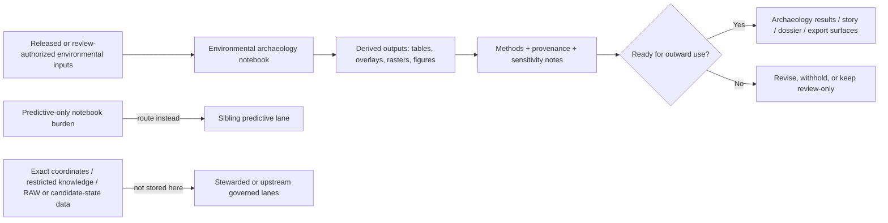

<!-- [KFM_META_BLOCK_V2]
doc_id: kfm://doc/NEEDS-VERIFICATION
title: Environmental Archaeology Notebooks
type: standard
version: v1
status: draft
owners: NEEDS VERIFICATION
created: YYYY-MM-DD
updated: YYYY-MM-DD
policy_label: NEEDS VERIFICATION
related: [../README.md, ../../README.md, ../../../README.md, ../spatial/README.md, ../temporal/README.md, ../predictive/README.md, ../../../../_templates/analysis_readme.md]
tags: [kfm, archaeology, analyses, notebooks, environmental]
notes: [Current public-main verification shows this lane exists but is README-only scaffold at the moment; verify owners, dates, policy label, and any working-branch notebook inventory before merge.]
[/KFM_META_BLOCK_V2] -->

# Environmental Archaeology Notebooks

Evidence-bounded lane guide for archaeology notebooks that relate site, survey, and landscape questions to climate, hydrology, soils, vegetation, and paleoenvironment context.

> [!NOTE]
> **Status:** experimental  
> **Owners:** NEEDS VERIFICATION  
>       
> **Quick jumps:** [Scope](#scope) · [Repo fit](#repo-fit) · [Accepted inputs](#accepted-inputs) · [Exclusions](#exclusions) · [Current verified baseline](#current-verified-baseline) · [Directory tree](#directory-tree) · [Quickstart](#quickstart) · [Usage](#usage) · [Diagram](#diagram) · [Reference tables](#reference-tables) · [Task list](#task-list--definition-of-done) · [FAQ](#faq) · [Appendix](#appendix)  
> **Repo fit:** `docs/analyses/archaeology/results/notebooks/environmental/README.md` → upstream: [`../README.md`](../README.md), [`../../README.md`](../../README.md), [`../../../README.md`](../../../README.md), [`../../../../README.md`](../../../../README.md) · sibling lanes: [`../spatial/README.md`](../spatial/README.md), [`../temporal/README.md`](../temporal/README.md), [`../predictive/README.md`](../predictive/README.md), [`../geophysics/README.md`](../geophysics/README.md), [`../artifacts/README.md`](../artifacts/README.md), [`../cultural-landscapes/README.md`](../cultural-landscapes/README.md)

> [!IMPORTANT]
> Current public-`main` verification shows this lane exists, but the visible file inventory is still **README-only placeholder scaffolding**. This README therefore prioritizes **lane boundary, trust posture, and routing** over claims about mature notebook inventory, schema hooks, or automation behavior.

> [!WARNING]
> Environmental archaeology can blur **observed**, **proxy/reconstructed**, **modeled**, and **derived/interpreted** inputs into one smooth story. This lane should do the opposite: keep those states visible, keep time basis visible, and never use environmental context to smuggle in exact sensitive locations, unsupported causal claims, or cultural-identity inference.

## Scope

This directory is the notebook-family lane for archaeology work whose explanatory burden is **environmental context**.

In the currently verified parent notebook index, that means notebook work centered on **climate, hydrology, soils, vegetation, and paleoenvironment correlation**. This lane is for notebooks that help answer questions like:

- how site patterning relates to moisture, floodplain, soils, vegetation, or terrain context
- how an archaeological distribution compares to environmental gradients or environmental change
- how notebook-derived environmental overlays, summaries, or raster products qualify an archaeological interpretation
- how paleoenvironment context is used as evidence-bearing support rather than as speculative narrative decoration

Use this README to keep the lane narrow, inspectable, and honest about what it does **not** prove.

### Status vocabulary used here

| Label | Use in this README |
| --- | --- |
| **CONFIRMED** | Directly verified from the current public repo surface or supported by attached KFM doctrine |
| **INFERRED** | Conservative interpretation that fits visible repo evidence or attached doctrine, but is not directly proven as working-branch fact |
| **PROPOSED** | Starter structure, guidance, or wording added to turn this lane into a reviewable README |
| **UNKNOWN** | Not verified strongly enough in the current session |
| **NEEDS VERIFICATION** | Explicit review item before merge |

## Repo fit

This file should behave as a **lane README**, not as a second paleoenvironment manual, not as a predictive-model registry, and not as a catch-all notebook dump.

| Direction | Path | Why it matters | Status |
| --- | --- | --- | --- |
| **This file** | `docs/analyses/archaeology/results/notebooks/environmental/README.md` | lane README for environmental archaeology notebooks | **CONFIRMED path** |
| **Upstream** | [`../README.md`](../README.md) | parent notebook index and family boundary | **CONFIRMED** |
| **Upstream** | [`../../README.md`](../../README.md) | archaeology results publication boundary | **CONFIRMED** |
| **Upstream** | [`../../../README.md`](../../../README.md) | archaeology analysis doctrine and sensitivity posture | **CONFIRMED** |
| **Upstream** | [`../../../../_templates/analysis_readme.md`](../../../../_templates/analysis_readme.md) | lane-README pattern source for thin analysis directories | **CONFIRMED** |
| **Sibling** | [`../predictive/README.md`](../predictive/README.md) | predictive-model work belongs there when forecast/probability is primary | **CONFIRMED path** |
| **Sibling** | [`../spatial/README.md`](../spatial/README.md) | pure clustering / KDE / proximity work belongs there when environment is only support | **CONFIRMED path** |
| **Sibling** | [`../temporal/README.md`](../temporal/README.md) | chronology and sequence testing should stay there when time logic is primary | **CONFIRMED path** |
| **Sibling** | [`../geophysics/README.md`](../geophysics/README.md) | geophysics interpretation should not be quietly mixed into this lane | **CONFIRMED path** |
| **Downstream** | lane-local notebook leaves and assets beside this README | none are currently verified on public `main` beyond this README itself | **NEEDS VERIFICATION** |

### Lane role in the larger archaeology flow

This directory sits under the **derived notebook layer** of archaeology results. It should help a reader answer four questions quickly:

1. Is this notebook actually environmental in burden, or is it better routed to another sibling lane?
2. What kind of environmental input state is being used: observed, proxy, modeled, or derived?
3. What public-safe controls, uncertainty notes, and provenance links qualify the result?
4. What downstream result surface could reuse the notebook output safely?

## Accepted inputs

Place materials here when they are primarily **environment-facing archaeology notebook surfaces**, such as:

- Jupyter notebooks that correlate archaeological evidence with climate, hydrology, soils, vegetation, terrain, or paleoenvironment context
- lane-local markdown notes that explain environmental variable choice, time basis, proxy basis, uncertainty, or public-safe reduction
- small figures, raster quicklooks, overlay maps, charts, and correlation tables produced by notebooks in this lane
- notebook-side provenance notes that point to dataset versions, catalog records, run receipts, or equivalent evidence handles
- rerun notes, parameter snapshots, or short manifests that make an environmental notebook reviewable
- narrow leaf pages that summarize one notebook question, one study window, one environmental driver family, or one methods slice

### What belongs here in practice

This lane is strongest when each leaf stays narrow:

- one notebook or one notebook family
- one clearly named environmental question
- one visible time basis
- one explicit sensitivity posture
- one obvious route back to evidence and methods

## Exclusions

| Excluded material | Why it does not belong here | Where it goes instead |
| --- | --- | --- |
| **Predictive suitability, forecast, probability, or validation-first notebook work** | predictive burden should stay explicit instead of being laundered as ordinary correlation | [`../predictive/README.md`](../predictive/README.md) |
| **Pure chronology or phase-order reasoning** | time logic is the primary burden there | [`../temporal/README.md`](../temporal/README.md) |
| **Spatial clustering, KDE, or proximity work with no environmental explanatory burden** | that is spatial notebook work first | [`../spatial/README.md`](../spatial/README.md) |
| **Geophysics-only anomaly review or sensor interpretation** | keep geophysics signal claims in their own lane | [`../geophysics/README.md`](../geophysics/README.md) |
| **Artifact typology, assemblage, or material-culture patterning that is not environment-led** | artifact analysis already has its own lane | [`../artifacts/README.md`](../artifacts/README.md) |
| **Corridor, interaction-sphere, or settlement reconstruction where environmental variables are secondary** | that is cultural-landscape work first | [`../cultural-landscapes/README.md`](../cultural-landscapes/README.md) |
| **RAW / WORK / QUARANTINE data** | this is a results-notebook lane, not an intake or candidate-state lane | governed upstream lifecycle zones |
| **Exact site coordinates, raw human-remains data, or restricted cultural knowledge** | not public-safe notebook material | steward-reviewed or access-controlled lanes |
| **Final story, dossier, export, or public release artifacts** | those are downstream publication surfaces, not notebook-lane documentation | archaeology results / governed product surfaces |
| **Speculative environmental determinism** | KFM doctrine requires bounded interpretation, not persuasive overreach | keep out until evidence, method, and review state justify it |

## Current verified baseline

| Item | Verified state | Notes |
| --- | --- | --- |
| Lane path `docs/analyses/archaeology/results/notebooks/environmental/` | **CONFIRMED** | visible on current public `main` |
| Current public-main file inventory | **CONFIRMED** | only `README.md` is visible in this lane right now |
| Parent notebook index describes this family as climate, hydrology, soils, vegetation, or paleoenvironment correlation | **CONFIRMED** | use that as the primary lane boundary |
| Parent notebook index warns that observed and modeled inputs must remain distinct | **CONFIRMED** | this is the key caution that should shape every leaf here |
| Notebook leaves, assets, figures, or local helper files beyond `README.md` | **UNKNOWN** | none are visible in the current public snapshot |
| Owners, created/updated dates, policy label, live notebook counts, validation hooks | **NEEDS VERIFICATION** | replace placeholders from working-branch truth before merge |

[Back to top](#environmental-archaeology-notebooks)

## Directory tree

### Current verified public-main tree

```text
docs/
└── analyses/
    └── archaeology/
        └── results/
            └── notebooks/
                └── environmental/
                    └── README.md
```

> [!TIP]
> Because the current public-main snapshot is still README-only, the safest next step is usually to add **one narrow notebook leaf** rather than inventing a deep subfolder hierarchy too early.

## Quickstart

Use this lane when you need to **review**, **add**, or **audit** archaeology notebooks whose main analytic burden is environmental context.

### Minimal operator sequence

1. Confirm the work is actually environmental in burden and not better routed to a sibling lane.
2. Confirm whether each input is **observed**, **proxy/reconstructed**, **modeled**, or **derived/interpreted**.
3. Record time basis, acquisition date or periodization, spatial support, units, and any calibration or proxy caveats.
4. Run the notebook in a clean environment and keep the output inventory visible.
5. Generalize, mask, or withhold anything that could expose sensitive locations or restricted knowledge.
6. Route any outward-facing artifacts through the downstream review and publication boundary instead of treating notebook output as self-publishing.

### Illustrative launcher

```bash
# Illustrative only — replace with the project-approved environment and launcher.
jupyter lab docs/analyses/archaeology/results/notebooks/environmental/
```

### Before you add the first real notebook

- keep the question narrow
- keep the evidence route explicit
- keep the time basis explicit
- keep observed/proxy/modeled states distinct
- keep predictive-only work routed to the sibling predictive lane
- keep public-safe reduction visible instead of implied

## Usage

### Keep this lane narrow

An environmental notebook belongs here when the **environmental variable is part of the claim**, not just a convenient backdrop. A notebook that happens to use a DEM, a land-cover raster, or a moisture layer does **not** automatically belong here if its main burden is spatial clustering, chronology, prediction, or geophysics.

Right now, this lane should stay **flat and legible**. Until the live inventory proves otherwise, prefer a small number of narrow leaves over a sprawling environmental subtree.

### Environmental notebook contract

| Question | Minimum visible answer |
| --- | --- |
| **Why does this notebook exist?** | one-sentence archaeology question with an environmental burden |
| **What environmental inputs does it use?** | named variables, dataset/version refs, and input state labels |
| **What time basis governs the analysis?** | acquisition date, interval, phase window, or reconstruction horizon |
| **How were inputs aligned?** | reprojection, clipping, resampling, zonal stats, joins, thresholds, or aggregation notes |
| **What does it produce?** | output tables, figures, rasters, quicklooks, or notebook-side summaries |
| **What is the trust posture?** | observed / proxy / modeled / derived status is explicitly labeled |
| **What is the sensitivity posture?** | masking, aggregation, withholding, or exclusion rules are visible |
| **Can it be rerun and reviewed?** | execution order, parameters, and provenance links are visible enough to inspect |

> [!NOTE]
> Environmental notebooks are still **2D-first** by default. A 3D or volumetric notebook should appear here only when vertical reasoning materially changes the claim, and only when the notebook states why 2D was insufficient.

## Diagram



## Reference tables

### Input-state distinctions that must stay visible

| Input state | What it looks like in this lane | What the leaf must disclose |
| --- | --- | --- |
| **Observed** | released measurements, field observations, or observation-led rasters/tables | acquisition date, support, units, QC posture |
| **Proxy / reconstructed** | pollen, sediment, paleoenvironment, or other reconstruction surfaces | proxy basis, interpolation/reconstruction method, uncertainty |
| **Modeled** | hydrologic, climate, anomaly, or simulation-led surfaces | model/config identity, assumptions, calibration or fit notes |
| **Derived / interpreted** | notebook-generated overlays, correlations, indices, or summaries | method, thresholds, caveats, and why the output is not sovereign truth |

### Quick routing guide

| If the notebook is mostly about… | Put it here? | Better home when the burden shifts |
| --- | --- | --- |
| climate, hydrology, soils, vegetation, or paleoenvironment correlation | **Yes** | this lane |
| predictive suitability or forecast logic | usually **No** | [`../predictive/README.md`](../predictive/README.md) |
| phase ordering or chronology | usually **No** | [`../temporal/README.md`](../temporal/README.md) |
| H3/KDE/proximity patterning with environment only as support | often **No** | [`../spatial/README.md`](../spatial/README.md) |
| geophysics anomaly interpretation | **No** | [`../geophysics/README.md`](../geophysics/README.md) |
| assemblage or typology patterning | **No** | [`../artifacts/README.md`](../artifacts/README.md) |

[Back to top](#environmental-archaeology-notebooks)

## Task list & definition of done

This lane README is ready for review when all applicable checks below pass:

- [ ] H1, one-line purpose, and top impact block are present
- [ ] KFM meta block placeholders are resolved or intentionally preserved with an explicit note
- [ ] current public-main snapshot is described honestly
- [ ] repo-fit links are checked on the working branch
- [ ] accepted inputs and exclusions are explicit
- [ ] the lane boundary stays environmental and does not swallow predictive, spatial, temporal, geophysics, artifact, or cultural-landscape work
- [ ] observed / proxy / modeled / derived distinctions are visible
- [ ] exact sensitive coordinates and other restricted content are explicitly excluded
- [ ] at least one meaningful Mermaid diagram is present
- [ ] any future notebook leaves are routed to evidence, methods, outputs, and sensitivity notes
- [ ] no sentence overclaims live inventory, schemas, workflows, or runtime behavior

[Back to top](#environmental-archaeology-notebooks)

## FAQ

### Is every archaeology notebook that touches climate, terrain, or land cover automatically environmental?

No. Use this lane only when the environmental variable is part of the notebook’s main explanatory burden.

### Can predictive climate or hydrology notebooks live here?

Only when they are being used as bounded context within a broader environmental notebook. If prediction, suitability, or forecast logic is the main point, route the work to [`../predictive/README.md`](../predictive/README.md).

### Are notebook outputs in this lane authoritative truth objects?

No. They are derived analysis surfaces that stay downstream of evidence, release or review state, sensitivity handling, and correction lineage.

### Can public-safe notebook outputs include exact site coordinates?

They should not. Use aggregation, masking, generalization, or withholding as needed, and escalate to steward-reviewed handling when the precision burden is high.

### What is the single most important review question here?

Ask whether the notebook keeps **observed, proxy, modeled, and derived** environmental inputs visibly distinct. If it does not, trust drops quickly.

## Appendix

<details>
<summary>Starter opening-cell template for the first real environmental notebook leaf</summary>

```md
# Notebook purpose

- **Notebook ID:** `NEEDS_VERIFICATION`
- **Lane:** `archaeology / results / notebooks / environmental`
- **Status:** `draft | review | ready-for-review`
- **Question:** One-sentence environmental archaeology question
- **Spatial scope:** Generalized study area, basin, county, or survey window
- **Temporal scope:** Acquisition date, interval, phase range, or reconstruction horizon
- **Input states:** `observed | proxy | modeled | mixed`
- **Inputs:** Dataset versions, catalog refs, or equivalent evidence handles
- **Methods:** Overlay, zonal stats, resampling, correlation, classification, reconstruction, or comparison summary
- **Outputs:** Tables, rasters, figures, quicklooks, markdown summaries, or notebook-side manifests
- **Sensitivity controls:** Masking, aggregation, withholding, exclusions
- **Environmental cautions:** Acquisition date, support, calibration, proxy uncertainty, modeled-vs-observed distinctions
- **Reviewer notes:** Open cautions, gaps, and items needing verification
```

</details>

[Back to top](#environmental-archaeology-notebooks)
