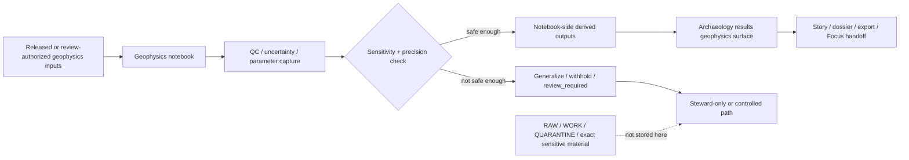

# Kansas Frontier Matrix — Archaeology Geophysics Notebooks

Review-bearing notebook index and operating guide for derived archaeology geophysics work in KFM.

> [!IMPORTANT]
> **Status:** experimental  
> **Owners:** `@bartytime4life` *(public `/docs/` CODEOWNERS fallback; narrower archaeology/geophysics ownership remains `NEEDS VERIFICATION`)*  
>       
> **Quick jump:** [Scope](#scope) · [Repo fit](#repo-fit) · [Accepted inputs](#accepted-inputs) · [Exclusions](#exclusions) · [Directory tree](#directory-tree) · [Quickstart](#quickstart) · [Usage](#usage) · [Diagram](#diagram) · [Tables](#tables) · [Task list](#task-list) · [FAQ](#faq) · [Appendix](#appendix)
>
> **Truth posture used here:** `CONFIRMED` = directly supported by visible repo or attached corpus · `INFERRED` = strongly supported but not path-verified in a mounted checkout · `PROPOSED` = starter structure added to make the directory commit-ready · `UNKNOWN / NEEDS VERIFICATION` = not directly verified in the current public-main slice.

> [!NOTE]
> This directory is the **notebook-layer geophysics surface**, not the release-facing archaeology geophysics results root. Notebook outputs here remain **derived**, **review-bearing**, and **non-sovereign** until routed through the appropriate downstream result surface.

> [!WARNING]
> Geophysics notebook work must not quietly become a back door for exact anomaly geometry, burial or structure claims, sacred-site inference, or culturally sensitive site revelation.

---

## Scope

This directory is for **archaeology geophysics notebooks** that support analysis, comparison, quality control, and review of subsurface-adjacent geospatial evidence while keeping KFM’s stronger doctrine visible:

- notebook work is **derived analysis**, not authoritative truth
- outward use remains **evidence-linked**, not citation-free
- notebook outputs are **review-bearing**, not self-publishing
- archaeology precision is **public-safe by default**, with generalization or withholding when needed
- **2D remains the calm default**; 2.5D or 3D only belongs here when its burden is explicit

### Current public-main evidence map

| Observation | Status | Why it matters here |
|---|---|---|
| `docs/analyses/archaeology/results/notebooks/geophysics/README.md` is a real repo path | **CONFIRMED** | This file has an actual repo role and should no longer remain a placeholder |
| The parent archaeology notebooks index already names **geophysics** as a notebook family | **CONFIRMED** | This README should align with an existing local documentation pattern, not invent a new one |
| The current public-main `geophysics/` notebooks directory is **README-only** | **CONFIRMED** | The doc should define the directory contract without pretending a richer child inventory already exists |
| A separate results-surface geophysics root exists at `../../geophysics/README.md` | **CONFIRMED** | Notebook work here must stay distinct from review-facing or release-facing result packages |
| Method-specific notebook subfolders under this path | **UNKNOWN** | Do not imply mounted magnetometry / GPR / resistivity / EMI notebook trees unless they are actually added |

[Back to top](#kansas-frontier-matrix--archaeology-geophysics-notebooks)

---

## Repo fit

| Field | Value |
|---|---|
| **Path** | `docs/analyses/archaeology/results/notebooks/geophysics/README.md` |
| **Local role** | README-like contract for the archaeology geophysics notebook layer |
| **Upstream** | [`../README.md`](../README.md) · [`../../README.md`](../../README.md) · [`../../../README.md`](../../../README.md) |
| **Related downstream surface** | [`../../geophysics/README.md`](../../geophysics/README.md) |
| **Repo governance cues** | [`../../../../../../.github/CODEOWNERS`](../../../../../../.github/CODEOWNERS) · [`../../../../../../.github/PULL_REQUEST_TEMPLATE.md`](../../../../../../.github/PULL_REQUEST_TEMPLATE.md) |
| **Directory maturity in the current public slice** | README-only |
| **Why this directory matters** | It gives notebook-side geophysics work a governed place to declare purpose, method, support, uncertainty, and sensitivity posture before any outward release path is considered |

### What makes this directory different from `../../geophysics/`

`../../geophysics/` is the **results** lane.  
This directory is the **notebook** lane.

That distinction matters because a notebook may contain exploratory steps, parameter disclosures, quality checks, intermediate reasoning, and uncertainty inspection that should **not** be mistaken for release-ready public artifacts.

> [!CAUTION]
> A useful notebook is still only a **candidate explanatory surface**. It does not become publishable merely because it runs end-to-end.

[Back to top](#kansas-frontier-matrix--archaeology-geophysics-notebooks)

---

## Accepted inputs

This directory accepts materials that belong to the **geophysics notebook layer** of archaeology results.

| Input family | Belongs here when | Typical examples |
|---|---|---|
| Jupyter notebooks | They are the primary analysis surface | `.ipynb` notebooks for magnetometry review, GPR slice comparison, resistivity analysis, EMI context work, or cross-sensor synthesis |
| Notebook-local explanation assets | They explain a notebook’s method or outputs | diagrams, method notes, figure images, markdown companions |
| Lightweight run notes | They make the notebook rerunnable or reviewable | parameter snapshots, execution notes, versioned assumptions, seed notes |
| QC and uncertainty companions | They keep interpretation bounded | noise summaries, drift notes, disagreement maps, confidence tables |
| Preview-safe derived outputs | They are tightly coupled to a notebook and not yet final publication artifacts | internal review figures, masked rasters, generalized vectors, summary tables |
| Notebook-side provenance notes | They tie outputs to released or review-authorized inputs | source references, dataset-version notes, result inventory, handoff notes |

### Minimum expectations for anything added here

Every notebook or notebook-adjacent file should make these things easy to answer:

1. What method family is this?
2. What signal or source basis does it use?
3. What is the support, time basis, and coordinate frame?
4. What is measured vs processed vs interpreted vs modeled?
5. What uncertainty or masking choices were applied?
6. What result surface, if any, is it preparing for downstream review?

[Back to top](#kansas-frontier-matrix--archaeology-geophysics-notebooks)

---

## Exclusions

The following do **not** belong in this directory.

| Excluded material | Why it does not belong here | Put it instead |
|---|---|---|
| Raw survey captures or vendor-native acquisition dumps | Too close to source-sensitive detail; not notebook-layer documentation | governed RAW / WORK / QUARANTINE or equivalent stewarded acquisition paths |
| Exact anomaly geometries or unmasked subsurface slices | Can imply sensitive site revelation | generalized or withheld handling paths |
| Burial, structure, enclosure, or sacred-site claims | Unsupported or too sensitive for notebook-by-default storage | steward review lanes only, if admissible at all |
| Final release-facing result packages | Notebook work is upstream of release-facing result surfaces | `../../geophysics/README.md` and its governed children |
| Canonical schemas, policy bundles, or global proof objects | Those are repo-wide trust artifacts, not notebook-local convenience files | contracts / schemas / policy / release-proof surfaces |
| Ad hoc scratch work with no provenance or review notes | Weakens rerunnability and trust posture | keep out until documented or discard |
| Human-remains datasets or culturally restricted materials | Archaeology sensitivity burden is too high for default notebook storage | restricted stewardship paths |

> [!WARNING]
> “It is only an analysis notebook” is **not** a valid reason to bypass precision, sensitivity, or review obligations.

[Back to top](#kansas-frontier-matrix--archaeology-geophysics-notebooks)

---

## Directory tree

### Current public-main slice

```text
docs/analyses/archaeology/results/notebooks/geophysics/
└── README.md
```

That is the only mounted inventory this README treats as current fact.

<details>
<summary><strong>PROPOSED future subtree cues (not current inventory)</strong></summary>

```text
docs/analyses/archaeology/results/notebooks/geophysics/
├── README.md
├── magnetometry/          # gradient review, anomaly envelopes, environmental correlation
├── gpr/                   # slice review, depth-window comparison, reflector summaries
├── resistivity/           # resistivity / conductivity comparison notebooks
├── electromagnetic/       # EMI notebook-side environmental context work
├── cross-sensor/          # agreement / disagreement / tendency synthesis
├── uncertainty/           # drift, noise, disagreement, confidence inspection
└── helpers/               # notebook-local assets only; no shared global code
```

Use this only as a planning aid after the real tree is created and verified.

</details>

[Back to top](#kansas-frontier-matrix--archaeology-geophysics-notebooks)

---

## Quickstart

Use this directory when you need to **find**, **review**, **run**, or **author** geophysics notebooks that produce derived archaeology-facing outputs.

### Minimal operator sequence

1. Confirm that the input material is **released** or **review-authorized** for notebook use.
2. Declare the notebook’s **method family** and **signal family** clearly.
3. Record support, time basis, CRS, and precision posture before interpretation begins.
4. Run the notebook in a clean environment from top to bottom.
5. Keep measured, processed, interpreted, and modeled outputs visibly separate.
6. Attach QC / uncertainty notes before any outward handoff.
7. Route release-facing outputs to `../../geophysics/README.md` or another confirmed archaeology result surface.

### Illustrative launcher

```bash
# Illustrative only — replace with the project-approved environment / launcher
jupyter lab docs/analyses/archaeology/results/notebooks/geophysics/
```

### Before you press “Run”

- Verify whether the notebook uses **measured**, **processed**, **interpreted**, or **modeled** inputs.
- Verify whether the notebook contains geometry that must be **generalized**, **withheld**, or **excluded**.
- Verify whether the result is purely internal review work or a candidate handoff to a result surface.
- Verify whether any 2.5D / 3D or depth-window visualization adds real explanatory value.

> [!TIP]
> A good first notebook-side artifact is often not a map. It is a small, reviewable packet: notebook + QC summary + parameter disclosure + output inventory + uncertainty note.

[Back to top](#kansas-frontier-matrix--archaeology-geophysics-notebooks)

---

## Usage

### Notebook contract

Every notebook in this directory should make these questions easy to answer on inspection.

| Question | Minimum visible answer |
|---|---|
| **Why does this notebook exist?** | A one-sentence analytical job statement |
| **Which geophysics family does it use?** | Magnetometry, GPR, resistivity / ERT, EMI, cross-sensor synthesis, or QC / uncertainty |
| **What does it read?** | Input datasets, source references, and acquisition / time scope |
| **What support does it claim?** | Traverse, grid, point, raster cell, slice, volume, generalized block, or other declared support |
| **What coordinate frame does it use?** | CRS, units, and any reprojection or generalization step |
| **What does it do?** | Method summary and major processing stages |
| **How was it configured?** | Parameters, thresholds, filters, smoothing, interpolation, seeds, or model settings |
| **What does it produce?** | Output inventory, formats, and notebook-to-result handoff path |
| **What is its trust posture?** | Measured vs processed vs interpreted vs modeled |
| **What is its sensitivity posture?** | Public-safe, generalized, withheld, or review-only |
| **Can it be rerun?** | Environment note, execution order, and reproducibility cues |

### Suggested opening cell template

```markdown
# Notebook purpose

- **Notebook ID:** `NEEDS VERIFICATION`
- **Method family:** `magnetometry | gpr | resistivity | emi | cross-sensor | qc`
- **Status:** `draft | review | ready-for-review`
- **Purpose:** one-sentence description
- **Spatial scope:** generalized study area only
- **Temporal scope:** acquisition date(s) or analysis window
- **Inputs:** source references / dataset versions / review-authorized handles
- **Support:** point / line / grid / raster / slice / volume / generalized block
- **CRS / units:** declare explicitly
- **Major transforms:** filtering, drift correction, interpolation, slicing, masking, fusion
- **Parameters:** thresholds, window sizes, seeds, weights, or defaults
- **Outputs:** figures, tables, rasters, vectors, summaries, handoff target
- **Trust posture:** measured / processed / interpreted / modeled
- **Sensitivity controls:** masking, generalization, withholding, exclusions
- **Reviewer notes:** open cautions and verification items
```

### Reproducibility and evidence rules

A geophysics notebook in this directory should:

- run cleanly from top to bottom
- avoid hidden state and ad hoc side effects
- disclose sensor-family assumptions instead of burying them
- preserve the difference between recorded signal and later interpretation
- make uncertainty visible
- never imply that notebook outputs alone are final publication truth

[Back to top](#kansas-frontier-matrix--archaeology-geophysics-notebooks)

---

## Diagram



### Reading the flow

The notebook is a **derived step**, not the terminal truth surface.  
Notebook work becomes more trustworthy when its QC, uncertainty, and generalization logic are recorded **before** outward use.

[Back to top](#kansas-frontier-matrix--archaeology-geophysics-notebooks)

---

## Tables

### Method families

| Method family | Typical notebook work | Typical notebook-side outputs | Key caution |
|---|---|---|---|
| **Magnetometry** | gradient review, anomaly envelope comparison, environmental correlation, cross-run consistency checks | generalized maps, summary figures, tendency tables | Do not turn magnetic variation into feature-level subsurface claims |
| **GPR** | slice review, depth-window comparison, reflector consistency checks, safe section summaries | slice mosaics, section figures, depth-window tables | Depth slices can imply sensitive features; generalize aggressively |
| **Resistivity / ERT** | resistivity contrast comparison, terrain/moisture context, line or grid interpretation support | generalized rasters, comparison plots, uncertainty notes | Resistivity contrast alone is not cultural proof |
| **Electromagnetic / EMI** | environmental conductivity or susceptibility context, multi-frequency comparison | conductivity summaries, environmental-link figures, agreement tables | Keep the interpretation frame environmental-only unless stronger review says otherwise |
| **Cross-sensor synthesis** | agreement / disagreement review, anomaly tendency comparison, contextual overlay | fusion figures, tendency maps, comparison matrices | Preserve sensor-specific limits; do not hide disagreement |
| **QC / uncertainty** | drift review, calibration checks, noise-field inspection, disagreement accounting | QC reports, confidence tables, noise maps, drift summaries | Uncertainty must be visible, not relegated to a hidden appendix |

### Output trust classes

| Class | What it means here | Minimum labeling expectation |
|---|---|---|
| **Measured** | Closest notebook-visible representation of recorded signal | acquisition/source basis, support, units, time scope |
| **Processed** | Signal after filtering, correction, resampling, or other technical transforms | major transforms, parameters, QC notes |
| **Interpreted** | Human analytical judgment over measured/processed material | interpretation frame, evidence limits, review caution |
| **Modeled** | Interpolated, fused, predicted, or otherwise synthetic surface | modeled label, assumptions, validation limits |
| **Generalized** | Geometry or values intentionally reduced for public-safe handling | generalization method and reason |
| **Withheld / review-only** | Not fit for ordinary notebook-side exposure | explicit note that the material is not included here |

### Public-safe controls

| Control area | Expectation for notebook work |
|---|---|
| **Exact coordinates** | Remove, blur, aggregate, or withhold unless a stronger review basis exists |
| **Feature-shape exposure** | Avoid fine-grained anomaly geometry when it can imply sensitive subsurface detail |
| **Human remains / sacred inference** | Exclude from public-safe notebook outputs |
| **Measured vs modeled distinction** | Never blur them together |
| **AI-assisted narration** | May summarize; may not invent feature identity, structure claims, or burial claims |
| **2.5D / 3D** | Explain why 2D was insufficient and what added burden was introduced |

[Back to top](#kansas-frontier-matrix--archaeology-geophysics-notebooks)

---

## Task list

A notebook or notebook update in this directory is ready for review when all of the following are true:

- [ ] Purpose, method family, and trust posture are visible at the top
- [ ] Inputs are identified with source references or equivalent provenance handles
- [ ] Support, time basis, CRS, and units are explicit
- [ ] Major transforms and parameters are documented clearly enough to rerun
- [ ] Measured, processed, interpreted, and modeled states are not blurred together
- [ ] QC / uncertainty notes are present
- [ ] Sensitive coordinates or revealing geometries are generalized, withheld, or removed
- [ ] No burial, structure, enclosure, or sacred-site claim is made beyond visible support
- [ ] Any 2.5D / 3D work states why 2D was insufficient
- [ ] Outputs are listed and their handoff path is visible
- [ ] The current directory tree in this README still matches the mounted repo slice

### Definition of done for this README

- [ ] Path, local role, and neighboring archaeology links are correct
- [ ] Owners are updated if path-specific CODEOWNERS are later added
- [ ] The README stays notebook-layer specific and does not drift into results-surface language
- [ ] Any future child folders are added only after they exist in the repo
- [ ] Any behavior-significant notebook workflow changes are reflected here

[Back to top](#kansas-frontier-matrix--archaeology-geophysics-notebooks)

---

## FAQ

### Does this directory currently contain notebooks in the public main slice?

Not yet. The current public-main slice shows **README-only** content for this directory.

### Are outputs from this directory authoritative truth objects?

No. They are **derived notebook-side analysis surfaces**.

### Can raw magnetometry, GPR, EMI, or resistivity acquisition files live here?

No. That is too close to source-sensitive detail and belongs in governed source or stewarded working lanes instead.

### Where should release-facing geophysics result packages go?

Use the separate archaeology geophysics results surface at [`../../geophysics/README.md`](../../geophysics/README.md).

### Is 2.5D or 3D allowed here?

Yes, but only when the notebook records why 2D was insufficient and keeps evidence, policy, and correction burden visible.

### Can AI help write geophysics notebook summaries?

It can help summarize, label, or organize notebook outputs, but it must not infer feature identity, burial, structure, or exact site revelation beyond the evidence and review state.

[Back to top](#kansas-frontier-matrix--archaeology-geophysics-notebooks)

---

## Appendix

<details>
<summary><strong>Why this README is intentionally conservative</strong></summary>

This file avoids claiming:

- mounted child notebook inventories that do not yet exist in the public slice
- method-specific schemas, workflow YAML, or CI hooks not directly verified here
- notebook-to-release automation that has not been surfaced in repo evidence
- ownership narrower than the visible `/docs/` fallback owner

That conservatism is deliberate. In KFM, the cost of a polished but unsupported repo claim is higher than the cost of leaving an unknown visible.

</details>

<details>
<summary><strong>Method-family expansion cues (INFERRED / PROPOSED only)</strong></summary>

The strongest corpus-visible geophysics material points especially toward:

- generalized magnetometry notebook work
- environmental-only EMI context
- cross-sensor synthesis with resistivity and GPR
- uncertainty-forward companion outputs
- public-safe, generalized summary geometry rather than revealing feature maps

Treat these as **design pressure**, not current mounted tree proof.

</details>

<details>
<summary><strong>Open verification items</strong></summary>

Before treating this directory as mature, verify:

- whether method-specific child folders are added in working branches
- whether notebook execution or validation hooks exist
- whether narrower archaeology/geophysics owners are intended
- whether notebook-side STAC / DCAT / PROV sidecars are already standardized elsewhere
- whether any neighboring archaeology result docs should cross-link here more explicitly

</details>

[Back to top](#kansas-frontier-matrix--archaeology-geophysics-notebooks)
