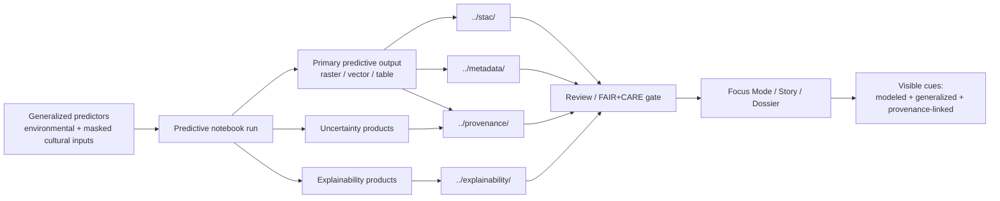

<!-- [KFM_META_BLOCK_V2]
doc_id: kfm://doc/NEEDS-VERIFICATION
title: Kansas Frontier Matrix — Archaeology Predictive Notebooks
type: standard
version: v1
status: review
owners: Archaeology Working Group · FAIR+CARE Council
created: YYYY-MM-DD
updated: YYYY-MM-DD
policy_label: restricted
related: [../README.md, ../../README.md, ../../../methods/predictive_modeling.md]
tags: [kfm, archaeology, notebooks, predictive, faircare]
notes: [Owners and policy label were inherited from adjacent archaeology notebook and methods docs; exact mounted-file metadata, dates, and leaf inventory still need verification.]
[/KFM_META_BLOCK_V2] -->

# Kansas Frontier Matrix — Archaeology Predictive Notebooks

Predictive-modeling notebook lane for archaeology results, bundling generalized outputs, uncertainty, explainability, and governed metadata handoff for KFM.

> [!NOTE]
> **Status:** active (**INFERRED**)  
> **Owners:** Archaeology Working Group · FAIR+CARE Council (**inherited from adjacent archaeology docs; exact mounted ownership NEEDS VERIFICATION**)  
>       
> **Quick jumps:** [Scope](#scope) · [Repo fit](#repo-fit) · [Accepted inputs](#accepted-inputs) · [Exclusions](#exclusions) · [Directory tree](#directory-tree) · [Quickstart](#quickstart) · [Usage](#usage) · [Diagram](#diagram) · [Tables](#tables) · [Task list](#task-list--definition-of-done) · [FAQ](#faq) · [Appendix](#appendix)  
> **Repo fit:** `docs/analyses/archaeology/results/notebooks/predictive/` → upstream: [`../README.md`](../README.md), [`../../README.md`](../../README.md), [`../../../methods/predictive_modeling.md`](../../../methods/predictive_modeling.md) · downstream: predictive notebook files in this lane plus routed outputs to sibling explainability, STAC, metadata, and provenance surfaces (**exact mounted inventory NEEDS VERIFICATION**)

> [!IMPORTANT]
> This directory should function as the **predictive notebook results lane**, not as the full predictive-modeling methodology and not as a container for precise site targeting. Predictive results here remain **modeled, interpretive, generalized, and review-bearing**.

> [!WARNING]
> Current-session workspace evidence is PDF-only. The structure below is grounded in attached KFM archaeology notebook and methods documents, but the mounted repo inventory for this exact path remains **UNKNOWN** until directly inspected.

## Scope

This directory narrows the broader archaeology notebook lane to **predictive notebook work**: notebook-based runs that use model families such as random forests, GAMs, GLMs, and related ensemble approaches to produce generalized archaeological tendency surfaces, uncertainty ranges, and explainability companions.

In KFM, predictive outputs are useful but never sovereign. They support interpretation, comparison, and contextual narration, but they do **not** authorize precise site discovery, cultural forecasting, or outward claims that outrun evidence, policy, or review state.

Use this README as the routing surface for **what belongs here**, **what must ship beside it**, and **what must be withheld or redirected**.

## Repo fit

| Path | Role | Relationship |
| --- | --- | --- |
| `docs/analyses/archaeology/results/notebooks/README.md` | archaeology notebook root | parent lane for all analysis notebooks |
| `docs/analyses/archaeology/results/notebooks/predictive/README.md` | this file | predictive notebook sublane |
| `docs/analyses/archaeology/methods/predictive_modeling.md` | methods authority | upstream rules for goals, inputs, reproducibility, and ethical guardrails |
| `docs/analyses/archaeology/results/notebooks/explainability/` | sibling lane | handoff point for SHAP/LIME/residual companions |
| `docs/analyses/archaeology/results/notebooks/stac/` | sibling lane | notebook-generated STAC items |
| `docs/analyses/archaeology/results/notebooks/metadata/` | sibling lane | DCAT / JSON-LD records |
| `docs/analyses/archaeology/results/notebooks/provenance/` | sibling lane | PROV-O lineage, transformation logs, and run artifacts |

> [!TIP]
> When the question is **how predictive modeling is allowed to work**, route upward to [`../../../methods/predictive_modeling.md`](../../../methods/predictive_modeling.md). When the question is **which notebook results exist and how they are handed off**, stay here.

## Accepted inputs

Place material here when it is primarily part of a **predictive notebook results workflow**:

- predictive notebook files and safe rendered exports
- notebook-local notes that explain model scope, target period, and result intent
- generalized result previews or figures that help review a notebook output
- companion references to uncertainty products and explainability outputs
- routing stubs or manifests that point to sibling STAC, metadata, or provenance records
- review-safe summaries of predictive runs intended for Focus Mode, Story, or Dossier context

## Exclusions

Do **not** place the following here:

- full predictive methodology or policy language → [`../../../methods/predictive_modeling.md`](../../../methods/predictive_modeling.md)
- raw or precise site coordinates, restricted archaeological inputs, or anything that could aid prospecting or looting
- deterministic claims about Indigenous cultural behavior, migration, or identity
- unsupported AI summaries, speculative interpretations, or “smart” prose without inspectable evidence
- explainability-only notebooks when the sibling explainability lane is the better fit
- canonical STAC, DCAT, or PROV records when the mounted repo convention keeps them in sibling `../stac/`, `../metadata/`, or `../provenance/` lanes
- non-predictive notebook work that belongs in `../spatial/`, `../temporal/`, `../environmental/`, `../cultural-landscapes/`, `../artifacts/`, or `../geophysics/`

## Directory tree

The exact mounted subtree for this path was not directly surfaced in the current session. The working contract below is therefore **INFERRED / NEEDS VERIFICATION**, built from the parent archaeology notebook lane and the predictive methods draft.

```text
docs/analyses/archaeology/results/notebooks/predictive/
├── README.md                        # this file
├── *.ipynb                          # predictive notebooks (NEEDS VERIFICATION)
├── *.md / *.html                    # rendered notebook exports (NEEDS VERIFICATION)
├── figures/                         # optional review-safe notebook visuals (NEEDS VERIFICATION)
└── routed outputs
    ├── ../explainability/           # SHAP / LIME / residual companions
    ├── ../stac/                     # notebook-generated STAC items
    ├── ../metadata/                 # DCAT / JSON-LD records
    └── ../provenance/               # PROV-O lineage and run artifacts
```

## Quickstart

1. Confirm the notebook actually belongs in the predictive lane and is consistent with the allowed goals in [`../../../methods/predictive_modeling.md`](../../../methods/predictive_modeling.md).
2. Verify that any archaeological inputs are already generalized or masked before they enter a review-safe notebook result.
3. Run the notebook with logged configuration, fixed seeds where randomness is used, and reproducible transform notes.
4. Export the primary result plus uncertainty and explainability companions as applicable.
5. Register or update the sibling STAC, DCAT / JSON-LD, and PROV artifacts.
6. Mark the result as **modeled** and **interpretive**, then route it through FAIR+CARE review before any outward public-safe release.

Illustrative handoff shape:

```yaml
predictive_result:
  notebook: late_prehistoric_probability.ipynb
  model_family: random_forest
  generalized_inputs: true
  outputs:
    primary: lp_probability_surface.tif
    uncertainty: lp_probability_uncertainty.tif
    explainability: lp_probability_shap.parquet
  handoff:
    stac: ../stac/archaeology-predictive-late-prehistoric-v1.json
    metadata: ../metadata/archaeology-predictive-late-prehistoric-v1.jsonld
    provenance: ../provenance/archaeology-predictive-late-prehistoric-v1.prov.json
  release_notes:
    modeled: true
    generalized: true
    public_safe: false
```

> [!CAUTION]
> The YAML above is an **illustrative example**, not a verified mounted contract.

## Usage

### Add a new predictive notebook result

Use this lane for notebook work that produces one or more of the following:

- generalized probability or tendency surfaces
- comparative model experiments
- uncertainty ranges or disagreement surfaces
- notebook-bound explainability companions
- review-safe predictive summaries for Focus Mode or Story context

Keep the notebook output tied to a clear scope: period, geography, predictor set, and intended interpretive use.

### Route metadata and lineage beside the notebook

A predictive notebook result is not complete when only the notebook runs. Route the surrounding evidence package as well:

1. **Primary result** stays attached to the notebook result lane.
2. **Explainability products** route to the sibling explainability lane when separated.
3. **STAC** describes the spatial asset and its extent.
4. **DCAT / JSON-LD** describes dataset purpose, authorship, lifecycle, and FAIR+CARE statements.
5. **PROV-O** records `prov:used`, `prov:wasGeneratedBy`, versioning, transformations, and replay context.

### Prepare outward use carefully

If a predictive result is surfaced beyond notebook review:

- Story surfaces must keep the result **interpretive**, not authoritative.
- Focus Mode should show provenance chips, uncertainty cues, and CARE/generalization warnings.
- Any outward text should preserve the difference between **verified historical data** and **modeled output**.
- Evidence should remain one hop away through the linked metadata and provenance package.

## Diagram



## Tables

### Predictive notebook classes handled here

| Class | Typical methods | Expected outputs | Key caution |
| --- | --- | --- | --- |
| Landscape-scale tendency modeling | random forests, GAMs, GLMs, ensemble models | generalized raster/vector tendency surfaces | not precise site prediction |
| Environmental affordance modeling | environmental predictors, hydrology, soils, vegetation, climate | contextual explanatory surfaces and summary tables | keep environmental predictors distinct from cultural interpretation |
| Corridor / interaction support experiments | cost or suitability notebooks tied to predictive comparisons | comparative surfaces or ranked scenarios | interpretive only; disclose assumptions |
| Uncertainty & disagreement reporting | ensemble comparison, residual analysis, uncertainty summaries | uncertainty rasters, ranges, disagreement tables | uncertainty must remain visible |
| Explainability handoff | SHAP, LIME, residual commentary | explainability overlays and chips | route or mirror in sibling explainability lane when appropriate |

### Required companion records

| Artifact family | Minimum expectation | Where it normally routes |
| --- | --- | --- |
| Notebook result | notebook file plus review-safe rendered output | this lane |
| Primary asset | generalized raster / vector / table output | this lane or sibling result surface |
| Explainability | SHAP/LIME/residual output when used | `../explainability/` |
| STAC | item with spatial asset references and sensitivity tags | `../stac/` |
| Metadata | DCAT / JSON-LD with purpose, authorship, lifecycle, FAIR+CARE statements | `../metadata/` |
| Provenance | `prov:used`, `prov:wasGeneratedBy`, versioning, transformations, replay context | `../provenance/` |
| Transform log | transformations log or equivalent config snapshot | `../provenance/` |
| Review note | FAIR+CARE or steward review outcome when public release is contemplated | local or sibling governance surface (**NEEDS VERIFICATION**) |

### Surface-state and handling matrix

| State | When to use it | Minimum visible cue |
| --- | --- | --- |
| **modeled** | output is forecasted, inferred, classified, or statistically derived | label result as modeled / interpretive |
| **generalized** | spatial precision has been reduced or masked | show CARE/generalization notice |
| **partial** | coverage, predictors, or result completeness are incomplete | disclose partial coverage in-place |
| **review-required** | rights, sensitivity, or public-surface suitability remain unresolved | hold for steward / FAIR+CARE review |
| **withheld** | outward exposure would create unacceptable exact-location or cultural risk | do not publish on outward surfaces |

## Task list / Definition of done

A predictive notebook result is ready for review when all of the following are true:

- [ ] The notebook belongs to the predictive lane and not to a different notebook class.
- [ ] Restricted archaeological or cultural data have been excluded or generalized.
- [ ] The result is clearly labeled as **modeled** and **interpretive**.
- [ ] Uncertainty and model limitations are documented in notebook output or companion notes.
- [ ] Explainability companions are included or explicitly not applicable.
- [ ] STAC, metadata, and provenance handoffs are present or intentionally queued.
- [ ] `prov:used` and `prov:wasGeneratedBy` are recoverable from the lineage package.
- [ ] Transform steps, configuration snapshots, and seeds are preserved for replay.
- [ ] Any Focus Mode or Story summary avoids precise site inference and speculative cultural claims.
- [ ] FAIR+CARE review is completed before public-safe release.

[Back to top](#kansas-frontier-matrix--archaeology-predictive-notebooks)

## FAQ

### Is this directory for precise site prediction?

No. KFM archaeology predictive work is contextual and interpretive. This lane should not become a precise targeting surface or an unauthorized prospecting aid.

### Can predictive notebooks use archaeological site data?

Only under the lane’s masking and generalization rules. Sensitive coordinates and culturally restricted data do not belong in outward-facing results form.

### Where do SHAP, LIME, and related transparency products go?

They can travel with the notebook for review, but the parent notebooks lane also defines a sibling explainability surface. Use that sibling lane when the mounted repo keeps explainability artifacts separated.

### Can Focus Mode use results from this directory?

Yes, but only as governed, provenance-linked, uncertainty-visible, generalized context. Focus-facing text must preserve the distinction between modeled output and verified historical evidence.

## Appendix

<details>
<summary><strong>Status vocabulary used in this file</strong></summary>

| Label | Meaning in this README |
| --- | --- |
| **CONFIRMED** | Directly supported by attached KFM archaeology, atlas, or master-manual material |
| **INFERRED** | Strong completion from adjacent KFM docs when the exact mounted path was not surfaced |
| **PROPOSED** | Recommended directory behavior or workflow shape |
| **UNKNOWN** | Not directly verifiable in the current session |
| **NEEDS VERIFICATION** | A review flag for file inventory, metadata values, or mounted repo behavior |

</details>

<details>
<summary><strong>Current verified snapshot</strong></summary>

The current-session evidence directly supports these points:

- the archaeology notebooks root exists in the attached corpus as a centralized index for analysis notebooks
- predictive notebooks are named as a notebook class using random forests, GAMs, GLMs, environmental predictors, and ensemble models
- notebook outputs are expected to hand off explainability, uncertainty, STAC, metadata, and PROV lineage artifacts
- archaeology notebook outputs must exclude sensitive coordinates, apply H3-based generalization for sensitive features, and remain FAIR+CARE-governed
- predictive archaeology methods are documented separately under `docs/analyses/archaeology/methods/predictive_modeling.md`

What remains unverified here is the mounted leaf inventory for this exact `predictive/` subtree and the exact file-level metadata values for this README.

</details>

[Back to top](#kansas-frontier-matrix--archaeology-predictive-notebooks)
