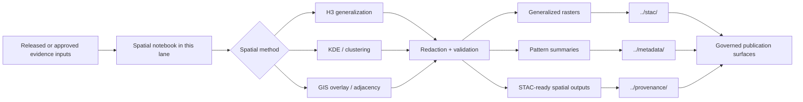

<!-- [KFM_META_BLOCK_V2]
doc_id: kfm://doc/<NEEDS-VERIFICATION-UUID>
title: KFM Archaeology Spatial Notebooks
type: standard
version: v1
status: review
owners: <NEEDS VERIFICATION; parent archaeology notebooks draft suggests Archaeology WG · FAIR+CARE Council>
created: YYYY-MM-DD
updated: YYYY-MM-DD
policy_label: <NEEDS VERIFICATION; parent archaeology notebooks draft indicates internal/restricted handling>
related: [../README.md, ../stac/, ../metadata/, ../provenance/]
tags: [kfm, archaeology, notebooks, spatial]
notes: [Path-local repo inventory was not directly visible in this session; this draft is grounded in KFM doctrine plus the strongest available parent archaeology notebooks index.]
[/KFM_META_BLOCK_V2] -->

# KFM Archaeology Spatial Notebooks

Public-safe spatial analysis notebooks for archaeology workflows, routed through KFM evidence, redaction, and provenance rules.

> [!IMPORTANT]
> **Status:** review  
> **Owners:** NEEDS VERIFICATION *(parent notebooks draft suggests Archaeology WG · FAIR+CARE Council)*  
> **Path:** `docs/analyses/archaeology/results/notebooks/spatial/README.md`
>
> 
> 
> 
> 
>
> **Quick jumps:** [Scope](#scope) · [Repo fit](#repo-fit) · [Inputs](#inputs) · [Exclusions](#exclusions) · [Directory tree](#directory-tree) · [Quickstart](#quickstart) · [Usage](#usage) · [Diagram](#diagram) · [Tables](#tables) · [Review gates](#review-gates) · [FAQ](#faq)

> [!CAUTION]
> This lane should hold generalized, public-safe spatial notebook outputs only. Exact site coordinates, sensitive cultural-feature inference, or unpublished steward-only material do not belong here.

## Scope

This directory is the spatial notebook lane inside KFM’s archaeology analysis notebooks family. Its job is to hold notebook work whose primary unit of value is spatial reasoning: H3-based generalization, KDE and clustering, GIS overlays, adjacency analysis, and comparable map-first analytical workflows.

**CONFIRMED from the strongest available parent-lane baseline**

- The parent archaeology notebooks lane includes a `spatial/` subtree described as **“Spatial notebooks (H3, KDE, GIS workflows)”**.
- The same parent lane names examples such as **H3 layer generation**, **KDE smoothing & cluster analysis**, **hydrology adjacency modeling**, and **environmental overlays**.
- The parent lane also says spatial notebooks emit **generalized rasters**, **pattern summaries**, and **STAC Items**.

**INFERRED for this path-local README**

- This file should define the routing boundary for spatial archaeology notebooks without collapsing sibling lanes such as temporal, environmental, geophysics, artifact, or predictive work into one catch-all bucket.
- This README should foreground redaction, provenance, and downstream metadata obligations because archaeology sits in a higher-sensitivity publication lane than a generic GIS notebook set.

**NEEDS VERIFICATION**

- The current mounted file inventory inside `spatial/`
- Current CODEOWNERS or reviewer bindings
- Exact schema, CI, or automation hooks wired to this directory in the live repo

## Repo fit

**Path:** `docs/analyses/archaeology/results/notebooks/spatial/README.md`

**Upstream**

- [Parent archaeology notebooks index](../README.md)

**Adjacent notebook lanes**

- [Temporal](../temporal/)
- [Environmental](../environmental/)
- [Cultural landscapes](../cultural-landscapes/)
- [Artifacts](../artifacts/)
- [Geophysics](../geophysics/)
- [Predictive](../predictive/)
- [Explainability](../explainability/)

**Downstream evidence surfaces**

- [STAC outputs](../stac/)
- [Metadata](../metadata/)
- [Provenance](../provenance/)

This README should be read as the spatial-routing companion to the parent notebooks index, not as a claim that all linked siblings are mounted or populated in the current session.

## Inputs

This lane accepts notebook content whose primary product is a spatial analytic result and whose publication posture is already public-safe or generalized.

| Accepted here | Why it belongs |
| --- | --- |
| H3 generalization notebooks | They transform sensitive point-like or site-like observations into governed spatial bins or generalized analytical surfaces |
| KDE, hotspot, and cluster notebooks | They produce spatial density or pattern summaries rather than artifact- or chronology-first narratives |
| GIS overlay notebooks | They combine archaeology with hydrology, soils, terrain, land cover, or other contextual layers where the main result is spatial |
| Adjacency and proximity notebooks | They compute distance, corridor, catchment, or neighborhood relationships as the main analytical object |
| Spatial export notebooks | They generate generalized rasters, pattern summaries, or STAC-ready spatial outputs for downstream governed publication |

## Exclusions

This lane should stay narrow. Put the following elsewhere.

| Do **not** put here | Route instead |
| --- | --- |
| Exact-location notebooks, trench-level coordinates, or sensitive site geometry | Steward/review workflows and policy-gated restricted surfaces *(mounted path needs verification)* |
| Primarily chronological or phase-model notebooks | [Temporal](../temporal/) |
| Primarily climate, hydrology, soils, or eco-context notebooks where environmental modeling is the center of gravity | [Environmental](../environmental/) |
| Artifact-typology or distribution notebooks centered on lithic, ceramic, faunal, or comparable material classes | [Artifacts](../artifacts/) |
| Geophysics-first notebooks (magnetometry, GPR, resistivity) | [Geophysics](../geophysics/) |
| Predictive modeling pipelines where training/evaluation is the primary unit of work | [Predictive](../predictive/) |
| Standalone catalog, metadata, or provenance records | [STAC](../stac/), [Metadata](../metadata/), and [Provenance](../provenance/) |

## Directory tree

> [!NOTE]
> The mounted subdirectory inventory for `spatial/` was not directly visible in this session. The tree below shows confirmed parent-lane context plus this README’s routing boundary.

```text
docs/analyses/archaeology/results/notebooks/
├── README.md
├── spatial/
│   └── README.md
├── temporal/
├── environmental/
├── cultural-landscapes/
├── artifacts/
├── geophysics/
├── predictive/
├── explainability/
├── stac/
├── metadata/
└── provenance/
```

Current path-local notebook filenames, sample datasets, and export bundles remain **NEEDS VERIFICATION**.

## Quickstart

Use this lane only when a notebook’s main output is spatial and already policy-safe.

1. Confirm the notebook is spatial-first:
   - H3
   - KDE or clustering
   - overlay / adjacency / proximity
   - generalized raster or map-ready output

2. Remove or generalize sensitive location detail before the notebook is indexed here.

3. Make the notebook inspectable:
   - state purpose
   - state evidence basis
   - state spatial grain / support
   - state time basis
   - state output class

4. Link or emit downstream artifacts when used:
   - STAC item or collection entry
   - metadata record
   - provenance / run lineage

5. Update the [parent archaeology notebooks index](../README.md) if the lane inventory or scope changes.

### Minimal notebook stub

```text
Notebook title:
Primary spatial method:
Evidence inputs:
Spatial grain / support:
Time basis:
Redaction / generalization method:
Primary outputs:
Linked STAC / metadata / provenance records:
Verification status:
```

## Usage

### What this lane is for

The strongest available parent-lane baseline describes this subtree as the home for **H3, KDE, and GIS workflows**. Treat that as the routing rule for new additions here.

| Notebook pattern | Confirmed parent examples | Typical outputs | Trust controls that should stay visible |
| --- | --- | --- | --- |
| Spatial generalization | H3 layer generation | Generalized spatial bins, coverage masks, summary layers | No exact coordinates; document aggregation logic |
| Density and clustering | KDE smoothing and cluster analysis | Density rasters, hotspot summaries, cluster tables | Explain smoothing choices and uncertainty limits |
| Contextual adjacency | Hydrology adjacency modeling | Distance bands, neighborhood joins, generalized catchment or corridor views | Keep modeled relationships visibly distinct from direct observation |
| GIS overlays | Environmental overlays | Overlay maps, pattern summaries, STAC-ready assets | Name source layers, time basis, and support semantics |
| Output packaging | Generalized rasters, pattern summaries, STAC Items | Publishable spatial artifacts | Preserve metadata, provenance, and release linkage |

### What a good spatial notebook should expose

A notebook in this lane should make five things easy to inspect:

1. **Purpose** — what spatial question is being asked.
2. **Support** — what the geometry actually represents at the chosen grain.
3. **Time basis** — what date, period, or as-of frame governs the output.
4. **Evidence route** — which source datasets, transformations, and redaction steps produced the result.
5. **Downstream packaging** — which spatial assets, metadata objects, and provenance records should be updated with it.

### Runtime posture

The parent archaeology notebooks draft says notebooks in this family may be run in the **KFM Compute Environment**, **KFM Gov-Safe Local Execution Mode**, and **containerized notebook runners**. Preserve that language as a working compatibility target, but treat exact runtime names and availability in the mounted repo as **NEEDS VERIFICATION**.

## Diagram



## Tables

### Spatial lane operating matrix

| Question | Expected answer in this lane |
| --- | --- |
| What is the primary object? | A generalized spatial result, not an exact site disclosure |
| What is the publication posture? | Public-safe, generalized, or otherwise policy-cleared |
| What must never be hidden? | Redaction method, evidence basis, time basis, and modeled-vs-observed status |
| What makes a notebook “done”? | It reruns cleanly, documents support semantics, and routes outputs into metadata/provenance surfaces |
| What escalates the work out of this lane? | Exact-location sensitivity, unresolved rights, or a need for steward review |

### Confirmed versus unverified path facts

| Topic | Current posture |
| --- | --- |
| Parent archaeology notebooks taxonomy | CONFIRMED in the available parent-lane baseline |
| `spatial/` as H3 / KDE / GIS workflow lane | CONFIRMED in the available parent-lane baseline |
| Generalized rasters / pattern summaries / STAC Items as spatial outputs | CONFIRMED in the available parent-lane baseline |
| Mounted `spatial/` file inventory | NEEDS VERIFICATION |
| Mounted owners / CODEOWNERS | NEEDS VERIFICATION |
| Mounted CI workflow names | NEEDS VERIFICATION |
| Exact steward-only path for restricted archaeology outputs | NEEDS VERIFICATION |

## Review gates

Use this as the lane-specific definition of done.

- [ ] The notebook is spatial-first rather than temporal-, artifact-, geophysics-, or predictive-first.
- [ ] Exact coordinates are removed, generalized, or withheld.
- [ ] Archaeological or cultural features are not inferable at unsafe precision.
- [ ] Inputs, support semantics, and time basis are stated in the notebook or its companion metadata.
- [ ] Output class is clear: generalized raster, pattern summary, STAC-ready spatial artifact, or another public-safe spatial derivative.
- [ ] Modeled or inferred relationships are labeled as such.
- [ ] Downstream STAC / metadata / provenance links are added when this repo checkout uses them.
- [ ] The parent [notebooks index](../README.md) is updated when this lane’s routing boundary or inventory changes.

## FAQ

### Does every archaeology notebook with a map belong here?

No. A map inside a notebook is not enough. Put it here only when the notebook’s main analytical product is spatial and the outputs are meant to be generalized, map-facing, or spatially packaged.

### Can this lane hold exact site coordinates?

No. The strongest available archaeology-notebooks baseline explicitly says these notebooks exclude sensitive coordinates and mask archaeological and cultural features via H3 generalization.

### Are these notebooks authoritative truth?

No. They are analytical products inside a governed evidence system. KFM doctrine requires analytical and derived outputs to remain distinct from canonical truth and to preserve evidence, rights, and policy linkage.

### What should happen when a notebook needs restricted review?

Stop routing it through this public-safe lane and move it into the appropriate steward/review workflow. The exact mounted path for that restricted flow was not surfaced in this session and needs verification.

## Appendix

<details>
<summary><strong>Verification backlog for this README</strong></summary>

1. Replace placeholder owner, policy-label, and date fields with mounted repo values.
2. Confirm whether this directory already contains notebook leaves, indexes, or export bundles.
3. Confirm whether path-local schema refs exist for notebook metadata or redaction receipts.
4. Confirm whether sibling `stac/`, `metadata/`, and `provenance/` directories are mounted exactly as shown in the parent baseline.
5. Add local badge targets once real workflow, lint, or review endpoints are visible.
6. Add file-level examples only after the mounted inventory is inspected.

</details>

[Back to top](#kfm-archaeology-spatial-notebooks)
