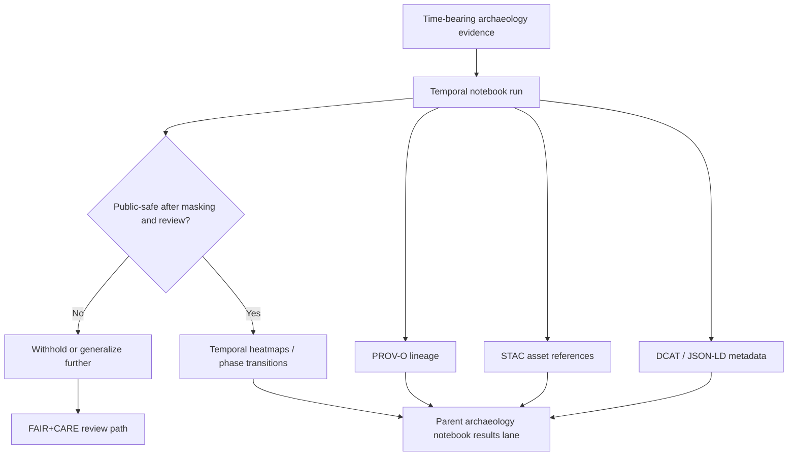

<!-- [KFM_META_BLOCK_V2]
doc_id: kfm://doc/NEEDS-VERIFICATION
title: Archaeology Temporal Analysis Notebooks
type: standard
version: v1
status: draft
owners: NEEDS VERIFICATION
created: YYYY-MM-DD
updated: YYYY-MM-DD
policy_label: NEEDS VERIFICATION
related: [../README.md, ../stac/, ../metadata/, ../provenance/]
tags: [kfm, archaeology, temporal, notebooks]
notes: [Built upward from the confirmed archaeology notebooks root index; mounted repo metadata, ownership, and exact temporal-lane inventory still need direct verification.]
[/KFM_META_BLOCK_V2] -->

# Archaeology Temporal Analysis Notebooks

Governed notebook lane for chronology, sequence modeling, and public-safe temporal outputs in KFM archaeology work.

> [!NOTE]
> **Status:** experimental  
> **Owners:** NEEDS VERIFICATION · likely Archaeology Working Group / FAIR+CARE Council (**INFERRED**)  
>      
> **Quick jumps:** [Scope](#scope) · [Repo fit](#repo-fit) · [Accepted inputs](#accepted-inputs) · [Exclusions](#exclusions) · [Current source-grounded snapshot](#current-source-grounded-snapshot) · [Workflow classes](#workflow-classes) · [Quickstart](#quickstart) · [Diagram](#diagram) · [Task list](#task-list--definition-of-done) · [FAQ](#faq)  
> **Repo fit:** `docs/analyses/archaeology/results/notebooks/temporal/README.md` → upstream: [`../README.md`](../README.md) · downstream: temporal notebook leaves and generated outputs in this lane (**NEEDS VERIFICATION**)

> [!IMPORTANT]
> This directory is for **temporal analysis notebooks and their governed outputs**, not for unrestricted archaeological chronology claims, not for raw dating archives, and not for notebook-independent interpretation prose.

> [!WARNING]
> Current-session evidence confirms the **parent archaeology notebooks lane** and its temporal notebook class, but it does **not** directly verify the mounted inventory inside `temporal/`. Treat notebook filenames, helper scripts, tests, CI hooks, and lane-local ownership beyond the parent index as **NEEDS VERIFICATION**.

## Scope

The `temporal/` lane exists for notebook work that turns chronology and sequence questions into reproducible, policy-aware analysis.

In the source-grounded archaeology notebook index, the temporal notebook class is described as work on:

- OWL-Time interval expansion
- generalized radiocarbon Bayesian modeling
- occupation-phase correlation

Its documented outputs are **temporal heatmaps** and **phase transitions**.

This lane should preserve the notebook-wide archaeology controls already established for the parent results notebook subtree:

- no sensitive coordinates
- archaeological and cultural masking via H3 generalization
- FAIR+CARE governance
- WAL → Retry → Rollback lineage
- validated results rather than notebook-only claims

## Repo fit

| Path | Role | Relationship |
| --- | --- | --- |
| `../README.md` | parent notebook index | confirmed root for archaeology analysis notebooks |
| `./README.md` | this file | lane README for temporal notebook work |
| `../stac/` | notebook-generated STAC routing surface | use for governed asset references emitted by notebook workflows |
| `../metadata/` | notebook DCAT / JSON-LD routing surface | use for dataset-purpose, lifecycle, and authorship metadata |
| `../provenance/` | lineage routing surface | use for PROV-O notebook-run lineage |
| `../environmental/` | adjacent notebook lane | use when the primary question is climate, hydrology, soils, or ecological forcing rather than chronology |
| `../geophysics/` | adjacent notebook lane | use when the primary signal is subsurface/environmental geophysics rather than occupation sequence |

## Accepted inputs

Place material here when it is primarily about **time-aware archaeological notebook analysis**:

- OWL-Time interval notebooks
- generalized radiocarbon phase-model notebooks
- occupation-phase correlation notebooks
- temporal heatmaps, phase-transition summaries, and date-window comparison outputs
- notebook parameter manifests, reproducibility notes, and public-safe explainability summaries tied to a temporal notebook run
- STAC / DCAT / PROV references that belong to notebook-derived temporal outputs
- validation artifacts showing the analysis passed the lane’s scientific and governance checks

## Exclusions

Do **not** place the following here:

- exact site coordinates, raw trench coordinates, or other precision-bearing archaeological locations
- unrestricted sample tables or dating exports that can be reverse-linked to sensitive places
- notebook-independent historical interpretation essays
- broad environmental temporal trend notebooks whose primary owner is `../environmental/`
- geophysics “temporal” products that remain environmental-only and are **not linked to cultural chronology**
- speculative settlement narratives or unsupported phase claims
- raw cultural or subsurface material that has not passed FAIR+CARE review and masking

## Current source-grounded snapshot

| Item | State | Notes |
| --- | --- | --- |
| Parent archaeology notebooks lane | **CONFIRMED** | The surfaced archaeology notebook index explicitly documents a `temporal/` subdirectory. |
| Temporal workflow class | **CONFIRMED** | Defined as OWL-Time interval expansion, generalized radiocarbon Bayesian modeling, and occupation-phase correlation. |
| Temporal outputs | **CONFIRMED** | Documented outputs are temporal heatmaps and phase transitions. |
| Notebook-wide safety controls | **CONFIRMED** | Parent notebook index requires no sensitive coordinates, H3 generalization, FAIR+CARE governance, WAL → Retry → Rollback lineage, and validated results. |
| Lane-local file inventory | **UNKNOWN** | Exact notebooks, helper scripts, tests, and emitted artifacts inside `temporal/` were not directly surfaced in the mounted repo. |
| Ownership, dates, and stable doc ID for this file | **NEEDS VERIFICATION** | Parent-lane metadata exists in project documents, but lane-specific metadata was not directly verified. |

## Workflow classes

| Workflow class | What belongs here | Typical outputs | Boundary note |
| --- | --- | --- | --- |
| OWL-Time interval expansion | notebooks that normalize or compare interval-bearing archaeological evidence in time-aware form | generalized interval layers, sequence tables, temporal summaries | keep interval semantics explicit; avoid place re-identification |
| Generalized radiocarbon Bayesian modeling | notebooks that estimate public-safe phase structure from dating evidence | phase distributions, generalized posterior summaries, temporal heatmaps | do not expose raw sensitive sample linkage without approved masking |
| Occupation-phase correlation | notebooks comparing occupation windows, transitions, or overlap patterns | phase-transition diagrams, overlap matrices, public-safe comparison maps | distinguish evidence-supported correlations from free interpretation |

## Metadata and provenance expectations

Temporal notebooks should route their machine-readable outputs through the same parent archaeology notebook support surfaces documented for the notebook lane.

| Surface | Minimum expectation |
| --- | --- |
| `../stac/` | STAC Item with raster/vector asset references, temporal/spatial extent, and CARE sensitivity tags |
| `../metadata/` | DCAT / JSON-LD record for dataset purpose, authorship, and lifecycle stage |
| `../provenance/` | PROV-O lineage including `prov:used`, `prov:wasGeneratedBy`, hash-locked notebook version, WAL → Retry → Rollback checkpoints, and computational environment metadata |

> [!TIP]
> Keep the notebook itself subordinate to the emitted proof objects. A strong output package is easier to review, route, withhold, or generalize than a persuasive notebook narrative.

## Temporal lane boundary rules

1. A temporal notebook may summarize chronology. It must not silently become a public chronology authority.
2. Public-safe outputs should remain generalized. If precision or sample linkage raises re-identification risk, withhold or generalize further.
3. Environmental timing signals can support chronology work, but environmental-only temporal products belong in the lane that owns the environmental question.
4. Notebook conclusions should separate:
   - **CONFIRMED** notebook results
   - **INFERRED** analytical interpretation
   - **PROPOSED** next analytical moves
   - **UNKNOWN / NEEDS VERIFICATION** unresolved chronology or sensitivity questions

## Directory tree

```text
docs/
└── analyses/
    └── archaeology/
        └── results/
            └── notebooks/
                ├── README.md
                ├── temporal/
                │   ├── README.md
                │   └── *.ipynb / *.md / emitted artifacts   # NEEDS VERIFICATION
                ├── stac/
                ├── metadata/
                └── provenance/
```

## Quickstart

When adding or revising a temporal notebook in this lane:

1. Confirm the notebook’s primary role is chronology / sequence analysis rather than another archaeology sublane.
2. Remove or generalize any sensitive coordinates, sample linkages, or place identifiers before treating output as public-safe.
3. Export the notebook’s governed outputs:
   - temporal heatmap or comparable public-safe asset
   - lifecycle / authorship metadata
   - PROV-O lineage and notebook version references
4. Record uncertainty, masking, and limits in the notebook output package.
5. Update this README if the temporal lane gains stable inventory, conventions, or review gates that can be directly verified.

Illustrative checklist:

```text
[ ] Workflow class fits `temporal/`
[ ] Output is generalized and public-safe
[ ] STAC / DCAT / PROV references exist
[ ] Uncertainty and masking are documented
[ ] Lane-specific claims stay evidence-bounded
```

## Usage

### Add a notebook

Use this lane for notebook leaves whose center of gravity is temporal reasoning, sequence modeling, or phase comparison. Prefer narrow, reviewable notebooks over catch-all research workbooks.

### Add generated outputs

Place routed metadata and lineage in the parent archaeology notebook support surfaces unless a mounted repo convention proves a different lane-local pattern.

### Update this README

Update this file when any of the following become directly verifiable:

- stable notebook filenames or naming patterns
- lane-specific validation hooks or CI checks
- resolved ownership / doc ID / dates / policy label
- confirmed downstream directories inside `temporal/`
- new accepted workflow classes or explicit exclusions

## Diagram



## Task list / definition of done

- [ ] Lane purpose is explicit and does not blur into other archaeology notebook classes
- [ ] Accepted inputs and exclusions are easy to scan
- [ ] Every notebook claim is routable to evidence, metadata, and provenance
- [ ] Sensitive coordinates and sensitive-site inference are blocked or generalized
- [ ] At least one public-safe output example is identified or linked (**NEEDS VERIFICATION** in the current session)
- [ ] README metadata placeholders are replaced after mounted repo verification
- [ ] Parent archaeology notebook index stays synchronized with this lane

## FAQ

### Why a separate temporal lane?

Because chronology, phase comparison, and interval reasoning have different risks and review needs than spatial patterning, environmental forcing, or geophysics.

### Can raw radiocarbon tables live here?

Not by default. Keep raw or precision-bearing materials out of the public-safe temporal lane unless a verified review path allows them.

### Do environmental time-series belong here?

Only when they are supporting chronology work. Environmental-only temporal analysis should live in the lane that owns the environmental question.

### Must every notebook emit STAC, metadata, and provenance?

For notebook-generated spatial products and other governed outputs, that is the documented expectation for the archaeology notebook lane. Missing metadata or lineage should be treated as a publication blocker for governed release.

<details>
<summary>Status vocabulary used in this directory</summary>

| Label | Meaning here |
| --- | --- |
| **CONFIRMED** | Directly supported by surfaced project documents in the current session |
| **INFERRED** | Strong completion from the parent archaeology notebook doctrine, but not directly verified in the mounted repo |
| **PROPOSED** | Recommended lane behavior or document structure added in this draft |
| **UNKNOWN** | Not verified strongly enough from the currently surfaced evidence |
| **NEEDS VERIFICATION** | Placeholder or review flag that should be resolved from the mounted repository before commit |

</details>

---

Back to [`../README.md`](../README.md) · [Back to top](#archaeology-temporal-analysis-notebooks)
