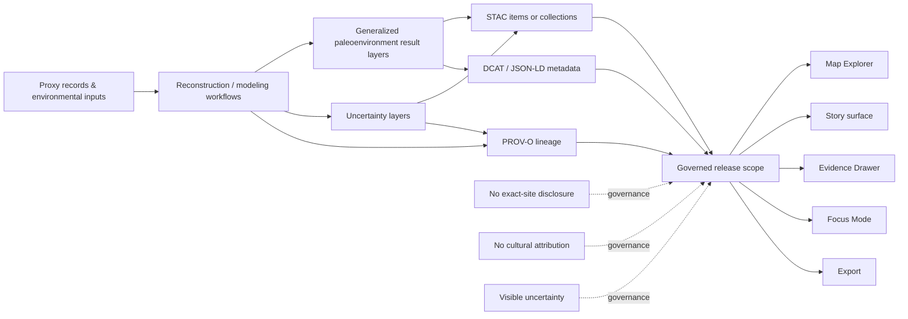

<!-- [KFM_META_BLOCK_V2]
doc_id: <REVIEW_REQUIRED: kfm://doc/uuid-not-verified-in-mounted-repo>
title: Kansas Frontier Matrix — Paleoenvironmental Results
type: standard
version: v1
status: review
owners: Paleoenvironment WG · FAIR+CARE Council
created: <REVIEW_REQUIRED>
updated: <REVIEW_REQUIRED>
policy_label: restricted
related: [../README.md, ./climate/README.md, ./paleohydrology/README.md, ./vegetation/README.md, ./seasonality/README.md, ./drought-cycles/README.md, ./predictive/README.md, ./uncertainty/README.md, ./stac/, ./metadata/, ./provenance/]
tags: [kfm, archaeology, paleoenvironment, fair-care, stac, dcat, prov]
notes: [Owners and result-family names are source-grounded from attached KFM paleoenvironment drafts; policy label retains the task-supplied restricted posture and aligns with CARE-governed sensitivity language, but mounted policy-registry confirmation, exact repo presence, created/updated dates, and canonical doc UUID remain NEEDS VERIFICATION because the mounted repo tree was not visible in the current session.]
[/KFM_META_BLOCK_V2] -->

# Kansas Frontier Matrix — Paleoenvironmental Results

Unified entrypoint for generalized paleoenvironment result families used as environmental context within KFM archaeology workflows.

> [!NOTE]
> **Status:** review  
> **Owners:** Paleoenvironment WG · FAIR+CARE Council  
> **Policy label:** `restricted` · CARE-governed  
> **Repo fit:** `docs/analyses/archaeology/results/paleoenvironment/README.md` *(path is source-grounded; mounted repo presence remains NEEDS VERIFICATION)*  
> **Upstream:** [Archaeology results](../README.md)  
> **Downstream:** [Climate](./climate/README.md) · [Paleohydrology](./paleohydrology/README.md) · [Vegetation](./vegetation/README.md) · [Seasonality](./seasonality/README.md) · [Drought cycles](./drought-cycles/README.md) · [Predictive](./predictive/README.md) · [Uncertainty](./uncertainty/README.md)  
> 
> 
> 
> 
>
> **Quick jump:** [Scope](#scope) · [Repo fit](#repo-fit) · [Accepted inputs](#accepted-inputs) · [Exclusions](#exclusions) · [Directory tree](#directory-tree) · [Quickstart](#quickstart) · [Usage](#usage) · [Diagram](#diagram) · [Tables](#tables) · [Task list](#task-list) · [FAQ](#faq) · [Appendix](#appendix)

> [!IMPORTANT]
> This directory is for **generalized environmental context and derived result products**. It is **not** the place for exact-site disclosure, cultural identity inference, or unrestricted historical narrative.

> [!WARNING]
> The current session exposed a document corpus, not a mounted repository tree. Family names and relative links below are source-grounded, but exact local presence, timestamps, and sibling README availability still need repo verification before commit.

## Scope

This directory gathers KFM archaeology-facing **paleoenvironmental analytical results** that provide deep-time environmental context for Late Prehistoric, Protohistoric, and Historic-period interpretation without becoming a proxy for cultural identity, ownership, site prediction, or restricted knowledge.

It is the landing page for result families such as climate reconstructions, paleohydrology, paleovegetation, seasonality, drought cycles, predictive paleoenvironment layers, uncertainty products, and the metadata/provenance materials that make those outputs inspectable and governable.

| Truth posture | How to read this README |
| --- | --- |
| **CONFIRMED** | Environmental-only framing, FAIR+CARE posture, STAC/DCAT/PROV companionship, trust-visible release expectations, and the major family names are grounded in the attached KFM source corpus. |
| **INFERRED** | Exact sibling link targets, some local folder assumptions, and the appendix starter shapes are conservative completions based on repeated attached drafts. |
| **NEEDS VERIFICATION** | Mounted repo presence, canonical UUID, created/updated dates, exact file inventory, CI command names, and whether every linked child README already exists. |

This root README should stay **navigational and boundary-setting**. Family-specific methods, constraints, and publication burdens belong in child READMEs.

[Back to top](#kansas-frontier-matrix--paleoenvironmental-results)

## Repo fit

**Path:** `docs/analyses/archaeology/results/paleoenvironment/README.md`

**Role in the repo:** root index for archaeology-facing paleoenvironment result families and their release-facing metadata, uncertainty, and provenance companions.

**Upstream link:** [Archaeology results root](../README.md) *(source-grounded; repo presence NEEDS VERIFICATION)*

**Downstream family set:**  
[Climate](./climate/README.md) · [Paleohydrology](./paleohydrology/README.md) · [Vegetation](./vegetation/README.md) · [Seasonality](./seasonality/README.md) · [Drought cycles](./drought-cycles/README.md) · [Predictive](./predictive/README.md) · [Uncertainty](./uncertainty/README.md)

**Adjacent companions:**  
[`./stac/`](./stac/) · [`./metadata/`](./metadata/) · [`./provenance/`](./provenance/)

This page should help maintainers answer three fast questions:

1. Which result family should I open next?
2. What belongs here?
3. What must never be implied from these layers?

[Back to top](#kansas-frontier-matrix--paleoenvironmental-results)

## Accepted inputs

The following belong here or immediately beneath this directory:

- Generalized paleoenvironment result families.
- Paleoclimate, paleohydrology, vegetation, seasonality, and drought-cycle outputs.
- Environmental-only predictive paleoenvironment layers.
- Uncertainty rasters, disagreement summaries, fit limits, and variance products.
- STAC item or collection materials for released result layers.
- DCAT / JSON-LD discovery metadata for outward dataset description.
- PROV-O lineage bundles documenting reconstruction and transformation history.
- Family-level READMEs that define scope, limits, review expectations, and release posture.

## Exclusions

The following do **not** belong here:

- Raw proxy captures, unreviewed sample locations, or precision source extracts.
- Exact archaeological site coordinates, sensitive Indigenous knowledge, or culturally restricted materials.
- Cultural identity inference, migration reconstruction, or deterministic settlement claims.
- Unreleased candidate outputs that have not passed metadata, uncertainty, and policy review.
- Source-edge onboarding contracts and raw ingest artifacts when they are acting as canonical source truth rather than release companions.
- UI-only story copy with no evidence linkage.

Route those materials to the appropriate **source/onboarding**, **WORK/QUARANTINE**, **steward-only**, or adjacent **cultural / heritage** workflows instead of forcing them into this directory.

[Back to top](#kansas-frontier-matrix--paleoenvironmental-results)

## Directory tree

Source-grounded family names are shown below. Exact local presence remains **NEEDS VERIFICATION**.

```text
docs/analyses/archaeology/results/paleoenvironment/
├── README.md
├── climate/
├── paleohydrology/
├── vegetation/
├── seasonality/
├── drought-cycles/
├── predictive/
├── uncertainty/
├── stac/
├── metadata/
└── provenance/
```

[Back to top](#kansas-frontier-matrix--paleoenvironmental-results)

## Quickstart

Use this when reviewing or adding a paleoenvironment result family.

1. Confirm the family is **environmental-only**, generalized, and uncertainty-bearing.
2. Verify the family has a child README or equivalent scope note.
3. Keep metadata, lineage, and uncertainty companions visible at the same release scope as the result.
4. Check that public-facing language stays contextual and does not drift into cultural certainty.
5. Verify local names and links against the mounted repo before merge.

```bash
# Illustrative only — verify actual repo paths and local conventions first.
cd docs/analyses/archaeology/results/paleoenvironment

# Review current family set before adding or renaming anything.
ls

# Add a new family landing page only after verifying adjacent docs and local conventions.
mkdir -p <family>
touch <family>/README.md

# Then update any required metadata/provenance/uncertainty companions
# in the locations your mounted repo already uses.
```

```yaml
# Illustrative result-pack shape — not a confirmed mounted schema.
family: vegetation
result_scope: generalized
time_model: owl-time
spatial_generalization: h3-r7-plus
artifacts:
  uncertainty: true
  stac: true
  dcat: true
  prov: true
release_state: candidate
policy_review: required
```

> [!TIP]
> Treat this directory as a **release-safe packaging lane**, not just a folder of maps. A family that cannot explain its scope, uncertainty, and lineage is not done.

[Back to top](#kansas-frontier-matrix--paleoenvironmental-results)

## Usage

Use this README as the **first stop** for archaeology-facing paleoenvironment material.

1. Start here to determine which family holds the environmental context you need.
2. Move into the relevant child README for family-specific structure and prohibitions.
3. Follow the linked metadata and provenance materials before using a layer in Story, Dossier, Export, Focus, or adjacent analytical surfaces.
4. Keep this page synchronized with family additions, removals, or naming changes.
5. Preserve the distinction between environmental context, modeled output, uncertainty expression, and any higher-level archaeological interpretation that happens elsewhere.

> [!TIP]
> A strong root README here reduces duplication: it should explain **where to go next**, **what belongs here**, and **what must never be implied from these layers**.

[Back to top](#kansas-frontier-matrix--paleoenvironmental-results)

## Diagram



[Back to top](#kansas-frontier-matrix--paleoenvironmental-results)

## Tables

### Result family registry

| Family | What belongs here | Typical contents | Interpretation boundary |
| --- | --- | --- | --- |
| `climate/` | Generalized paleoclimate reconstructions | temperature, precipitation, seasonality, drought/flood intervals, proxy composites | Environmental-only; no cultural timeline claims |
| `paleohydrology/` | Paleo-hydrology and moisture-balance context | paleochannels, alluvial generalizations, moisture balance, hydrology summaries | No exact-site prediction from river or water context alone |
| `vegetation/` | Paleovegetation and ecozone reconstructions | ecozones, biomass envelopes, canopy/groundcover, proxy assemblages | No habitat-to-group attribution |
| `seasonality/` | Seasonal climate reconstructions | winter/summer patterns, seasonal precipitation, temporal uncertainty | Use as temporal context, not behavioral certainty |
| `drought-cycles/` | Generalized drought/wet oscillation summaries | recurrence, severity, duration, clustering, proxy agreement | No deterministic historical explanation |
| `predictive/` | Environmental-only predictive paleoenvironment layers | paleoclimate, hydrology, vegetation, soils, temporal scenarios, predictive uncertainty | No cultural forecasting, identity inference, or fine-scale reconstruction |
| `uncertainty/` | Cross-family uncertainty outputs | disagreement, variance, interpolation confidence, ensemble spread | Must stay visible wherever consequential use occurs |
| `stac/` | Spatiotemporal release descriptors | item/asset references, extent, asset listings | Release-facing carrier, not a substitute for DCAT/PROV |
| `metadata/` | Dataset discovery and distribution records | purpose, scope, methods summary, FAIR+CARE statements | Discovery layer, not the whole evidence story |
| `provenance/` | Reconstruction and transformation lineage | proxy usage, activities, configuration lineage, masking/generalization history | Provenance must remain inspectable and role-safe |

### Catalog closure, metadata, and lineage companions

| Artifact family | Minimum purpose here | Notes |
| --- | --- | --- |
| **STAC** | Carry spatiotemporal item/asset description for released layers | Best when the result is an asset-bearing spatiotemporal item or collection |
| **DCAT / JSON-LD** | Describe outward dataset/distribution discovery | Keep scope, method summary, distribution, and access posture legible |
| **PROV-O** | Preserve reconstruction, modeling, and masking lineage | Should remain linked to release-safe artifacts, not hidden behind prose |
| **Uncertainty companion** | Express disagreement, fit limits, spread, and ambiguity | Required for ethical and scientific use of derived outputs |
| **Evidence-linked release refs** | Support Evidence Drawer, Focus, and correction visibility | Do not imply that a visually compelling layer is self-authenticating |

### Trust-visible shell use

| Surface | How paleoenvironment results should appear | Must stay visible |
| --- | --- | --- |
| Map Explorer | Layered environmental context | time scope, freshness, uncertainty, route to evidence |
| Timeline | Time-bounded environmental change context | valid-time labels, compare basis, stale-state cues |
| Story surface | Human-authored narrative with evidence linkage | dates, perspective labels, correction/review state |
| Evidence Drawer | Immediate provenance inspection | lineage members, transforms, release scope, preview limits |
| Focus Mode | Bounded environmental context and synthesis | scoped retrieval, citation verification, answer/abstain/deny/error outcomes |
| Export | Policy-safe outward artifact generation | release scope, evidence linkage, correction linkage |

[Back to top](#kansas-frontier-matrix--paleoenvironmental-results)

## Task list

- [ ] Root README reflects the current family set without duplicating child-family method detail.
- [ ] Every released family has uncertainty material, not just a visually strong output layer.
- [ ] STAC, DCAT, and PROV references are present where required.
- [ ] Environmental-only framing is explicit and stable.
- [ ] No exact-location leakage, identity inference, or cultural attribution is introduced.
- [ ] Story and Focus language remains contextual, bounded, and evidence-linked.
- [ ] Release state and correction path are visible for outward-facing artifacts.
- [ ] Naming seams have been checked against the mounted repo before merge.
- [ ] Metadata, provenance, and child links render correctly on GitHub.
- [ ] Any newly added family has a sibling README before publication.

### Definition of done

A change to this directory is ready when:

- the family is correctly placed,
- the README and child links are coherent,
- uncertainty is published alongside results,
- metadata and provenance are inspectable,
- public-safe interpretation boundaries are explicit, and
- the change does not quietly turn environmental context into cultural certainty.

[Back to top](#kansas-frontier-matrix--paleoenvironmental-results)

## FAQ

### Why is this under archaeology if the layers are environmental?

Because these datasets support archaeological interpretation with **environmental context**, but the datasets themselves remain environmental-only and governance-bounded.

### Can these layers be used in Focus Mode?

Yes, but only as scoped, evidence-linked environmental context with visible uncertainty and release state.

### Are predictive layers allowed here?

Yes, but only when they remain generalized, environmental-only, uncertainty-bearing, and free of cultural forecasting or identity linkage.

### Why are some links and names marked as inferred?

Because the current session did not expose a mounted repo tree. The attached project documents strongly imply these sibling families, but local file presence still needs repo verification.

### Is 3D required for these results?

No. KFM doctrine is 2D-first by default. Any 3D use must remain conditional, burden-bearing, and evidence-linked.

[Back to top](#kansas-frontier-matrix--paleoenvironmental-results)

## Appendix

<details>
<summary><strong>Inferred child-family starter shapes</strong></summary>

These are useful review targets, not confirmed mounted repo facts.

| Family | Likely child structure |
| --- | --- |
| `climate/` | `temperature/`, `precipitation/`, `seasonality/`, `drought-flood/`, `proxy-assemblages/`, `temporal/`, `uncertainty/`, `stac/`, `metadata/`, `provenance/` |
| `vegetation/` | `ecozones/`, `biomass/`, `canopy-groundcover/`, `proxy-assemblages/`, `temporal/`, `uncertainty/`, `stac/`, `metadata/`, `provenance/` |
| `drought-cycles/` | `frequency/`, `severity/`, `duration/`, plus uncertainty/metadata/provenance companions |
| `predictive/` | `climate/`, `hydrology/`, `vegetation/`, `soils/`, `drought-cycles/`, `temporal/`, `uncertainty/`, `stac/`, `metadata/`, `provenance/` |
| `provenance/` | lineage bundles, crosswalks, masking logs, reproducibility snapshots |

</details>

<details>
<summary><strong>Naming seam to verify before commit</strong></summary>

The attached drafts consistently use `paleohydrology/` at the root, while some predictive child drafts use `hydrology/` under `predictive/`. Keep that distinction unless the mounted repo has already standardized differently.

</details>

<details>
<summary><strong>Recommended maintainer rule</strong></summary>

Whenever a new family or child directory is added, update this root README in the same change so the landing page stays trustworthy.

</details>

[Back to top](#kansas-frontier-matrix--paleoenvironmental-results)