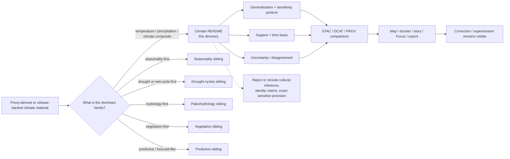

<!-- [KFM_META_BLOCK_V2]
doc_id: kfm://doc/<uuid-NEEDS-VERIFICATION>
title: Kansas Frontier Matrix — Paleoenvironmental Climate Results
type: standard
version: v1
status: review
owners: Paleoenvironment WG · FAIR+CARE Council (INFERRED from parent README; NEEDS VERIFICATION)
created: YYYY-MM-DD
updated: YYYY-MM-DD
policy_label: restricted
related: [docs/analyses/archaeology/results/paleoenvironment/README.md, docs/analyses/archaeology/results/README.md, docs/analyses/archaeology/README.md]
tags: [kfm, archaeology, paleoenvironment, climate]
notes: [Public repo path is confirmed, but the checked-in file was only a placeholder at review time; child-local UUID, dates, ownership, and local inventory beyond README.md still need direct repo verification.]
[/KFM_META_BLOCK_V2] -->

# Kansas Frontier Matrix — Paleoenvironmental Climate Results

Evidence-aware guide for generalized, environmental-only paleoclimate result surfaces and their release-facing companions in KFM archaeology workflows.

> [!IMPORTANT]
> **Status:** review  
> **Owners:** `Paleoenvironment WG · FAIR+CARE Council` *(INFERRED from the parent paleoenvironment README; verify child ownership before merge)*  
> **Policy label:** `restricted`  
> 
> 
> 
> 
>   
> **Quick jump:** [Scope](#scope) · [Repo fit](#repo-fit) · [Accepted inputs](#accepted-inputs) · [Exclusions](#exclusions) · [Directory tree](#directory-tree) · [Quickstart](#quickstart) · [Usage](#usage) · [Diagram](#diagram) · [Tables](#tables) · [Task list](#task-list) · [FAQ](#faq) · [Appendix](#appendix)  
> **Repo fit:** `docs/analyses/archaeology/results/paleoenvironment/climate/README.md` → upstream [Paleoenvironment](../README.md) · [Archaeology results](../../README.md) · adjacent [Seasonality](../seasonality/README.md) · [Drought cycles](../drought-cycles/README.md) · [Paleohydrology](../paleohydrology/README.md) · [Vegetation](../vegetation/README.md) · [Predictive](../predictive/README.md) · [Uncertainty](../uncertainty/README.md)  
> **Status vocabulary used here:** **CONFIRMED**, **INFERRED**, **PROPOSED**, **UNKNOWN**, **NEEDS VERIFICATION**

> [!WARNING]
> This family is for **environmental context only**. It must not be used to imply cultural identity, migration, settlement causation, or unrestricted precision about sensitive proxy or archaeology-linked locations.

## Scope

This directory is the family README for archaeology-facing **paleoclimate results** inside the broader paleoenvironment results lane.

Use it to document generalized climate reconstructions that help explain environmental context across time without letting climate prose become a proxy for cultural interpretation, ownership, or identity. In KFM terms, this README should stay **downstream of evidence, review, release state, sensitivity handling, and correction lineage**. It is a routing surface and publication-boundary guide, not a sovereign climate catalog and not a substitute for the governing truth path.

Climate-family work here should make five things easy to see:

1. what kind of climate result is being described
2. what support and time basis it depends on
3. how generalization and sensitivity are handled
4. what uncertainty remains visible
5. how the result routes outward to evidence-linked release surfaces

### Current verified baseline

| Item | Status | Why it matters |
| --- | --- | --- |
| `docs/analyses/archaeology/results/paleoenvironment/climate/README.md` exists in the public repo | **CONFIRMED** | This rewrite is replacing a real checked-in placeholder, not inventing a path |
| The current checked-in file is only a placeholder sentence | **CONFIRMED** | A substantive replacement is warranted |
| The parent paleoenvironment README names **Climate** as a child family | **CONFIRMED** | This child README should own family-specific scope, constraints, and routing |
| Sibling family README paths exist for paleohydrology, vegetation, seasonality, drought cycles, predictive, and uncertainty | **CONFIRMED** | This file should route material to the correct sibling family instead of swallowing everything climate-adjacent |
| Climate-local folders such as `temperature/`, `precipitation/`, `temporal/`, `stac/`, `metadata/`, and `provenance/` | **INFERRED** | These are strongly suggested by attached climate-specific design drafts, but they were not reverified as checked-in local inventory here |
| Child-specific UUID, created date, updated date, ownership, schema refs, telemetry refs, and release artifact refs | **NEEDS VERIFICATION** | Do not treat those values as current repo truth until directly rechecked before merge |

[Back to top](#kansas-frontier-matrix--paleoenvironmental-climate-results)

## Repo fit

| Direction | Link / path | Role in repo | Status |
| --- | --- | --- | --- |
| **This file** | `docs/analyses/archaeology/results/paleoenvironment/climate/README.md` | Family README for climate-facing paleoenvironment results | **CONFIRMED path** |
| **Immediate upstream** | [../README.md](../README.md) | Parent paleoenvironment index and boundary-setting README | **CONFIRMED path** |
| **Archaeology results root** | [../../README.md](../../README.md) | Results-layer publication boundary for archaeology outputs | **CONFIRMED path** |
| **Lane doctrine upstream** | [../../../README.md](../../../README.md) | Archaeology lane guidance, sensitivity posture, and 2D/2.5D/3D burden rules | **CONFIRMED path** |
| **Adjacent family surfaces** | [../seasonality/README.md](../seasonality/README.md) · [../drought-cycles/README.md](../drought-cycles/README.md) · [../paleohydrology/README.md](../paleohydrology/README.md) · [../vegetation/README.md](../vegetation/README.md) · [../predictive/README.md](../predictive/README.md) · [../uncertainty/README.md](../uncertainty/README.md) | Keep climate work routed to the correct sibling when the dominant question is not actually climate | **CONFIRMED paths; family content still thin in several siblings** |
| **Potential family-local companions** | `./temperature/` · `./precipitation/` · `./proxy-assemblages/` · `./temporal/` · `./uncertainty/` · `./stac/` · `./metadata/` · `./provenance/` | Useful starter substructure for a fuller climate family | **INFERRED / NEEDS VERIFICATION** |

### Role in the repository

This README should help a maintainer or reviewer answer four quick questions:

1. Does this material belong in the **climate** family at all?
2. Is the result **environmental-only** and suitably generalized?
3. Are **support, time basis, uncertainty, and evidence routing** visible?
4. Should the reader stay here, or move to a sibling family such as seasonality, drought cycles, or paleohydrology?

## Accepted inputs

Use this directory for **release-facing climate result documentation** and family-level routing, not for upstream raw evidence or broad paleoenvironment doctrine.

| Fits here | Minimum expectation | Route elsewhere when |
| --- | --- | --- |
| **Generalized temperature reconstructions** | Environmental-only framing, time basis, uncertainty, and evidence route are visible | The page is really a model card, raw dataset catalog, or unrestricted source inventory |
| **Generalized precipitation or moisture reconstructions** | Method class and support are explicit; proxy disagreement is not hidden | The dominant burden is hydrology rather than climate interpretation |
| **Multi-proxy climate composites** | Proxy families are named, mixing logic is stated, and uncertainty remains visible | The result is actually a broader paleoenvironment synthesis root |
| **Climate-local interval summaries** | Time semantics are explicit and not flattened into timeless claims | The dominant question is seasonality or drought-cycle behavior as its own family |
| **Climate-specific uncertainty and disagreement notes** | Readers can inspect spread, proxy conflict, fit limits, or confidence qualifiers | The page is a cross-family uncertainty registry better placed under `../uncertainty/` |
| **Release-facing STAC / DCAT / PROV companions** | They are clearly companions to climate results, not source-edge or schema-authority docs | They are canonical shared schemas, policy bundles, or source onboarding contracts |
| **Public-safe story / dossier / Focus support notes** | They remain environmental-only and route back to evidence-linked climate results | They drift into UI-only copy, detached narrative, or cultural inference |

### Representative source families that may support climate result pages

These are appropriate to reference **only when already release-scoped or review-scoped**:

- pollen and other vegetation-proxy climate signals
- charcoal or fire-regime materials used as climate-context proxies
- lake-core, river-core, sediment, isotope, or soil-profile climate indicators
- climate interval or anomaly syntheses derived from governed upstream datasets
- uncertainty or proxy-disagreement products tied to one climate result family

> [!NOTE]
> Seasonality, drought-cycle, vegetation, paleohydrology, and predictive paleoenvironment materials may intersect climate work, but their **primary** family README should still live in the corresponding sibling path when that family is the dominant interpretive home.

## Exclusions

This directory is **not** the place for source-edge or culturally risky material.

| Do **not** put this here | Why not | Put it where instead |
| --- | --- | --- |
| **Raw proxy captures, sample-level extracts, or unresolved source-edge data** | These are upstream evidence states, not release-facing climate result docs | Governed source / RAW / WORK / QUARANTINE lanes |
| **Exact archaeological site coordinates or exact proxy-locality exposure that raises sensitivity risk** | Public-safe climate documentation must not imply unrestricted precision | Generalized or steward-restricted documentation paths |
| **Cultural identity inference, migration reconstruction, or settlement causation claims** | Climate context is not permission to narrate cultural explanation as fact | Review-only or culturally governed interpretation lanes |
| **Primary seasonality family docs** | The parent paleoenvironment README already gives seasonality its own family path | [../seasonality/README.md](../seasonality/README.md) |
| **Primary drought or wet-cycle family docs** | These belong in the drought-cycles family once they become the main subject | [../drought-cycles/README.md](../drought-cycles/README.md) |
| **Primary paleohydrology result docs** | Hydrology context should not be flattened into a climate-only bucket | [../paleohydrology/README.md](../paleohydrology/README.md) |
| **Primary vegetation / ecozone result docs** | Vegetation reconstructions deserve their own family surface | [../vegetation/README.md](../vegetation/README.md) |
| **Predictive paleoenvironment models** | Predictive burden and prohibitions differ from descriptive climate reconstructions | [../predictive/README.md](../predictive/README.md) |
| **Detached AI summaries with no evidence route** | KFM requires evidence-linked, policy-safe outputs or abstention | Nowhere until properly linked and reviewed |
| **Spectacle-first 3D climate scenes** | 3D is burden-bearing and must materially improve reasoning | Use only under the archaeology representation rules, with explicit justification |

## Directory tree

### Confirmed current tree

```text
docs/analyses/archaeology/results/paleoenvironment/climate/
└── README.md
```

<details>
<summary><strong>INFERRED starter layout from attached climate-family working drafts</strong></summary>

The layout below is useful as a planning surface, but it is **not** confirmed current repo inventory.

```text
docs/analyses/archaeology/results/paleoenvironment/climate/
├── README.md
├── temperature/
├── precipitation/
├── proxy-assemblages/
├── temporal/
├── uncertainty/
├── stac/
├── metadata/
└── provenance/
```

Use it only after directly rechecking local repo inventory and adjacent conventions before merge.
</details>

## Quickstart

Use this sequence when replacing climate-family placeholders or adding climate-family pages.

1. Confirm the page is truly **about climate results**, not primarily seasonality, drought cycles, hydrology, vegetation, or predictive modeling.
2. State whether the material is **release-backed** or **review-only**.
3. Declare the **time basis** and the **support / grain**.
4. Mark the result class plainly: temperature, precipitation/moisture, variability, proxy composite, interval summary, or uncertainty/disagreement.
5. Make the **generalization / sensitivity posture** explicit.
6. Keep **uncertainty** and **proxy disagreement** visible.
7. Link outward to the relevant evidence, provenance, and correction path.

Illustrative starter block for a climate-family leaf:

```md
> Status: review
> Basis: release-backed | review-only
> Climate family: temperature | precipitation/moisture | variability | proxy composite | uncertainty
> Time basis: 
> Spatial support: 
> Method class: observation-derived | proxy composite | reconstruction | modeled | mixed
> Precision posture: generalized | withheld
> Downstream surface: map | dossier | story | Focus | export | review-only
> Evidence / provenance: 
> Correction path:
```

## Usage

### Keep the family boundary sharp

This page should stay a **family README**, not expand into a full climate atlas, a source catalog, or a policy bundle.

A practical rule:

- keep **climate reconstructions** here
- route **seasonality-first** work to [../seasonality/README.md](../seasonality/README.md)
- route **drought-cycle-first** work to [../drought-cycles/README.md](../drought-cycles/README.md)
- route **hydrology-first** work to [../paleohydrology/README.md](../paleohydrology/README.md)
- route **vegetation-first** work to [../vegetation/README.md](../vegetation/README.md)
- route **predictive** work to [../predictive/README.md](../predictive/README.md)

### State support, time basis, and method honestly

Every climate result page or child note should let a reviewer see:

- what proxy or upstream result families were used
- whether the output is observational, proxy-derived, reconstructed, modeled, or mixed
- what interval, slice, or temporal window is being discussed
- what uncertainty, disagreement, or fit limit qualifies interpretation

### Default representation rule

For archaeology-facing climate results, the honest default is usually **2D**.

Use **2.5D** only when terrain-aware relief materially improves understanding of a climate surface or interval. Treat **3D** as rare and burden-bearing: it must justify why 2D is insufficient, preserve the same public-safe sensitivity controls, and keep correction/supersession visible.

### Update without breaking lineage

When climate interpretation changes, prefer:

- **supersession**
- **narrowing**
- **replacement with visible note**
- **withdrawal**

Do not silently overwrite a climate-family result if the better operation is to preserve visible correction lineage.

## Diagram



## Tables

### Climate-family routing matrix

| If the dominant question is about... | Primary home | Why |
| --- | --- | --- |
| **Temperature reconstruction** | **Here** | Core climate family material |
| **Precipitation or moisture reconstruction** | **Here** | Core climate family material |
| **Climate variability or interval summary** | **Here** | Core climate family material when it stays environmental-only |
| **Seasonality as its own analytical family** | [../seasonality/README.md](../seasonality/README.md) | Parent paleoenvironment README already names seasonality as a sibling family |
| **Drought and wet-cycle behavior as its own family** | [../drought-cycles/README.md](../drought-cycles/README.md) | Keeps drought-cycle burden and terminology separate |
| **Paleohydrology or paleo-flow behavior** | [../paleohydrology/README.md](../paleohydrology/README.md) | Hydrology-first questions should not be flattened into climate |
| **Vegetation or ecozone reconstruction** | [../vegetation/README.md](../vegetation/README.md) | Vegetation has its own family and publication burden |
| **Predictive paleoenvironment modeling** | [../predictive/README.md](../predictive/README.md) | Predictive outputs carry a different method and policy burden |
| **Cross-family uncertainty registry** | [../uncertainty/README.md](../uncertainty/README.md) | Use the uncertainty sibling when the page is not climate-specific |

### Minimum visible contract for one climate result

| Item | Minimum visible cue | Why it matters |
| --- | --- | --- |
| **Basis** | release-backed or review-only status | Prevents silent truth laundering |
| **Climate family** | temperature, precipitation/moisture, variability, proxy composite, interval summary, or uncertainty | Keeps navigation clear |
| **Support / grain** | site aggregate, region, interval, slice, polygon, grid, or other support language | Prevents misleading precision |
| **Time basis** | explicit interval, date range, or temporal slice | Stops timeless climate prose |
| **Method class** | observational, proxy-derived, reconstructed, modeled, or mixed | Keeps method visible |
| **Generalization / sensitivity** | generalized, withheld, or otherwise controlled | Preserves public-safe posture |
| **Uncertainty** | disagreement, spread, fit limits, confidence class, or missingness note | Required for ethical interpretation |
| **Evidence / provenance** | EvidenceBundle, STAC/DCAT/PROV, release manifest, or equivalent links | Keeps consequential claims inspectable |
| **Correction path** | supersedes / superseded-by / withdrawn / corrected note | Makes change visible later |

### Climate-family interpretation rules

| Rule | What it means in practice |
| --- | --- |
| **Environmental-only framing** | Climate context must not quietly become cultural explanation |
| **No exactness by implication** | If precision is generalized or withheld, say so plainly |
| **Uncertainty is part of the result** | Do not publish polished climate prose that hides disagreement or partial support |
| **Sibling routes are a strength** | Sending drought, seasonality, or hydrology material to the right family improves clarity |
| **Correction is normal** | Supersession, narrowing, and withdrawal are part of trustworthy climate documentation |

[Back to top](#kansas-frontier-matrix--paleoenvironmental-climate-results)

## Task list

**Definition of done for this family README and any child climate note it routes to**

- [ ] The placeholder content is fully replaced
- [ ] The release basis or review basis is named
- [ ] The climate family is named precisely
- [ ] Support and time basis are explicit
- [ ] Environmental-only framing is visible
- [ ] Cultural inference is explicitly excluded
- [ ] Generalization / sensitivity posture is explicit
- [ ] Uncertainty or disagreement handling is visible
- [ ] Evidence / provenance routing is present where applicable
- [ ] Sibling family routing is used when the dominant subject is not actually climate
- [ ] Any `INFERRED` local folders or schema refs are rechecked before commit
- [ ] Correction / supersession behavior is described
- [ ] Any 2.5D / 3D element includes a burden justification
- [ ] KFM meta block placeholders are replaced from direct repo truth, or intentionally preserved with a review note

## FAQ

### Is this a dataset catalog?

No. This is a **family README** for climate-facing paleoenvironment results. It should route to evidence, metadata, provenance, and sibling families, not replace them.

### Can climate results here explain why people settled, moved, or changed behavior?

Not as a settled claim. This family should remain **environmental-only** unless a separate, governed interpretation path can justify broader statements without flattening uncertainty or sensitivity.

### Are seasonality and drought cycles part of climate?

Yes in subject matter, but not always in **documentation ownership**. The parent paleoenvironment README already gives those families their own sibling paths, so this file should route readers there when those become the dominant frame.

### Are local child folders like `temperature/` and `precipitation/` confirmed current repo inventory?

No. They are useful, source-grounded planning suggestions from attached climate drafts, but they remain **INFERRED / NEEDS VERIFICATION** until directly rechecked in the repo.

### Can 3D climate outputs live here?

Only when the added dimensionality materially improves reasoning and inherits the same evidence, sensitivity, release, and correction burdens as 2D. “Looks better” is not enough.

### Is archaeology the first KFM thin slice?

No. Hydrology remains the preferred first governed thin slice. Archaeology and climate-family expansion should not outrun the evidence and policy foundations that earlier lanes still need.

## Appendix

<details>
<summary><strong>Appendix A — INFERRED family-local starter layout from attached climate working drafts</strong></summary>

The attached climate-family working drafts suggest a fuller local structure like this:

```text
climate/
├── temperature/
├── precipitation/
├── proxy-assemblages/
├── temporal/
├── uncertainty/
├── stac/
├── metadata/
└── provenance/
```

Use that shape only after verifying that the mounted repo actually wants climate-local folders instead of keeping some of those surfaces at the parent paleoenvironment level.
</details>

<details>
<summary><strong>Appendix B — Review prompts before merging climate-family changes</strong></summary>

1. **Family fit**
   - Is this really climate-facing material?
   - Would a sibling family be a more honest home?

2. **Support**
   - What proxy or upstream result families support the page?
   - Is the support observational, proxy-derived, reconstructed, modeled, or mixed?

3. **Time**
   - Is the interval, slice, or temporal window explicit?
   - Does the wording avoid timeless climate implication?

4. **Sensitivity**
   - Could a more precise location or overly specific wording expose sensitive proxy or archaeology-linked context?
   - Is generalization or withholding named clearly enough?

5. **Uncertainty**
   - Does the page show disagreement, spread, fit limits, or missingness?
   - Is polished certainty being smuggled in by omission?

6. **Downstream use**
   - If this page feeds a map, dossier, story, Focus, or export, can that downstream surface stay one hop from evidence?

7. **Correction**
   - If the reconstruction changes later, what remains visible: supersession, narrowing, withdrawal, or replacement note?
</details>

<details>
<summary><strong>Appendix C — Illustrative child-leaf skeleton</strong></summary>

```yaml
title:
status: review
basis:
family:
time_basis:
spatial_support:
method_class:
precision_posture:
uncertainty_note:
evidence_refs:
provenance_refs:
downstream_surfaces:
correction:
```

Illustrative only. Replace with lane-local conventions already used by the repo if a more specific checked-in pattern exists.
</details>

[Back to top](#kansas-frontier-matrix--paleoenvironmental-climate-results)
