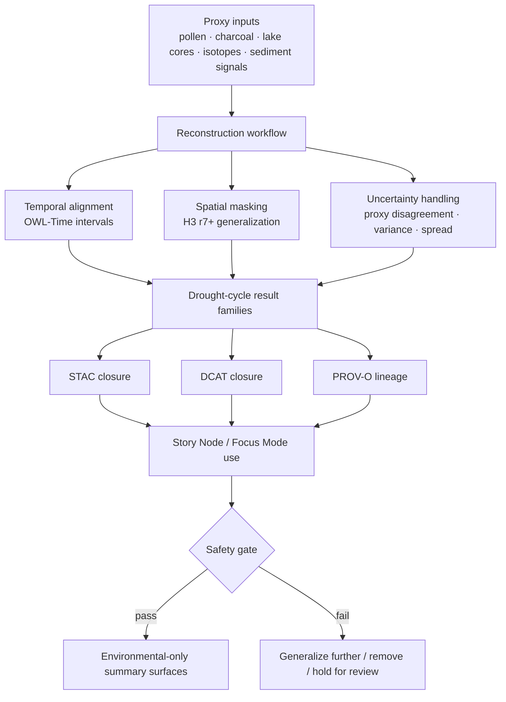

<!-- [KFM_META_BLOCK_V2]
doc_id: kfm://doc/NEEDS-VERIFICATION
title: Paleoenvironmental Results — Drought Cycles
type: standard
version: v1
status: review
owners: Paleoenvironment WG · FAIR+CARE Council
created: YYYY-MM-DD
updated: YYYY-MM-DD
policy_label: restricted
related: [../README.md, ../climate/README.md, ../seasonality/README.md, ../predictive/README.md, ../provenance/README.md, ../uncertainty/README.md]
tags: [kfm, archaeology, paleoenvironment, drought-cycles]
notes: [Built upward from the attached drought-cycles baseline and adjacent paleoenvironment drafts; exact mounted repo inventory, final kfm://doc UUID, and in-tree schema/workflow verification remain NEEDS VERIFICATION.]
[/KFM_META_BLOCK_V2] -->

# Paleoenvironmental Results — Drought Cycles

Generalized, sovereignty-safe drought-cycle result registry for Kansas Frontier Matrix paleoenvironmental analysis.

> [!NOTE]
> **Status:** stable  
> **Owners:** Paleoenvironment WG · FAIR+CARE Council  
>      
> **Quick jumps:** [Scope](#scope) · [Repo fit](#repo-fit) · [Accepted inputs](#accepted-inputs) · [Exclusions](#exclusions) · [Directory tree](#directory-tree) · [Quickstart](#quickstart) · [Usage](#usage) · [Diagram](#diagram) · [Registries](#drought-cycle-result-families) · [Definition of done](#task-list--definition-of-done) · [FAQ](#faq)  
> **Repo fit:** `docs/analyses/archaeology/results/paleoenvironment/drought-cycles/README.md` → upstream: [`../README.md`](../README.md) · adjacent lanes: [`../climate/README.md`](../climate/README.md), [`../seasonality/README.md`](../seasonality/README.md), [`../predictive/README.md`](../predictive/README.md), [`../provenance/README.md`](../provenance/README.md), [`../uncertainty/README.md`](../uncertainty/README.md)

> [!IMPORTANT]
> This lane is for **environmental drought-cycle reconstruction only**. It should document generalized moisture-deficit patterns, proxy-driven recurrence, uncertainty, and lineage. It is **not** the place for cultural chronology, settlement causation, tribal-history inference, or fine-grained paleo-location claims.

> [!WARNING]
> Current-session workspace evidence is document-heavy and **repo-light**. This README is built upward from the attached drought-cycle baseline and adjacent paleoenvironment drafts, but direct verification of the mounted repository tree, schema files, workflow YAML, tests, and exact subdirectory inventory remains **NEEDS VERIFICATION**.

## Scope

This directory documents the **generalized paleo-drought cycle reconstructions** used in KFM’s archaeology-facing paleoenvironment lane.

Within this lane, drought-cycle results are expected to stay:

- environmental in meaning
- generalized in space and time
- explicit about uncertainty
- linked to provenance and review state
- safe for Story Node and Focus Mode use only when they remain non-cultural

The working center of gravity is broad, long-horizon hydroclimatic variability: drought frequency, duration, severity, proxy disagreement, and drought–recovery patterning across centuries or millennia.

### Local truth posture

| Label | Use in this README |
| --- | --- |
| **CONFIRMED** | Directly supported by the attached drought-cycle draft or adjacent paleoenvironment drafts |
| **INFERRED** | Structural completion that matches the surrounding paleoenvironment lane pattern |
| **PROPOSED** | Recommended maintenance behavior, review gate, or file convention not directly proven in-tree |
| **UNKNOWN** | Not verified strongly enough in the current session |
| **NEEDS VERIFICATION** | A visible follow-up flag for repo inventory, schema presence, ownership finalization, or workflow enforcement |

[Back to top](#paleoenvironmental-results--drought-cycles)

## Repo fit

| Path | Role | Relationship |
| --- | --- | --- |
| `docs/analyses/archaeology/results/paleoenvironment/README.md` | paleoenvironment results root | parent lane for environmental result families |
| `docs/analyses/archaeology/results/paleoenvironment/drought-cycles/README.md` | this file | drought-cycle registry and routing surface |
| `docs/analyses/archaeology/results/paleoenvironment/climate/README.md` | adjacent sibling lane | broader paleoclimate context; drought sits narrower than full climate reconstruction |
| `docs/analyses/archaeology/results/paleoenvironment/seasonality/README.md` | adjacent sibling lane | seasonal rhythm and timing context that can intersect with drought interpretation |
| `docs/analyses/archaeology/results/paleoenvironment/predictive/README.md` | adjacent sibling lane | forecast- or model-oriented environmental projections, kept separate from result registry |
| `docs/analyses/archaeology/results/paleoenvironment/provenance/README.md` | adjacent sibling lane | authoritative lineage, masking, and reconstruction-chain detail |
| `docs/analyses/archaeology/results/paleoenvironment/uncertainty/README.md` | adjacent sibling lane | uncertainty-specific registry for proxy disagreement and reconstruction spread |

### Current verification snapshot

| Item | Verified state | Notes |
| --- | --- | --- |
| Target file path | **CONFIRMED** | Exact path and purpose are named in the attached drought-cycle baseline |
| Drought-cycle lane purpose | **CONFIRMED** | Environmental-only, generalized, sovereignty-safe framing is explicit |
| Adjacent paleoenvironment sibling paths | **CONFIRMED in source drafts** | Mounted repo presence of every sibling file is still **NEEDS VERIFICATION** |
| JSON Schema / SHACL path strings | **CONFIRMED in source draft metadata** | Actual in-tree file presence is **NEEDS VERIFICATION** |
| Mounted repo tree, workflows, tests, schemas | **UNKNOWN** | Current session did not directly expose them |

## Accepted inputs

This directory is the right home for material that is primarily about **generalized drought-cycle results**, such as:

- multi-proxy drought-frequency envelopes
- generalized drought-severity indicators
- drought-duration windows built from sediment, isotope, charcoal, pollen, or related proxy families
- OWL-Time-aligned drought sequence summaries
- uncertainty and proxy-disagreement summaries specific to drought-cycle outputs
- STAC, DCAT, and PROV-linked metadata for drought-cycle assets
- Focus Mode-safe environmental summaries that stay strictly non-cultural
- redaction, masking, and lineage notes that are specific to drought-cycle products

## Exclusions

Do **not** place the following here:

- broad paleoclimate summaries that belong in [`../climate/README.md`](../climate/README.md)
- seasonality-specific reconstructions better routed to [`../seasonality/README.md`](../seasonality/README.md)
- predictive or scenario-oriented outputs that belong in [`../predictive/README.md`](../predictive/README.md)
- full provenance bundles or cross-lane lineage registries that belong in [`../provenance/README.md`](../provenance/README.md)
- uncertainty doctrine or cross-cutting uncertainty registries that belong in [`../uncertainty/README.md`](../uncertainty/README.md)
- any cultural chronology, identity inference, migration narrative, settlement-causation claim, or tribal-history linkage
- exact or sub-H3 paleo-event localization
- speculative drought-driven historical storytelling

## Directory tree

The attached drought-cycle baseline indicates the following lane structure:

```text
docs/analyses/archaeology/results/paleoenvironment/drought-cycles/
├── README.md
├── frequency/
├── severity/
├── duration/
├── paleo-drivers/
├── temporal/
├── uncertainty/
├── stac/
├── metadata/
└── provenance/
```

### Tree interpretation

- `frequency/` holds long-horizon drought occurrence and recurrence summaries.
- `severity/` holds generalized intensity indicators.
- `duration/` holds interval-length and persistence windows.
- `paleo-drivers/` holds proxy-side environmental drivers.
- `temporal/` holds OWL-Time sequence structures.
- `uncertainty/` holds disagreement, spread, and confidence material.
- `stac/`, `metadata/`, and `provenance/` hold outward metadata and lineage closure.

> [!NOTE]
> The tree above reflects the attached lane baseline. It should not be read as proof that every directory is already mounted and populated in the current repository view.

[Back to top](#paleoenvironmental-results--drought-cycles)

## Quickstart

When adding or revising a drought-cycle artifact in this lane:

1. Confirm the artifact is **environmental-only** and does not drift into cultural interpretation.
2. Place it in the narrowest sublane that matches its job: `frequency/`, `severity/`, `duration/`, `paleo-drivers/`, `temporal/`, or `uncertainty/`.
3. Record the proxy basis, temporal framing, and masking/generalization assumptions.
4. Add or update STAC/DCAT/PROV references in the drought-cycle metadata surfaces.
5. Make uncertainty explicit; do not bury disagreement or spread in prose.
6. Ensure any Focus Mode or Story Node summary stays generalized, non-cultural, and review-safe.
7. Mark anything not directly verified as **INFERRED**, **UNKNOWN**, or **NEEDS VERIFICATION** rather than smoothing it away.

### Minimal authoring checklist

```md
## Local notes
- CONFIRMED:
- INFERRED:
- PROPOSED:
- UNKNOWN / NEEDS VERIFICATION:

## Metadata closure
- STAC updated:
- DCAT updated:
- PROV linked:
- Redaction / masking logged:
- Focus Mode text reviewed:
```

## Usage

### Add a new drought-cycle result

Use this lane when the output is a **result**, not a raw source and not a predictive forecast. Good fits include:

- a generalized recurrence envelope for multi-century drought episodes
- a proxy-weighted severity layer
- an interval registry for drought duration windows
- a grouped summary of drought–recovery oscillation patterns

### Update metadata and lineage

Any drought-cycle result that changes meaning should carry corresponding updates in:

- `stac/` for outward asset description
- `metadata/` for dataset framing and access posture
- `provenance/` for proxy use, masking, smoothing, and uncertainty lineage

### Write Focus Mode-safe summaries

Use short, inspectable, environmental phrasing.

**Preferred summary shape**

> Multi-proxy paleodrought cycles describe long-term moisture variability without cultural interpretation. All layers are generalized, uncertainty-weighted, and sovereignty-safe.

**Avoid**

- settlement explanations
- identity-based implications
- “this drought caused…” historical claims
- precise event localization
- strong narrative certainty where proxies disagree

## Diagram



## Drought-cycle result families

| Family | What belongs here | Must stay out | Review emphasis |
| --- | --- | --- | --- |
| `frequency/` | multi-century occurrence rates, recurrence windows, oscillation summaries | event-by-event historical storytelling | support semantics and temporal scale |
| `severity/` | proxy-weighted intensity indicators, generalized deficit envelopes, soil-moisture sensitivity summaries | local impact claims, exact drought footprints | proxy basis and confidence framing |
| `duration/` | interval length, persistence windows, sediment- or isotope-derived spans | fine-grained chronology claims | interval definition and smoothing logic |
| `paleo-drivers/` | pollen, charcoal, isotopes, sediment signatures, eco-hydrological correlations | culturally interpreted “drivers” | environmental-only proxy meaning |
| `temporal/` | drought–recovery cycles, OWL-Time interval bundles, hydroclimatic transitions | cultural timelines or occupation sequences | temporal alignment and ambiguity |
| `uncertainty/` | disagreement, variance, spread, confidence envelopes, chip-ready summaries | hidden caveats or one-number certainty theater | visibility of uncertainty at point of use |

### Publication and interpretation rules

| Rule | Why it matters |
| --- | --- |
| Keep every output environmental-only | This lane is explicitly bounded away from cultural inference |
| Use H3 r7+ or equivalent generalized geography | Prevents sensitive paleo-location exposure |
| Treat OWL-Time as operational, not decorative | Drought-cycle interpretation depends on interval logic |
| Show uncertainty explicitly | Proxy disagreement is part of the result, not an appendix |
| Link every outward-facing result to provenance | Reconstruction meaning changes with methods, masking, and smoothing |
| Prefer narrow result pages over shapeless rollups | Keeps review and correction scope manageable |

[Back to top](#paleoenvironmental-results--drought-cycles)

## Metadata, provenance, and surface behavior

### STAC expectations

Drought-cycle STAC material should describe:

- generalized H3 geometry
- temporal extent
- proxy-driver metadata
- uncertainty fields
- environmental-only purpose
- lineage references into PROV-O material

### DCAT expectations

Drought-cycle DCAT material should document:

- dataset purpose
- environmental framing
- access and CARE posture
- temporal coverage
- publication and reuse notes appropriate to the lane

### PROV-O expectations

Drought-cycle provenance should capture at minimum:

- proxy datasets used
- reconstruction methods
- masking and generalization steps
- temporal smoothing
- uncertainty propagation
- rollback / retry / correction lineage where relevant

### Trust-visible surface behavior

If a drought-cycle layer influences a user-facing surface, the surface should show:

- that the content is environmental-only
- that the geography is generalized
- that uncertainty exists and is inspectable
- that the result links back to provenance and metadata closure
- that unsafe or unresolved interpretations are withheld rather than improvised

## Task list / definition of done

- [ ] KFM meta block placeholders are resolved where direct repo evidence exists
- [ ] This README remains drought-cycle scoped and does not absorb broader climate or predictive doctrine
- [ ] Accepted inputs and exclusions are still aligned with adjacent paleoenvironment lanes
- [ ] The directory tree still reflects the mounted lane or is updated with explicit review notes
- [ ] Every result-family section still matches the intended sublane purpose
- [ ] STAC, DCAT, and PROV closure expectations are still accurate for this lane
- [ ] Focus Mode-safe summary language remains environmental-only
- [ ] Uncertainty remains visible in prose and metadata
- [ ] Any cultural-interpretation drift is removed or generalized further
- [ ] New claims about schema files, workflows, enforcement, or in-tree inventory are source-grounded

## FAQ

### Why is this separate from `../climate/README.md`?

Because this lane is narrower than full paleoclimate reconstruction. It is specifically for drought-cycle products and their metadata, uncertainty, and lineage.

### Does this lane allow historical or cultural explanation?

No. This lane is for environmental reconstruction only. If a sentence starts implying identity, settlement chronology, migration, or tribal-history linkage, it is outside scope.

### Why is H3-style masking called out so prominently?

Because the source baseline repeatedly treats generalized geography as part of the safety posture, not as optional presentation polish.

### What should happen when a drought-cycle result depends on a predictive model?

Keep the result here only if it is being published as a drought-cycle result surface. Put the model-oriented detail in [`../predictive/README.md`](../predictive/README.md) and link the lineage through [`../provenance/README.md`](../provenance/README.md).

### Where should redaction and masking detail live?

Summarize the obligation here, but keep the authoritative lineage and masking record in the provenance lane.

### What if the repository does not yet contain every listed subdirectory?

Do not bluff. Update the verification snapshot, keep the lane logic intact, and mark the inventory gap as **NEEDS VERIFICATION**.

[Back to top](#paleoenvironmental-results--drought-cycles)

## Appendix

<details>
<summary><strong>Suggested review prompts</strong></summary>

### Scope prompts

- Is the page still about drought-cycle **results**, not raw sources or predictive modeling?
- Has any section drifted into broader paleoclimate exposition better kept in `../climate/README.md`?
- Has any statement slipped from environmental reconstruction into cultural interpretation?

### Metadata prompts

- Does each outward-facing result still expose time basis, proxy basis, and uncertainty?
- Are STAC/DCAT/PROV references still routed correctly?
- Are masking and generalization obligations visible?

### Surface prompts

- Would a Focus Mode summary from this lane remain safe if quoted on its own?
- Does the reader see uncertainty and environmental framing before interpretation?
- Would a reviewer know where to find lineage and redaction detail?

</details>

<details>
<summary><strong>Minimum per-result notes template</strong></summary>

```md
## <Result name>

**Type:** frequency | severity | duration | paleo-driver | temporal | uncertainty  
**Status:** CONFIRMED | INFERRED | PROPOSED | UNKNOWN | NEEDS VERIFICATION

### Environmental scope
One or two lines on what this result describes without cultural inference.

### Proxy basis
- Proxy families:
- Temporal basis:
- Spatial generalization:
- Smoothing / harmonization notes:

### Uncertainty
- Disagreement:
- Confidence expression:
- Review note:

### Metadata closure
- STAC:
- DCAT:
- PROV:
```

</details>
