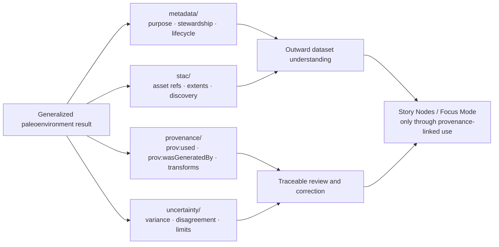

<!-- [KFM_META_BLOCK_V2]
doc_id: kfm://doc/NEEDS-VERIFICATION
title: Paleoenvironment Metadata
type: standard
version: v1
status: draft
owners: Paleoenvironment WG · FAIR+CARE Council (NEEDS VERIFICATION against mounted ownership files)
created: YYYY-MM-DD
updated: YYYY-MM-DD
policy_label: NEEDS VERIFICATION
related: [../README.md, ../stac/, ../provenance/, ../uncertainty/]
tags: [kfm, archaeology, paleoenvironment, metadata, dcat, jsonld, faircare]
notes: [Directory role is evidenced in repo-grounded paleoenvironment documents, but the mounted file inventory, ownership wiring, dates, and exact policy label were not directly verified in the current session.]
[/KFM_META_BLOCK_V2] -->

# Paleoenvironment Metadata

Directory README for the DCAT and JSON-LD metadata lane under `docs/analyses/archaeology/results/paleoenvironment/`.

> [!NOTE]
> **Status:** active lane · draft README refresh  
> **Owners:** `Paleoenvironment WG · FAIR+CARE Council` *(owner wiring NEEDS VERIFICATION)*  
>      
> **Quick jumps:** [Scope](#scope) · [Repo fit](#repo-fit) · [Accepted inputs](#accepted-inputs) · [Exclusions](#exclusions) · [Directory tree](#directory-tree) · [Quickstart](#quickstart) · [Usage](#usage) · [Diagram](#diagram) · [Metadata registry](#metadata-registry) · [Task list](#task-list--definition-of-done) · [FAQ](#faq) · [Appendix](#appendix)  
> **Repo fit:** `docs/analyses/archaeology/results/paleoenvironment/metadata/` → upstream: [`../README.md`](../README.md) · adjacent: [`../stac/`](../stac/), [`../provenance/`](../provenance/), [`../uncertainty/`](../uncertainty/) · downstream: outward dataset metadata, provenance-linked publication context, and evidence-aware archaeology surfaces such as Story Nodes and Focus Mode *(exact emitted filenames NEEDS VERIFICATION)*

> [!IMPORTANT]
> This directory is the **metadata closure lane** for paleoenvironment results. Keep it focused on outward description: dataset purpose, authorship and stewardship, lifecycle stage, temporal extent, spatial generalization notes, FAIR+CARE labels, and reuse or governance descriptors.  
>  
> Do **not** turn this folder into a second STAC catalog, a provenance-bundle dump, or a notebook-run archive.

> [!WARNING]
> Current-session verification was PDF-grounded rather than repo-mounted. The subtree role and adjacent lane names are supported by project materials, but the exact mounted file inventory, schema filenames, CODEOWNERS wiring, and CI commands in this specific directory remain **NEEDS VERIFICATION**.

## Scope

This directory holds the **DCAT / JSON-LD-facing metadata layer** for paleoenvironment result outputs.

Its job is to make a paleoenvironment result set understandable and reviewable **without** duplicating the full asset catalog or the full provenance graph. In KFM terms, this is part of the outward metadata spine: the place where purpose, stewardship, lifecycle, temporal scope, spatial generalization posture, FAIR+CARE framing, and reuse/governance constraints stay visible.

For this subtree, metadata should remain explicitly **environmental-only**. The parent paleoenvironment lane is documented as generalized, uncertainty-aware, and prohibited from inferring cultural identities or exposing restricted Indigenous knowledge. This README preserves that same boundary here.

[Back to top](#paleoenvironment-metadata)

## Repo fit

| Field | Value |
|---|---|
| **Path** | `docs/analyses/archaeology/results/paleoenvironment/metadata/` |
| **Role in repo** | Metadata lane for outward paleoenvironment result description |
| **Upstream doc** | [`../README.md`](../README.md) — root paleoenvironment results index |
| **Adjacent lanes** | [`../stac/`](../stac/) for spatiotemporal asset description · [`../provenance/`](../provenance/) for PROV-O lineage · [`../uncertainty/`](../uncertainty/) for uncertainty-bearing result material |
| **Downstream use** | Dataset discovery, FAIR+CARE review, governance-aware release packaging, provenance-linked Story Node / Focus Mode referencing |
| **Trust posture** | Metadata here should support admissibility and outward interpretation; it should not silently replace source, STAC, or provenance truth |

### Working boundary

This folder exists to answer questions like:

- What is this paleoenvironment dataset for?
- Who stewards it?
- What lifecycle stage is it in?
- What temporal scope does it claim?
- How was spatial generalization handled at a metadata level?
- What FAIR+CARE or reuse constraints matter before use?

This folder is **not** the primary home for:

- full STAC Items or Collections
- full PROV bundles
- raw proxy inventory
- notebook execution state
- cultural interpretation
- precise sensitive geography

[Back to top](#paleoenvironment-metadata)

## Accepted inputs

This directory accepts concise, reviewable metadata derived from paleoenvironment result outputs, including:

- dataset purpose and environmental framing
- authorship, stewardship, and review body references
- lifecycle stage, stability, TTL, or supersession notes
- DCAT temporal extent and other outward time descriptors
- spatial generalization metadata
- FAIR+CARE labels and governance descriptors
- reuse constraints, publication posture, and license notes
- references to sibling STAC and provenance materials
- machine-readable JSON-LD or equivalent metadata descriptors when they are part of the lane

## Exclusions

This directory is **not** the home for:

- raw proxy datasets such as pollen, charcoal, isotopes, or sediment-source detail
- full notebook-run evidence
- full `prov:used` / `prov:wasGeneratedBy` chain bundles
- STAC Item or Collection payloads that belong in `../stac/`
- quantitative uncertainty rasters or disagreement surfaces that belong in `../uncertainty/`
- cultural, identity-based, or group-linked interpretation
- precise restricted locations, sovereignty-sensitive coordinates, or redaction-bypassing detail
- speculative environmental narratives not backed by result packages

## Directory tree

Verified parent context from repo-grounded paleoenvironment materials:

```text
docs/analyses/archaeology/results/paleoenvironment/
├── README.md
├── climate/
├── paleohydrology/
├── vegetation/
├── seasonality/
├── drought-cycles/
├── predictive/
├── uncertainty/
├── stac/
├── metadata/
│   └── README.md
└── provenance/
```

> [!TIP]
> The tree above is the **conservative verified snapshot** for this lane family.  
>  
> Additional files inside `metadata/` may exist, but they were not directly enumerated from a mounted checkout in the current session.

## Quickstart

### Minimal authoring flow

1. Start from a **generalized, reviewable paleoenvironment result** rather than a raw notebook or proxy source.
2. Record the dataset’s **purpose**, **stewardship**, **lifecycle stage**, and **environmental-only framing**.
3. Add the outward **temporal extent**, **spatial generalization note**, and **FAIR+CARE / reuse descriptors**.
4. Link to sibling **STAC** and **PROV-O** materials instead of duplicating them.
5. Mark anything not directly verified as **NEEDS VERIFICATION** rather than smoothing it into confident prose.
6. Run the local or CI validation path once the actual repo commands are verified.

### Illustrative minimum metadata skeleton

```json
{
  "title": "NEEDS VERIFICATION",
  "description": "Generalized paleoenvironment result dataset for Kansas Frontier Matrix.",
  "creator": "Paleoenvironment WG",
  "steward": "FAIR+CARE Council",
  "lifecycle_stage": "NEEDS VERIFICATION",
  "temporal_extent": "NEEDS VERIFICATION",
  "spatial_generalization": "NEEDS VERIFICATION",
  "faircare_statement": "Environmental-only; sovereignty-aware; no cultural inference.",
  "license": "CC-BY 4.0",
  "stac_ref": "../stac/",
  "prov_ref": "../provenance/",
  "uncertainty_ref": "../uncertainty/"
}
```

> [!NOTE]
> The skeleton above is **illustrative**.  
>  
> Use the mounted repo’s actual JSON-LD / DCAT field names once they are directly verified.

## Usage

### What this lane owns

Metadata in this folder should make a result set legible from the outside. That normally includes:

- what the dataset is
- why it exists
- who stewards it
- what temporal span it covers
- what its lifecycle state is
- what generalization / masking posture applies
- what FAIR+CARE and reuse conditions attach to it

### What this lane should point to, not duplicate

| Concern | Keep here? | Route to |
|---|---|---|
| Dataset purpose | Yes | `metadata/` |
| Authorship / stewardship | Yes | `metadata/` |
| Lifecycle stage / sunset / supersession note | Yes | `metadata/` |
| Temporal extent | Yes | `metadata/` |
| Spatial generalization note | Yes | `metadata/` |
| FAIR+CARE labels | Yes | `metadata/` |
| Asset HREFs and STAC roles | Usually no | `../stac/` |
| Full provenance graph | No | `../provenance/` |
| Notebook-run hashes and rollback lineage | No | `../provenance/` |
| Uncertainty surfaces and disagreement products | No | `../uncertainty/` |
| Cultural interpretation | No | Nowhere in this lane |

### Environmental-only framing rule

Keep this lane aligned with the parent paleoenvironment subtree:

- describe **environmental context**
- preserve **generalization**
- surface **uncertainty**
- avoid **cultural inference**
- avoid **identity linkage**
- avoid **restricted location exposure**

If a metadata record drifts into cultural interpretation, exact proxy-site disclosure, or reconstructed human behavior claims, it no longer belongs here in its current form.

### Metadata as operational, not decorative

KFM doctrine treats metadata as part of the trust system. In practice, that means metadata here should help a downstream reader understand:

- support
- time basis
- rights posture
- provenance linkage
- review posture
- whether the record is fit for outward use

This lane should therefore stay concise, machine-friendly, and explicit about uncertainty.

[Back to top](#paleoenvironment-metadata)

## Diagram



## Metadata registry

### Minimum field families for this lane

| Field family | Why it belongs here | Minimum expectation | Current grounding |
|---|---|---|---|
| **Purpose** | Keeps the dataset environmental-only and legible | concise dataset purpose + non-cultural framing | **CONFIRMED** |
| **Authorship / stewardship** | Makes accountability visible | author, steward, or review body | **CONFIRMED** |
| **Lifecycle** | Shows whether a result is active, stable, draft, or superseded | lifecycle stage + review or sunset note | **CONFIRMED** |
| **Temporal extent** | Supports outward time interpretation | period covered or time-basis statement | **CONFIRMED** |
| **Spatial generalization** | Preserves safe publication posture | masking/generalization note | **CONFIRMED** |
| **FAIR+CARE descriptors** | Carries rights, ethics, and sensitivity context | FAIR+CARE labels / governance statement | **CONFIRMED** |
| **Reuse / governance descriptors** | Prevents misuse by omission | reuse, publication, or governance note | **CONFIRMED** |
| **Cross-links** | Avoids duplicate truth objects | refs to sibling STAC / PROV / uncertainty lanes | **INFERRED** |
| **Exact field names / schema payload** | Needed for machine validation | mounted schema or example file | **NEEDS VERIFICATION** |

### Recommended writing stance

Use these labels when precision matters:

- **CONFIRMED** — supported by mounted repo evidence or reviewed artifact
- **INFERRED** — strongly implied by adjacent repo-grounded material
- **PROPOSED** — recommended structure not yet proven in implementation
- **UNKNOWN** — not verified in the current session
- **NEEDS VERIFICATION** — reviewer action required before treating as settled

## Task list / definition of done

- [ ] KFM meta block placeholders are replaced or consciously retained with review notes.
- [ ] Owners are verified against mounted ownership files.
- [ ] The lane’s actual emitted metadata files are directly inspected.
- [ ] Dataset purpose, authorship/stewardship, lifecycle stage, and FAIR+CARE statements are visible.
- [ ] Temporal extent and spatial generalization metadata are present where applicable.
- [ ] Links to sibling `stac/`, `provenance/`, and `uncertainty/` materials resolve.
- [ ] No metadata entry introduces cultural inference or restricted location detail.
- [ ] Validation commands and CI gates are either verified or explicitly marked TBD.
- [ ] Any illustrative payloads remain clearly labeled until backed by mounted schemas/examples.

A metadata-lane update is complete when the folder helps a reviewer understand **what the dataset is, how it may be used, and what it must not be mistaken for**—without forcing them to reverse-engineer that meaning from STAC assets or provenance bundles alone.

## FAQ

### Why keep `metadata/` separate from `provenance/`?

Because they do different jobs. Metadata helps a reader understand the outward dataset description quickly. Provenance records the deeper lineage, transforms, and process history. Keeping them separate prevents outward descriptors from becoming noisy while preserving a full audit trail elsewhere.

### Should this folder store STAC Items too?

Prefer no. The parent subtree already distinguishes `stac/` from `metadata/`. Keep asset- and item-centric records in `../stac/`, then link to them from here.

### What if a result is too sensitive for outward metadata?

Generalize further, narrow the record, or withhold it. Do not let metadata become a side channel for restricted coordinates, cultural implications, or sovereignty-sensitive detail.

### Can metadata mention settlement tendencies?

Only at the same high-level environmental-support level already established by the parent subtree. Do not turn this lane into a place for new chronology claims, cultural identity claims, or speculative human-behavior inference.

### What should happen if metadata and provenance disagree?

Treat that as a correction problem, not a wording tweak. Reconcile the linked records through the governed review path and preserve visible lineage rather than silently rewriting history.

[Back to top](#paleoenvironment-metadata)

## Appendix

<details>
<summary><strong>Illustrative route-by-artifact checklist</strong></summary>

| Artifact or concern | Best home |
|---|---|
| Dataset purpose | `metadata/` |
| Authorship / stewardship | `metadata/` |
| FAIR+CARE statement | `metadata/` |
| Temporal extent | `metadata/` |
| Spatial generalization note | `metadata/` |
| Asset roles / hrefs / item extents | `stac/` |
| `prov:used` / `prov:wasGeneratedBy` chain | `provenance/` |
| Notebook run checkpoints / rollback lineage | `provenance/` |
| Uncertainty rasters / disagreement surfaces | `uncertainty/` |
| Environmental-only narrative use | parent `README.md` + provenance-linked consumption |

</details>

<details>
<summary><strong>Illustrative metadata review prompts</strong></summary>

1. Does the record stay environmental-only?
2. Does it disclose lifecycle and review posture?
3. Does it name stewardship without overclaiming current ownership wiring?
4. Does it expose temporal extent and generalization clearly enough for a reviewer?
5. Does it link outward to STAC and provenance rather than duplicating them?
6. Could anything here be misread as cultural attribution, identity inference, or precise sensitive geography?
7. Are unverified values marked instead of smoothed?

</details>

[Back to top](#paleoenvironment-metadata)
