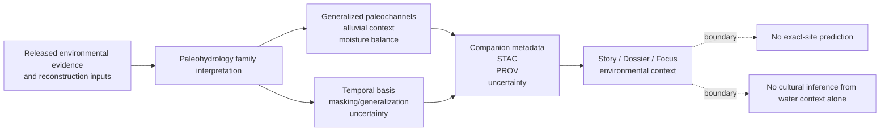

<!-- [KFM_META_BLOCK_V2]
doc_id: kfm://doc/<NEEDS_VERIFICATION>
title: Kansas Frontier Matrix — Paleoenvironmental Results: Paleohydrology
type: standard
version: v1
status: review
owners: Paleoenvironment WG · FAIR+CARE Council
created: YYYY-MM-DD
updated: YYYY-MM-DD
policy_label: restricted
related: [docs/analyses/archaeology/results/README.md, docs/analyses/archaeology/results/paleoenvironment/README.md, docs/analyses/archaeology/results/paleoenvironment/provenance/, docs/analyses/archaeology/results/paleoenvironment/uncertainty/]
tags: [kfm, archaeology, paleoenvironment, paleohydrology]
notes: [doc_id and dates need repo verification; checked-in target README was placeholder in the inspected GitHub-visible snapshot]
[/KFM_META_BLOCK_V2] -->

# Kansas Frontier Matrix — Paleoenvironmental Results: Paleohydrology

Generalized paleo-hydrology and moisture-balance result family for archaeology-facing environmental context in KFM.


| Field | Value |
| --- | --- |
| Status | `review` |
| Owners | `Paleoenvironment WG · FAIR+CARE Council` |
| Policy label | `restricted` · CARE-governed |
| Repo fit | `docs/analyses/archaeology/results/paleoenvironment/paleohydrology/README.md` |
| Upstream | [`../README.md`](../README.md) · [`../../README.md`](../../README.md) |
| Downstream / companions | [`../stac/`](../stac/) · [`../metadata/`](../metadata/) · [`../provenance/`](../provenance/) · [`../uncertainty/`](../uncertainty/) |

**Quick jumps:** [Scope](#scope) · [Repo fit](#repo-fit) · [Accepted inputs](#accepted-inputs) · [Exclusions](#exclusions) · [Directory tree](#directory-tree) · [Quickstart](#quickstart) · [Usage](#usage) · [Diagram](#diagram) · [Reference tables](#reference-tables) · [Task list](#task-list) · [FAQ](#faq) · [Appendix](#appendix)

> [!IMPORTANT]
> This lane is for generalized paleohydrology and moisture-balance results used as archaeology-facing environmental context. It is **not** a release lane for raw proxy captures, exact-site disclosure, or cultural inference.

> [!WARNING]
> The currently inspected repo snapshot confirms this family path and its parent routing, but does **not** confirm a richer checked-in child inventory beneath `paleohydrology/` beyond this README. Keep any unverified starter structure visibly marked.

## Scope

This README defines what **belongs** in the paleohydrology family, what must be **routed elsewhere**, and what kinds of claims this lane must **refuse**.

Within KFM’s archaeology results tree, paleohydrology is the place for **deep-time water-context interpretation**: generalized paleochannels, alluvial and floodplain context, moisture-balance summaries, and other hydrology-linked environmental results that help frame archaeological landscapes without turning water proximity into deterministic settlement proof.

### Local truth posture

- **CONFIRMED**
  - This family exists as `paleohydrology/` under the checked-in paleoenvironment results tree.
  - The parent paleoenvironment README already describes it as **paleo-hydrology and moisture-balance context**.
  - The parent family registry already sets the key interpretation boundary: **no exact-site prediction from river or water context alone**.
- **INFERRED**
  - A stronger child-family README should route users toward sibling release companions such as uncertainty, provenance, metadata, and STAC surfaces when those are relevant.
  - This family should remain environmental-first and archaeology-facing, not a substitute for source onboarding or predictive modeling lanes.
- **NEEDS VERIFICATION**
  - Exact created/updated dates for this file.
  - Whether this family has any checked-in leaves beneath `paleohydrology/` beyond this README.
  - Family-specific CI commands, contracts, and fixtures.

_Back to top: [top](#kansas-frontier-matrix--paleoenvironmental-results-paleohydrology)_

## Repo fit

This file is the **family README** for paleohydrology within the archaeology paleoenvironment results subtree.

- **Path:** `docs/analyses/archaeology/results/paleoenvironment/paleohydrology/README.md`
- **Immediate upstream context:** [`../README.md`](../README.md)
- **Broader archaeology results context:** [`../../README.md`](../../README.md)
- **Companion release surfaces:** [`../stac/`](../stac/), [`../metadata/`](../metadata/), [`../provenance/`](../provenance/), [`../uncertainty/`](../uncertainty/)
- **Adjacent result families:** [`../climate/`](../climate/), [`../seasonality/`](../seasonality/), [`../drought-cycles/`](../drought-cycles/), [`../vegetation/`](../vegetation/), [`../predictive/`](../predictive/)

Use this README when you need to answer four questions quickly:

1. Does this material really belong in **paleohydrology**?
2. What can this family safely say in a **public or reviewer-facing** result?
3. What must be routed into **companion metadata, provenance, or uncertainty** lanes?
4. What kinds of wording would overreach into **site prediction, cultural inference, or unsupported precision**?

## Accepted inputs

Accepted inputs here are **released, generalized result objects or family-level interpretation notes**—not raw source-edge captures.

| Accepted input or result type | Why it belongs here | Minimum framing required |
| --- | --- | --- |
| Generalized paleochannel interpretation | Water-course context is central to paleohydrology | Time basis, support, uncertainty, no site-level inference |
| Alluvial or floodplain generalization | Conveys depositional and water-context setting | Scale, masking/generalization, interpretation boundary |
| Moisture-balance or wetness context summaries | Adds hydroclimatic context across time slices | Environmental-only wording, uncertainty visibility |
| Family-level hydrology summaries for Story / Dossier / Focus | Gives users a routable environmental explanation layer | Evidence-linked language, provenance route, no deterministic archaeology claims |
| Cross-links to companion uncertainty / provenance / metadata notes | Prevents false precision and orphaned interpretation | Explicit routing to sibling lanes |

### What “accepted” means here

Accepted does **not** mean “anything about water.”

It means the material is all of the following:

- archaeology-facing
- environmental in meaning
- generalized in spatial support
- bounded by uncertainty
- fit for a **results** lane rather than a source-intake lane

## Exclusions

| Excluded material | Where it goes instead |
| --- | --- |
| Raw proxy/source-edge captures, sample logs, lab extracts, or unprocessed source pulls | Upstream dataset or source-onboarding lane, not this results family |
| Predictive hydrology surfaces, scenario outputs, or forecast-style products | [`../predictive/`](../predictive/) |
| Standalone provenance bundles, lineage graphs, or method-only transform logs | [`../provenance/`](../provenance/) |
| Standalone STAC/DCAT distribution records | [`../stac/`](../stac/) and [`../metadata/`](../metadata/) |
| Uncertainty-only artifacts without family explanation | [`../uncertainty/`](../uncertainty/) |
| Exact-site water-access arguments, sensitive location reconstruction, cultural identity linkage, or deterministic settlement claims | Do **not** publish in this family; require separate steward-reviewed handling |

> [!CAUTION]
> “Near water” is **not** enough to support a site claim, ownership claim, chronology claim, or cultural behavior claim. This family can describe **environmental affordances and constraints** only at the generalized level supported by released evidence.

## Directory tree

```text
docs/analyses/archaeology/results/paleoenvironment/
├── README.md
├── climate/
├── drought-cycles/
├── metadata/
├── paleohydrology/
│   └── README.md
├── predictive/
├── provenance/
├── seasonality/
├── stac/
├── uncertainty/
└── vegetation/
```

**Local note:** in the inspected GitHub-visible snapshot, only `README.md` is confirmed inside `paleohydrology/` at this level.

_Back to top: [top](#kansas-frontier-matrix--paleoenvironmental-results-paleohydrology)_

## Quickstart

### Add or revise a paleohydrology result safely

1. Confirm the material is a **released, generalized paleohydrology result** and not raw source intake.
2. State the **time basis**, **spatial support**, and **interpretation boundary**.
3. Make **uncertainty** and **lineage** visible through sibling companion lanes when needed.
4. Strip any wording that implies **exact-site prediction**, **identity linkage**, or **cultural causation** from water context alone.
5. Update this family README if the checked-in inventory or routing rules materially change.

### Copy/paste review stub

```yaml
truth_posture:
  confirmed:
    - family routing matches ../README.md
    - target path exists in the checked-in archaeology paleoenvironment tree
  inferred:
    - companion links needed for provenance, metadata, and uncertainty
  needs_verification:
    - exact created/updated dates
    - child inventory below paleohydrology/
release_checks:
  - generalized spatial support stated
  - temporal basis stated
  - uncertainty visible
  - provenance route visible
  - no exact-site prediction
  - no cultural inference from water context alone
```

## Usage

### For maintainers

Use this README to keep the lane narrow, legible, and consistent with the parent paleoenvironment registry.

Prefer:

- “generalized paleochannel context”
- “moisture-balance interpretation”
- “alluvial setting”
- “hydrology-linked environmental transition”
- “uncertainty-bearing water-context result”

Avoid:

- “this site was chosen because it was near water”
- “hydrology proves settlement”
- “water access identifies group identity”
- “precise paleochannel location implies exact occupation”
- “river context alone predicts archaeological occurrence”

### For reviewers

Before merge or release, confirm that the result:

- stays environmental in meaning
- keeps uncertainty visible
- does not flatten modern hydrology and paleohydrology into one undifferentiated claim
- routes machine-readable release surfaces to the right companion lane
- does not smuggle in exact-site or culturally sensitive implications

### For Story, Dossier, and Focus authors

This family supports **environmental background** and **water-context explanation**.

It should be used to answer questions like:

- What broad water-setting or moisture context framed the landscape?
- How might floodplain or alluvial conditions have changed over time?
- What uncertainty remains in the hydrology interpretation?

It should **not** be used as a sovereign explanation layer for cultural behavior.

> [!TIP]
> In user-facing prose, prefer “supports,” “is consistent with,” “suggests generalized context,” and “remains uncertain” over deterministic verbs such as “proves,” “shows exactly,” or “locates.”

## Diagram



_Back to top: [top](#kansas-frontier-matrix--paleoenvironmental-results-paleohydrology)_

## Reference tables

### Family result matrix

| Result cue | What it can safely contribute | What it must not imply |
| --- | --- | --- |
| Paleochannels | Broad water-course history or corridor context | Exact site placement, exact occupation path, identity linkage |
| Alluvial / floodplain generalization | Depositional and moisture setting | Parcel-like boundaries, deterministic archaeological suitability |
| Moisture-balance summary | Wetness / dryness context across time | Exact household-scale water budgeting or precise local hydrology |
| Hydrology summary for Story / Focus | Environmental background and water-context explanation | Sovereign archaeological conclusion without other evidence |
| Comparative water-context note | Carefully framed comparison across periods or surfaces | Collapse of modern observation into unqualified paleohydrology fact |

### Companion matrix

| Companion lane | What it should carry | When to route there |
| --- | --- | --- |
| [`../uncertainty/`](../uncertainty/) | disagreement, confidence, variance, support gaps | when the hydrology claim needs visible uncertainty objects |
| [`../provenance/`](../provenance/) | lineage, transform history, masking and generalization notes | when method and causality must be inspectable |
| [`../stac/`](../stac/) | asset-level discoverability and release pointers | when a machine-readable spatial asset is being published |
| [`../metadata/`](../metadata/) | DCAT / JSON-LD style distribution and catalog context | when release packaging needs formal catalog descriptors |
| [`../predictive/`](../predictive/) | modeled or scenario-style hydrology outputs | when the result is predictive rather than interpretive / descriptive |

### Interpretation boundary cues

| Cue | Use it when | Avoid it when |
| --- | --- | --- |
| “generalized” | scale is broad or intentionally masked | you are tempted to imply exactness |
| “environment-only” | result should stay non-cultural | prose starts drifting toward behavior or identity |
| “uncertainty-bearing” | proxy disagreement or model spread matters | you are compressing caveats out of the result |
| “supports context” | the result is one line of evidence | you are turning it into a singular explanation |

## Task list

- [ ] Keep this family README aligned with the parent paleoenvironment registry.
- [ ] Keep environmental-only framing explicit.
- [ ] Keep uncertainty and provenance routing visible.
- [ ] Route predictive hydrology to [`../predictive/`](../predictive/), not here.
- [ ] Remove exact-site, identity, or cultural-inference language before merge.
- [ ] Verify unresolved metadata placeholders before commit.

### Definition of done

A paleohydrology family update is ready when:

1. the lane’s scope is still archaeology-facing and environmental-only
2. the interpretation boundary is visible
3. companion routing is clear
4. uncertainty is not hidden
5. the README does not imply a deeper checked-in inventory than the repo actually shows

## FAQ

### Why `paleohydrology/` and not just `hydrology/`?

Because this lane is nested inside **archaeology paleoenvironment results**, not the broader KFM hydrology operating lane. The name keeps the family tied to deep-time environmental interpretation rather than to contemporary operational hydrology.

### Can river or spring proximity be used here as archaeological proof?

No. Water context can support a **generalized environmental reading**, but it must not become exact-site prediction or a shortcut to cultural explanation.

### Where should predictive hydrology go?

Route it to [`../predictive/`](../predictive/) and keep the distinction visible. This family is for released interpretive/descriptive paleohydrology results, not forecast- or scenario-style outputs.

### Do we need child folders under `paleohydrology/` before this README is useful?

No. This README can still function as the routing and boundary document even if the family currently contains only `README.md`.

### Can this family point to machine-readable release artifacts?

Yes, but the machine-readable surfaces should route to sibling companion lanes such as [`../stac/`](../stac/), [`../metadata/`](../metadata/), [`../provenance/`](../provenance/), and [`../uncertainty/`](../uncertainty/).

_Back to top: [top](#kansas-frontier-matrix--paleoenvironmental-results-paleohydrology)_

## Appendix

<details>
<summary><strong>Working glossary for this family</strong></summary>

<br />

| Term | Working meaning in this lane |
| --- | --- |
| Paleohydrology | Deep-time water-regime, channel, and moisture-context interpretation used as environmental background |
| Moisture balance | Generalized relationship of water input, retention, and environmental wetness/dryness—not a site-specific operational budget |
| Alluvial generalization | Broad depositional or floodplain framing, not parcel-precision mapping |
| Paleochannel | Reconstructed or interpreted former channel path/corridor, not an exact-site locator |
| Environmental-only context | Context that stays out of cultural identity, ownership, chronology, and deterministic behavior claims |

</details>

<details>
<summary><strong>Illustrative starter shape — not confirmed checked-in inventory</strong></summary>

<br />

The following is a **starter shape example only**. It is useful for planning, but it should not be read as a confirmed checked-in local inventory.

```text
docs/analyses/archaeology/results/paleoenvironment/paleohydrology/
├── README.md
├── paleochannels/
├── alluvial/
├── moisture-balance/
├── time-slices/
└── methods/
```

If the repo later adopts a richer child structure, update this README to replace this example with verified paths.

</details>

<details>
<summary><strong>Naming seam to preserve</strong></summary>

<br />

Keep the current family name **`paleohydrology/`** here unless the repo later standardizes a different term across the archaeology subtree. If predictive materials continue to use a child label like **`hydrology/`** beneath [`../predictive/`](../predictive/), preserve that seam instead of flattening the two lanes into one.

</details>

---

[Back to top](#kansas-frontier-matrix--paleoenvironmental-results-paleohydrology)
