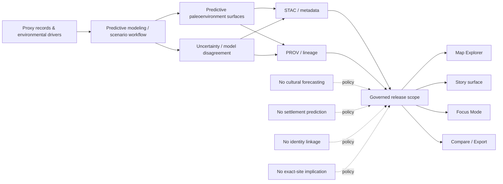

<!-- [KFM_META_BLOCK_V2]
doc_id: kfm://doc/NEEDS-VERIFICATION
title: Kansas Frontier Matrix — Paleoenvironmental Results: Predictive Models
type: standard
version: v1
status: review
owners: NEEDS VERIFICATION
created: YYYY-MM-DD
updated: YYYY-MM-DD
policy_label: restricted
related: [../README.md, ../../README.md, ../stac/README.md, ../metadata/README.md, ../provenance/README.md]
tags: [kfm, archaeology, paleoenvironment, predictive, care-governed]
notes: [Replace placeholders after mounted-repo verification. Current verified snapshot shows this directory but does not yet verify predictive child leaves, schema refs, or owner metadata.]
[/KFM_META_BLOCK_V2] -->

<a id="top"></a>

# Kansas Frontier Matrix — Paleoenvironmental Results: Predictive Models

Govern the predictive paleoenvironment lane for generalized, environmental-only model outputs used as archaeology-facing context inside KFM.

> [!NOTE]
> **Status:** review  
> **Owners:** NEEDS VERIFICATION *(attached family drafts point to Paleoenvironment WG · Predictive Modeling WG · FAIR+CARE Council)*  
> **Repo fit:** `docs/analyses/archaeology/results/paleoenvironment/predictive/README.md` → upstream: [Paleoenvironment results](../README.md) · archaeology hub: [Archaeology results](../../README.md) · adjacent companions: [Metadata](../metadata/README.md) · [STAC](../stac/README.md) · [Provenance](../provenance/README.md) · **Downstream:** none confirmed in the current verified snapshot  
>       
> **Quick jump:** [Scope](#scope) · [Repo fit](#repo-fit) · [Accepted inputs](#accepted-inputs) · [Exclusions](#exclusions) · [Directory tree](#directory-tree) · [Quickstart](#quickstart) · [Usage](#usage) · [Diagram](#diagram) · [Tables](#tables) · [Task list](#task-list) · [FAQ](#faq) · [Appendix](#appendix)  
> **Status vocabulary used here:** **CONFIRMED** · **INFERRED** · **PROPOSED** · **NEEDS VERIFICATION**

> [!IMPORTANT]
> Predictive materials in this lane must remain **modeled**, **environmental-only**, **generalized**, and **uncertainty-bearing**. They must never imply cultural forecasting, settlement prediction, identity linkage, migration inference, or exact-site reconstruction.

> [!WARNING]
> The current verified snapshot confirms this directory and its `README.md`, but it does **not** verify predictive child subfolders, schema/SHACL/telemetry refs, or mounted ownership metadata. Any deeper structure shown below is a starter shape, not settled repo fact.

## Scope

This directory is the family README for KFM’s **predictive paleoenvironment** lane inside archaeology-facing results. It should explain how predictive climate, paleohydrology, vegetation, soils/moisture, drought-cycle, and temporal scenario outputs can be described and released as **environmental context** without quietly becoming cultural explanation.

It exists to keep four burdens visible at once:

1. the output is **modeled**, not raw observation
2. the result is **environmental-only**
3. uncertainty, masking, and generalization remain inspectable
4. metadata and provenance stay attached at the same release scope as the predictive surface

### Truth posture used here

| Area | Status | How this README treats it |
| --- | --- | --- |
| The path `docs/analyses/archaeology/results/paleoenvironment/predictive/README.md` exists in the current verified snapshot | **CONFIRMED** | This README is replacing a placeholder, not inventing a new lane |
| `predictive/` is routed from the parent paleoenvironment README as a distinct result family | **CONFIRMED** | The family belongs in the archaeology-facing paleoenvironment results subtree |
| Predictive outputs must remain environmental-only and must not drift into cultural implication | **CONFIRMED** | This is a hard boundary carried by the parent README and attached predictive family drafts |
| The predictive lane should likely grow child starter leaves such as climate, hydrology/paleohydrology, vegetation, soils, temporal, uncertainty, and release companions | **PROPOSED** | Attached family drafts name this structure, but the current verified snapshot does not yet prove it beneath `predictive/` |
| Exact owners, dates, canonical IDs, schema refs, SHACL refs, and telemetry refs | **NEEDS VERIFICATION** | Do not treat placeholders as mounted repo truth |

[Back to top](#top)

## Repo fit

**Path:** `docs/analyses/archaeology/results/paleoenvironment/predictive/README.md`

**Role in the repo:** family README and boundary-setting guide for predictive paleoenvironment outputs that may later feed governed map, story, Focus, compare, or export surfaces.

### Relationship map

| Direction | Path / link | Role | Status |
| --- | --- | --- | --- |
| Upstream family hub | [../README.md](../README.md) | parent paleoenvironment index and family registry | **CONFIRMED** |
| Upstream results hub | [../../README.md](../../README.md) | archaeology results publication boundary | **CONFIRMED** |
| Adjacent companions | [../stac/README.md](../stac/README.md) · [../metadata/README.md](../metadata/README.md) · [../provenance/README.md](../provenance/README.md) | release-facing descriptive and lineage companion lanes | **CONFIRMED paths** |
| Adjacent family leaves | [../climate/README.md](../climate/README.md) · [../paleohydrology/README.md](../paleohydrology/README.md) · [../vegetation/README.md](../vegetation/README.md) · [../seasonality/README.md](../seasonality/README.md) · [../drought-cycles/README.md](../drought-cycles/README.md) · [../uncertainty/README.md](../uncertainty/README.md) | sibling family routes in the current subtree | **CONFIRMED paths** |
| Child leaves beneath `predictive/` | none verified in the current snapshot | current directory inventory is still scaffold-light | **CONFIRMED absence in snapshot / NEEDS VERIFICATION on working branch** |

This README should help maintainers answer four quick questions:

1. What predictive paleoenvironment outputs belong here?
2. What must accompany them before they are reviewable or releasable?
3. What must never be inferred from them?
4. How should this family expand without pretending the child tree already exists?

[Back to top](#top)

## Accepted inputs

The following belong here or immediately beneath this directory when they are public-safe or explicitly review-scoped:

- generalized predictive paleoclimate outputs
- predictive paleohydrology or moisture-balance scenarios
- predictive vegetation / ecozone / biomass tendency layers
- predictive soils or pedogenic response layers
- generalized drought-cycle scenario envelopes
- long-horizon temporal scenario notes or interval models
- uncertainty, disagreement, fit-limit, or ensemble-spread companions
- release-facing STAC / DCAT / JSON-LD / PROV materials for predictive artifacts
- family-level README content that states scope, prohibitions, review posture, and release limits

### Minimum visible cues for anything indexed here

| Input type | Minimum visible cue |
| --- | --- |
| Predictive raster / vector / table | **modeled** or **predictive** state, not observational phrasing |
| Scenario or interval output | time basis, comparison basis, and uncertainty posture |
| Generalized surface | what was generalized, masked, or withheld |
| Metadata companion | scope, purpose, access posture, and distribution logic |
| Provenance companion | drivers, transformations, masking, and lineage route |
| Family README or leaf note | release or review state, interpretation boundary, and downstream-use warning |

## Exclusions

The following do **not** belong here:

- exact archaeological site prediction or exact-location outputs
- cultural forecasting, identity linkage, migration inference, or group-level implication
- raw proxy captures, training sets, or precision source extracts acting as canonical truth
- unreviewed experiments with no uncertainty disclosure or lineage route
- predictive copy written as settled archaeological explanation
- spectacle-first 2.5D / 3D scenes that add presentation without evidentiary burden
- metadata or provenance claims copied forward from draft packets without working-branch verification

### Route these elsewhere instead

| Keep out of `predictive/` | Why | Route it instead to... |
| --- | --- | --- |
| Raw proxy or training inputs | not release-facing family documentation | source, ingest, or WORK/QUARANTINE lanes |
| Sensitive or precise predictive geographies | may create archaeology or sovereignty risk | steward-only or withheld surfaces |
| Uncertainty-free candidate models | not reviewable or publishable yet | review-only model or experiment lanes |
| Schema / SHACL / telemetry references not present on the working branch | turns draft naming into false repo fact | README notes until mounted-repo verification closes the gap |
| Cultural interpretation built from predictive context alone | violates family boundary | separate, explicitly reviewed interpretation surfaces |

[Back to top](#top)

## Directory tree

### Current verified snapshot

```text
docs/analyses/archaeology/results/paleoenvironment/predictive/
└── README.md
```

### Starter shape carried by attached predictive-family drafts

> [!NOTE]
> The tree below is **PROPOSED / NEEDS VERIFICATION**. It is useful as a starter shape because the attached predictive family drafts name these leaves, but the current verified snapshot does not yet verify them beneath `predictive/`.

```text
docs/analyses/archaeology/results/paleoenvironment/predictive/
├── README.md
├── climate/
├── hydrology/            # naming seam: verify against repo-native "paleohydrology" usage
├── vegetation/
├── soils/
├── drought-cycles/
├── temporal/
├── uncertainty/
├── stac/
├── metadata/
└── provenance/
```

> [!TIP]
> Before creating any of these starter leaves, verify whether the working branch wants predictive-local companions here or whether release companions should continue to live at the parent `paleoenvironment/` level.

[Back to top](#top)

## Quickstart

Use this sequence when replacing the placeholder with real predictive-family documentation or when expanding the lane.

1. Verify the current branch inventory for `predictive/` before adding links or new leaves.
2. Confirm the output is **environmental-only**, not a proxy for cultural behavior or identity.
3. Label the output as **modeled / predictive / generalized** in-place.
4. Keep uncertainty visible at the same scope as the predictive result.
5. Link or plan the release companions needed for discovery and lineage.
6. Recheck every relative link before merge, especially if you promote any proposed child leaves into actual repo inventory.

```bash
# Verify current branch inventory first.
cd docs/analyses/archaeology/results/paleoenvironment/predictive
ls -la

# Review the parent family README before adding predictive-local assumptions.
sed -n '1,120p' ../README.md
```

```yaml
# Illustrative family-level starter block — verify mounted conventions first.
family: predictive-paleoenvironment
claim_class: modeled
environment_only: true
generalized: true
uncertainty_required: true
release_state: review
companions:
  stac: planned-or-linked
  dcat: planned-or-linked
  prov: planned-or-linked
prohibited:
  - cultural-forecasting
  - settlement-forecasting
  - identity-linkage
  - fine-scale-environmental-reconstruction
```

[Back to top](#top)

## Usage

### For maintainers

Use this README as the family contract for predictive paleoenvironment materials. Keep it narrow, release-aware, and explicit about what is currently verified versus what is only a starter shape from attached drafts.

### For reviewers

Review predictive outputs as **modeled environmental context**, not as archaeological truth by proximity. Good review questions here are:

- Is the output clearly marked predictive or modeled?
- Does it disclose uncertainty, disagreement, or fit limits?
- Does it avoid exact-site or cultural implication?
- Does it link to a discovery and lineage route, or at least record the gap honestly?

### For downstream product surfaces

Predictive layers may later support **Map Explorer**, **Story**, **Focus Mode**, **Compare**, or **Export**, but only when the same release scope, uncertainty, and evidence route remain visible there. A compelling layer is not self-authenticating just because it renders well.

> [!IMPORTANT]
> If a downstream surface cannot show prediction state, uncertainty, and route-to-evidence, it is not ready to consume this family.

[Back to top](#top)

## Diagram



[Back to top](#top)

## Tables

### Predictive sub-lane register

| Starter leaf | What it would hold | Must stay visible | Current status |
| --- | --- | --- | --- |
| `climate/` | predictive climate envelopes, temperature / precipitation tendencies, moisture-balance scenarios | modeled state, temporal scope, uncertainty | **PROPOSED** |
| `hydrology/` or repo-native `paleohydrology/` | paleo-flow regime, floodplain stability, recharge / drought cycles | naming choice, water-context boundary, uncertainty | **PROPOSED / naming NEEDS VERIFICATION** |
| `vegetation/` | ecozone shifts, biomass tendencies, pollen-driven vegetation projections | environmental-only framing, no habitat-to-group leap | **PROPOSED** |
| `soils/` | paleo-moisture proxies, pedogenic response, soil-formation tendencies | proxy basis, masking, uncertainty | **PROPOSED** |
| `drought-cycles/` | predictive drought recurrence, intensity envelopes, scenario summaries | generalized scale, modeled status, no historical determinism | **PROPOSED** |
| `temporal/` | long-duration scenario windows, interval models, compare-ready temporal frames | time model, scenario basis, uncertainty | **PROPOSED** |
| `uncertainty/` | disagreement, variance, ensemble spread, fit limits | never optional for consequential use | **PROPOSED** |

### Companion artifacts that should travel with predictive results

| Companion | Why it matters | Current repo read |
| --- | --- | --- |
| **Uncertainty companion** | predictive context without uncertainty is easy to misuse | parent subtree routes uncertainty as a family, but a predictive-local leaf is not verified |
| **STAC** | gives predictive assets a release-facing spatiotemporal description | parent `../stac/README.md` exists, but a predictive-local leaf is not verified |
| **DCAT / JSON-LD metadata** | expresses purpose, scope, access posture, and distribution | parent `../metadata/README.md` exists, but a predictive-local leaf is not verified |
| **PROV-O lineage** | keeps drivers, masking, and modeling lineage inspectable | parent `../provenance/README.md` exists, but a predictive-local leaf is not verified |

### Trust-visible surface use

| Surface | Predictive lane may support it when... | Must stay visible |
| --- | --- | --- |
| **Map Explorer** | the layer is generalized and release-safe | modeled status, time basis, uncertainty, evidence route |
| **Story surface** | narrative text stays environmental-only and evidence-linked | dates, scope, perspective, uncertainty |
| **Focus Mode** | bounded synthesis can explain predictive context without improvising culture | prediction state, driver explanation, answer/abstain behavior, route-to-evidence |
| **Compare / Export** | release scope and correction visibility remain intact | comparison basis, preview limits, correction linkage |

[Back to top](#top)

## Task list

- [ ] Reverify the working-branch inventory for `docs/analyses/archaeology/results/paleoenvironment/predictive/`.
- [ ] Replace `NEEDS VERIFICATION` placeholders for `doc_id`, owners, and dates from mounted repo truth.
- [ ] Confirm whether predictive-local child leaves are being created now or should remain starter shapes only.
- [ ] Label predictive outputs as **modeled**, **environmental-only**, and **generalized**.
- [ ] Keep uncertainty visible beside every consequential predictive surface.
- [ ] Confirm whether any draft schema / SHACL / telemetry references actually exist before linking them.
- [ ] Verify that no sentence implies settlement prediction, identity linkage, migration inference, or exact-site reconstruction.
- [ ] Recheck all relative links and GitHub rendering before merge.

### Definition of done

A revision to this directory is ready when:

- the placeholder has been replaced with a family README that matches current repo reality
- current snapshot facts and proposed starter shapes are clearly separated
- predictive outputs are described as modeled environmental context, not as cultural explanation
- uncertainty, metadata, and lineage expectations are visible
- every live link resolves on the working branch
- no hidden assumption remains about unverified child inventory, owners, or schemas

[Back to top](#top)

## FAQ

### Why keep predictive work under paleoenvironment if it is modeled?

Because this lane is still about **environmental context** for archaeology-facing work. The predictive state changes how the result should be read, not the fact that it remains environmental-only.

### Can this lane be used for settlement or migration forecasting?

No. Predictive paleoenvironment outputs may describe environmental tendencies, but they must not be used here for settlement forecasting, migration inference, identity linkage, or group attribution.

### Are H3 r7+ and OWL-Time mandatory?

Attached predictive family drafts expect generalized spatial outputs and OWL-Time aligned temporal windows. Those are useful starter expectations, but their exact mounted implementation status is still **NEEDS VERIFICATION** for this directory.

### Should this README link to child folders that do not exist yet?

No. Keep starter shapes clearly marked as **PROPOSED** until the working branch actually adds them.

### Is 3D required for predictive paleoenvironment?

No. KFM remains 2D-first by default. Any 2.5D or 3D use must carry the same evidence, uncertainty, policy, and correction burdens as 2D.

[Back to top](#top)

## Appendix

<details>
<summary><strong>Appendix A — Proposed starter shape from attached predictive-family drafts</strong></summary>

These starter leaves are grounded in the attached predictive family drafts, not in the current verified directory snapshot:

```text
predictive/
├── climate/
├── hydrology/
├── vegetation/
├── soils/
├── drought-cycles/
├── temporal/
├── uncertainty/
├── stac/
├── metadata/
└── provenance/
```

If the working branch adopts them, each leaf should answer four things quickly:

1. what predictive result type lives there
2. what uncertainty expression is required
3. what metadata / provenance companion is expected
4. what interpretation boundary must never be crossed

</details>

<details>
<summary><strong>Appendix B — Naming seam to resolve before leaf creation</strong></summary>

The parent paleoenvironment family already uses `paleohydrology/` as a sibling family name. Attached predictive drafts use `hydrology/` as a starter leaf under `predictive/`. Before creating a child lane here, resolve whether the repo should preserve the shorter draft term or align with the repo-native `paleohydrology` vocabulary.

</details>

<details>
<summary><strong>Appendix C — Carried-forward prohibitions worth keeping verbatim in review</strong></summary>

Use this checklist whenever predictive wording starts to drift:

- no cultural forecasting
- no settlement prediction
- no identity linkage
- no paleo-migration inference
- no fine-scale environmental reconstruction that could imply exact archaeological geography

</details>
