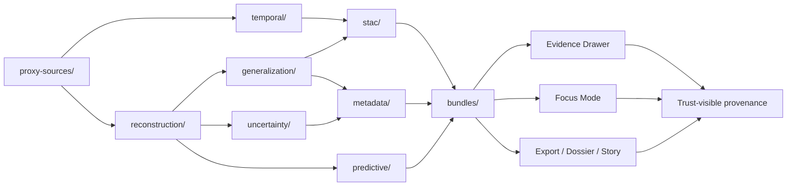

<!-- [KFM_META_BLOCK_V2]
doc_id: kfm://doc/NEEDS-VERIFICATION
title: Paleoenvironmental Results — Provenance & Lineage
type: standard
version: v1
status: draft
owners: Paleoenvironment WG · Metadata WG · FAIR+CARE Council
created: 2025-11-17
updated: YYYY-MM-DD
policy_label: restricted
related: [../../README.md, ../README.md, ../climate/README.md, ../seasonality/README.md, ../drought-cycles/README.md, ../predictive/README.md, ./proxy-sources/, ./reconstruction/, ./temporal/, ./generalization/, ./uncertainty/, ./predictive/, ./stac/, ./metadata/, ./bundles/]
tags: [kfm, archaeology, paleoenvironment, provenance, prov-o, fair-care]
notes: [Built upward from the source-draft provenance registry surfaced in the attached KFM corpus; mounted repo inventory, schema paths, release refs, and current checksum/id values still need direct verification.]
[/KFM_META_BLOCK_V2] -->

# Paleoenvironmental Results — Provenance & Lineage

Authoritative lineage, masking, and outward-metadata registry for KFM paleoenvironment result packages.

> [!NOTE]
> **Status:** active  
> **Owners:** Paleoenvironment WG · Metadata WG · FAIR+CARE Council  
>      
> **Quick jumps:** [Scope](#scope) · [Repo fit](#repo-fit) · [Accepted inputs](#accepted-inputs) · [Exclusions](#exclusions) · [Directory tree](#directory-tree) · [Quickstart](#quickstart) · [Usage](#usage) · [Diagram](#diagram) · [Tables](#tables) · [Task list](#task-list--definition-of-done) · [FAQ](#faq) · [Appendix](#appendix)  
> **Repo fit:** `docs/analyses/archaeology/results/paleoenvironment/provenance/` → upstream: [`../README.md`](../README.md), [`../../README.md`](../../README.md) · adjacent: [`../climate/README.md`](../climate/README.md), [`../seasonality/README.md`](../seasonality/README.md), [`../drought-cycles/README.md`](../drought-cycles/README.md), [`../predictive/README.md`](../predictive/README.md)

> [!IMPORTANT]
> This directory is a **provenance registry**, not a second interpretation lane. Its job is to show how paleoenvironment results were sourced, generalized, validated, and made publishable without erasing uncertainty, masking, or correction history.

> [!WARNING]
> Current-session verification is **PDF-only**. The path, purpose, subdirectory design, and continuity metadata below are source-grounded, but mounted repo inventory, schema files, telemetry files, release bundles, and sibling README presence remain **NEEDS VERIFICATION** until the repository tree is directly inspected.

## Scope

This directory is the root provenance surface for **environment-only** paleoenvironment results in KFM. It exists to preserve inspectable lineage across proxy sourcing, reconstruction logic, temporal alignment, spatial generalization, uncertainty handling, outward catalog linkage, and final PROV-O bundle assembly.

It covers provenance for paleoenvironment result families that the corpus names explicitly: paleoclimate, hydrology-linked environmental reconstruction, vegetation, soils, drought cycles, and predictive paleoenvironment models. It is the place to explain **how** a result became trustworthy enough to surface, not the place to restate the result as if lineage were optional.

### Current evidence posture

| Area | Status | What is grounded here |
| --- | --- | --- |
| Target path, title, and registry role | **CONFIRMED** | The attached source corpus includes a directly matching draft for this exact path and role. |
| Directory design below this README | **CONFIRMED** as source design · **NEEDS VERIFICATION** as mounted repo state | The source draft names the child directories, but the live tree was not directly inspected. |
| Paleoenvironment lineage duties | **CONFIRMED** | Proxy provenance, reconstruction steps, OWL-Time alignment, H3 masking, uncertainty, STAC/DCAT linkage, and PROV bundles are all named in the source corpus. |
| KFM trust posture and standards alignment | **CONFIRMED** | This README is strengthened by current KFM doctrine on truth path, trust membrane, STAC/DCAT/PROV linkage, and trust-visible surfaces. |
| Exact schema files, telemetry files, release manifests, and checksums | **UNKNOWN** / **NEEDS VERIFICATION** | Older source-draft values are preserved only as continuity hints and should not be treated as mounted repo fact. |

[Back to top](#paleoenvironmental-results--provenance--lineage)

## Repo fit

| Path | Role | Relationship |
| --- | --- | --- |
| `../../README.md` | archaeology results hub | higher-level archaeology results entry point |
| `../README.md` | paleoenvironment results root | parent lane for paleoenvironment outputs |
| `./README.md` | this file | provenance registry root for the paleoenvironment subtree |
| `../climate/README.md` | sibling result lane | climate reconstruction results, not provenance root |
| `../seasonality/README.md` | sibling result lane | seasonality reconstruction results |
| `../drought-cycles/README.md` | sibling result lane | drought-cycle reconstruction results |
| `../predictive/README.md` | sibling result lane | predictive paleoenvironment result lane |
| `./stac/` | outward metadata support surface | STAC-side lineage linkage for result assets |
| `./metadata/` | outward metadata support surface | DCAT / metadata enrichments and governance descriptors |
| `./bundles/` | final lineage packaging surface | PROV-O bundle assembly and reproducibility snapshots |

### Why this README matters in the subtree

KFM doctrine treats provenance as part of the outward truth surface, not as backstage decoration. That means this directory has to support trust-visible surfaces such as the Evidence Drawer, dossier views, Story surfaces, export previews, and Focus Mode without letting any of them outrun review state, masking, or correction lineage.

[Back to top](#paleoenvironmental-results--provenance--lineage)

## Accepted inputs

This directory should accept material that explains lineage for paleoenvironment results, including:

- proxy-source provenance for pollen, charcoal, isotopes, sediment cores, soil proxies, and ecohydrological drivers
- reconstruction records for weighting, harmonization, calibration, interpolation, smoothing, and model selection
- OWL-Time interval lineage and multi-period alignment notes
- H3 r7+ generalization receipts, geometry simplification notes, masking decisions, and sovereignty-based redaction justifications
- uncertainty lineage for proxy disagreement, variance, ambiguity, and ensemble spread
- predictive-model lineage that remains strictly environmental-only
- STAC-linked lineage notes, dataset dependency chains, and DCAT-side provenance summaries
- final PROV-O bundles and reproducibility snapshots
- correction, supersession, or rollback notes when lineage meaning changed after publication or review

> [!TIP]
> The strongest entries here explain **support, method, scope, and masking** together. A lineage note that preserves only a file reference but not method, support, and review context is too thin for this lane.

## Exclusions

This directory should **not** become a catch-all paleoenvironment notebook. Keep the following out of this lane:

- interpretive climate, drought, seasonality, vegetation, or predictive result summaries that belong in sibling result lanes such as [`../climate/README.md`](../climate/README.md) or [`../drought-cycles/README.md`](../drought-cycles/README.md)
- cultural inference, tribal history linkage, group attribution, or speculative paleo-historical claims
- exact or reconstructable proxy-source locations that would weaken sovereignty, geoprivacy, or review obligations
- free-floating Story prose with no lineage purpose
- public-facing exports that omit masking, uncertainty, or review state
- raw implementation claims about mounted schemas, workflows, or telemetry files that have not been directly verified

### Route it elsewhere when:

- the main question is **what the reconstruction says** → use the sibling result lane
- the main question is **whether a result is publishable** → coordinate with stewardship / review artifacts
- the main question is **how the shell presents provenance** → see parent paleoenvironment docs plus broader KFM UI / trust-surface doctrine
- the material is **sensitive and unresolved** → quarantine it until rights, masking, and review obligations are explicit

[Back to top](#paleoenvironmental-results--provenance--lineage)

## Directory tree

Source-grounded design baseline:

```text
docs/analyses/archaeology/results/paleoenvironment/provenance/
├── README.md                         # This file
├── proxy-sources/                    # Provenance of pollen, charcoal, isotopes, cores
├── reconstruction/                   # Steps + transformations for each paleo-surface
├── temporal/                         # OWL-Time interval lineage
├── generalization/                   # H3 masking & redaction logs
├── uncertainty/                      # Variance, disagreement & model-spread lineage
├── predictive/                       # Lineage for paleoenvironment predictive models
├── stac/                             # STAC provenance links
├── metadata/                         # DCAT provenance enrichments
└── bundles/                          # Final PROV-O bundles (JSON-LD)
```

> [!NOTE]
> The tree above is **CONFIRMED as source design**. Whether every listed directory currently exists in the mounted repository is **NEEDS VERIFICATION**.

[Back to top](#paleoenvironmental-results--provenance--lineage)

## Quickstart

Use this lane when a paleoenvironment result package needs a reviewable lineage trail.

1. Start from the result family that needs lineage support.
2. record proxy-source provenance under `proxy-sources/`
3. capture reconstruction and calibration logic under `reconstruction/`
4. record temporal alignment under `temporal/`
5. preserve masking and H3-based generalization receipts under `generalization/`
6. document uncertainty under `uncertainty/`
7. link outward metadata under `stac/` and `metadata/`
8. assemble final PROV-O bundle material under `bundles/`
9. route unresolved cultural-risk or exact-location risk to review instead of smoothing it away

Illustrative packet shape:

```text
<surface-id>/
├── proxy-sources/
├── reconstruction/
├── temporal/
├── generalization/
├── uncertainty/
├── stac/
├── metadata/
└── bundles/
```

Illustrative provenance stub:

```json
{
  "bundle_id": "NEEDS-VERIFICATION",
  "surface_id": "NEEDS-VERIFICATION",
  "scope": {
    "time": "NEEDS-VERIFICATION",
    "space": "generalized"
  },
  "proxy_inputs": [
    "proxy-sources/NEEDS-VERIFICATION"
  ],
  "lineage_summary": "Environmental-only reconstruction with masking and uncertainty disclosed.",
  "rights_state": "generalized",
  "negative_path_trace": null
}
```

The JSON example above is **illustrative**. It shows the shape this lane should support, not a confirmed mounted schema file.

[Back to top](#paleoenvironmental-results--provenance--lineage)

## Usage

### 1. Register proxy inputs first

Every result lineage should start with source clarity. Proxy inputs belong here only when they can be described with enough support to survive review: what the proxy is, what it measures, how it was cleared for use, and whether any source-level masking or sovereignty burden applies.

### 2. Capture transform logic without hiding the method

Reconstruction lineage should preserve weighting, calibration, interpolation, smoothing, and error-control notes. A published surface should never look “natural” if its method chain is invisible.

### 3. Keep time explicit

Temporal lineage belongs in `temporal/` and should preserve OWL-Time interval logic, reconstruction windows, and aggregation/smoothing logs. Paleoenvironment results are time-bearing, so provenance that drops interval semantics is incomplete.

### 4. Treat generalization as a first-class event

Masking, H3 r7+ generalization, geometry simplification, and sovereignty-based redaction are not editorial polish. They are provenance-bearing transforms and should be documented as such.

### 5. Carry uncertainty all the way outward

Proxy disagreement, variance, ambiguity, and model fragility should not disappear when a dataset becomes more polished. If uncertainty matters upstream, it still matters at the STAC/DCAT/PROV layer and in downstream trust-visible surfaces.

### 6. Preserve correction and rollback lineage

KFM doctrine expects supersession, narrowing, withdrawal, and replacement to preserve lineage rather than erase it. If a provenance statement changes because a source was withdrawn, generalized further, or corrected, the new note should point back to the prior state rather than silently overwriting history.

> [!IMPORTANT]
> “Environmental-only” is a hard boundary here. If a provenance note starts implying cultural behavior, group identity, settlement chronology, or fine-grained sensitive location, the correct next action is to **generalize, withhold, or remove** — not to soften the language and keep it.

[Back to top](#paleoenvironmental-results--provenance--lineage)

## Diagram



This is the intended trust flow: lineage is assembled in the registry, linked outward through STAC/DCAT/PROV closure, and then exposed in the same governed shell rather than copied into detached surfaces.

[Back to top](#paleoenvironmental-results--provenance--lineage)

## Tables

### Provenance component registry

| Component | What belongs here | Minimum trust burden |
| --- | --- | --- |
| `proxy-sources/` | source-level notes for pollen, charcoal, isotopes, cores, soil proxies, ecohydrological drivers | source identity, method clue, clearance/review state, support semantics |
| `reconstruction/` | weighting, calibration, interpolation, smoothing, model-selection, masking notes | transform visibility, error controls, no hidden methodological jumps |
| `temporal/` | OWL-Time intervals, reconstruction windows, smoothing/aggregation logs | explicit time basis and interval logic |
| `generalization/` | H3 r7+ receipts, geometry simplification, masking operations, redaction justifications | sovereignty-safe spatial handling must remain visible |
| `uncertainty/` | disagreement pathways, variance decomposition, ambiguity and fragility notes | uncertainty must remain attached, not implied away |
| `predictive/` | environmental-only predictive lineage, ensemble notes, uncertainty surfaces | no cultural inference, no identity linkage, no fine-scale reconstruction |
| `stac/` | lineage-linked STAC fields and dependency chains | outward asset metadata must resolve cleanly |
| `metadata/` | DCAT temporal extent, FAIR+CARE labels, governance descriptors | outward discovery metadata must preserve purpose and restrictions |
| `bundles/` | final PROV-O bundles, reproducibility snapshots, masking logs, WAL checkpoint lineage | entity/activity/agent chain must remain inspectable |

### Best-fit KFM contract alignment

| Provenance area | Best-fit doctrinal contract family | Status note |
| --- | --- | --- |
| Source-side intake and proxy identification | `SourceDescriptor` / `IngestReceipt` | **INFERRED doctrinal fit**; exact mounted file inventory remains unknown |
| Reconstruction, temporal, masking, and uncertainty records | `ValidationReport` / `ProjectionBuildReceipt` | **INFERRED doctrinal fit**; useful as alignment guidance, not a file claim |
| Outward STAC + DCAT closure | `CatalogClosure` | **CONFIRMED doctrinal fit** in current KFM canon |
| Trust-visible provenance packets | `EvidenceBundle` | **CONFIRMED doctrinal fit**; mounted bundle implementation still needs verification |
| Result or lineage state changes after publication | `CorrectionNotice` / `ReleaseManifest` linkage | **PROPOSED operational fit** for this lane |

### Redaction and review triggers

| Trigger | Default handling | Why it matters |
| --- | --- | --- |
| exact or reconstructable paleo-source location | generalize or withhold | protects sovereignty and exact-location sensitivity |
| cultural implication in lineage prose | remove or rewrite to environmental-only framing | provenance must not turn into cultural inference |
| unresolved reuse or rights posture | hold for review | KFM treats rights as part of publishability |
| proxy conflict or high model fragility | disclose uncertainty and keep visible | uncertainty is first-class, not optional |
| correction after publication | preserve prior lineage and add supersession note | KFM favors correctability without erasing history |

[Back to top](#paleoenvironmental-results--provenance--lineage)

## Task list / definition of done

A provenance update in this lane is complete only when all of the following are true:

- [ ] the result family and scope are named clearly
- [ ] proxy inputs are documented or explicitly unresolved
- [ ] reconstruction steps are visible enough to explain weighting, calibration, smoothing, and masking
- [ ] OWL-Time alignment or temporal framing is preserved where relevant
- [ ] H3 generalization / redaction decisions are logged where relevant
- [ ] uncertainty is stated rather than implied
- [ ] outward STAC/DCAT linkage is present or explicitly pending
- [ ] final PROV-O bundle path or bundle plan is named
- [ ] cultural inference, identity linkage, and fine-grained spatial leakage are absent
- [ ] any correction, rollback, or supersession path preserves prior lineage
- [ ] relative links are reviewable and repo-native
- [ ] any source-draft continuity values that were carried forward are marked **NEEDS VERIFICATION** where the mounted repo has not confirmed them

### Minimum definition of done for this README itself

- [ ] purpose and lane role are clear
- [ ] scope and exclusions are distinct
- [ ] child directory responsibilities are visible
- [ ] at least one trust-flow diagram exists
- [ ] tables clarify component ownership and review triggers
- [ ] definition-of-done gates are explicit
- [ ] appendix preserves continuity fields without overstating mounted implementation

[Back to top](#paleoenvironmental-results--provenance--lineage)

## FAQ

### What is the difference between this provenance lane and the paleoenvironment results root?

The paleoenvironment results root explains the result families and their use in KFM. This directory explains the lineage behind those results: proxy sources, transforms, masking, uncertainty, outward metadata, and bundle assembly.

### Can this lane hold raw proxy data?

Not by default. This lane should hold provenance documentation and linkage surfaces, not unrestricted raw data dumps. Sensitive or exact-location-bearing material should remain generalized, withheld, or routed to review.

### Does Focus Mode read from this lane directly?

This lane is part of what makes Focus Mode explainable, but it is not itself a free-form narrative surface. Its role is to preserve environmental-only lineage that downstream trust-visible surfaces can inspect.

### Are the schema and telemetry paths in the older source draft safe to treat as current?

No. They are useful continuity hints, but they remain **NEEDS VERIFICATION** until the mounted repository confirms them.

### What should happen when provenance is incomplete?

Hold, generalize, quarantine, or mark the result partial. KFM doctrine treats negative outcomes as valid governed outcomes; incomplete lineage should not be smoothed into confident publication.

[Back to top](#paleoenvironmental-results--provenance--lineage)

## Appendix

<details>
<summary><strong>Source-derived continuity fields preserved for review</strong></summary>

These values appeared in the earlier source-draft provenance registry and may be useful for reconciliation, but they should not be treated as mounted repo fact until directly verified.

| Continuity field | Source-derived value | Current handling |
| --- | --- | --- |
| source-draft version | `v11.0.0` | preserved as historical continuity only |
| source-draft last updated | `2025-11-17` | used as a grounded continuity date |
| doc kind | `Provenance Registry` | preserved in meaning, not as authoritative repo status |
| old semantic document id | `kfm-arch-paleoenv-provenance` | **NEEDS VERIFICATION** |
| old event source id | `ledger:docs/analyses/archaeology/results/paleoenvironment/provenance/README.md` | **NEEDS VERIFICATION** |
| old doc UUID | `urn:kfm:doc:archaeology:paleoenvironment:provenance-v11.0.0` | **NEEDS VERIFICATION** |
| JSON schema ref | `../../../../../schemas/json/archaeology-paleoenv-provenance.schema.json` | **NEEDS VERIFICATION** |
| SHACL shape ref | `../../../../../schemas/shacl/archaeology-paleoenv-provenance-shape.ttl` | **NEEDS VERIFICATION** |
| telemetry schema ref | `../../../../../schemas/telemetry/archaeology-paleoenv-provenance-v1.json` | **NEEDS VERIFICATION** |
| AI Focus usage | `Restricted / Environmental-Only` | source-grounded continuity note |
| AI transform permissions | `summaries`, `semantic-highlighting`, `lineage-explanation` | source-grounded continuity note |
| AI transform prohibitions | `cultural-inference`, `reverse-location-reconstruction`, `historical-attribution` | source-grounded continuity note |

</details>

<details>
<summary><strong>Illustrative lineage packet checklist</strong></summary>

```text
[ ] proxy-sources/<dataset-or-bundle>.md
[ ] reconstruction/<surface-id>/steps.md
[ ] temporal/<surface-id>/intervals.jsonld
[ ] generalization/<surface-id>/masking-receipt.md
[ ] uncertainty/<surface-id>/summary.md
[ ] stac/<surface-id>.json
[ ] metadata/<surface-id>.jsonld
[ ] bundles/<surface-id>.prov.jsonld
[ ] correction note or supersession note, if applicable
```

This checklist is illustrative and should be reconciled against the mounted repository before commit if the live tree differs.

</details>

<details>
<summary><strong>Working terminology used in this README</strong></summary>

| Term | Meaning in this lane |
| --- | --- |
| environmental-only | lineage or result framing that does not infer culture, identity, group behavior, or tribal history |
| provenance | inspectable record of inputs, transforms, masking, uncertainty, and outward linkage |
| generalization | deliberate reduction of spatial or temporal precision for safety, governance, or support-fit reasons |
| trust-visible surface | a user-facing surface that exposes provenance, freshness, review state, and policy context at the point of use |
| correction lineage | the preserved chain connecting a prior published state to its narrowing, withdrawal, supersession, or replacement |

</details>

[Back to top](#paleoenvironmental-results--provenance--lineage)
