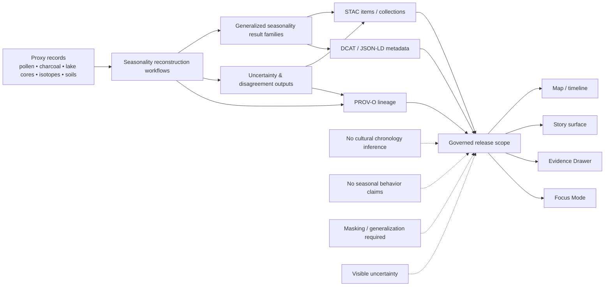

<!-- [KFM_META_BLOCK_V2]
doc_id: kfm://doc/NEEDS-VERIFICATION
title: Paleoenvironmental Results — Seasonality Reconstructions
type: standard
version: v1
status: review
owners: Paleoenvironment WG · FAIR+CARE Council
created: YYYY-MM-DD
updated: YYYY-MM-DD
policy_label: restricted
related: [docs/analyses/archaeology/results/paleoenvironment/README.md, docs/analyses/archaeology/results/README.md, docs/analyses/archaeology/README.md]
tags: [kfm, archaeology, paleoenvironment, seasonality]
notes: [doc_id and dates need repo verification; owners are source-grounded from the attached seasonality draft; downstream local inventory remains NEEDS VERIFICATION]
[/KFM_META_BLOCK_V2] -->

<a id="top"></a>

# Paleoenvironmental Results — Seasonality Reconstructions

Generalized, environmental-only seasonality outputs and their uncertainty, metadata, and lineage companions for archaeology-facing paleoenvironment work in Kansas Frontier Matrix.

> [!NOTE]
> **Status:** review  
> **Owners:** Paleoenvironment WG · FAIR+CARE Council *(source-grounded from attached seasonality material; CODEOWNERS alignment NEEDS VERIFICATION)*  
>      
> **Quick jump:** [Scope](#scope) · [Repo fit](#repo-fit) · [Accepted inputs](#accepted-inputs) · [Exclusions](#exclusions) · [Directory tree](#directory-tree) · [Quickstart](#quickstart) · [Usage](#usage) · [Diagram](#diagram) · [Tables](#tables) · [Task list](#task-list) · [FAQ](#faq) · [Appendix](#appendix)  
> **Repo fit:** `docs/analyses/archaeology/results/paleoenvironment/seasonality/README.md`  
> **Upstream:** [Paleoenvironment results](../README.md) · [Archaeology results](../../README.md) · [Archaeology analyses](../../../README.md)  
> **Downstream:** `temperature-seasonality/` · `precipitation-seasonality/` · `freeze-thaw/` · `drought-seasonality/` · `proxy-assemblages/` · `temporal/` · `uncertainty/` · `stac/` · `metadata/` · `provenance/` *(source-grounded target layout; mounted presence NEEDS VERIFICATION)*

> [!IMPORTANT]
> This README is for **environmental temporal context only**. It must not turn seasonality layers into cultural chronology, seasonal behavior claims, event reconstruction, or exact-location disclosure.

> [!WARNING]
> The checked-in `main` branch currently exposes this file as a one-line placeholder. This rewrite is therefore an **evidence-bounded replacement draft**, not a claim that every local child path, schema, telemetry file, or release artifact is already mounted and live.

## Scope

This directory is the child-family landing page for archaeology-facing **paleo-seasonality reconstructions** inside KFM’s broader paleoenvironment results lane. It should help maintainers and reviewers answer four fast questions:

1. What kind of seasonality result is being described?
2. What makes it public-safe or review-safe?
3. Where do uncertainty, masking, and lineage stay visible?
4. What must never be inferred from these layers?

### Truth posture used here

| Area | Status | How it is handled in this README |
| --- | --- | --- |
| The current repo file at this path is a placeholder | **CONFIRMED** | Treated as the direct revision baseline. |
| `seasonality/` is a named child family beneath `paleoenvironment/` | **CONFIRMED** | Inherited from the checked-in parent README. |
| Environmental-only framing, visible uncertainty, STAC/DCAT/PROV companionship, and release-boundary discipline | **CONFIRMED** | Preserved from current KFM doctrine and adjacent archaeology / paleoenvironment READMEs. |
| The seasonality family breakdown, steward names, OWL-Time interval framing, H3-style masking, and “Seasonality Confidence Chips” | **INFERRED** | Source-grounded in attached seasonality material, but not presented as mounted implementation proof. |
| Exact local child-directory inventory, schema files, telemetry file paths, release artifact refs, created / updated dates, and CODEOWNERS alignment | **NEEDS VERIFICATION** | Kept visible as commit-review work before merge. |

Seasonality work here remains **downstream of evidence, masking, uncertainty, review, and release state**. This README should therefore stay boundary-setting and navigational, not speculative or sovereignty-blind.

[Back to top](#top)

## Repo fit

**Path:** `docs/analyses/archaeology/results/paleoenvironment/seasonality/README.md`

**Role in the repo:** child-family README for generalized paleo-seasonality results and the companion materials that make those outputs inspectable, reviewable, and safe to use in downstream KFM surfaces.

### Upstream and downstream anchors

| Direction | Path | Why it matters | Status here |
| --- | --- | --- | --- |
| Upstream | [../README.md](../README.md) | parent paleoenvironment results index and boundary-setting README | **CONFIRMED** |
| Upstream | [../../README.md](../../README.md) | archaeology results publication layer and exposure guardrail | **CONFIRMED path** |
| Upstream | [../../../README.md](../../../README.md) | archaeology analysis doctrine and representation burden | **CONFIRMED path** |
| Downstream | `temperature-seasonality/` | seasonal temperature variability and amplitude families | **INFERRED path** |
| Downstream | `precipitation-seasonality/` | wet/dry-season envelopes and rainfall seasonality | **INFERRED path** |
| Downstream | `freeze-thaw/` | frost-window and freeze-cycle products | **INFERRED path** |
| Downstream | `drought-seasonality/` | drought-linked seasonal rhythm products | **INFERRED path** |
| Downstream | `proxy-assemblages/` | harmonized multi-proxy seasonal signatures | **INFERRED path** |
| Downstream | `temporal/`, `uncertainty/`, `stac/`, `metadata/`, `provenance/` | time, uncertainty, discovery, and lineage companions | **INFERRED path** |

### Repo-native expectation

This README should behave like a **release-safe family guide**, not like a hidden methods paper or an unrestricted interpretive note. Its job is to route readers toward the correct child material, keep the environmental-only boundary explicit, and make metadata, lineage, and uncertainty impossible to forget.

[Back to top](#top)

## Accepted inputs

The following content belongs here or immediately beneath this directory:

- Generalized paleo-seasonality result families.
- Seasonal temperature, precipitation, freeze–thaw, and drought rhythm products.
- Multi-proxy seasonal composites and their disagreement summaries.
- Interval-based or time-slice seasonality summaries.
- Uncertainty layers, disagreement metrics, variance summaries, and reconstruction limits.
- STAC, DCAT / JSON-LD, and PROV-O companions that travel with released outputs.
- Family-specific READMEs that explain scope, masking, and interpretation boundaries.
- Evidence-linked release notes that clarify what was generalized, withheld, or downgraded.

### Minimum expectations for anything linked from here

| Expectation | Why it matters |
| --- | --- |
| The result family says what kind of seasonality it represents | avoids decorative or vague publication |
| Seasonal outputs remain environmental-only | prevents cultural certainty from leaking in through temporal language |
| Uncertainty is published beside the result, not buried elsewhere | scientific and ethical burden stays visible |
| Masking / generalization posture is explicit | seasonality gradients can imply precision even when coordinates are hidden |
| Time semantics are named | interval, slice, or sequence ambiguity creates false interpretive confidence |
| Metadata and lineage routes are present | the layer must stay inspectable in Story, Focus, Export, or review surfaces |

[Back to top](#top)

## Exclusions

The following do **not** belong in this directory:

- Raw proxy captures, unreviewed sample locations, or unredacted site-specific extracts.
- Cultural chronology claims, seasonal behavior claims, migration narratives, or group-linked inference.
- Exact or precision-rich seasonality gradients that could act as indirect site disclosure.
- Event reconstruction presented as if seasonality alone proved historical episodes.
- Unreleased candidate outputs that lack uncertainty, masking, or lineage material.
- AI-generated summaries with no evidence route or review context.
- Exact schema, telemetry, or release-artifact claims that have not been rechecked in the mounted repo.

### Route these elsewhere instead

| Material | Keep it out of `seasonality/` because... | Put it where instead |
| --- | --- | --- |
| Raw proxy files and unreviewed captures | not release-safe | source onboarding / `RAW` / `WORK` / `QUARANTINE` lanes |
| Exact archaeological site coordinates or sensitive tribal geographies | may create stewardship or exposure harm | steward-restricted or generalized public-safe surfaces |
| Cultural interpretation prose | this directory is environmental context, not cultural authorship | archaeology interpretation / story / dossier surfaces with their own evidence burdens |
| Machine-readable schemas or policy bundles | canonical truth for those objects belongs elsewhere | shared `contracts/`, `schemas/`, and `policy/` surfaces |
| Release manifests, receipts, and proof packs | trust objects should not be hidden inside result prose | release / catalog / proof-pack surfaces |

[Back to top](#top)

## Directory tree

> [!NOTE]
> The tree below is a **source-grounded target shape**, not a blanket claim of mounted local completeness.

```text
docs/analyses/archaeology/results/paleoenvironment/seasonality/
├── README.md
├── temperature-seasonality/
├── precipitation-seasonality/
├── freeze-thaw/
├── drought-seasonality/
├── proxy-assemblages/
├── temporal/
├── uncertainty/
├── stac/
├── metadata/
└── provenance/
```

Where local directories are not yet present, treat the tree as a review target rather than settled repo inventory.

[Back to top](#top)

## Quickstart

Use this sequence before adding, revising, or linking a seasonality result family:

1. Confirm the output is **generalized** and **environmental-only**.
2. Check whether the family is observationally reconstructed, analytically derived, or modeled, and name that honestly.
3. Keep uncertainty, masking, and time semantics visible at the same scope as the result.
4. Verify that any downstream Story or Focus phrasing stays contextual and non-cultural.
5. Recheck local child paths, schema locations, and owners against the mounted repo before merge.

```bash
# Illustrative only — verify local paths and conventions first.
cd docs/analyses/archaeology/results/paleoenvironment/seasonality

# Review the family landing page and any child lanes before renaming or adding folders.
ls

# Add or revise a child-family README only after confirming it stays environmental-only,
# uncertainty-bearing, and reviewable.
```

```yaml
# Illustrative family-pack shape — not a confirmed mounted schema.
family: seasonality
result_scope: generalized
time_model: interval-based
spatial_generalization: required
uncertainty_visible: true
artifacts:
  stac: required
  dcat: required
  prov: required
release_state: candidate
policy_review: required
```

> [!TIP]
> A seasonality family is not “done” when it draws a convincing gradient. It is done when scope, masking, time semantics, uncertainty, and lineage are inspectable.

[Back to top](#top)

## Usage

Use this README as the first stop when a reviewer, maintainer, or contributor needs to decide how a seasonality layer should be packaged.

1. Start here to confirm that the material belongs in `seasonality/` and not in a steward-restricted or culture-facing lane.
2. Move into the relevant child family for temperature, precipitation, freeze–thaw, drought, or proxy-assemblage detail.
3. Follow the companion metadata and provenance materials before using any layer in Story, Focus, Export, or external explanation.
4. Update this README whenever the local family set changes or when seasonality-specific burdens become clearer.
5. Keep this page concise and directional; family-specific methods belong in child READMEs or formal methods docs.

[Back to top](#top)

## Diagram



[Back to top](#top)

## Tables

### Seasonality family registry

| Family | What belongs here | Typical outputs | Interpretation boundary |
| --- | --- | --- | --- |
| `temperature-seasonality/` | seasonal thermal variability and amplitude | amplitude envelopes, thermal seasonality models, generalized freeze–thaw signals | environmental context only; no behavioral season claims |
| `precipitation-seasonality/` | wet/dry rhythm reconstruction | wet-season length, dry-season duration, rainfall seasonality composites, hydrology-linked transitions | no deterministic settlement or movement claims |
| `freeze-thaw/` | frost-window and freeze-cycle context | frost-free duration, surface freeze-cycle summaries, ecohydrological stability cues | no exact agricultural or habitation timing inference |
| `drought-seasonality/` | recurring seasonal moisture stress patterns | drought frequency, intensity bands, deficit windows, generalized oscillation summaries | no episode-level historical reconstruction from seasonality alone |
| `proxy-assemblages/` | harmonized multi-proxy seasonal signatures | proxy blends, weighting summaries, calibration notes, generalized composites | proxy convergence does not erase disagreement |
| `temporal/` | interval-oriented time packaging | OWL-Time-style intervals, sequence summaries, multi-period groupings | time labels must remain explicit and uncertainty-bearing |
| `uncertainty/` | disagreement and fragility expression | spread surfaces, disagreement metrics, variance notes, model-fit limits | required companion, not optional appendix |

### Artifact companions and release closure

| Companion | Minimum role in this family | Notes |
| --- | --- | --- |
| `stac/` | spatiotemporal description of released seasonality assets | strongest when the result is an asset-bearing item or collection |
| `metadata/` | outward dataset/distribution description | keep scope, access posture, and FAIR+CARE statements legible |
| `provenance/` | reconstruction, masking, and transformation lineage | should preserve proxy use, modeling activity, and generalization history |
| Uncertainty companion | visible disagreement, fit limits, and ambiguity | required wherever consequential use is possible |
| Evidence-linked release refs | connection to review state, release state, and correction path | avoids treating a compelling layer as self-authenticating |

### Trust-visible downstream use

| Surface | How seasonality should appear | Must stay visible |
| --- | --- | --- |
| Map / timeline | generalized temporal-environmental context | time basis, masking posture, uncertainty cue |
| Story surface | human-authored environmental narrative | evidence link, release state, refusal to over-interpret |
| Evidence Drawer | inspectable support and lineage | proxy references, transforms, obligations, preview-safe extracts |
| Focus Mode | bounded environmental synthesis | scoped retrieval, confidence / uncertainty cues, answer / abstain discipline |
| Export | policy-safe outward artifact | access posture, evidence linkage, correction route |

[Back to top](#top)

## Task list

- [ ] The README stays environmental-only and does not drift into cultural chronology or behavior claims.
- [ ] Every released child family has visible uncertainty material.
- [ ] Masking or generalization posture is explicit wherever spatial gradients are discussed.
- [ ] Time semantics are named instead of implied.
- [ ] Metadata and provenance companions are present or intentionally deferred with a visible reason.
- [ ] Relative links and child directories have been checked against the mounted repo before merge.
- [ ] Owners, doc identifiers, created / updated dates, and any schema or telemetry paths have been verified before publication.
- [ ] Downstream Story / Focus wording remains contextual, evidence-linked, and non-speculative.

### Definition of done

A change to this directory is ready when:

1. the family is correctly placed under `paleoenvironment/`,
2. the environmental-only boundary is explicit,
3. uncertainty and masking are visible,
4. metadata and lineage routes are inspectable,
5. no exactness or cultural certainty is implied,
6. and the local repo inventory has been rechecked before merge.

[Back to top](#top)

## FAQ

### Why is seasonality under archaeology if the content is environmental?

Because these datasets support archaeology-facing interpretation with **environmental temporal context**, but the seasonality layers themselves remain environmental-only and governance-bounded.

### Can seasonality outputs be used in Focus Mode?

Yes — but only as scoped, evidence-linked environmental context with visible uncertainty and an explicit release state.

### Are seasonality layers allowed to imply seasonal behavior, migration, or cultural scheduling?

No. This README treats those moves as out of bounds unless they are handled elsewhere under a stronger evidentiary and policy burden.

### Do these results need 3D?

Not by default. The surrounding archaeology and paleoenvironment doctrine is still 2D-first unless an added representation burden is explicitly justified.

### Why are child paths marked as `INFERRED` or `NEEDS VERIFICATION`?

Because the attached seasonality draft names a richer local family layout than the currently visible repo placeholder proves. This README keeps that layout visible without converting it into silent repo fact.

[Back to top](#top)

## Appendix

<details>
<summary><strong>Source-grounded starter shapes and open verification items</strong></summary>

### A. Attached-draft signals carried forward carefully

The attached seasonality draft names several family-specific signals that are useful here but are not presented as mounted runtime proof:

- interval-oriented time handling
- H3-style masking or spatial generalization
- “Seasonality Confidence Chips” for Focus-facing uncertainty cues
- seasonality-specific schema, SHACL, telemetry, and release-artifact references

Treat those as **source-grounded design targets** until the repo confirms exact paths, filenames, and implementation status.

### B. Open verification checklist before commit

| Item | Why it needs review |
| --- | --- |
| `doc_id` and exact UUID-style identifier | current repo truth was not surfaced |
| created / updated dates | placeholder file does not provide canonical dates |
| CODEOWNERS alignment | owner text is source-grounded but not branch-verified |
| child folder presence beneath `seasonality/` | attached draft names a fuller local family than the visible repo proves |
| schema / telemetry / manifest paths | attached draft references exist in project materials, but mounted repo presence was not verified |
| release-state wording | current checked-in file is a placeholder, so stronger “active / enforced” language would overclaim |

### C. Suggested neighboring docs to review next

- [Paleoenvironment results root](../README.md)
- [Archaeology results root](../../README.md)
- [Archaeology analyses root](../../../README.md)

</details>

<div align="center">

[Back to Paleoenvironment Results](../README.md) · [Back to Archaeology Results](../../README.md)

</div>
