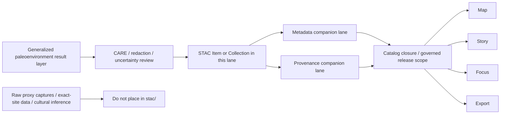

<!-- [KFM_META_BLOCK_V2]
doc_id: kfm://doc/NEEDS-VERIFICATION
title: Kansas Frontier Matrix — Paleoenvironment STAC
type: standard
version: v1
status: draft
owners: Paleoenvironment WG · FAIR+CARE Council (inherited from parent lane; NEEDS VERIFICATION for this subdirectory)
created: YYYY-MM-DD
updated: YYYY-MM-DD
policy_label: restricted
related: [../README.md]
tags: [kfm, archaeology, paleoenvironment, stac]
notes: [Current live file is a placeholder; lane-specific owner/date/doc_id/schema inventory still need verification before merge.]
[/KFM_META_BLOCK_V2] -->

# Kansas Frontier Matrix — Paleoenvironment STAC

STAC-facing lane for release-safe, generalized paleoenvironment result metadata in the archaeology results subtree.

> [!NOTE]
> **Status:** active directory · draft README revision  
> **Owners:** Paleoenvironment WG · FAIR+CARE Council *(inherited from parent paleoenvironment lane; confirm lane-specific ownership before merge)*  
> **Policy label:** `restricted` · CARE-governed *(inherited from parent lane; subdirectory-level confirmation still recommended)*  
>       
> **Quick jumps:** [Scope](#scope) · [Repo fit](#repo-fit) · [Accepted inputs](#accepted-inputs) · [Exclusions](#exclusions) · [Directory tree](#directory-tree) · [Quickstart](#quickstart) · [Usage](#usage) · [Diagram](#diagram) · [Tables](#tables) · [Task list](#task-list) · [FAQ](#faq) · [Appendix](#appendix)  
> **Repo fit:** `docs/analyses/archaeology/results/paleoenvironment/stac/README.md` · Upstream [`../README.md`](../README.md) · Downstream catalog-closure and trust-visible surfaces via STAC plus companion metadata/provenance lanes

> [!IMPORTANT]
> The live repo currently shows this directory as a structural lane with a placeholder `README.md`. This rewrite keeps that routing role, but turns it into an evidence-bounded guide. Do not read the examples below as proof that sibling schemas, item inventories, or CI commands already exist.

## Scope

This directory is the STAC-facing packaging lane for generalized paleoenvironment result layers. It is where release-safe Items, Collections, and related discovery-facing material should live when a paleoenvironment output is ready to be described as a governed spatial asset.

It is **not** the place for raw proxy captures, exact archaeological location disclosure, cultural identity inference, or unrestricted historical narrative. Those boundaries matter here because STAC records are outward-facing discovery objects; once they exist, they become part of the claim surface.

| Truth posture | How to read this README |
| --- | --- |
| **CONFIRMED** | The `stac/` directory exists in the live repo, the current checked-in file is only a placeholder, and the parent paleoenvironment README routes `./stac/` as an adjacent companion lane. |
| **INFERRED** | Future checked-in Items, Collections, or lane-specific subfolders will sit beneath this README when the repo grows past the placeholder stage. |
| **NEEDS VERIFICATION** | Lane-specific owner resolution, canonical document UUID, created/updated dates, exact local file inventory, schema filenames, and validation command names. |

[Back to top](#kansas-frontier-matrix--paleoenvironment-stac)

## Repo fit

**Path:** `docs/analyses/archaeology/results/paleoenvironment/stac/`

**Role in the repo:** release-facing STAC guide for archaeology-facing paleoenvironment outputs and their asset-level discovery posture.

**Upstream context:** [`../README.md`](../README.md)

**Adjacent companion lanes:** `../metadata/` and `../provenance/`  
These companions are source-grounded in the parent paleoenvironment README, but their exact checked-in README/file inventory should be reverified before merge.

**Downstream consequence:** records prepared here should be usable in the broader KFM release chain where STAC, DCAT, and PROV remain linked rather than treated as substitutes for one another.

This README should help maintainers answer three fast questions:

1. Does this paleoenvironment output belong in a STAC-facing release lane at all?
2. What must a release-safe STAC record make visible?
3. What must never be implied from a paleoenvironment discovery record?

[Back to top](#kansas-frontier-matrix--paleoenvironment-stac)

## Accepted inputs

The following belong here or immediately beneath this directory when they are release-safe:

- STAC Item or Collection materials for **released** generalized paleoenvironment result layers.
- Asset references for generalized rasters, vectors, or tables used as public-safe environmental context.
- Explicit temporal extent or time semantics for paleoclimate, paleohydrology, vegetation, seasonality, drought-cycle, predictive, or uncertainty outputs.
- Generalized spatial footprint information that does not recreate fine-grained archaeological origin data.
- Uncertainty, proxy-context, or method-summary fields needed to keep discovery honest.
- Links or references that connect the STAC record to companion metadata and provenance materials at the same release scope.

## Exclusions

The following do **not** belong here:

- Raw proxy captures, sample-level extracts, or precision source materials.
- Exact archaeological site coordinates, culturally restricted geographies, or any file that raises reverse-location risk.
- Cultural identity inference, migration reconstruction, deterministic settlement claims, or story copy without evidence linkage.
- Unreleased candidate outputs that have not passed uncertainty, metadata, and policy review.
- Full provenance bundles or broader dataset-distribution narratives when those are being handled in dedicated companion lanes.
- Draft notebook outputs, local scratch artifacts, or source-edge ingest objects masquerading as release-safe STAC.

When in doubt, route sensitive or unfinished material back to the appropriate source/onboarding, WORK/QUARANTINE, steward-only, family-specific, metadata, or provenance lane instead of forcing it into `stac/`.

[Back to top](#kansas-frontier-matrix--paleoenvironment-stac)

## Directory tree

**Current live directory shape**

```text
docs/analyses/archaeology/results/paleoenvironment/stac/
└── README.md
```

**Interpretation rule**

The tree above is intentionally minimal because that is the only confirmed checked-in inventory visible for this lane right now. Do not pad it with imagined `items/`, `collections/`, or schema files unless the mounted repo actually contains them.

[Back to top](#kansas-frontier-matrix--paleoenvironment-stac)

## Quickstart

Use this when reviewing or adding STAC-facing paleoenvironment material.

1. Confirm the output is **environmental-only**, generalized, and appropriate for release-facing discovery.
2. Confirm uncertainty is visible rather than implied away.
3. Check that the result has companion metadata and provenance at the same release scope, or explicitly document the missing companion as **NEEDS VERIFICATION** before merge.
4. Keep spatial disclosure generalized enough that the record cannot drift into exact-site reconstruction.
5. Verify local file names, child paths, and validation commands against the mounted repo before commit.

**Illustrative lane checklist — verify local schema and commands first**

```yaml
release_scope: generalized
surface_class: paleoenvironment-result
stac_record: required
temporal_semantics: explicit
uncertainty_visible: required
provenance_link: required
metadata_link: required
care_review: required
fine_grained_location_data: forbidden
cultural_inference: forbidden
```

> [!TIP]
> Treat this lane as a release-safe packaging lane, not just a folder of JSON. A STAC record that hides its uncertainty, time basis, or lineage link is not finished.

[Back to top](#kansas-frontier-matrix--paleoenvironment-stac)

## Usage

### Add or revise a STAC-facing record

1. Start from a released or review-ready paleoenvironment result family, not from raw proxy material.
2. Add or revise the STAC-facing record in this lane.
3. Keep the spatial footprint generalized and the temporal model explicit.
4. Make uncertainty and environmental-only framing visible in the record or in clearly linked companions.
5. Ensure metadata/provenance routing is preserved before the record is treated as outward-facing.

### Route related material to the right lane

Use this directory for **spatiotemporal asset discovery**. Route full dataset-distribution description to the metadata lane and full lineage / transformation chains to the provenance lane.

### Keep the README narrow

This file should remain routing-heavy and implementation-aware. Family-specific semantics, proxy discussions, and result-method detail belong in the relevant child family README, not in this lane root.

[Back to top](#kansas-frontier-matrix--paleoenvironment-stac)

## Diagram



[Back to top](#kansas-frontier-matrix--paleoenvironment-stac)

## Tables

### Lane handoff matrix

| Material | Belongs here? | Route instead | Why |
| --- | --- | --- | --- |
| Released STAC Item for a generalized paleoenvironment raster or vector | **Yes** | — | This is the core purpose of the lane |
| STAC Collection grouping released paleoenvironment assets | **Yes** | — | Family- or release-level discovery belongs here |
| Full DCAT dataset/distribution narrative | Usually **No** | `../metadata/` | Better handled as outward dataset description |
| Full PROV-O bundle or transformation chain | Usually **No** | `../provenance/` | Better handled as lineage documentation |
| Raw proxy records or sample coordinates | **No** | Source/onboarding or steward-only lanes | Not release-safe discovery material |
| Story text, cultural interpretation, or settlement narrative | **No** | Story / dossier / family-level docs | This lane should not imply interpretive certainty |

### Minimum STAC-facing expectations for this lane

| Facet | Expectation | Notes |
| --- | --- | --- |
| Spatial footprint | Generalized only | No reverse-location reconstruction |
| Temporal model | Explicit | Interval, range, or instant must be clear |
| Asset references | Released artifacts only | Avoid candidate or scratch outputs |
| Uncertainty | Visible or clearly linked | Do not hide proxy disagreement or variance |
| Proxy context | Present at a useful level | Enough to keep the record interpretable as environmental-only |
| Rights / policy posture | Visible | Release-safe discovery still needs care labels and access logic |
| Metadata linkage | Present or explicitly outstanding | Route broader dataset description cleanly |
| Provenance linkage | Present or explicitly outstanding | Route transformation lineage cleanly |

[Back to top](#kansas-frontier-matrix--paleoenvironment-stac)

## Task list

A STAC-facing paleoenvironment record in this lane is not done until all of the following are true:

- [ ] The record describes a **generalized** paleoenvironment result rather than a raw source extract.
- [ ] Spatial disclosure stays above exact-site or fine-grained origin risk.
- [ ] Temporal semantics are explicit.
- [ ] Uncertainty is visible in the record or an immediately linked companion.
- [ ] Environmental-only framing is preserved.
- [ ] Released asset references are present and stable enough for discovery.
- [ ] Metadata routing is preserved.
- [ ] Provenance routing is preserved.
- [ ] No cultural inference or historical overclaim is implied by titles, summaries, or links.
- [ ] Any unresolved lane-specific detail is marked **NEEDS VERIFICATION** rather than smoothed away.

## FAQ

### Why separate STAC from metadata and provenance?

Because these are companion surfaces, not synonyms. STAC is the discovery-facing spatiotemporal asset carrier; broader dataset/distribution description and full lineage need their own room.

### Can exact coordinates or precise archaeological geometries appear here?

No. This lane is for generalized paleoenvironment discovery records, not fine-grained archaeological disclosure.

### Can draft or notebook-stage outputs go here?

Not as release-facing STAC. Keep them out of this lane until they have passed the relevant review, uncertainty, and policy checks.

### What if the provenance or metadata companion is missing?

Do not bluff. Either add the missing companion, keep the record in candidate space, or mark the gap **NEEDS VERIFICATION** and stop short of claiming release-safe completeness.

### Does a STAC record here prove a release happened?

No. A STAC record can be part of a release-facing package, but release meaning still depends on the broader KFM evidence, review, and correction model.

[Back to top](#kansas-frontier-matrix--paleoenvironment-stac)

## Appendix

<details>
<summary><strong>Appendix — local verification snapshot</strong></summary>

| Fact | Status | Why it matters |
| --- | --- | --- |
| The `stac/` directory is present in the live repo | **CONFIRMED** | This lane is real, not hypothetical |
| The current checked-in `README.md` is only a placeholder | **CONFIRMED** | A stronger routing README is justified |
| The parent paleoenvironment README treats `./stac/` as an adjacent companion lane | **CONFIRMED** | This child README should stay narrow and routing-focused |
| Additional checked-in STAC Items, Collections, or schemas beneath this directory | **NEEDS VERIFICATION** | The live directory listing did not show them |
| Lane-specific owner/date/doc ID resolution | **NEEDS VERIFICATION** | Use placeholders until repo evidence resolves them |
| Exact validation command names for this lane | **NEEDS VERIFICATION** | Do not invent CI or local tooling contracts |

</details>

<details>
<summary><strong>Appendix — illustrative future lane shape (not current repo proof)</strong></summary>

```text
docs/analyses/archaeology/results/paleoenvironment/stac/
├── README.md
├── <collection-or-family>.json
└── <item-or-release-record>.json
```

Use a shape like this only after verifying the mounted repo’s naming and validation conventions.

</details>
