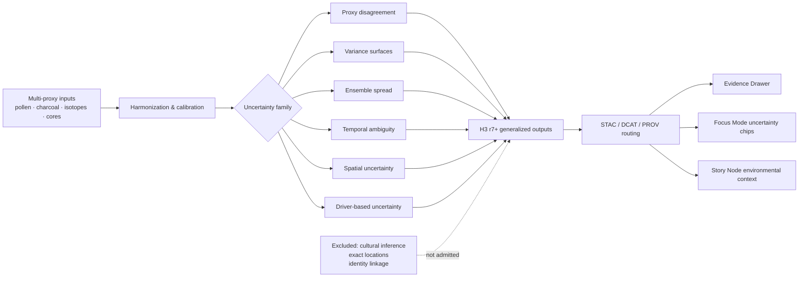

<!-- [KFM_META_BLOCK_V2]
doc_id: kfm://doc/NEEDS-VERIFICATION
title: Paleoenvironmental Results — Uncertainty Registry
type: standard
version: v1
status: review
owners: NEEDS VERIFICATION — prior draft names Paleoenvironment WG · FAIR+CARE Council
created: YYYY-MM-DD
updated: YYYY-MM-DD
policy_label: NEEDS VERIFICATION
related: [../README.md, ../provenance/README.md, ../predictive/README.md, ../drought-cycles/README.md]
tags: [kfm, archaeology, paleoenvironment, uncertainty]
notes: [PDF-only workspace evidence in current session; placeholders retained where mounted repo state was not directly visible.]
[/KFM_META_BLOCK_V2] -->

# Paleoenvironmental Results — Uncertainty Registry

Generalized, sovereignty-safe registry for expressing paleoenvironmental uncertainty across proxy disagreement, variance, temporal ambiguity, and model spread.

> [!IMPORTANT]
> **Status:** `review` — mounted repo state was not directly visible in this session, so local implementation details remain **NEEDS VERIFICATION**. Prior draft material for this exact path marked the lane **Active / Enforced**.
>
> **Owners:** **NEEDS VERIFICATION** — prior draft names `Paleoenvironment WG · FAIR+CARE Council`.
>
>    
>
> **Quick jump:** [Scope](#scope) · [Repo fit](#repo-fit) · [Accepted inputs](#accepted-inputs) · [Directory tree](#directory-tree) · [Uncertainty families](#uncertainty-families) · [Metadata & lineage expectations](#metadata--lineage-expectations) · [Task list](#task-list--definition-of-done) · [FAQ](#faq)

> [!NOTE]
> This README is built upward from the attached KFM corpus and a prior draft of this exact file path. It preserves the strongest lane-specific doctrine, but it does **not** claim that every referenced directory, schema, telemetry file, or workflow is mounted and present in the current workspace.

## Scope

This lane documents **how paleoenvironmental uncertainty is expressed once reconstructions already exist**. Its job is to keep uncertainty legible, environmental-only, and publication-safe.

In practice, this README should help a maintainer answer four questions quickly:

1. What uncertainty families belong here?
2. What absolutely does **not** belong here?
3. How should this lane route into metadata, provenance, and shell surfaces?
4. What still needs direct verification before the file is treated as fully repo-native?

### Evidence posture used in this README

| Label | Meaning here |
| --- | --- |
| **CONFIRMED** | Directly supported by the attached KFM corpus, including a prior draft of this exact target path. |
| **INFERRED** | Strongly implied by adjacent KFM materials and preserved only where it closes an obvious documentation seam. |
| **PROPOSED** | Repo-ready presentation or maintenance structure added in this revision for GitHub clarity. |
| **NEEDS VERIFICATION** | Depends on mounted repo evidence that was not directly visible in this session. |

## Repo fit

This README should function as the **routing and interpretation hub** for the paleoenvironment uncertainty lane.

| Item | Repo fit |
| --- | --- |
| **Path** | `docs/analyses/archaeology/results/paleoenvironment/uncertainty/README.md` |
| **Primary role** | Root README for generalized paleoenvironment uncertainty results |
| **Upstream context** | [`../README.md`](../README.md) |
| **Closest sibling lanes** | [`../climate/README.md`](../climate/README.md), [`../seasonality/README.md`](../seasonality/README.md), [`../vegetation/README.md`](../vegetation/README.md), [`../drought-cycles/README.md`](../drought-cycles/README.md), [`../predictive/README.md`](../predictive/README.md), [`../provenance/README.md`](../provenance/README.md) |
| **Downstream directories** | `proxy-disagreement/`, `variance/`, `ensemble/`, `temporal/`, `spatial/`, `drivers/`, `stac/`, `metadata/`, `provenance/` |
| **Primary shell touchpoints** | Evidence Drawer, Focus Mode uncertainty chips, Story Node environmental context |
| **Expected adjacent contracts** | `../../../../../schemas/json/archaeology-paleoenv-uncertainty-results.schema.json`, `../../../../../schemas/shacl/archaeology-paleoenv-uncertainty-results-shape.ttl`, `../../../../../schemas/telemetry/archaeology-paleoenv-uncertainty-v1.json` — **NEEDS VERIFICATION** |

The routing boundary is intentionally narrow: this file should prioritize **structure, meaning, guardrails, and downstream pointers** over unsupported claims about mature implementation.

## Accepted inputs

The following input classes belong here when they are already **generalized, environmentally framed, and publication-safe**.

| Input class | Belongs here | Notes |
| --- | --- | --- |
| Proxy-conflict summaries | Yes | Pollen/charcoal/isotopes/lake-core disagreement belongs here when the output is uncertainty-first rather than source-first. |
| Reconstruction variance layers | Yes | Variance, spread, smoothing error, and model-derived environmental uncertainty are core lane content. |
| Ensemble spread and model fragility | Yes | Multi-model divergence, proxy-weight variability, and scenario disagreement fit this lane. |
| OWL-Time aligned temporal ambiguity | Yes | Time-window spread, period ambiguity, and reconstruction timing uncertainty belong here. |
| H3 r7+ spatial uncertainty fields | Yes | Spatial error patterns, density-linked uncertainty, and generalized smoothing effects belong here. |
| Driver-linked uncertainty | Yes | Climate, hydrology, soils, vegetation, and ecohydrological-cycle ambiguity are in scope. |
| STAC / DCAT / PROV pointers for uncertainty assets | Yes | This lane should route to outward metadata and lineage rather than duplicate them blindly. |
| Masking, redaction, and review notes | Yes | Only when they explain uncertainty publication posture, not when they try to become the full provenance registry. |

## Exclusions

This directory should **not** be used as a dumping ground for everything uncertain.

It should not host raw proxy-source intake, precise site coordinates, cultural or archaeological inference, identity-linked narratives, settlement chronology claims, or feature-level localization below the lane’s stated spatial generalization threshold.

Route the following elsewhere:

| Does **not** belong here | Route instead |
| --- | --- |
| Raw proxy datasets, collection notes, or source-native landing records | `../provenance/README.md` and source-specific provenance leaves |
| Cultural interpretation, settlement narratives, chronology claims, or group-linked implications | Out of scope for this lane |
| Exact paleo-locations, fine-grained geomorph detail, or sub-generalization outputs | Withhold, generalize further, or route to steward-only review |
| Full predictive model configuration and model-specific governance | `../predictive/README.md` plus predictive provenance |
| Repo- or workflow-specific implementation claims without direct evidence | Mark **NEEDS VERIFICATION** or omit |

## Directory tree

**Directory inventory below is preserved from the strongest prior draft for this exact path and should be verified against the mounted repo before publication.**

```text
docs/analyses/archaeology/results/paleoenvironment/uncertainty/
├── README.md                        # This file
├── proxy-disagreement/              # Proxy conflict (pollen/charcoal/isotopes)
├── variance/                        # Variance / spread layers
├── ensemble/                        # Ensemble spread + model fragility
├── temporal/                        # OWL-Time uncertainty windows
├── spatial/                         # H3 r7+ spatial uncertainty fields
├── drivers/                         # Uncertainty tied to climate/hydrology/soil drivers
├── stac/                            # STAC Items for uncertainty layers
├── metadata/                        # DCAT + JSON-LD metadata
└── provenance/                      # PROV-O lineage for uncertainty modeling
```

## Quickstart

### Add or revise uncertainty content

1. Confirm that the content is **environmental-only** and already generalized enough for this lane.
2. State the uncertainty family explicitly: `proxy-disagreement`, `variance`, `ensemble`, `temporal`, `spatial`, or `drivers`.
3. Make support and time semantics visible: what proxy family, what temporal framing, what spatial generalization.
4. Link outward to metadata and lineage rather than restating them freehand.
5. Mark anything unverified as **NEEDS VERIFICATION** instead of smoothing it into confident prose.

### Start from a narrow, routable shape

```md
## Local notes

- CONFIRMED:
- INFERRED:
- PROPOSED:
- NEEDS VERIFICATION:
```

### Before treating a change as complete

- Verify directory inventory against the mounted repo.
- Resolve or consciously retain metadata placeholders.
- Check that no wording suggests cultural inference.
- Confirm that generalized geometry, uncertainty framing, and lineage routing stay aligned.

## Usage

### Use this lane when the primary question is “how sure are we?”

That includes uncertainty about proxy agreement, reconstruction spread, temporal ambiguity, spatial error patterns, and environmental driver sensitivity.

### Route elsewhere when the primary question is “where did this come from?” or “what exactly was modeled?”

Use `../provenance/README.md` when lineage is the main subject. Use `../predictive/README.md` when model-specific predictive framing is primary. Use sibling paleoenvironment lanes when the content is a climate, seasonality, vegetation, or drought-cycle result first and only secondarily uncertain.

### Keep the lane visibly environmental-only

Uncertainty language here should remain about **proxy fit, reconstruction method, spatial/temporal support, and publication safety**. It should not slide into claims about people, identity, behavior, chronology, migration, or culturally specific history.

## Diagram



## Uncertainty families

| Family | What belongs here | Typical outputs | Guardrails |
| --- | --- | --- | --- |
| **Proxy disagreement** | Direct conflict between proxy families or proxy assemblages | disagreement clusters, proxy-comparison summaries, environmental ambiguity notes | Must remain about environmental signal disagreement, never cultural signal |
| **Variance surfaces** | Reconstruction spread, anomaly spread, smoothing error, model-derived environmental uncertainty | variance rasters, summary tables, spread envelopes | Keep units/support visible; do not imply false precision |
| **Ensemble spread** | Multi-model or multi-proxy divergence | divergence summaries, fragility indicators, disagreement envelopes | Present as modeled uncertainty, not hidden consensus |
| **Temporal uncertainty** | OWL-Time aligned time-window spread and reconstruction timing ambiguity | period envelopes, temporal spread summaries, ambiguity intervals | Explicitly label temporal support and aggregation basis |
| **Spatial uncertainty** | H3-generalized spatial error patterns, density-linked uncertainty, smoothing-range effects | generalized error fields, density-linked uncertainty surfaces | No sub-H3 or precise-site reconstruction in this lane |
| **Driver-based uncertainty** | Ambiguity tied to climate, hydrology, soils, vegetation, or ecohydrological cycles | driver-linked uncertainty notes, cross-driver uncertainty surfaces | Never recast environmental drivers as archaeological or cultural drivers |

## Metadata & lineage expectations

This README should keep the metadata and lineage boundary **visible and routable**.

| Surface / contract | This lane should make explicit | Why it matters |
| --- | --- | --- |
| **STAC** | Generalized geometry, uncertainty-type designation, environmental-only roles, lineage links | Uncertainty assets should be discoverable without losing their generalization and support context |
| **DCAT** | Dataset purpose, FAIR+CARE framing, scope, distribution/licensing posture, method summary | Publication-safe uncertainty depends on visible scope and reuse conditions |
| **PROV-O** | Reconstruction methods, smoothing/interpolation, environmental models used, masking/generalization, uncertainty propagation | Uncertainty without lineage turns into unsupported mood instead of inspectable evidence |
| **Evidence Drawer / shell surfaces** | One-hop route to evidence, uncertainty chips, freshness/review cues, environmental-only wording | KFM trust surfaces must not hide uncertainty or detach it from evidence |

### Recommended publication posture

| Requirement | Expectation in this lane |
| --- | --- |
| Spatial precision | **H3 r7+ generalized** or stricter |
| Temporal framing | OWL-Time aligned when historical interpretation matters |
| Uncertainty visibility | In-place, not buried in appendices |
| Rights / sensitivity | Visible before outward use |
| Correction behavior | Narrowing, withdrawal, or replacement should remain visible |

## Task list / definition of done

- [ ] KFM Meta Block v2 placeholders are replaced or consciously retained with review notes
- [ ] Mounted directory inventory matches the tree shown here
- [ ] Owners, dates, and policy label are verified against live repo conventions
- [ ] Every active subdirectory has a clear upstream/downstream routing boundary
- [ ] No section blurs environmental uncertainty into cultural interpretation
- [ ] H3 r7+ and OWL-Time statements are checked against actual pipeline or schema evidence
- [ ] STAC / DCAT / PROV references are verified against mounted files or consciously marked as pending
- [ ] At least one real example, registry leaf, or artifact pointer exists for each active uncertainty family
- [ ] Any implementation-depth statements that cannot be proven in-session are labeled **NEEDS VERIFICATION**
- [ ] Long reference material stays collapsed and does not drown the scanning path

## FAQ

### Why is uncertainty separate from provenance?

Because the two lanes answer different questions. Uncertainty asks **how sure are we, about what, at what support and time grain?** Provenance asks **what sources, transforms, and review steps produced the result?** They should stay linked, but they should not collapse into one file.

### What is the minimum spatial precision for this lane?

This README preserves the prior draft rule that uncertainty outputs stay **H3 r7+ generalized**. Anything finer should be treated as **NEEDS VERIFICATION** at minimum and may need to be withheld or routed into steward review instead of this public-facing or general-facing lane.

### Can predictive-model uncertainty appear here?

Yes, but only when the content is still uncertainty-first and environmental-only. Full predictive-model configuration, scenario logic, and model-governance detail should remain routed through `../predictive/README.md` and predictive provenance leaves.

### Does Focus Mode use this directly?

This lane is intended to support **uncertainty chips** and bounded environmental context in Focus Mode. It should help Focus explain uncertainty, not hide it, and it should never become a detached answer source.

### What should happen if an uncertainty layer could be culturally misread?

Generalize further, narrow the representation, or remove it from outward use. This README should prefer **visible withholding** over persuasive but unsafe interpretation.

## Appendix

<details>
<summary><strong>Appendix — placeholder resolution, adjacent paths, and review prompts</strong></summary>

### Placeholder resolution ledger

| Placeholder | Why it remains unresolved here | Verify from |
| --- | --- | --- |
| `doc_id` | No mounted repo metadata registry was directly visible | Repo-local metadata or document registry |
| `owners` | Prior draft names are visible, but live repo ownership was not verified | CODEOWNERS, adjacent docs, or governance registry |
| `created` / `updated` | Current session did not expose git history or live file timestamps | Repo history / file metadata |
| `policy_label` | Prior draft suggests internal or restricted posture, but no mounted exception list was visible | Local policy taxonomy |

### Expected adjacent paths to confirm

| Path | Why it matters | Status |
| --- | --- | --- |
| `../README.md` | Parent paleoenvironment results hub | Expected / verify mounted file |
| `../provenance/README.md` | Lineage routing and uncertainty propagation details | Expected / verify mounted file |
| `../predictive/README.md` | Predictive uncertainty boundary | Expected / verify mounted file |
| `../../../../../schemas/json/archaeology-paleoenv-uncertainty-results.schema.json` | JSON contract path from prior draft | NEEDS VERIFICATION |
| `../../../../../schemas/shacl/archaeology-paleoenv-uncertainty-results-shape.ttl` | Shape validation path from prior draft | NEEDS VERIFICATION |
| `../../../../../schemas/telemetry/archaeology-paleoenv-uncertainty-v1.json` | Telemetry reference from prior draft | NEEDS VERIFICATION |

### Reviewer prompts

- Is every uncertainty statement still environmental-only?
- Does each leaf make support and time semantics explicit?
- Is generalized geometry visibly called out where it changes meaning?
- Are lineage and metadata routed rather than duplicated?
- Are placeholders being resolved with evidence rather than preference?

[Back to top](#paleoenvironmental-results--uncertainty-registry)

</details>
