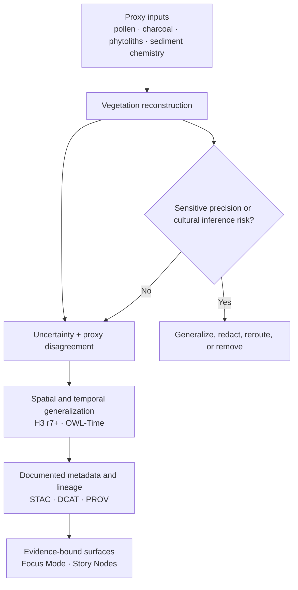

<!-- [KFM_META_BLOCK_V2]
doc_id: kfm://doc/NEEDS-VERIFICATION
title: Paleoenvironmental Results — Vegetation & Ecozone Reconstructions
type: standard
version: v1
status: review
owners: Paleoenvironment WG · FAIR+CARE Council
created: YYYY-MM-DD
updated: 2025-11-17
policy_label: restricted
related: [../README.md, ../climate/README.md, ../predictive/README.md, ../provenance/README.md, ../seasonality/README.md]
tags: [kfm, archaeology, paleoenvironment, vegetation, ecozones]
notes: [Title, stewardship, safety posture, and schema references are source-grounded; created date, kfm://doc mapping, and mounted sibling inventory still need direct repo verification.]
[/KFM_META_BLOCK_V2] -->

# Paleoenvironmental Results — Vegetation & Ecozone Reconstructions

Generalized, sovereignty-safe vegetation and ecozone results for KFM archaeology and paleoenvironment work.

> [!NOTE]
> **Status:** stable  
> **Owners:** Paleoenvironment WG · FAIR+CARE Council  
>      
> **Quick jumps:** [Scope](#scope) · [Repo fit](#repo-fit) · [Accepted inputs](#accepted-inputs) · [Exclusions](#exclusions) · [Current verified snapshot](#current-verified-snapshot) · [Directory tree](#directory-tree) · [Quickstart](#quickstart) · [Usage](#usage) · [Diagram](#diagram) · [Result matrix](#result-matrix) · [Metadata & lineage expectations](#metadata--lineage-expectations) · [Task list](#task-list--definition-of-done) · [FAQ](#faq) · [Appendix](#appendix)  
> **Repo fit:** `docs/analyses/archaeology/results/paleoenvironment/vegetation/` → upstream: [`../README.md`](../README.md) · adjacent lanes: [`../climate/README.md`](../climate/README.md), [`../predictive/README.md`](../predictive/README.md), [`../provenance/README.md`](../provenance/README.md), [`../seasonality/README.md`](../seasonality/README.md)

> [!IMPORTANT]
> This lane is for **environmental vegetation reconstruction only**. It exists to hold generalized ecozone, biomass, canopy, groundcover, and vegetation-transition outputs that remain downstream of evidence, masking, uncertainty handling, and FAIR+CARE review.

> [!WARNING]
> Current session evidence clearly defines this lane’s doctrine, safety posture, and documented path references, but does **not** directly verify the mounted repo inventory, CI wiring, schema files, or every sibling leaf. Treat unsurfaced file inventory and enforcement details as **NEEDS VERIFICATION**.

## Scope

This directory is the routing and documentation surface for KFM’s vegetation-focused paleoenvironment results. It covers environmental reconstructions that describe long-horizon vegetation change without collapsing into cultural interpretation.

In scope here:

- generalized ecozone distributions
- paleo-biomass envelopes
- canopy versus groundcover reconstructions
- proxy-assemblage composites for vegetation interpretation
- vegetation stability and transition surfaces
- OWL-Time-aligned temporal vegetation summaries
- uncertainty-aware environmental context for Story Nodes and Focus Mode

This lane should preserve a strict distinction between **environmental reconstruction** and **cultural meaning**. Vegetation results can support archaeological context, but they must not become a side door for identity claims, migration stories, tribal attribution, or sensitive landscape reconstruction.

[Back to top](#paleoenvironmental-results--vegetation--ecozone-reconstructions)

## Repo fit

| Path | Role | Relationship |
| --- | --- | --- |
| `docs/analyses/archaeology/results/paleoenvironment/vegetation/README.md` | this file | directory README and routing surface for vegetation results |
| [`../README.md`](../README.md) | parent paleoenvironment results lane | use for cross-lane rules, shared posture, and sibling navigation |
| [`../climate/README.md`](../climate/README.md) | adjacent reconstruction lane | use when the output is climate-first rather than vegetation-first |
| [`../predictive/README.md`](../predictive/README.md) | predictive modeling lane | use when the work becomes forecast-, scenario-, or model-driven rather than reconstruction-first |
| [`../provenance/README.md`](../provenance/README.md) | lineage lane | use when the document’s main burden is PROV-O, masking logs, or transformation history |
| [`../seasonality/README.md`](../seasonality/README.md) | temporal sibling lane | use when seasonal signal or temporal envelope is primary and vegetation is secondary |

## Accepted inputs

Place material here when it is primarily about **generalized paleo-vegetation results**:

- pollen, charcoal, phytolith, or sediment-chemistry vegetation composites
- broad ecozone reconstructions
- biomass or vegetation-density envelopes
- canopy / shrub / grass / forb balance summaries
- OWL-Time-aligned vegetation interval summaries
- uncertainty and proxy-disagreement outputs specific to vegetation interpretation
- vegetation result metadata and references to STAC / DCAT / PROV artifacts
- environmental-only summary language intended for Focus Mode or Story Node context

## Exclusions

Do **not** place the following here:

- climate-first reconstructions → [`../climate/README.md`](../climate/README.md)
- predictive vegetation or paleoenvironment forecasting → [`../predictive/README.md`](../predictive/README.md)
- provenance bundles, masking logs, or lineage-first registries → [`../provenance/README.md`](../provenance/README.md)
- cultural or tribal attribution claims, migration narratives, or identity associations → outside this lane
- exact-location or sub-H3 vegetation releases → not allowed here
- raw proxy archives whose main burden is source stewardship rather than vegetation interpretation → route to the owning source/provenance lane
- unsupported statements that a reconstruction is published, enforced, or schema-validated when the mounted repo evidence does not prove that state

## Status vocabulary used in this lane

| Label | Use here |
| --- | --- |
| **CONFIRMED** | Directly supported by the visible project source corpus in this session |
| **INFERRED** | Conservative completion that fits the source family but was not directly surfaced as mounted repo evidence |
| **PROPOSED** | Recommended structure, workflow, or documentation move beyond what the source proves |
| **UNKNOWN** | Not verified strongly enough in the current session |
| **NEEDS VERIFICATION** | Review flag for mounted paths, schemas, automation, ownership, or inventory details |

## Current verified snapshot

The strongest currently surfaced evidence for this lane is doctrinal and structural rather than implementation-complete.

| Item | Verified state | Notes |
| --- | --- | --- |
| Exact target path and title | **CONFIRMED** | This README path and title are named directly in the source draft family |
| Lane purpose and safety posture | **CONFIRMED** | Environmental-only vegetation reconstructions with strict FAIR+CARE alignment |
| Core vegetation result types | **CONFIRMED** | Ecozones, biomass, canopy / groundcover, proxy assemblages, temporal alignment, uncertainty-aware outputs |
| Explicit prohibitions | **CONFIRMED** | No cultural inference, no habitat-to-group attribution, no culturally sensitive landscape reconstruction, no sub-H3 precision |
| Metadata / schema references | **CONFIRMED** | JSON Schema and SHACL paths are named in the source draft family |
| Mounted repo sibling inventory | **NEEDS VERIFICATION** | Adjacent README paths are source-drafted and structurally plausible, but the mounted tree was not directly inspected here |
| Exact subdirectory inventory beyond surfaced names | **NEEDS VERIFICATION** | See the directory tree section for where the line is drawn between confirmed and inferred structure |

That means this README should prioritize **routing, boundaries, metadata expectations, and review discipline** over claims about mature implementation or already-enforced automation.

## Directory tree

```text
docs/
└── analyses/
    └── archaeology/
        └── results/
            └── paleoenvironment/
                └── vegetation/
                    ├── README.md                  # CONFIRMED
                    ├── ecozones/                 # CONFIRMED in source draft
                    ├── biomass/                  # CONFIRMED in source draft
                    ├── canopy-groundcover/       # CONFIRMED in source draft
                    ├── proxy-assemblages/        # CONFIRMED in source draft
                    ├── temporal/                 # CONFIRMED in source draft
                    ├── uncertainty/              # INFERRED from documented lane behavior; NEEDS VERIFICATION
                    ├── stac/                     # INFERRED from documented metadata pattern; NEEDS VERIFICATION
                    ├── metadata/                 # INFERRED from documented metadata pattern; NEEDS VERIFICATION
                    └── provenance/               # INFERRED from documented lineage pattern; NEEDS VERIFICATION
```

## Quickstart

When adding or revising vegetation material in this lane, keep the entry narrow, generalized, and explicit about what it is allowed to mean.

Illustrative starter shape:

```md
# <OWL-Time interval> — <Vegetation result name>

One-line purpose for a generalized, environmental-only vegetation result.

## What this result is
- ecozone / biomass / canopy-groundcover output
- OWL-Time interval or temporal envelope
- proxy basis
- uncertainty summary

## Minimum release posture
- Spatial support: H3 r7+ or coarser
- Cultural linkage: prohibited
- FAIR+CARE review: required
- Metadata links: STAC / DCAT / PROV refs or NEEDS VERIFICATION
- Public-safe note: generalized and sovereignty-safe

## Verification notes
- CONFIRMED:
- INFERRED:
- PROPOSED:
- NEEDS VERIFICATION:
```

## Usage

### Add or update a vegetation reconstruction

1. Confirm that the material is **vegetation-first** rather than climate-first, provenance-first, or predictive-first.
2. State the **temporal support** clearly using an OWL-Time interval, slice, or equivalent documented period language.
3. Record the **proxy basis** in a way that supports review without exposing sensitive source detail unnecessarily.
4. Keep the spatial representation **generalized to H3 r7+ or coarser**.
5. Include an **uncertainty statement** that explains disagreement, spread, confidence limits, or reconstruction ambiguity.
6. Link to STAC / DCAT / PROV references when they exist; otherwise mark the gap as **NEEDS VERIFICATION** rather than implying completion.
7. Remove or rewrite any language that drifts into cultural inference, identity association, or sensitive paleo-landscape reconstruction.

### Route adjacent work correctly

- Climate-led reconstruction belongs in [`../climate/README.md`](../climate/README.md).
- Predictive or scenario-led work belongs in [`../predictive/README.md`](../predictive/README.md).
- Lineage, redaction logs, or transformation history belong in [`../provenance/README.md`](../provenance/README.md).
- Shared paleoenvironment rules belong in [`../README.md`](../README.md).

### Update this README

Update this file when any of the following changes:

- the verified lane inventory changes
- sibling lane paths are directly confirmed or corrected
- schema or shape references are reverified
- the lane gains a stable naming pattern for result leaves
- the safety boundary changes for Focus Mode or Story Node use
- FAIR+CARE review expectations become more explicit in mounted repo evidence

## Diagram



## Result matrix

| Result family | What belongs here | Routing note |
| --- | --- | --- |
| **Ecozones** | Broad prairie / woodland / savanna / wetland analog surfaces and region envelopes | Keep generalized; do not overclaim biome precision |
| **Biomass** | Biomass density envelopes, productivity indicators, moisture-linked vegetation response | Environmental-only; no cultural interpretation |
| **Canopy / groundcover** | Tree–shrub–grass–forb balance, shading or cover envelopes | Use when structural vegetation pattern is the main burden |
| **Proxy assemblages** | Multi-proxy vegetation composites combining pollen, charcoal, phytoliths, or sediment chemistry | Keep source roles legible and uncertainty visible |
| **Temporal vegetation summaries** | OWL-Time-aligned transitions, stability intervals, vegetation change across broad periods | Route to seasonality/climate only when vegetation is secondary |
| **Uncertainty summaries** | Proxy disagreement, reconstruction spread, confidence or ambiguity notes for vegetation outputs | May live here conceptually; exact mounted subdirectory inventory still needs verification |

## Metadata & lineage expectations

The source draft family clearly expects this lane to participate in a broader STAC / DCAT / PROV pattern. The table below captures the **documented expectation**, not a claim that all paths are already mounted and wired.

| Surface | Minimum expectation for this lane | Verification status |
| --- | --- | --- |
| **Result metadata** | generalized spatial support, temporal interval, proxy descriptors, uncertainty summary, stewardship posture | **CONFIRMED** as doctrine |
| **STAC** | generalized geometry, vegetation-domain metadata, proxy-source descriptors, uncertainty information, lineage references | **CONFIRMED** as source-drafted expectation |
| **DCAT** | dataset purpose, scope, FAIR+CARE constraints, distribution framing, access posture | **INFERRED** from sibling paleoenvironment docs; exact mounted path needs verification |
| **PROV-O** | proxy inputs, transformations, masking / generalization, uncertainty propagation, configuration / lineage context | **INFERRED** from sibling paleoenvironment docs; exact mounted path needs verification |
| **Schema references** | JSON Schema and SHACL refs should remain linked and reviewable | **CONFIRMED** as documented paths; mounted existence needs verification |

### Documented contract references

| Reference | Documented path |
| --- | --- |
| JSON Schema | `../../../../../schemas/json/archaeology-paleoenv-vegetation-results.schema.json` |
| SHACL Shape | `../../../../../schemas/shacl/archaeology-paleoenv-vegetation-results-shape.ttl` |
| Telemetry schema | `../../../../../schemas/telemetry/archaeology-paleoenv-vegetation-v1.json` |
| Governance root | `../../../../standards/governance/ROOT-GOVERNANCE.md` |

## AI and surface-use limits

| Use | Status | Notes |
| --- | --- | --- |
| Summaries | Allowed | Environmental-only summary use is documented |
| Semantic highlighting | Allowed | Keep meaning subordinate to evidence and release state |
| Uncertainty explanation | Allowed | Good fit for vegetation ambiguity and proxy disagreement |
| Cultural inference | Prohibited | Do not infer group identity, affiliation, or culture from vegetation data |
| Migration reconstruction | Prohibited | Do not derive mobility or migration narratives from this lane |
| Identity association | Prohibited | Do not tie environmental patterns to specific people or groups |

## Task list — Definition of done

Before treating a vegetation result as review-ready in this lane, confirm the following:

- [ ] The output is **environmental-only** and vegetation-first.
- [ ] Spatial support is generalized to **H3 r7+ or coarser**.
- [ ] Temporal support is declared with an **OWL-Time interval** or equivalent documented slice.
- [ ] Proxy basis is named clearly enough for review.
- [ ] Uncertainty, disagreement, or spread is explained.
- [ ] Any Story Node / Focus Mode use is explicitly **environment-only**.
- [ ] Cultural linkage, migration claims, tribal attribution, and identity association are absent.
- [ ] STAC / DCAT / PROV references are linked, or the gap is marked **NEEDS VERIFICATION**.
- [ ] FAIR+CARE review needs are visible.
- [ ] Any exact-location or sensitive precision risk is generalized, redacted, rerouted, or removed.

> [!TIP]
> Exact CI, schema-validation, and release-proof automation for this lane were **not** directly surfaced in the mounted repo during this session. Keep review gates visible, but do not imply more runtime maturity than the evidence supports.

## FAQ

### Is this the place for predictive vegetation models?

No. Predictive or scenario-driven vegetation work belongs in the predictive paleoenvironment lane, typically via [`../predictive/README.md`](../predictive/README.md).

### Can this lane support Focus Mode or Story Nodes?

Yes, but only as **environment-only** background with explicit uncertainty and without cultural inference.

### Can this lane publish exact paleo-locations or fine-grained site vegetation?

No. The source-drafted posture prohibits sub-H3 precision and culturally sensitive paleo-landscape reconstruction in this lane.

### Does this README prove that all referenced schemas, directories, and CI checks are mounted today?

No. It documents the strongest visible lane contract and routing logic. Mounted repo presence for every referenced path remains **NEEDS VERIFICATION** unless separately surfaced.

### Why is uncertainty treated as mandatory rather than optional?

Because the lane is built from proxy-driven reconstruction rather than direct, exhaustive observation. Suppressing uncertainty would misstate what the outputs can support.

## Appendix

<details>
<summary><strong>Open verification backlog</strong></summary>

### Mounted repo questions still open

| Item | Why it matters |
| --- | --- |
| Exact `created` date for this README | Needed to fully populate KFM Meta Block V2 |
| Confirmed `kfm://doc/...` identifier mapping | The source draft exposes a `urn:kfm:doc:...`, not a `kfm://doc/...` value |
| Mounted existence of sibling README paths | Needed before treating all related links as fully verified |
| Mounted existence of vegetation subdirectories beyond surfaced names | Needed for exact directory tree accuracy |
| JSON Schema, SHACL, and telemetry schema file presence | Needed before implying validator coverage |
| Current CODEOWNERS / review owners | Needed if owner display should reflect repo governance rather than source draft stewardship |
| CI or workflow enforcement for this lane | Needed before claiming automated schema or review gates |

### Editing rule for future maintainers

When evidence is partial:

1. keep the environmental-only boundary explicit,
2. prefer **NEEDS VERIFICATION** over smooth overclaiming,
3. route predictive, provenance, and climate work to the sibling lanes that own them,
4. preserve uncertainty and masking language rather than compressing it away.

[Back to top](#paleoenvironmental-results--vegetation--ecozone-reconstructions)

</details>
