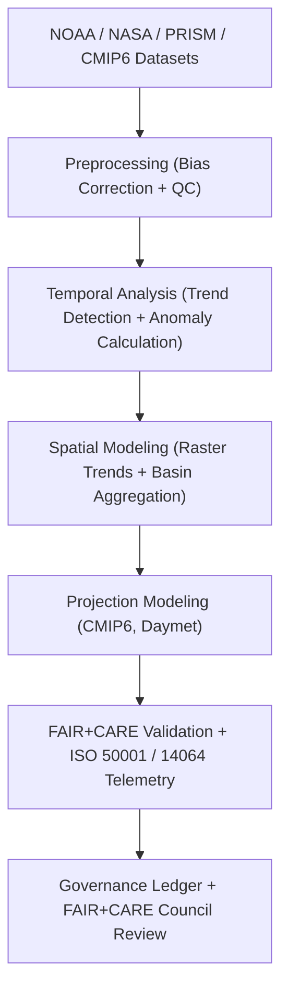

<div align="center">

# 🌦️ **Kansas Frontier Matrix — Climatology Analyses Overview**
`docs/analyses/climatology/README.md`

**Purpose:**  
Document and govern all **climate-oriented analytical workflows** in the Kansas Frontier Matrix (KFM), including **temperature and precipitation trend analyses**, **extreme weather validation**, and **future projection modeling**.  
These workflows comply with **FAIR+CARE**, **ISO 19115**, and **MCP-DL v6.3** documentation-first standards, ensuring scientific reproducibility, sustainability, and ethical climate governance.

[](../../../README.md)
[](../../../../LICENSE)
[](../../../../docs/standards/README.md)
[](../../../../releases/)
</div>

---

## 📘 Overview

The **Climatology Analysis Module** explores Kansas’s long-term temperature, precipitation, and atmospheric behavior using open datasets (NOAA, NASA, PRISM, and CMIP6).  
It serves as the backbone for **hydrologic**, **agricultural**, and **ecological** modeling by providing validated climate indicators under FAIR+CARE and ISO-aligned telemetry standards.

**Primary Objectives**
- Detect and quantify **temperature and precipitation trends** since 1850  
- Analyze **extreme weather events** (droughts, floods, heatwaves, and cold spells)  
- Integrate **future climate projections** using CMIP6 and Daymet datasets  
- Provide FAIR+CARE-validated results supporting sustainability and policy frameworks  

---

## 🗂️ Directory Layout

```plaintext
docs/analyses/climatology/
├── README.md                                  # This overview
├── datasets/                                  # Climate data sources and metadata
│   ├── README.md
│   ├── raw/                                   # NOAA, NASA, PRISM, CMIP6 datasets
│   ├── processed/                             # Cleaned, bias-corrected climate time-series
│   ├── derived/                               # Trend surfaces, anomaly indices
│   └── metadata/                              # STAC/DCAT 3.0 + FAIR+CARE metadata registry
├── temporal-modeling.md                       # Time-series and anomaly modeling methods
├── spatial-trends.md                          # Geospatial climate trend mapping
├── projection-modeling.md                     # CMIP6 and Daymet climate projection workflows
├── validation.md                              # FAIR+CARE and ISO validation
└── reports/                                   # Dashboards, summaries, and visualization products
    ├── README.md
    ├── climatology_summary.json
    ├── sustainability_audit.json
    └── visualization/
        ├── temperature_trend_map.png
        ├── precipitation_anomaly_overlay.png
        └── cmip6_projection_timeseries.png
```

---

## 🧩 Analytical Framework



---

## ⚙️ Core Datasets

| Source | Dataset | Variables | Coverage | FAIR+CARE Status |
|--------|----------|------------|-----------|------------------|
| **NOAA NCEI** | GHCN-Daily | Tmin, Tmax, Precip | 1880–present | ✅ Certified |
| **PRISM Climate Group** | Gridded Climate Data | Tmean, Precip | 1895–present | ✅ Certified |
| **NASA Daymet V4** | Daily Surface Weather | Tmin, Tmax, P, VP | 1980–present | ✅ Certified |
| **CMIP6 (Downscaled)** | Climate Projections (SSP1–SSP5) | Tmean, Precip, PET | 2015–2100 | ✅ Certified |
| **NOAA Storm Events** | Severe Weather & Extremes | Event, Date, Magnitude | 1950–present | ✅ Certified |

---

## 🌡️ Temporal Analysis Overview

Temporal analysis quantifies climate variability and trends across Kansas:

| Method | Purpose | Tools | Output |
|--------|----------|-------|--------|
| **Mann–Kendall Trend Test** | Detects monotonic temperature/precipitation trends | `pyMannKendall` | Trend slope, p-value |
| **Sen’s Slope Estimator** | Quantifies rate of change per decade | `scipy.stats` | °C or mm/decade |
| **Seasonal Decomposition (STL)** | Isolates long-term trend and cyclic components | `statsmodels` | Decomposed series |
| **Wavelet Transform** | Identifies multi-scale oscillations (ENSO, PDO) | `pycwt` | Power spectra |
| **Extreme Value Analysis (EVA)** | Detects annual maxima/minima | `extremefit` | Return period estimates |

---

## 🗺️ Spatial Trend Mapping

| Product | Description | Format |
|----------|--------------|--------|
| `temperature_trend_map.tif` | Raster map of temperature trend slopes (°C/decade). | GeoTIFF (COG) |
| `precipitation_anomaly_overlay.tif` | Gridded precipitation anomaly index (SPEI). | GeoTIFF |
| `trend_significance.geojson` | Basin-level areas with significant p < 0.05 trends. | GeoJSON |
| `seasonality_shift_map.tif` | Shift in wet/dry season onset from 1900–2025. | GeoTIFF |

Spatial analyses employ Moran’s I and Gi* to detect clusters of significant change.

---

## 🔮 Climate Projection Modeling (CMIP6 + Daymet)

Future scenarios integrate **CMIP6** downscaled datasets with **Daymet** high-resolution historical baselines:

| Model | Scenario | Variables | Temporal Range | Resolution |
|--------|-----------|------------|----------------|-------------|
| **ACCESS-ESM1-5** | SSP2–4.5 | Tmean, Precip | 2020–2100 | 0.25° |
| **GFDL-ESM4** | SSP3–7.0 | Tmean, PET | 2020–2100 | 0.25° |
| **UKESM1-0-LL** | SSP5–8.5 | Tmean, Precip | 2020–2100 | 0.25° |

Outputs:
- Multi-model ensemble mean temperature and precipitation maps.  
- Annual anomaly projections (relative to 1991–2020 climatology).  
- FAIR+CARE registered CMIP6 metadata via `datasets/metadata/`.

---

## ⚖️ FAIR+CARE & ISO Governance Integration

| Principle | Implementation | Verification Source |
|------------|----------------|--------------------|
| **Findable** | STAC/DCAT 3.0 metadata for all products | `datasets/metadata/` |
| **Accessible** | Public FAIR+CARE releases under CC-BY | Governance Ledger |
| **Interoperable** | GeoTIFF, NetCDF, CSV, JSON-LD formats | `telemetry_schema` |
| **Reusable** | Lineage tracked in manifest and audit logs | `manifest_ref` |
| **Collective Benefit** | Supports Kansas climate resilience policy | FAIR+CARE Audit |
| **Responsibility** | Tracks energy and carbon per model run | `telemetry_ref` |
| **Ethics** | Sensitive projections anonymized at county level | FAIR+CARE Council Review |

---

## 🧮 Sustainability Metrics

| Metric | Description | Target | Unit |
|---------|-------------|---------|------|
| **Energy (J)** | Mean energy per analysis run | ≤ 15 | Joules |
| **Carbon (gCO₂e)** | CO₂ output per module | ≤ 0.006 | gCO₂e |
| **Telemetry Coverage (%)** | FAIR+CARE trace completion | ≥ 95 | % |
| **Validation Compliance (%)** | FAIR+CARE audit success rate | 100 | % |

---

## 🧾 Governance Ledger Example

```json
{
  "ledger_id": "climatology-analysis-ledger-2025-11-09-0012",
  "component": "Climatology Analysis and Projection Module",
  "datasets": [
    "NOAA GHCN-Daily",
    "PRISM Gridded Climate Data",
    "NASA Daymet V4",
    "CMIP6 SSP Projections"
  ],
  "energy_joules": 13.6,
  "carbon_gCO2e": 0.0055,
  "faircare_status": "Pass",
  "auditor": "FAIR+CARE Council",
  "timestamp": "2025-11-09T13:35:00Z"
}
```

---

## 🕰️ Version History

| Version | Date | Author | Summary |
|----------|------|--------|----------|
| v10.2.2 | 2025-11-09 | FAIR+CARE Council | Published aligned climatology overview with CMIP6 projections and telemetry integration. |
| v10.2.1 | 2025-11-09 | Climatology Working Group | Added projection modeling and sustainability audit structure. |
| v10.2.0 | 2025-11-09 | KFM Data Science Team | Initial climatology documentation under MCP-DL v6.3 with FAIR+CARE registry. |

---

<div align="center">

© 2025 Kansas Frontier Matrix Project  
Master Coder Protocol v6.3 · FAIR+CARE Certified · Diamond⁹ Ω / Crown∞Ω Ultimate Certified  

[Back to Analyses Overview](../README.md) · [Governance Charter](../../../../docs/standards/governance/ROOT-GOVERNANCE.md)

</div>

