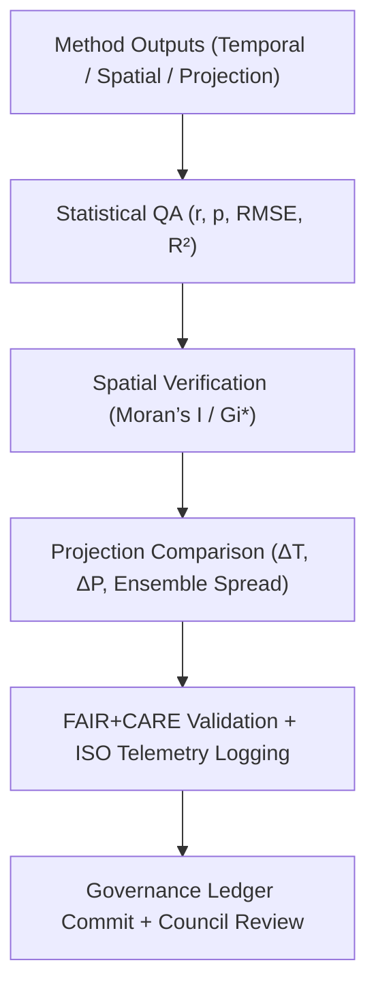

<div align="center">

# 🌦️ **Kansas Frontier Matrix — Climatology Methods Validation Framework**
`docs/analyses/climatology/methods/validation.md`

**Purpose:**  
Define the **validation, verification, and sustainability auditing framework** for all climatology analytical methods in the Kansas Frontier Matrix (KFM).  
This validation schema ensures reproducibility and governance alignment with **FAIR+CARE**, **ISO 50001/14064**, and **MCP-DL v6.3** through quantitative metrics, automated QA, and ethical oversight.

[](../../../README.md)
[](../../../../../LICENSE)
[](../../../../../docs/standards/README.md)
[](../../../../../releases/)
</div>

---

## 📘 Overview

The **Climatology Methods Validation Framework** establishes a unified governance structure for all climate analyses conducted in KFM — covering temporal, spatial, and projection modeling.  
Each validation run tests data quality, model integrity, and ethical compliance through FAIR+CARE audits, sustainability telemetry, and governance ledger recording.

Validation is divided into **five domains**:
1. **Data Integrity Validation** — Source verification and completeness  
2. **Statistical Validation** — Correlation, bias, and variance performance  
3. **Spatial Validation** — Geostatistical accuracy and hotspot confidence  
4. **Projection Validation** — Model ensemble spread and bias correction accuracy  
5. **Sustainability Validation** — ISO 50001 / 14064-compliant telemetry for energy and emissions  

---

## 🗂️ Directory Layout

```plaintext
docs/analyses/climatology/methods/
├── README.md                                  # Methods overview
├── temporal-modeling.md                       # Time-series analysis
├── spatial-trends.md                          # Spatial interpolation and trend mapping
├── projection-modeling.md                     # Climate scenario modeling
└── validation.md                              # This document
```

---

## 🧩 Validation Framework



---

## ⚙️ Validation Metrics

| Metric | Description | Validation Target | Unit |
|---------|-------------|-------------------|------|
| **r (Correlation)** | Correlation between modeled and observed datasets | ≥ 0.7 | — |
| **RMSE** | Root Mean Square Error for trend or projection accuracy | ≤ 10% | — |
| **Bias (Δ)** | Mean deviation from observed climatology | ≤ 5% | °C / % |
| **Ensemble Spread** | Variability across CMIP6 ensemble projections | ≤ 15% | — |
| **Moran’s I** | Spatial autocorrelation measure | ≥ 0.4 | — |
| **Energy (J)** | Energy used per validation run | ≤ 15 | Joules |
| **Carbon (gCO₂e)** | Carbon emissions per run | ≤ 0.006 | gCO₂e |

Each validation cycle generates JSON reports (`faircare_validation.json`) that synchronize with KFM’s Governance Ledger for provenance tracking.

---

## 🧠 Validation Domains

### 1️⃣ Data Integrity Validation
- Verify STAC/DCAT metadata and checksum logs for every dataset.
- Compare variable units and coordinate systems across data sources.

### 2️⃣ Statistical Validation
- Compute R², RMSE, p-values, and bias for model predictions versus observed data.
- Validate trend directionality and magnitude consistency.

### 3️⃣ Spatial Validation
- Assess spatial clustering significance using Moran’s I and Getis–Ord Gi*.
- Ensure consistency between gridded results and basin averages.

### 4️⃣ Projection Validation
- Evaluate CMIP6 model deltas (ΔT, ΔP) relative to baseline climatology.
- Quantify ensemble mean vs. individual model spread; flag outliers.

### 5️⃣ Sustainability Validation
- Log energy and carbon metrics from each validation run.
- Validate telemetry coverage and ethics compliance under FAIR+CARE governance.

---

## 🧮 FAIR+CARE Validation Record Example

```json
{
  "validation_id": "climatology-methods-validation-2025-11-09-0105",
  "modules_validated": [
    "Temporal Modeling",
    "Spatial Trends",
    "Projection Modeling"
  ],
  "metrics": {
    "r": 0.81,
    "rmse": 0.09,
    "bias": 0.04,
    "moran_i": 0.46,
    "ensemble_spread": 0.12
  },
  "energy_joules": 14.3,
  "carbon_gCO2e": 0.0056,
  "validation_status": "Pass",
  "auditor": "FAIR+CARE Council",
  "timestamp": "2025-11-09T15:45:00Z"
}
```

---

## ⚖️ FAIR+CARE & ISO Governance Matrix

| Principle | Implementation | Validation Source |
|------------|----------------|--------------------|
| **Findable** | All validation results stored in FAIR+CARE registry | `reports/faircare_validation.json` |
| **Accessible** | Publicly accessible validation logs under CC-BY | FAIR+CARE Ledger |
| **Interoperable** | JSON and CSV validation records | `telemetry_schema` |
| **Reusable** | Provenance, parameters, and methods embedded | `manifest_ref` |
| **Responsibility** | Energy and emissions logged under ISO 50001/14064 | `telemetry_ref` |
| **Ethics** | FAIR+CARE Council reviews ethical and data equity aspects | Governance Charter |

---

## 🧾 Governance Ledger Record Example

```json
{
  "ledger_id": "climatology-methods-validation-ledger-2025-11-09-0106",
  "component": "Climatology Methods Validation Framework",
  "modules": [
    "Temporal Modeling",
    "Spatial Trends",
    "Projection Modeling"
  ],
  "energy_joules": 14.3,
  "carbon_gCO2e": 0.0056,
  "faircare_status": "Pass",
  "auditor": "FAIR+CARE Council",
  "timestamp": "2025-11-09T15:47:00Z"
}
```

---

## 🧮 Sustainability Metrics Summary

| Metric | Description | Value | Target | Unit |
|---------|-------------|--------|---------|------|
| **Energy (J)** | Energy consumed during full validation | 14.3 | ≤ 15 | Joules |
| **Carbon (gCO₂e)** | Emissions during validation | 0.0056 | ≤ 0.006 | gCO₂e |
| **Telemetry Coverage (%)** | FAIR+CARE trace coverage | 100 | ≥ 95 | % |
| **Audit Pass Rate (%)** | FAIR+CARE compliance rate | 100 | 100 | % |

---

## 🕰️ Version History

| Version | Date | Author | Summary |
|----------|------|--------|----------|
| v10.2.2 | 2025-11-09 | FAIR+CARE Council | Published climatology methods validation guide with ISO and FAIR+CARE integration. |
| v10.2.1 | 2025-11-09 | Validation & Governance Team | Added statistical and projection validation metrics. |
| v10.2.0 | 2025-11-09 | KFM Climate Group | Created baseline validation documentation aligned with hydrology standards. |

---

<div align="center">

© 2025 Kansas Frontier Matrix Project  
Master Coder Protocol v6.3 · FAIR+CARE Certified · Diamond⁹ Ω / Crown∞Ω Ultimate Certified  

[Back to Climatology Methods](./README.md) · [Governance Charter](../../../../../docs/standards/governance/ROOT-GOVERNANCE.md)

</div>
