<div align="center">

# 🌦️ **Kansas Frontier Matrix — Climatology Derived Datasets**
`docs/analyses/climatology/datasets/derived/README.md`

**Purpose:**  
Describe all **derived climatological data products** generated from validated processed datasets, including **indices, anomaly surfaces, and trend composites**.  
These data products underpin long-term **climate variability, projection, and sustainability** analyses within the Kansas Frontier Matrix (KFM) and are governed by **FAIR+CARE** and **ISO 19115** standards.

[](../../../../../README.md)
[](../../../../../../LICENSE)
[](../../../../../../docs/standards/README.md)
[](../../../../../../releases/)
</div>

---

## 📘 Overview

Derived datasets represent **secondary and tertiary climate products** created from processed data through transformation, modeling, or aggregation.  
These include anomaly indices (SPEI, SPI), trend rasters, decadal composites, and projection deltas from CMIP6 ensemble outputs.  
Each dataset is accompanied by full **STAC/DCAT metadata**, **telemetry records**, and **FAIR+CARE validation audits**.

---

## 🗂️ Directory Layout

```plaintext
docs/analyses/climatology/datasets/derived/
├── README.md                                  # This document
├── spei_indices.csv                           # Standardized Precipitation–Evapotranspiration Index
├── spi_indices.csv                            # Standardized Precipitation Index (1–12 month scales)
├── temperature_anomaly_trends.tif              # Gridded temperature anomalies
├── precipitation_anomaly_trends.tif            # Gridded precipitation anomalies
├── decadal_composites.nc                      # 10-year averaged climate summaries
├── projection_deltas.nc                       # CMIP6 scenario deltas (SSP2–4.5, SSP5–8.5)
└── faircare_validation.json                   # FAIR+CARE + ISO validation and telemetry logs
```

---

## ⚙️ Derived Dataset Descriptions

| File | Derived From | Description | Variables | Format | FAIR+CARE Status |
|------|---------------|-------------|------------|---------|------------------|
| **spei_indices.csv** | PRISM / Daymet | Standardized Precipitation–Evapotranspiration Index | SPEI1–SPEI12 | CSV | ✅ Certified |
| **spi_indices.csv** | NOAA / PRISM | Standardized Precipitation Index | SPI1–SPI12 | CSV | ✅ Certified |
| **temperature_anomaly_trends.tif** | PRISM / GHCN-Daily | Gridded temperature anomalies (°C/decade) | Tmin, Tmax, Tmean | GeoTIFF (COG) | ✅ Certified |
| **precipitation_anomaly_trends.tif** | PRISM / Daymet | Gridded precipitation anomalies (mm/decade) | Precip | GeoTIFF (COG) | ✅ Certified |
| **decadal_composites.nc** | NOAA / PRISM | Averaged 10-year temperature and precipitation surfaces | Tmean, Precip | NetCDF | ✅ Certified |
| **projection_deltas.nc** | CMIP6 / Daymet | Climate projection deltas for SSP scenarios | ΔTmean, ΔPrecip | NetCDF | ✅ Certified |

All datasets are referenced by **unique UUIDs** in the STAC catalog and linked to provenance JSON-LD records.

---

## 🧩 Processing & Derivation Workflow

```mermaid
flowchart TD
  A["Processed Datasets (Temperature / Precipitation)"] --> B["Index Calculation (SPI/SPEI)"]
  B --> C["Trend Analysis (Mann–Kendall / Sen’s Slope)"]
  C --> D["Spatial Interpolation (Kriging / IDW)"]
  D --> E["Scenario Comparison (CMIP6 ΔT/ΔP)"]
  E --> F["FAIR+CARE Validation + ISO Telemetry Logging"]
```



---

## 📈 Key Algorithms & Methods

| Process | Description | Implementation | Output |
|----------|--------------|----------------|---------|
| **SPEI Calculation** | Uses precipitation minus PET to estimate water balance anomalies | `climate_indices`, `xclim` | `spei_indices.csv` |
| **SPI Calculation** | Based on gamma-distributed precipitation series | `scipy.stats`, `pandas` | `spi_indices.csv` |
| **Trend Analysis** | Mann–Kendall test + Sen’s Slope | `pyMannKendall` | `*_anomaly_trends.tif` |
| **Spatial Interpolation** | Rasterizes trends via Kriging | `PyKrige`, `rasterio` | GeoTIFF (COG) |
| **Scenario Delta Computation** | Computes ΔT and ΔP from CMIP6 ensemble means | `xarray`, `netCDF4` | `projection_deltas.nc` |

---

## 🧮 FAIR+CARE Validation Record Example

```json
{
  "validation_id": "climatology-derived-2025-11-09-0021",
  "datasets": [
    "spei_indices.csv",
    "spi_indices.csv",
    "temperature_anomaly_trends.tif",
    "precipitation_anomaly_trends.tif",
    "decadal_composites.nc",
    "projection_deltas.nc"
  ],
  "validation_metrics": {
    "trend_confidence": 0.95,
    "spatial_resolution_km": 1.0,
    "missing_data_rate": 0.3
  },
  "energy_joules": 13.4,
  "carbon_gCO2e": 0.0053,
  "validation_status": "Pass",
  "auditor": "FAIR+CARE Council",
  "timestamp": "2025-11-09T14:10:00Z"
}
```

---

## ⚖️ FAIR+CARE & ISO Governance Matrix

| Principle | Implementation | Validation Source |
|------------|----------------|--------------------|
| **Findable** | STAC/DCAT 3.0 registration with dataset UUIDs | `metadata/stac_catalog.json` |
| **Accessible** | Public FAIR+CARE repository and API | FAIR+CARE Ledger |
| **Interoperable** | GeoTIFF, NetCDF, CSV, JSON-LD formats | `telemetry_schema` |
| **Reusable** | Metadata includes lineage and energy/carbon metrics | `manifest_ref` |
| **Responsibility** | ISO 50001 telemetry for sustainability | `telemetry_ref` |
| **Ethics** | Projection rasters masked for population-sensitive zones | FAIR+CARE Council Ethics Review |

---

## 🧾 Governance Ledger Record Example

```json
{
  "ledger_id": "climatology-derived-ledger-2025-11-09-0030",
  "component": "Climatology Derived Datasets",
  "datasets": [
    "spei_indices.csv",
    "spi_indices.csv",
    "temperature_anomaly_trends.tif",
    "precipitation_anomaly_trends.tif",
    "projection_deltas.nc"
  ],
  "energy_joules": 13.4,
  "carbon_gCO2e": 0.0053,
  "faircare_status": "Pass",
  "auditor": "FAIR+CARE Council",
  "timestamp": "2025-11-09T14:15:00Z"
}
```

---

## 🕰️ Version History

| Version | Date | Author | Summary |
|----------|------|--------|----------|
| v10.2.2 | 2025-11-09 | FAIR+CARE Council | Published climatology derived dataset registry with validation and ISO telemetry integration. |
| v10.2.1 | 2025-11-09 | Climate Modeling Group | Added CMIP6 delta computations and trend rasterization workflow. |
| v10.2.0 | 2025-11-09 | KFM Climatology Team | Created derived dataset index and FAIR+CARE metadata linkage. |

---

<div align="center">

© 2025 Kansas Frontier Matrix Project  
Master Coder Protocol v6.3 · FAIR+CARE Certified · Diamond⁹ Ω / Crown∞Ω Ultimate Certified  

[Back to Climatology Datasets](../README.md) · [Governance Charter](../../../../../../docs/standards/governance/ROOT-GOVERNANCE.md)

</div>

