<div align="center">

# 🌦️ **Kansas Frontier Matrix — Climatology Processed Datasets**
`docs/analyses/climatology/datasets/processed/README.md`

**Purpose:**  
Document all **processed climate datasets** derived from FAIR+CARE-validated raw sources within the Kansas Frontier Matrix (KFM).  
These files have undergone **bias correction**, **unit standardization**, **temporal aggregation**, and **quality control (QC)** under **ISO 19115**, **STAC/DCAT 3.0**, and **MCP-DL v6.3** frameworks.

[](../../../../../README.md)
[](../../../../../../LICENSE)
[](../../../../../../docs/standards/README.md)
[](../../../../../../releases/)
</div>

---

## 📘 Overview

This directory contains **cleaned and harmonized climate data products** generated from raw NOAA, PRISM, Daymet, and CMIP6 inputs.  
Processing includes statistical corrections, temporal resampling, spatial harmonization, and telemetry capture for sustainability metrics.  
All processed datasets are FAIR+CARE registered, with provenance and transformation history stored in the **Governance Ledger**.

---

## 🗂️ Directory Layout

```plaintext
docs/analyses/climatology/datasets/processed/
├── README.md                                  # This document
├── temperature_trends.csv                     # Decadal temperature trend data (Mann–Kendall results)
├── precipitation_anomalies.nc                 # Monthly precipitation anomalies (PRISM-derived)
├── seasonal_means.nc                          # Seasonal (DJF, MAM, JJA, SON) temperature and precipitation averages
├── climate_extremes.csv                       # Extreme temperature/precipitation events summary
└── faircare_validation.json                   # Validation and energy telemetry for all processed outputs
```

---

## ⚙️ Dataset Descriptions

| File | Source(s) | Description | Processing Steps | FAIR+CARE Status |
|------|------------|-------------|------------------|------------------|
| **temperature_trends.csv** | NOAA / PRISM | Decadal mean temperature and Mann–Kendall significance | Bias correction, anomaly normalization | ✅ Certified |
| **precipitation_anomalies.nc** | PRISM / Daymet | Gridded precipitation anomaly indices | Detrending, z-normalization | ✅ Certified |
| **seasonal_means.nc** | NOAA / PRISM | Four-season mean temperature and precipitation composites | Resampling, climatology averaging | ✅ Certified |
| **climate_extremes.csv** | NOAA / Storm Events | Temperature and rainfall extremes by station | Quantile extraction, extreme value modeling | ✅ Certified |

Each dataset includes accompanying metadata in `metadata/stac_catalog.json` and energy telemetry in `faircare_validation.json`.

---

## 🧩 Processing Workflow

```mermaid
flowchart TD
  A["Raw Datasets (NOAA / PRISM / CMIP6 / Daymet)"] --> B["Bias Correction + Unit Standardization"]
  B --> C["Temporal Aggregation (Daily → Monthly → Seasonal)"]
  C --> D["Spatial Harmonization (Reprojection to EPSG:4326)"]
  D --> E["Outlier Filtering + Anomaly Detection"]
  E --> F["FAIR+CARE Validation + Telemetry Logging"]
```



---

## 📈 Processing Steps Summary

| Step | Description | Method / Tool | Output |
|------|--------------|---------------|--------|
| **Bias Correction** | Align CMIP6 & PRISM using quantile mapping | `xclim`, `scipy.stats` | Bias-adjusted NetCDF |
| **Unit Conversion** | Convert °F → °C, inches → mm | Pandas / NumPy | SI-standard dataset |
| **Aggregation** | Monthly and seasonal averages | `xarray` / `pandas` | Aggregated series |
| **Spatial Resampling** | Align grids to 1 km (Daymet scale) | GDAL / rasterio | GeoTIFF/NetCDF |
| **QC + Outlier Removal** | Remove 3σ outliers; fill gaps via spline interpolation | NumPy / SciPy | Smoothed trend data |
| **Validation** | FAIR+CARE + ISO 50001 audit logging | FAIR+CARE CLI | `faircare_validation.json` |

---

## 🧮 FAIR+CARE Validation Record Example

```json
{
  "validation_id": "climatology-processed-2025-11-09-0015",
  "datasets": [
    "temperature_trends.csv",
    "precipitation_anomalies.nc",
    "seasonal_means.nc",
    "climate_extremes.csv"
  ],
  "energy_joules": 12.8,
  "carbon_gCO2e": 0.0050,
  "validation_status": "Pass",
  "qa_metrics": {
    "bias_correction_rmse": 0.12,
    "missing_value_rate": 0.8,
    "zscore_outliers_removed": 314
  },
  "auditor": "FAIR+CARE Council",
  "timestamp": "2025-11-09T14:00:00Z"
}
```

---

## ⚖️ FAIR+CARE & ISO Governance

| Principle | Implementation | Validation Source |
|------------|----------------|--------------------|
| **Findable** | UUID-based STAC/DCAT 3.0 metadata for each product | `metadata/stac_catalog.json` |
| **Accessible** | Open access under CC-BY; downloadable via GitHub | FAIR+CARE Ledger |
| **Interoperable** | GeoTIFF, NetCDF, CSV open formats | `telemetry_schema` |
| **Reusable** | Provenance JSON and license embedded | `manifest_ref` |
| **Responsibility** | Energy and carbon metrics per dataset | `telemetry_ref` |
| **Ethics** | Sensitive data generalized to county resolution | FAIR+CARE Council Audit |

---

## 🧾 Governance Ledger Record Example

```json
{
  "ledger_id": "climatology-processed-ledger-2025-11-09-0016",
  "component": "Climatology Processed Datasets",
  "datasets": [
    "temperature_trends.csv",
    "precipitation_anomalies.nc",
    "seasonal_means.nc",
    "climate_extremes.csv"
  ],
  "energy_joules": 12.8,
  "carbon_gCO2e": 0.0050,
  "faircare_status": "Pass",
  "auditor": "FAIR+CARE Council",
  "timestamp": "2025-11-09T14:05:00Z"
}
```

---

## 🕰️ Version History

| Version | Date | Author | Summary |
|----------|------|--------|----------|
| v10.2.2 | 2025-11-09 | FAIR+CARE Council | Published processed climatology dataset registry with QC and telemetry metrics. |
| v10.2.1 | 2025-11-09 | Climate Data Governance Group | Added bias correction and temporal aggregation documentation. |
| v10.2.0 | 2025-11-09 | KFM Climatology Team | Created baseline processed dataset structure aligned with hydrology standards. |

---

<div align="center">

© 2025 Kansas Frontier Matrix Project  
Master Coder Protocol v6.3 · FAIR+CARE Certified · Diamond⁹ Ω / Crown∞Ω Ultimate Certified  

[Back to Climatology Datasets](../README.md) · [Governance Charter](../../../../../../docs/standards/governance/ROOT-GOVERNANCE.md)

</div>

