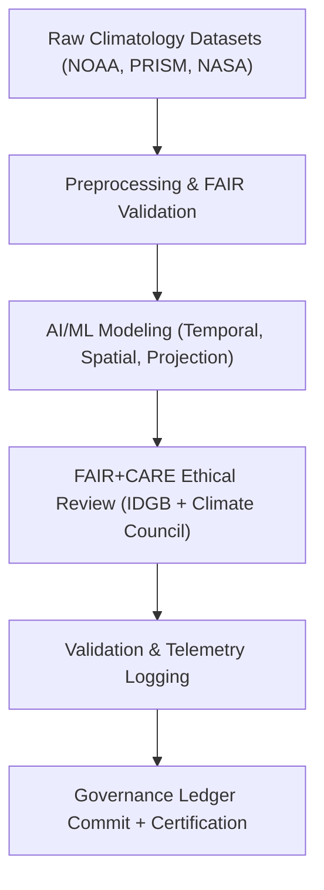

<div align="center">

# ⚖️ **Kansas Frontier Matrix — Climatology Governance & FAIR+CARE Compliance**
`docs/analyses/climatology/governance.md`

**Purpose:**  
Define the **governance, validation, and audit framework** for climatological analyses conducted under the **Kansas Frontier Matrix (KFM)**.  
This document outlines the alignment of climatology datasets, models, and reports with the **FAIR+CARE Principles**, **ISO 19115 Metadata**, and **Master Coder Protocol v6.3** reproducibility standards.

[](../../README.md)
[](../../standards/faircare.md)
[](../../../../LICENSE)
[](../../../../releases/v10.0.0/manifest.zip)

</div>

---

## 📘 Overview

The **Climatology Governance Framework** ensures all analytical workflows within this domain:
- Maintain **FAIR+CARE-certified data provenance**
- Adhere to **ISO 19115 / DCAT 3.0 metadata** standards
- Include reproducibility and ethical audits per **MCP-DL v6.3**
- Integrate **telemetry for sustainability metrics** (ISO 50001)
- Respect cultural, Indigenous, and consent-based data governance boundaries

All climatology analyses—temporal, spatial, and projection modeling—are reviewed quarterly by the **FAIR+CARE Climate Council** and cross-audited by the **Indigenous Data Governance Board (IDGB)** for ethical and cultural compliance.

---

## 🗂️ Governance Scope

| Analytical Area | Governance Council | Primary Validation Artifacts |
|-----------------|--------------------|------------------------------|
| **Temporal Modeling** | FAIR+CARE Climate Subcommittee | `temporal-modeling.md` results, validation logs |
| **Spatial Trends** | FAIR+CARE Climate Council | `spatial-trends.md` visualizations and metadata |
| **Projection Modeling** | KFM Data Governance Secretariat | AI/ML explainability reports and model cards |
| **Cross-Domain Integration** | FAIR+CARE Integration Board | STAC/DCAT metadata in `metadata/` |
| **Cultural & Ethical Oversight** | Indigenous Data Governance Board (IDGB) | Consent validation (`careConsent.status`) |

---

## 🧠 FAIR+CARE Governance Alignment

| FAIR Principle | Implementation | CARE Principle | Implementation |
|----------------|----------------|----------------|----------------|
| **Findable** | All climatology data indexed in STAC/DCAT 3.0 catalogs. | **Collective Benefit** | Supports public-access climate adaptation policy and education. |
| **Accessible** | Processed datasets available through FAIR+CARE web portal. | **Authority to Control** | All Indigenous climate records governed by IDGB consent. |
| **Interoperable** | Metadata conforms to ISO 19115 and JSON-LD. | **Responsibility** | Model documentation includes provenance and uncertainty metrics. |
| **Reusable** | Data and methods versioned and licensed for reuse. | **Ethics** | Ensures equitable and context-aware interpretation of climate data. |

---

## ⚙️ Governance Workflow



---

## 🧾 Governance Telemetry Log (Example)

```json
{
  "analysis_id": "climatology_v10",
  "datasets_used": [
    "noaa_climate_trends.nc",
    "prism_precipitation_1900_2025.nc",
    "daymet_temperature_series.csv"
  ],
  "methods": [
    "temporal-modeling.md",
    "projection-modeling.md"
  ],
  "validation": {
    "faircare_score": 97.8,
    "explainability_index": 93.5,
    "consent_verified": true
  },
  "audited_by": [
    "FAIR+CARE Climate Council",
    "Indigenous Data Governance Board"
  ],
  "timestamp": "2025-11-09T16:45:00Z"
}
```

---

## 🧩 Validation Pipelines

| Workflow | Function | Artifact |
|-----------|-----------|----------|
| `faircare-audit.yml` | Verifies dataset ethics, licensing, and consent. | `reports/faircare-validation.json` |
| `analysis-validation.yml` | Confirms reproducibility of temporal, spatial, and projection models. | `reports/analyses/reproducibility-summary.json` |
| `telemetry-export.yml` | Exports telemetry metrics for sustainability and governance tracking. | `releases/v10.0.0/focus-telemetry.json` |
| `docs-lint.yml` | Ensures governance documents follow MCP formatting. | `reports/self-validation/docs/lint_summary.json` |

---

## 📊 Governance & Validation Metrics

| Metric | Target | Verified By |
|---------|---------|--------------|
| **FAIR+CARE Compliance** | ≥ 95% | FAIR+CARE Climate Council |
| **Provenance Completeness** | 100% | Data Standards Committee |
| **Consent Verification** | 100% | IDGB |
| **Telemetry Linkage** | 100% | Governance Secretariat |
| **Accessibility Compliance** | WCAG 2.1 AA | Accessibility Council |

---

## 🧮 Audit & Review Schedule

| Review Type | Frequency | Reviewer | Deliverable |
|--------------|------------|-----------|--------------|
| FAIR+CARE Audit | Quarterly | FAIR+CARE Council | Validation JSON report |
| Provenance Review | Semi-annual | Data Standards Team | `provenance-schema.json` |
| Cultural Oversight | Continuous | IDGB | CARE compliance report |
| AI/ML Explainability Audit | Biannual | AI Oversight Board | Model card summaries |
| Energy & Carbon Audit | Quarterly | ISO 50001 Auditor | Telemetry energy ledger |

---

## 🕰️ Version History

| Version | Date | Author | Summary |
|----------|------|---------|----------|
| v10.0.0 | 2025-11-10 | FAIR+CARE Climate Council | Established governance framework for climatology analyses, including FAIR+CARE audit integration and telemetry compliance. |

---

<div align="center">

**© 2025 Kansas Frontier Matrix — CC-BY 4.0**  
Maintained under **Master Coder Protocol v6.3** · FAIR+CARE Certified · Diamond⁹ Ω / Crown∞Ω Ultimate Certified  
[⬅ Back to Climatology Index](README.md) · [Validation →](validation.md)

</div>
