<div align="center">

# 🌦️ **Kansas Frontier Matrix — Climatology Methods Overview**
`docs/analyses/climatology/methods/README.md`

**Purpose:**  
Define the **methodological architecture**, **analytical procedures**, and **telemetry-integrated validation workflows** used in KFM climatology studies.  
This directory standardizes methods for **trend analysis**, **extreme event evaluation**, **projection modeling**, and **climate–hydrology linkage**, following **FAIR+CARE** and **ISO 19115** metadata practices.

[](../../../README.md)
[](../../../../../LICENSE)
[](../../../../../docs/standards/README.md)
[](../../../../../releases/)
</div>

---

## 📘 Overview

The **Climatology Methods Module** unifies the procedures for deriving, validating, and publishing climate-related analytical outputs across Kansas.  
It establishes reproducible workflows that quantify historical trends and future projections for temperature, precipitation, and climate variability.  
All methods integrate FAIR+CARE governance, ISO-based sustainability telemetry, and MCP-DL v6.3 reproducibility protocols.

**Goals**
- Build reproducible climate trend models and projection analyses  
- Quantify uncertainty using ensemble-based validation (CMIP6, Daymet, PRISM)  
- Integrate sustainability (ISO 50001/14064) in climate computation pipelines  
- Maintain ethical transparency under FAIR+CARE Council review  

---

## 🗂️ Directory Layout

```plaintext
docs/analyses/climatology/methods/
├── README.md                                  # This document
├── temporal-modeling.md                       # Time-series analysis and anomaly detection
├── spatial-trends.md                          # Basin and raster-level spatial analyses
├── projection-modeling.md                     # Future climate scenarios and downscaling
├── validation.md                              # FAIR+CARE + ISO validation procedures
└── datasets/                                  # Supporting datasets and metadata
    ├── raw/
    ├── processed/
    ├── derived/
    └── metadata/
```

---

## 🧩 Analytical Framework

```mermaid
flowchart TD
  A["Climate Datasets (NOAA / PRISM / Daymet / CMIP6)"] --> B["Preprocessing + FAIR+CARE Validation"]
  B --> C["Temporal Analysis (Trend & Anomaly Detection)"]
  C --> D["Spatial Analysis (Interpolation & Basin Statistics)"]
  D --> E["Projection Modeling (Scenario ΔT / ΔP Computation)"]
  E --> F["Validation + ISO Telemetry Logging"]
  F --> G["Governance Ledger + FAIR+CARE Council Certification"]
```



---

## ⚙️ Core Analytical Methods

| Method | Objective | Implementation | Output |
|---------|------------|----------------|---------|
| **Mann–Kendall Test** | Detect monotonic climate trends | `pyMannKendall` | Trend slope, p-value |
| **Sen’s Slope Estimator** | Quantify rate of change per decade | `scipy.stats` | °C or mm/decade |
| **Wavelet Analysis** | Identify multi-scale oscillations (ENSO, PDO) | `pycwt` | Power spectra |
| **Extreme Value Analysis (EVA)** | Evaluate extreme temperature/precipitation events | `extremefit` | Return period estimates |
| **Kriging Interpolation** | Create continuous trend surfaces | `PyKrige` | Raster GeoTIFF (COG) |
| **Bias Correction (CMIP6)** | Adjust model outputs to observed climatology | `xclim` / `scipy.stats` | Corrected projection dataset |

---

## 🌡️ Projection Modeling Framework

| Step | Description | Input | Output |
|------|--------------|-------|---------|
| **1. Historical Baseline** | Aggregate PRISM + Daymet datasets (1980–2020) | NetCDF | `baseline.nc` |
| **2. CMIP6 Scenario Input** | Load SSP1–2.6, SSP2–4.5, SSP5–8.5 data | NetCDF | `cmip6_raw.nc` |
| **3. Bias Correction** | Quantile map bias correction using historical baseline | NetCDF | `cmip6_corrected.nc` |
| **4. Delta Computation** | Compute ΔT and ΔP relative to baseline | NetCDF | `projection_deltas.nc` |
| **5. FAIR+CARE Validation** | Audit sustainability and provenance metadata | JSON | `faircare_validation.json` |

---

## 🧮 FAIR+CARE Validation Example

```json
{
  "validation_id": "climatology-methods-2025-11-09-0065",
  "modules": [
    "Temporal Modeling",
    "Spatial Trends",
    "Projection Modeling"
  ],
  "energy_joules": 14.2,
  "carbon_gCO2e": 0.0056,
  "validation_status": "Pass",
  "qa_metrics": {
    "trend_confidence": 0.96,
    "ensemble_bias": 0.04,
    "missing_data_rate": 0.3
  },
  "auditor": "FAIR+CARE Council",
  "timestamp": "2025-11-09T14:50:00Z"
}
```

---

## ⚖️ FAIR+CARE & ISO Governance Matrix

| Principle | Implementation | Verification Source |
|------------|----------------|--------------------|
| **Findable** | Datasets and methods indexed in STAC/DCAT registries | `datasets/metadata/` |
| **Accessible** | Methods publicly documented under CC-BY | Governance Ledger |
| **Interoperable** | CSV, NetCDF, GeoTIFF, JSON-LD formats | `telemetry_schema` |
| **Reusable** | Metadata and lineage embedded in analysis outputs | `manifest_ref` |
| **Collective Benefit** | Supports statewide climate resilience and policy design | FAIR+CARE Audit |
| **Responsibility** | ISO 50001 telemetry tracks energy and emissions | `telemetry_ref` |
| **Ethics** | Projection results anonymized and reviewed for bias | FAIR+CARE Ethics Review |

---

## 🧾 Governance Ledger Example

```json
{
  "ledger_id": "climatology-methods-ledger-2025-11-09-0071",
  "component": "Climatology Methods Suite",
  "modules": [
    "Temporal Modeling",
    "Spatial Trends",
    "Projection Modeling"
  ],
  "energy_joules": 14.2,
  "carbon_gCO2e": 0.0056,
  "faircare_status": "Pass",
  "auditor": "FAIR+CARE Council",
  "timestamp": "2025-11-09T14:53:00Z"
}
```

---

## 🕰️ Version History

| Version | Date | Author | Summary |
|----------|------|--------|----------|
| v10.2.2 | 2025-11-09 | FAIR+CARE Council | Published climatology methods overview with FAIR+CARE and ISO telemetry integration. |
| v10.2.1 | 2025-11-09 | Climate Analysis Group | Added projection modeling steps and ensemble bias correction. |
| v10.2.0 | 2025-11-09 | KFM Climatology Team | Created methods directory overview aligned with hydrology documentation structure. |

---

<div align="center">

© 2025 Kansas Frontier Matrix Project  
Master Coder Protocol v6.3 · FAIR+CARE Certified · Diamond⁹ Ω / Crown∞Ω Ultimate Certified  

[Back to Climatology Overview](../README.md) · [Governance Charter](../../../../../docs/standards/governance/ROOT-GOVERNANCE.md)

</div>

