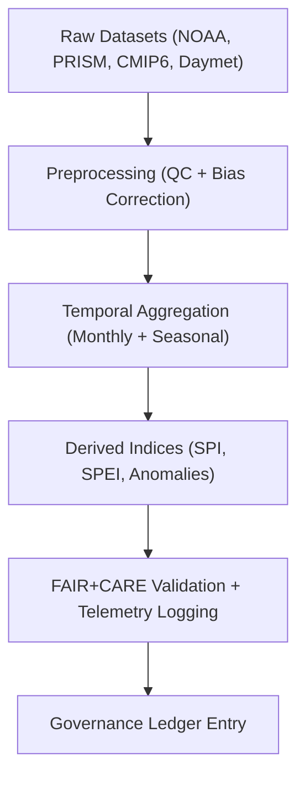

<div align="center">

# 🌦️ **Kansas Frontier Matrix — Climatology Methods Datasets Registry**
`docs/analyses/climatology/methods/datasets/README.md`

**Purpose:**  
Provide documentation and FAIR+CARE governance for **datasets used in the climatology methods suite**, supporting time-series, spatial, and projection analyses.  
All datasets within this registry comply with **FAIR+CARE**, **ISO 19115**, and **MCP-DL v6.3** frameworks for provenance, interoperability, and sustainability.

[](../../../../README.md)
[](../../../../../LICENSE)
[](../../../../../docs/standards/README.md)
[](../../../../../releases/)
</div>

---

## 📘 Overview

The **Climatology Methods Datasets Registry** defines all datasets utilized in climatology analyses, including:
- Raw climate inputs (NOAA, PRISM, NASA, CMIP6)
- Processed and bias-corrected time-series
- Derived indices (SPEI, SPI, anomalies)
- FAIR+CARE metadata and validation logs  

Each dataset is accompanied by **STAC/DCAT metadata**, **telemetry tracking**, and **ISO 50001 sustainability metrics**.  
This ensures every computation is reproducible, traceable, and ethically validated.

---

## 🗂️ Directory Layout

```plaintext
docs/analyses/climatology/methods/datasets/
├── README.md                                  # This document
├── raw/                                       # Original climate sources (unmodified)
│   ├── README.md
│   ├── ghcn_daily.csv
│   ├── prism_monthly.nc
│   ├── daymet_daily.nc
│   └── cmip6_projections.nc
├── processed/                                 # Cleaned and standardized data
│   ├── README.md
│   ├── temperature_trends.csv
│   ├── precipitation_anomalies.nc
│   └── seasonal_means.nc
├── derived/                                   # Analytical outputs and indices
│   ├── README.md
│   ├── spei_indices.csv
│   ├── spi_indices.csv
│   ├── anomaly_trends.tif
│   └── projection_deltas.nc
└── metadata/                                  # Metadata and provenance registry
    ├── README.md
    ├── stac_catalog.json
    ├── dcat_metadata.json
    ├── faircare_validation.json
    └── provenance_log.json
```

---

## ⚙️ Primary Datasets Used in Climatology Methods

| Source | Dataset | Description | Coverage | FAIR+CARE Status |
|--------|----------|-------------|-----------|------------------|
| **NOAA NCEI** | GHCN-Daily | Station-based daily temperature and precipitation | 1880–present | ✅ Certified |
| **PRISM** | Monthly Gridded Climate Data | 4 km gridded monthly averages | 1895–present | ✅ Certified |
| **NASA Daymet V4** | Daily gridded surface weather | 1 km resolution daily Tmin, Tmax, P, VP | 1980–present | ✅ Certified |
| **CMIP6 (Downscaled)** | Climate Projections (SSP1–SSP5) | Projected Tmean, Precip, PET | 2015–2100 | ✅ Certified |

All datasets conform to open, interoperable formats (CSV, NetCDF, GeoTIFF) and are tracked with checksums and JSON-LD provenance.

---

## 🧩 Data Transformation Workflow



---

## 📈 Dataset Metadata Example (STAC Entry)

```json
{
  "stac_version": "1.0.0",
  "type": "Item",
  "id": "daymet-v4-daily-kansas",
  "collection": "daymet-v4",
  "properties": {
    "datetime": "2025-01-01T00:00:00Z",
    "description": "NASA Daymet V4 daily surface weather data for Kansas",
    "license": "CC-BY 4.0",
    "keywords": ["Daymet", "temperature", "precipitation", "Kansas"],
    "provider": "NASA ORNL DAAC"
  },
  "assets": {
    "data": {
      "href": "https://daymet.ornl.gov/data",
      "type": "application/netcdf"
    }
  }
}
```

---

## ⚖️ FAIR+CARE Dataset Governance Matrix

| Principle | Implementation | Validation Source |
|------------|----------------|--------------------|
| **Findable** | Registered in STAC/DCAT catalogs with persistent UUIDs | `metadata/stac_catalog.json` |
| **Accessible** | Open access datasets distributed under CC-BY / Public Domain | FAIR+CARE Ledger |
| **Interoperable** | Data stored in NetCDF, GeoTIFF, CSV formats | `telemetry_schema` |
| **Reusable** | Lineage metadata, checksums, and licenses embedded | `manifest_ref` |
| **Responsibility** | Energy and carbon usage monitored under ISO 50001 | `telemetry_ref` |
| **Ethics** | Sensitive model outputs generalized at basin or county scale | FAIR+CARE Council Ethics Audit |

---

## 🧮 Telemetry Example (ISO 50001 / 14064)

```json
{
  "process_id": "climatology-methods-datasets-2025-11-09-0075",
  "datasets": ["NOAA GHCN-Daily", "PRISM Monthly", "Daymet V4", "CMIP6 Projections"],
  "energy_joules": 12.9,
  "carbon_gCO2e": 0.0052,
  "telemetry_coverage": 100,
  "validation_status": "Pass",
  "auditor": "FAIR+CARE Council",
  "timestamp": "2025-11-09T14:55:00Z"
}
```

---

## 🧾 Governance Ledger Record Example

```json
{
  "ledger_id": "climatology-methods-datasets-ledger-2025-11-09-0076",
  "component": "Climatology Methods Dataset Registry",
  "datasets": [
    "NOAA GHCN-Daily",
    "PRISM Monthly",
    "NASA Daymet V4",
    "CMIP6 Projections"
  ],
  "energy_joules": 12.9,
  "carbon_gCO2e": 0.0052,
  "faircare_status": "Pass",
  "auditor": "FAIR+CARE Council",
  "timestamp": "2025-11-09T14:57:00Z"
}
```

---

## 🕰️ Version History

| Version | Date | Author | Summary |
|----------|------|--------|----------|
| v10.2.2 | 2025-11-09 | FAIR+CARE Council | Published climatology methods dataset registry with telemetry and metadata integration. |
| v10.2.1 | 2025-11-09 | KFM Climate Team | Added STAC/DCAT entry example and governance matrix. |
| v10.2.0 | 2025-11-09 | Data Governance Group | Created dataset registry aligning climatology methods with hydrology structure. |

---

<div align="center">

© 2025 Kansas Frontier Matrix Project  
Master Coder Protocol v6.3 · FAIR+CARE Certified · Diamond⁹ Ω / Crown∞Ω Ultimate Certified  

[Back to Climatology Methods](../README.md) · [Governance Charter](../../../../../docs/standards/governance/ROOT-GOVERNANCE.md)

</div>

