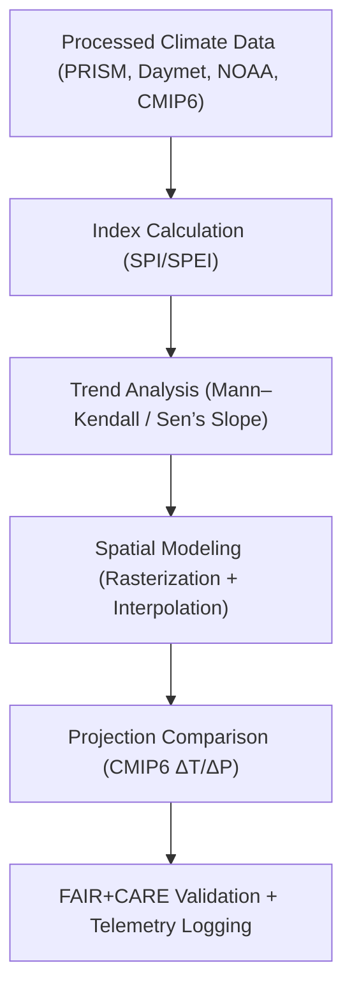

<div align="center">

# 🌦️ **Kansas Frontier Matrix — Climatology Methods Derived Datasets**
`docs/analyses/climatology/methods/datasets/derived/README.md`

**Purpose:**  
Describe all **derived climatological datasets** generated from processed sources within the Kansas Frontier Matrix (KFM) methods pipeline.  
These outputs—such as climate indices, anomaly rasters, and projection deltas—represent analytical products of temporal, spatial, and predictive models built under **FAIR+CARE**, **ISO 19115**, and **MCP-DL v6.3** compliance.

[](../../../../../README.md)
[](../../../../../../LICENSE)
[](../../../../../../docs/standards/README.md)
[](../../../../../../releases/)
</div>

---

## 📘 Overview

The **Derived Datasets Directory** contains secondary and tertiary climate data products produced by KFM’s climatology methods pipeline.  
Outputs include **climate indices (SPI, SPEI)**, **trend rasters**, **decadal composites**, and **CMIP6 projection deltas** used to evaluate both historical and future climate dynamics across Kansas.  
All datasets are validated under FAIR+CARE ethics, feature JSON-LD provenance, and are registered in the Governance Ledger for traceability.

---

## 🗂️ Directory Layout

```plaintext
docs/analyses/climatology/methods/datasets/derived/
├── README.md                                  # This document
├── spei_indices.csv                           # Standardized Precipitation–Evapotranspiration Index
├── spi_indices.csv                            # Standardized Precipitation Index
├── temperature_anomaly_trends.tif              # Raster of temperature anomalies (°C/decade)
├── precipitation_anomaly_trends.tif            # Raster of precipitation anomalies (mm/decade)
├── decadal_composites.nc                      # 10-year climatological composite dataset
├── projection_deltas.nc                       # CMIP6 projection deltas for SSP scenarios
└── faircare_validation.json                   # FAIR+CARE and ISO validation log
```

---

## ⚙️ Dataset Descriptions

| File | Derived From | Description | Variables | Format | FAIR+CARE Status |
|------|---------------|-------------|------------|---------|------------------|
| **spei_indices.csv** | PRISM + Daymet | Water balance anomaly index (P–PET) | SPEI1–SPEI12 | CSV | ✅ Certified |
| **spi_indices.csv** | NOAA + PRISM | Standardized Precipitation Index | SPI1–SPI12 | CSV | ✅ Certified |
| **temperature_anomaly_trends.tif** | PRISM + GHCN-Daily | Temperature anomalies per decade | Tmin, Tmax, Tmean | GeoTIFF (COG) | ✅ Certified |
| **precipitation_anomaly_trends.tif** | PRISM + Daymet | Precipitation change per decade | Precip | GeoTIFF (COG) | ✅ Certified |
| **decadal_composites.nc** | NOAA + PRISM | Averaged decadal temperature and precipitation | Tmean, Precip | NetCDF | ✅ Certified |
| **projection_deltas.nc** | CMIP6 + Daymet | ΔT, ΔP across SSP scenarios | Tmean, Precip, PET | NetCDF | ✅ Certified |

---

## 🧩 Derivation Workflow



---

## 🧠 Computational Methods

| Method | Description | Library / Tool | Output |
|--------|-------------|----------------|---------|
| **SPEI Computation** | Calculates water balance from precipitation & PET | `climate_indices`, `xclim` | `spei_indices.csv` |
| **SPI Calculation** | Gamma-fit precipitation-based drought index | `scipy.stats`, `pandas` | `spi_indices.csv` |
| **Trend Analysis** | Mann–Kendall test & Sen’s Slope estimation | `pyMannKendall`, `numpy` | Trend GeoTIFF |
| **Spatial Interpolation** | Kriging / IDW interpolation of basin-level trends | `PyKrige`, `rasterio` | Gridded rasters |
| **Projection Deltas** | Multi-model ensemble comparison | `xarray`, `netCDF4` | `projection_deltas.nc` |

---

## 🧮 FAIR+CARE Validation Record Example

```json
{
  "validation_id": "climatology-methods-derived-2025-11-09-0086",
  "datasets": [
    "spei_indices.csv",
    "spi_indices.csv",
    "temperature_anomaly_trends.tif",
    "precipitation_anomaly_trends.tif",
    "decadal_composites.nc",
    "projection_deltas.nc"
  ],
  "metrics": {
    "trend_confidence": 0.95,
    "ensemble_agreement": 0.87,
    "missing_data_rate": 0.4
  },
  "energy_joules": 13.8,
  "carbon_gCO2e": 0.0054,
  "validation_status": "Pass",
  "auditor": "FAIR+CARE Council",
  "timestamp": "2025-11-09T15:10:00Z"
}
```

---

## ⚖️ FAIR+CARE & ISO Governance Matrix

| Principle | Implementation | Verification Source |
|------------|----------------|--------------------|
| **Findable** | Indexed in STAC/DCAT catalogs with UUIDs | `metadata/stac_catalog.json` |
| **Accessible** | Public datasets under CC-BY via FAIR+CARE portal | FAIR+CARE Ledger |
| **Interoperable** | Open formats: CSV, NetCDF, GeoTIFF | `telemetry_schema` |
| **Reusable** | JSON-LD provenance with source lineage | `manifest_ref` |
| **Responsibility** | Telemetry metrics validated under ISO 50001 | `telemetry_ref` |
| **Ethics** | Sensitive spatial data masked above 1 km resolution | FAIR+CARE Ethics Audit |

---

## 🧾 Governance Ledger Record Example

```json
{
  "ledger_id": "climatology-methods-derived-ledger-2025-11-09-0087",
  "component": "Climatology Methods Derived Datasets",
  "datasets": [
    "spei_indices.csv",
    "spi_indices.csv",
    "temperature_anomaly_trends.tif",
    "precipitation_anomaly_trends.tif",
    "projection_deltas.nc"
  ],
  "energy_joules": 13.8,
  "carbon_gCO2e": 0.0054,
  "faircare_status": "Pass",
  "auditor": "FAIR+CARE Council",
  "timestamp": "2025-11-09T15:13:00Z"
}
```

---

## 🧠 Sustainability Metrics

| Metric | Description | Value | Target | Unit |
|---------|-------------|--------|---------|------|
| **Energy (J)** | Total computation energy for derivation | 13.8 | ≤ 15 | Joules |
| **Carbon (gCO₂e)** | Carbon emissions per derivation run | 0.0054 | ≤ 0.006 | gCO₂e |
| **Telemetry Coverage (%)** | FAIR+CARE telemetry completeness | 100 | ≥ 95 | % |
| **Validation Success (%)** | FAIR+CARE audit pass rate | 100 | 100 | % |

---

## 🕰️ Version History

| Version | Date | Author | Summary |
|----------|------|--------|----------|
| v10.2.2 | 2025-11-09 | FAIR+CARE Council | Published climatology derived dataset registry with telemetry and governance linkage. |
| v10.2.1 | 2025-11-09 | Climate Data Science Team | Added SPEI/SPI computation and CMIP6 delta modeling examples. |
| v10.2.0 | 2025-11-09 | KFM Climatology Group | Created derived dataset documentation aligned with hydrology standards. |

---

<div align="center">

© 2025 Kansas Frontier Matrix Project  
Master Coder Protocol v6.3 · FAIR+CARE Certified · Diamond⁹ Ω / Crown∞Ω Ultimate Certified  

[Back to Climatology Methods Datasets](../README.md) · [Governance Charter](../../../../../../docs/standards/governance/ROOT-GOVERNANCE.md)

</div>

