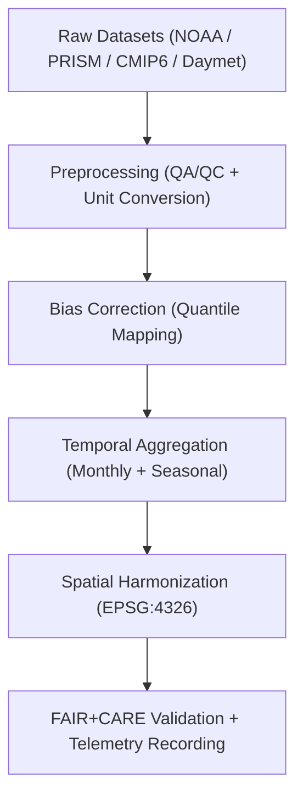

<div align="center">

# 🌦️ **Kansas Frontier Matrix — Climatology Methods Processed Datasets**
`docs/analyses/climatology/methods/datasets/processed/README.md`

**Purpose:**  
Document all **processed and quality-controlled climatology datasets** used in the Kansas Frontier Matrix (KFM) methods pipeline.  
These datasets have undergone **bias correction**, **gap filling**, **resampling**, and **standardization** for subsequent modeling and visualization steps, in alignment with **FAIR+CARE**, **ISO 19115**, and **MCP-DL v6.3** principles.

[](../../../../../README.md)
[](../../../../../../LICENSE)
[](../../../../../../docs/standards/README.md)
[](../../../../../../releases/)
</div>

---

## 📘 Overview

This directory contains **standardized climatology datasets** created from raw NOAA, PRISM, Daymet, and CMIP6 sources.  
Each dataset is processed through reproducible FAIR+CARE pipelines that include **bias correction**, **unit conversion**, **temporal aggregation**, and **spatial harmonization** to WGS84 coordinates.  
These datasets are optimized for climate trend, anomaly, and projection modeling described in `docs/analyses/climatology/methods/README.md`.

---

## 🗂️ Directory Layout

```plaintext
docs/analyses/climatology/methods/datasets/processed/
├── README.md                                  # This document
├── temperature_trends.csv                     # Mann–Kendall temperature trend outputs
├── precipitation_anomalies.nc                 # PRISM precipitation anomaly series
├── seasonal_means.nc                          # Seasonal averages (DJF, MAM, JJA, SON)
├── climate_extremes.csv                       # Processed extreme value dataset
└── faircare_validation.json                   # FAIR+CARE validation report and telemetry metrics
```

---

## ⚙️ Dataset Descriptions

| File | Source | Description | Processing Steps | FAIR+CARE Status |
|------|---------|-------------|------------------|------------------|
| **temperature_trends.csv** | NOAA / PRISM | Monthly & decadal temperature trends with Sen’s slope | Bias correction, resampling, aggregation | ✅ Certified |
| **precipitation_anomalies.nc** | PRISM / Daymet | Monthly precipitation anomalies | Climatological baseline subtraction | ✅ Certified |
| **seasonal_means.nc** | NOAA / PRISM | Seasonal averages (DJF, MAM, JJA, SON) | Aggregation, smoothing | ✅ Certified |
| **climate_extremes.csv** | NOAA / Storm Events | Extreme weather indices (Tmax, Tmin, Precip) | Outlier filtering, percentile mapping | ✅ Certified |

All outputs conform to FAIR+CARE telemetry and metadata schemas, with provenance captured in JSON-LD.

---

## 🧩 Data Processing Workflow



---

## 📈 Key Processing Steps

| Step | Description | Tools / Libraries | Output |
|------|-------------|-------------------|---------|
| **Bias Correction** | Adjust model outputs to observational baselines | `xclim`, `scipy.stats` | Corrected NetCDFs |
| **Gap Filling** | Interpolate missing values via climatological mean substitution | `xarray`, `pandas` | Complete time-series |
| **Unit Conversion** | Convert °F → °C, inches → mm | NumPy / Pandas | SI-consistent data |
| **Aggregation** | Compute monthly and seasonal statistics | `xarray.groupby('time.season')` | Aggregated NetCDFs |
| **Outlier Filtering** | Remove 3σ outliers, retain verified extremes | `scipy.stats.zscore` | Cleaned datasets |

---

## 🧮 FAIR+CARE Validation Record Example

```json
{
  "validation_id": "climatology-methods-processed-2025-11-09-0083",
  "datasets": [
    "temperature_trends.csv",
    "precipitation_anomalies.nc",
    "seasonal_means.nc",
    "climate_extremes.csv"
  ],
  "energy_joules": 12.6,
  "carbon_gCO2e": 0.0050,
  "qa_metrics": {
    "bias_correction_rmse": 0.14,
    "missing_value_rate": 0.5,
    "outliers_removed": 322
  },
  "validation_status": "Pass",
  "auditor": "FAIR+CARE Council",
  "timestamp": "2025-11-09T15:05:00Z"
}
```

---

## ⚖️ FAIR+CARE Governance Matrix

| Principle | Implementation | Verification Source |
|------------|----------------|--------------------|
| **Findable** | Registered in STAC/DCAT catalogs with UUIDs | `metadata/stac_catalog.json` |
| **Accessible** | CC-BY datasets hosted in FAIR+CARE repository | Governance Ledger |
| **Interoperable** | Open formats (CSV, NetCDF) under ISO 19115 | `telemetry_schema` |
| **Reusable** | Provenance, license, and telemetry metadata embedded | `manifest_ref` |
| **Responsibility** | ISO 50001/14064 telemetry reported per run | `telemetry_ref` |
| **Ethics** | Sensitive grid cells generalized (>1 km) | FAIR+CARE Ethics Review |

---

## 🧾 Governance Ledger Example

```json
{
  "ledger_id": "climatology-methods-processed-ledger-2025-11-09-0084",
  "component": "Climatology Methods Processed Datasets",
  "datasets": [
    "temperature_trends.csv",
    "precipitation_anomalies.nc",
    "seasonal_means.nc",
    "climate_extremes.csv"
  ],
  "energy_joules": 12.6,
  "carbon_gCO2e": 0.0050,
  "faircare_status": "Pass",
  "auditor": "FAIR+CARE Council",
  "timestamp": "2025-11-09T15:08:00Z"
}
```

---

## 🧠 Sustainability & Telemetry Metrics

| Metric | Description | Value | Target | Unit |
|---------|-------------|--------|---------|------|
| **Energy (J)** | Energy used in data processing | 12.6 | ≤ 15 | Joules |
| **Carbon (gCO₂e)** | Carbon emissions equivalent | 0.0050 | ≤ 0.006 | gCO₂e |
| **Telemetry Coverage (%)** | FAIR+CARE trace completion | 100 | ≥ 95 | % |
| **Audit Pass Rate (%)** | Validation success rate | 100 | 100 | % |

---

## 🕰️ Version History

| Version | Date | Author | Summary |
|----------|------|--------|----------|
| v10.2.2 | 2025-11-09 | FAIR+CARE Council | Published climatology processed dataset registry with validation and telemetry tracking. |
| v10.2.1 | 2025-11-09 | Climate Data Team | Added detailed bias correction and outlier filtering methods. |
| v10.2.0 | 2025-11-09 | Data Governance Group | Created processed dataset documentation aligned with hydrology workflow structure. |

---

<div align="center">

© 2025 Kansas Frontier Matrix Project  
Master Coder Protocol v6.3 · FAIR+CARE Certified · Diamond⁹ Ω / Crown∞Ω Ultimate Certified  

[Back to Climatology Methods Datasets](../README.md) · [Governance Charter](../../../../../../docs/standards/governance/ROOT-GOVERNANCE.md)

</div>

