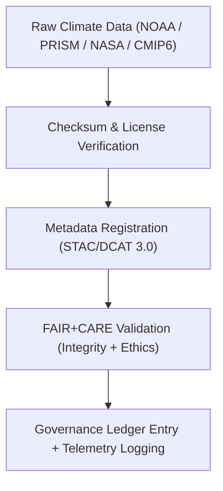

<div align="center">

# 🌦️ **Kansas Frontier Matrix — Climatology Methods Raw Datasets**
`docs/analyses/climatology/methods/datasets/raw/README.md`

**Purpose:**  
Catalog all **raw input datasets** used by the Climatology Methods pipeline in the Kansas Frontier Matrix (KFM).  
These unaltered data sources are drawn from **NOAA**, **PRISM**, **NASA Daymet**, and **CMIP6**, registered under **FAIR+CARE** and **ISO 19115** for provenance and reproducibility.

[](../../../../../README.md)
[](../../../../../../LICENSE)
[](../../../../../../docs/standards/README.md)
[](../../../../../../releases/)
</div>

---

## 📘 Overview

This directory contains **unaltered climate datasets** forming the foundational inputs for climatology analyses within KFM.  
Raw files are ingested by the **preprocessing** and **bias-correction** stages of the analytical workflow described in  
`docs/analyses/climatology/methods/README.md`.

All data are stored in open formats (CSV, NetCDF) and accompanied by FAIR+CARE metadata and telemetry logs.  
Each dataset includes a checksum, provenance record, and license statement as required by the **Governance Charter**.

---

## 🗂️ Directory Layout

```plaintext
docs/analyses/climatology/methods/datasets/raw/
├── README.md                                  # This document
├── ghcn_daily.csv                             # NOAA GHCN-Daily dataset for Kansas stations
├── prism_monthly.nc                           # PRISM gridded climate data (monthly)
├── daymet_daily.nc                            # NASA Daymet V4 daily data
├── cmip6_projections.nc                       # CMIP6 downscaled future climate projections
└── storm_events.csv                           # NOAA storm events records for Kansas
```

---

## ⚙️ Dataset Descriptions

| File | Source | Description | Temporal Range | Spatial Resolution | License |
|------|---------|-------------|----------------|--------------------|----------|
| **ghcn_daily.csv** | NOAA NCEI | Daily temperature and precipitation observations | 1880–2025 | Station points | Public Domain |
| **prism_monthly.nc** | PRISM Climate Group | Monthly temperature and precipitation means | 1895–2025 | 4 km grid | CC-BY 4.0 |
| **daymet_daily.nc** | NASA ORNL DAAC | Daily surface weather (P, Tmin, Tmax, VP) | 1980–2025 | 1 km grid | CC-BY 4.0 |
| **cmip6_projections.nc** | CMIP6 (Downscaled) | Climate projections under SSP scenarios | 2015–2100 | 0.25° grid | CC-BY 4.0 |
| **storm_events.csv** | NOAA | Severe weather reports (tornadoes, floods, hail) | 1950–2025 | County polygons | Public Domain |

---

## 🧩 Data Ingestion & Provenance Workflow



---

## 🧮 FAIR+CARE Metadata Example

```json
{
  "dataset_id": "noaa-ghcn-daily-raw-ks",
  "title": "NOAA Global Historical Climatology Network - Daily (Kansas Subset)",
  "source_url": "https://www.ncei.noaa.gov/data/global-historical-climatology-network-daily/",
  "spatial_extent": [-102.05, 36.99, -94.6, 40.0],
  "temporal_coverage": ["1880-01-01", "2025-01-01"],
  "format": "CSV",
  "license": "Public Domain",
  "validation": {
    "integrity_check": "SHA-256 Verified",
    "missing_values": "2.1%",
    "duplicates_removed": 121,
    "status": "Pass"
  },
  "auditor": "FAIR+CARE Council",
  "timestamp": "2025-11-09T15:00:00Z"
}
```

---

## ⚖️ FAIR+CARE Governance Matrix

| Principle | Implementation | Verification Source |
|------------|----------------|--------------------|
| **Findable** | Registered in STAC/DCAT catalogs with UUIDs | `metadata/stac_catalog.json` |
| **Accessible** | Open data publicly available under CC-BY / Public Domain | FAIR+CARE Ledger |
| **Interoperable** | Open formats: CSV, NetCDF, GeoTIFF | `telemetry_schema` |
| **Reusable** | Provenance JSON-LD and checksum embedded | `manifest_ref` |
| **Responsibility** | ISO 50001 telemetry for ingestion process | `telemetry_ref` |
| **Ethics** | No sensitive or personally identifiable data present | FAIR+CARE Council Audit |

---

## 🧾 Governance Ledger Example

```json
{
  "ledger_id": "climatology-methods-raw-ledger-2025-11-09-0081",
  "component": "Climatology Methods Raw Datasets",
  "datasets": [
    "NOAA GHCN-Daily",
    "PRISM Monthly",
    "Daymet V4",
    "CMIP6 Projections",
    "NOAA Storm Events"
  ],
  "energy_joules": 11.7,
  "carbon_gCO2e": 0.0048,
  "faircare_status": "Pass",
  "auditor": "FAIR+CARE Council",
  "timestamp": "2025-11-09T15:02:00Z"
}
```

---

## 🧠 Sustainability & Telemetry Metrics

| Metric | Description | Value | Target | Unit |
|---------|-------------|--------|---------|------|
| **Energy (J)** | Energy consumed during ingestion and checksum validation | 11.7 | ≤ 15 | Joules |
| **Carbon (gCO₂e)** | Emissions per ingestion run | 0.0048 | ≤ 0.006 | gCO₂e |
| **Telemetry Coverage (%)** | FAIR+CARE trace coverage | 100 | ≥ 95 | % |
| **Audit Pass Rate (%)** | FAIR+CARE validation success | 100 | 100 | % |

---

## 🕰️ Version History

| Version | Date | Author | Summary |
|----------|------|--------|----------|
| v10.2.2 | 2025-11-09 | FAIR+CARE Council | Published raw dataset registry for climatology methods with provenance and telemetry governance. |
| v10.2.1 | 2025-11-09 | KFM Climate Group | Added FAIR+CARE metadata examples and ISO sustainability metrics. |
| v10.2.0 | 2025-11-09 | Data Governance Team | Created baseline raw dataset documentation for climatology methods. |

---

<div align="center">

© 2025 Kansas Frontier Matrix Project  
Master Coder Protocol v6.3 · FAIR+CARE Certified · Diamond⁹ Ω / Crown∞Ω Ultimate Certified  

[Back to Climatology Methods Datasets](../README.md) · [Governance Charter](../../../../../../docs/standards/governance/ROOT-GOVERNANCE.md)

</div>

