<div align="center">

# 🌦️ **Kansas Frontier Matrix — Climatology Projection Modeling Methods**
`docs/analyses/climatology/methods/projection-modeling.md`

**Purpose:**  
Define the **modeling framework**, **statistical techniques**, and **sustainability validation** used for projecting Kansas climate futures within the Kansas Frontier Matrix (KFM).  
This workflow integrates **CMIP6 climate models**, **Daymet high-resolution baselines**, and **bias correction algorithms** under **FAIR+CARE** and **ISO 50001/14064** sustainability principles.

[](../../../README.md)
[](../../../../../LICENSE)
[](../../../../../docs/standards/README.md)
[](../../../../../releases/)
</div>

---

## 📘 Overview

The **Projection Modeling Framework** forecasts temperature and precipitation changes for Kansas using **downscaled CMIP6 models** (e.g., ACCESS-ESM1-5, GFDL-ESM4, UKESM1-0-LL).  
Each model is **bias-corrected** to the **Daymet** historical baseline, validated through ensemble analysis, and registered under FAIR+CARE ethical review.  
Outputs include **projection deltas (ΔTmean, ΔPrecip)**, **anomaly time-series**, and **uncertainty quantification maps**.

---

## 🗂️ Directory Layout

```plaintext
docs/analyses/climatology/methods/
├── README.md                                  # Methods overview
├── temporal-modeling.md                       # Historical time-series trend detection
├── spatial-trends.md                          # Basin-level and raster climate mapping
├── projection-modeling.md                     # This document
└── validation.md                              # FAIR+CARE validation and sustainability tracking
```

---

## 🧩 Projection Modeling Framework

```mermaid
flowchart TD
  A["CMIP6 Model Ensemble (SSP1–2.6, SSP2–4.5, SSP5–8.5)"] --> B["Bias Correction (Quantile Mapping vs Daymet)"]
  B --> C["Ensemble Mean & Spread Computation"]
  C --> D["Delta Calculation (ΔTmean, ΔPrecip)"]
  D --> E["Uncertainty Mapping (95% CI + Spatial Variance)"]
  E --> F["FAIR+CARE Validation + ISO 50001 Telemetry Logging"]
```



---

## ⚙️ Data Sources

| Source | Dataset | Coverage | Format | FAIR+CARE Status |
|---------|----------|-----------|---------|------------------|
| **CMIP6** | SSP-based Global Climate Models (ACCESS-ESM1-5, GFDL-ESM4, UKESM1-0-LL) | 2015–2100 | NetCDF | ✅ Certified |
| **Daymet V4** | Historical gridded climate baseline (temperature, precipitation) | 1980–2020 | NetCDF | ✅ Certified |
| **PRISM** | Historical climate anomaly dataset | 1895–2025 | NetCDF | ✅ Certified |

---

## 🔮 Model Steps and Algorithms

### 1️⃣ Historical Baseline
- Extract Daymet monthly temperature and precipitation for Kansas (1980–2020).  
- Aggregate into climatological normals (Tmean, Precip).  
- Define baseline climatology for all CMIP6 downscaled grids.

### 2️⃣ Bias Correction
- Apply **Quantile Mapping (QM)** and **Delta Method** corrections using historical overlaps:
```python
corrected = cmip6.quantile_transform(daymet, n_quantiles=100)
```
- Validate correction using RMSE and mean bias error (MBE).

### 3️⃣ Ensemble Computation
- Compute ensemble mean and variance for each variable and scenario.
- Identify model outliers (σ > 2 from ensemble mean).

### 4️⃣ Delta Calculation (Δ)
- Compute differences relative to baseline:
  - ΔTmean = (Future_Tmean – Baseline_Tmean)
  - ΔPrecip = (Future_Precip – Baseline_Precip)
- Store as NetCDF and GeoTIFF COG assets.

### 5️⃣ Uncertainty Quantification
- Calculate 95% confidence intervals and spatial variance maps.
- Use Monte Carlo sampling (N = 500 iterations) for robustness.

---

## 🧮 FAIR+CARE Validation Example

```json
{
  "validation_id": "climatology-projection-modeling-2025-11-09-0095",
  "models": ["ACCESS-ESM1-5", "GFDL-ESM4", "UKESM1-0-LL"],
  "scenarios": ["SSP1-2.6", "SSP2-4.5", "SSP5-8.5"],
  "metrics": {
    "rmse": 0.24,
    "mean_bias": 0.12,
    "ensemble_agreement": 0.89
  },
  "energy_joules": 15.0,
  "carbon_gCO2e": 0.0059,
  "validation_status": "Pass",
  "auditor": "FAIR+CARE Council",
  "timestamp": "2025-11-09T15:25:00Z"
}
```

---

## ⚖️ FAIR+CARE & ISO Governance Matrix

| Principle | Implementation | Verification Source |
|------------|----------------|--------------------|
| **Findable** | STAC/DCAT metadata for projection datasets with UUIDs | `datasets/metadata/` |
| **Accessible** | CMIP6 projection outputs under CC-BY license | FAIR+CARE Ledger |
| **Interoperable** | NetCDF, GeoTIFF, JSON-LD | `telemetry_schema` |
| **Reusable** | Provenance and telemetry JSON attached to each dataset | `manifest_ref` |
| **Collective Benefit** | Supports climate risk mitigation and water resource planning | FAIR+CARE Audit |
| **Responsibility** | ISO 50001 energy and ISO 14064 carbon tracking applied | `telemetry_ref` |
| **Ethics** | Spatial generalization applied to vulnerable areas | FAIR+CARE Council Review |

---

## 🧾 Governance Ledger Record Example

```json
{
  "ledger_id": "climatology-projection-ledger-2025-11-09-0096",
  "component": "Climatology Projection Modeling",
  "datasets": [
    "CMIP6 SSP2-4.5 Projections",
    "Daymet Baseline",
    "PRISM Historical Normals"
  ],
  "energy_joules": 15.0,
  "carbon_gCO2e": 0.0059,
  "faircare_status": "Pass",
  "auditor": "FAIR+CARE Council",
  "timestamp": "2025-11-09T15:27:00Z"
}
```

---

## 🧠 Sustainability Metrics

| Metric | Description | Value | Target | Unit |
|---------|-------------|--------|---------|------|
| **Energy (J)** | Energy consumed during projection computation | 15.0 | ≤ 15 | Joules |
| **Carbon (gCO₂e)** | Emissions generated per projection run | 0.0059 | ≤ 0.006 | gCO₂e |
| **Telemetry Coverage (%)** | FAIR+CARE trace completeness | 100 | ≥ 95 | % |
| **Audit Pass Rate (%)** | FAIR+CARE compliance rate | 100 | 100 | % |

---

## 🕰️ Version History

| Version | Date | Author | Summary |
|----------|------|--------|----------|
| v10.2.2 | 2025-11-09 | FAIR+CARE Council | Published projection modeling framework with ensemble validation and sustainability metrics. |
| v10.2.1 | 2025-11-09 | Climate Modeling Team | Added quantile mapping and uncertainty quantification examples. |
| v10.2.0 | 2025-11-09 | KFM Climatology Group | Created projection modeling documentation aligned with FAIR+CARE hydrology standards. |

---

<div align="center">

© 2025 Kansas Frontier Matrix Project  
Master Coder Protocol v6.3 · FAIR+CARE Certified · Diamond⁹ Ω / Crown∞Ω Ultimate Certified  

[Back to Climatology Methods](./README.md) · [Governance Charter](../../../../../docs/standards/governance/ROOT-GOVERNANCE.md)

</div>

