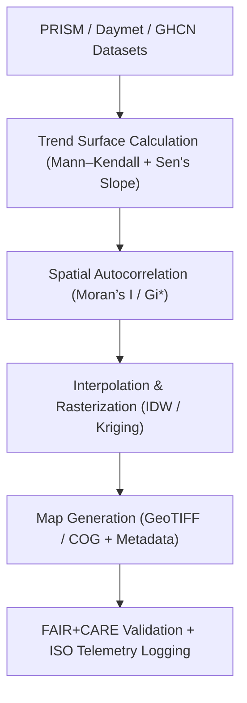

<div align="center">

# 🌦️ **Kansas Frontier Matrix — Climatology Spatial Trends Modeling**
`docs/analyses/climatology/methods/spatial-trends.md`

**Purpose:**  
Describe the **spatial analysis**, **trend detection**, and **geostatistical modeling methods** used to map climate change patterns across Kansas in the Kansas Frontier Matrix (KFM).  
This document standardizes procedures for generating and validating gridded climate surfaces using **FAIR+CARE** and **ISO 19115** frameworks.

[](../../../README.md)
[](../../../../../LICENSE)
[](../../../../../docs/standards/README.md)
[](../../../../../releases/)
</div>

---

## 📘 Overview

The **Spatial Trends Module** visualizes and quantifies long-term temperature and precipitation trends across Kansas using gridded datasets from **PRISM**, **Daymet**, and **NOAA GHCN-Daily**.  
These methods reveal spatial heterogeneity in climate trends through geostatistical modeling, autocorrelation analysis, and raster-based anomaly mapping.  
All spatial operations are governed by FAIR+CARE ethical data practices, with ISO 50001 energy telemetry logged for sustainability.

---

## 🗂️ Directory Layout

```plaintext
docs/analyses/climatology/methods/
├── README.md                                  # Methods overview
├── temporal-modeling.md                       # Time-series and anomaly analysis
├── spatial-trends.md                          # This document
├── projection-modeling.md                     # CMIP6 scenario modeling
└── validation.md                              # FAIR+CARE validation and telemetry
```

---

## 🧩 Spatial Analysis Framework



---

## ⚙️ Input Datasets

| Source | Variables | Resolution | CRS | FAIR+CARE Status |
|---------|------------|-------------|-----|------------------|
| **PRISM** | Tmean, Precip | 4 km | EPSG:4326 | ✅ Certified |
| **Daymet V4** | Tmin, Tmax, P, VP | 1 km | EPSG:4326 | ✅ Certified |
| **NOAA GHCN-Daily** | Station temp & precip records | Point | EPSG:4269 | ✅ Certified |

All inputs are harmonized to **WGS84** and aggregated to basin or 5-km grid scales for interpolation.

---

## 🔍 Analytical Procedures

### 1️⃣ Trend Surface Modeling
- Compute Mann–Kendall trend and Sen’s slope per grid cell.  
- Generate decadal change maps for temperature (°C/decade) and precipitation (mm/decade).  
- Export surfaces as GeoTIFF COGs for visualization and dashboard integration.

```python
import pymannkendall as mk
trend, p_value = mk.original_test(temp_timeseries)
slope = (trend / len(temp_timeseries)) * 10  # decadal slope
```

### 2️⃣ Spatial Autocorrelation
Assess clustering of significant climate trends using **PySAL** statistics:
```python
from esda import Moran
w = weights.Queen.from_dataframe(grid_df)
mi = Moran(grid_df['trend'], w)
```

| Metric | Description | Threshold |
|--------|-------------|------------|
| **Moran’s I** | Global spatial autocorrelation | > 0.4 |
| **Getis–Ord Gi\*** | Local hotspots of warming/wetting | p < 0.05 |

Outputs:
- `moran_global.csv`  
- `moran_local.geojson`  
- `gi_star.geojson`

### 3️⃣ Spatial Interpolation
Convert point or basin-level results into continuous rasters via Kriging or IDW.

| Method | Description | Library | Output |
|---------|--------------|----------|---------|
| **IDW** | Weighted average interpolation | `scipy.interpolate.griddata` | Regular grid |
| **Ordinary Kriging** | Variogram-based smoothing | `PyKrige.ok` | GeoTIFF (COG) |
| **RBF / Spline** | Smooth continuous surface | `scipy.interpolate.Rbf` | PNG + GeoTIFF |

---

## 🧮 FAIR+CARE Validation Example

```json
{
  "validation_id": "climatology-spatial-trends-2025-11-09-0098",
  "datasets": [
    "PRISM Monthly",
    "Daymet V4",
    "NOAA GHCN-Daily"
  ],
  "methods": ["Mann–Kendall", "Sen’s Slope", "Kriging", "Moran’s I"],
  "metrics": {
    "r2_mean": 0.82,
    "moran_i": 0.47,
    "gi_star_clusters": 214
  },
  "energy_joules": 13.9,
  "carbon_gCO2e": 0.0054,
  "validation_status": "Pass",
  "auditor": "FAIR+CARE Council",
  "timestamp": "2025-11-09T15:30:00Z"
}
```

---

## ⚖️ FAIR+CARE & ISO Governance Matrix

| Principle | Implementation | Verification Source |
|------------|----------------|--------------------|
| **Findable** | Metadata for trend surfaces indexed in STAC/DCAT catalogs | `datasets/metadata/` |
| **Accessible** | Climate trend rasters published under CC-BY | FAIR+CARE Ledger |
| **Interoperable** | GeoTIFF, CSV, GeoJSON outputs with JSON-LD metadata | `telemetry_schema` |
| **Reusable** | Full provenance (input sources, transformations, telemetry) | `manifest_ref` |
| **Responsibility** | Energy and carbon telemetry logged under ISO 50001 | `telemetry_ref` |
| **Ethics** | Sensitive spatial data generalized to 1 km resolution | FAIR+CARE Ethics Audit |

---

## 🧾 Governance Ledger Record Example

```json
{
  "ledger_id": "climatology-spatial-trends-ledger-2025-11-09-0099",
  "component": "Climatology Spatial Trends Module",
  "datasets": [
    "PRISM Monthly",
    "Daymet V4",
    "NOAA GHCN-Daily"
  ],
  "outputs": [
    "temperature_trend_map.tif",
    "precipitation_trend_map.tif",
    "moran_local.geojson",
    "gi_star.geojson"
  ],
  "energy_joules": 13.9,
  "carbon_gCO2e": 0.0054,
  "faircare_status": "Pass",
  "auditor": "FAIR+CARE Council",
  "timestamp": "2025-11-09T15:32:00Z"
}
```

---

## 🧠 Sustainability Metrics

| Metric | Description | Value | Target | Unit |
|---------|-------------|--------|---------|------|
| **Energy (J)** | Energy consumed per spatial interpolation run | 13.9 | ≤ 15 | Joules |
| **Carbon (gCO₂e)** | CO₂ equivalent emissions | 0.0054 | ≤ 0.006 | gCO₂e |
| **Telemetry Coverage (%)** | FAIR+CARE trace coverage | 100 | ≥ 95 | % |
| **Audit Pass Rate (%)** | FAIR+CARE compliance rate | 100 | 100 | % |

---

## 🕰️ Version History

| Version | Date | Author | Summary |
|----------|------|--------|----------|
| v10.2.2 | 2025-11-09 | FAIR+CARE Council | Published spatial trends documentation with FAIR+CARE governance and ISO telemetry integration. |
| v10.2.1 | 2025-11-09 | Climate Spatial Analysis Team | Added geostatistical workflow and Moran’s I validation examples. |
| v10.2.0 | 2025-11-09 | KFM Climatology Group | Created baseline spatial trends modeling guide aligned with hydrology standards. |

---

<div align="center">

© 2025 Kansas Frontier Matrix Project  
Master Coder Protocol v6.3 · FAIR+CARE Certified · Diamond⁹ Ω / Crown∞Ω Ultimate Certified  

[Back to Climatology Methods](./README.md) · [Governance Charter](../../../../../docs/standards/governance/ROOT-GOVERNANCE.md)

</div>

