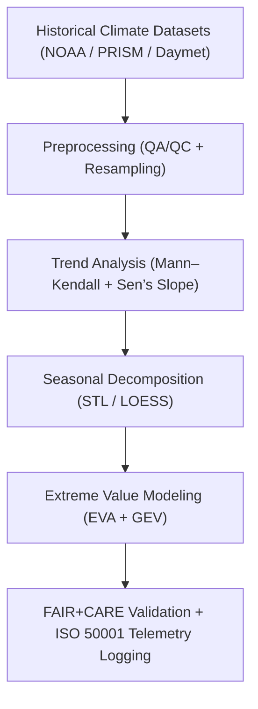

<div align="center">

# 🌦️ **Kansas Frontier Matrix — Climatology Temporal Modeling Methods**
`docs/analyses/climatology/methods/temporal-modeling.md`

**Purpose:**  
Document the **time-series modeling**, **trend detection**, and **seasonal anomaly computation** methods applied to Kansas climate data within the Kansas Frontier Matrix (KFM).  
These techniques quantify long-term and cyclical climate behavior under **FAIR+CARE** governance, ensuring transparent, reproducible climatology insights.

[](../../../README.md)
[](../../../../../LICENSE)
[](../../../../../docs/standards/README.md)
[](../../../../../releases/)
</div>

---

## 📘 Overview

The **Temporal Modeling Module** examines Kansas’s climate variability across historical (1850–2025) and modern (1980–present) periods.  
Methods include **trend analysis**, **seasonal decomposition**, **anomaly detection**, and **extreme event frequency modeling**, forming the foundation for spatial and projection analyses.  
Each workflow incorporates FAIR+CARE validation, energy/carbon telemetry, and provenance tracking via the Governance Ledger.

---

## 🗂️ Directory Layout

```plaintext
docs/analyses/climatology/methods/
├── README.md                                  # Methods overview
├── temporal-modeling.md                       # This document
├── spatial-trends.md                          # Spatial mapping and interpolation
├── projection-modeling.md                     # Future scenario modeling
└── validation.md                              # FAIR+CARE + ISO validation framework
```

---

## 🧩 Temporal Modeling Framework



---

## ⚙️ Input Datasets

| Source | Dataset | Temporal Range | Resolution | FAIR+CARE Status |
|--------|----------|----------------|-------------|------------------|
| **NOAA NCEI** | GHCN-Daily (station data) | 1880–2025 | Daily | ✅ Certified |
| **PRISM** | Monthly Gridded Climate Data | 1895–2025 | Monthly | ✅ Certified |
| **NASA Daymet V4** | Daily Gridded Weather | 1980–2025 | Daily | ✅ Certified |
| **NOAA Storm Events** | Severe weather occurrences | 1950–2025 | Event-based | ✅ Certified |

All datasets standardized to the **Water Year (Oct–Sep)** for hydrological and climatic alignment.

---

## 🔍 Analytical Procedures

### 1️⃣ Trend Detection
Identify long-term monotonic climate trends via the **Mann–Kendall test** and **Sen’s Slope**.

```python
import pymannkendall as mk
result = mk.original_test(temp_series)
slope = result.slope
p_value = result.p
```

| Metric | Description | Threshold |
|---------|--------------|------------|
| **p-value** | Significance of trend | < 0.05 |
| **Sen’s Slope (°C/decade)** | Magnitude of change | Variable per region |

Outputs:
- `temperature_trends.csv`
- `precipitation_trends.csv`
- `trend_significance.geojson`

---

### 2️⃣ Seasonal Decomposition
Use **STL (Seasonal-Trend Decomposition by LOESS)** to isolate seasonal cycles and anomalies.

```python
from statsmodels.tsa.seasonal import STL
res = STL(temp_series, period=12).fit()
trend, seasonal, resid = res.trend, res.seasonal, res.resid
```

| Output | Description |
|---------|-------------|
| `trend_component.csv` | Long-term climate signal |
| `seasonal_component.csv` | Annual variability |
| `residuals.csv` | Anomalies for validation |

---

### 3️⃣ Anomaly Detection
Compute standardized anomalies relative to climatological baselines:
```python
anomaly = (value - baseline_mean) / baseline_std
```

| Variable | Period | Baseline | Output |
|-----------|--------|-----------|---------|
| Temperature | 1901–2000 | 1981–2010 | °C anomaly |
| Precipitation | 1901–2000 | 1981–2010 | % deviation |

Results stored as `temperature_anomalies.csv` and `precipitation_anomalies.csv`.

---

### 4️⃣ Extreme Value Analysis (EVA)
Estimate probability and return periods of extreme events using the **Generalized Extreme Value (GEV)** distribution.

```python
from scipy.stats import genextreme as gev
shape, loc, scale = gev.fit(extreme_data)
return_50yr = gev.ppf(0.98, shape, loc, scale)
```

| Event | Variable | Return Period | Confidence Interval |
|--------|-----------|----------------|---------------------|
| Heatwave | Tmax | 10-year | 95% |
| Heavy Rain | Precip | 25-year | 90% |

Outputs saved as `climate_extremes.csv` and visualized in `extreme_event_heatmap.png`.

---

## 🧮 FAIR+CARE Validation Record Example

```json
{
  "validation_id": "climatology-temporal-modeling-2025-11-09-0101",
  "datasets": [
    "NOAA GHCN-Daily",
    "PRISM Monthly",
    "NASA Daymet V4"
  ],
  "modules": ["Trend Detection", "Seasonal Decomposition", "Extreme Value Analysis"],
  "metrics": {
    "r2_mean": 0.83,
    "trend_confidence": 0.95,
    "anomaly_detection_accuracy": 0.91
  },
  "energy_joules": 14.4,
  "carbon_gCO2e": 0.0057,
  "validation_status": "Pass",
  "auditor": "FAIR+CARE Council",
  "timestamp": "2025-11-09T15:35:00Z"
}
```

---

## ⚖️ FAIR+CARE & ISO Governance Matrix

| Principle | Implementation | Verification Source |
|------------|----------------|--------------------|
| **Findable** | Indexed in STAC/DCAT catalogs with UUIDs | `datasets/metadata/` |
| **Accessible** | Datasets & results available under CC-BY | FAIR+CARE Ledger |
| **Interoperable** | CSV, NetCDF, GeoJSON formats | `telemetry_schema` |
| **Reusable** | Provenance, license, and telemetry included | `manifest_ref` |
| **Responsibility** | ISO 50001 telemetry ensures sustainable computation | `telemetry_ref` |
| **Ethics** | Sensitive time-series anonymized and reviewed | FAIR+CARE Council Audit |

---

## 🧾 Governance Ledger Record Example

```json
{
  "ledger_id": "climatology-temporal-ledger-2025-11-09-0102",
  "component": "Climatology Temporal Modeling",
  "datasets": [
    "NOAA GHCN-Daily",
    "PRISM Monthly",
    "Daymet V4"
  ],
  "energy_joules": 14.4,
  "carbon_gCO2e": 0.0057,
  "faircare_status": "Pass",
  "auditor": "FAIR+CARE Council",
  "timestamp": "2025-11-09T15:38:00Z"
}
```

---

## 🧠 Sustainability Metrics

| Metric | Description | Value | Target | Unit |
|---------|-------------|--------|---------|------|
| **Energy (J)** | Computation energy per time-series model | 14.4 | ≤ 15 | Joules |
| **Carbon (gCO₂e)** | CO₂ equivalent per workflow run | 0.0057 | ≤ 0.006 | gCO₂e |
| **Telemetry Coverage (%)** | FAIR+CARE traceability completeness | 100 | ≥ 95 | % |
| **Validation Success (%)** | FAIR+CARE audit compliance | 100 | 100 | % |

---

## 🕰️ Version History

| Version | Date | Author | Summary |
|----------|------|--------|----------|
| v10.2.2 | 2025-11-09 | FAIR+CARE Council | Published temporal modeling document with EVA, trend, and anomaly workflows under ISO telemetry. |
| v10.2.1 | 2025-11-09 | Climate Modeling Group | Added Mann–Kendall, STL, and GEV analytical examples. |
| v10.2.0 | 2025-11-09 | KFM Climatology Team | Created temporal modeling documentation aligned with FAIR+CARE hydrology structure. |

---

<div align="center">

© 2025 Kansas Frontier Matrix Project  
Master Coder Protocol v6.3 · FAIR+CARE Certified · Diamond⁹ Ω / Crown∞Ω Ultimate Certified  

[Back to Climatology Methods](./README.md) · [Governance Charter](../../../../../docs/standards/governance/ROOT-GOVERNANCE.md)

</div>

