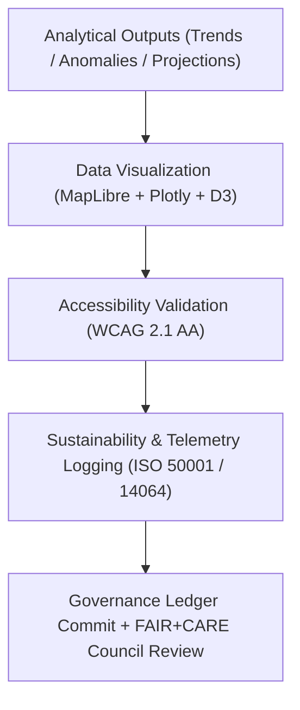

<div align="center">

# 🌦️ **Kansas Frontier Matrix — Climatology Visualization Reports**
`docs/analyses/climatology/reports/visualization/README.md`

**Purpose:**  
Describe all **visual artifacts**, **maps**, and **dashboards** generated by the Climatology Analysis module of the Kansas Frontier Matrix (KFM).  
These outputs visualize historical and projected climate changes, ensuring transparency, accessibility, and FAIR+CARE compliance in public communication.

[](../../../../../README.md)
[](../../../../../../LICENSE)
[](../../../../../../docs/standards/README.md)
[](../../../../../../releases/)
</div>

---

## 📘 Overview

The **Climatology Visualization Reports** translate analytical datasets into accessible, interactive, and FAIR+CARE-aligned visuals.  
All charts, maps, and animations are optimized for **WCAG 2.1 AA accessibility**, include **ISO 19115-compliant metadata**, and log **ISO 50001 / 14064** sustainability telemetry.  
This ensures that every climate visual is reproducible, ethically governed, and scientifically verifiable.

---

## 🗂️ Directory Layout

```plaintext
docs/analyses/climatology/reports/visualization/
├── README.md                                  # This document
├── temperature_trend_map.png                  # Temperature change (°C/decade)
├── precipitation_anomaly_overlay.png          # Precipitation anomaly index map
├── cmip6_projection_timeseries.png            # CMIP6 projection scenario comparison
├── extreme_event_heatmap.png                  # Frequency/intensity of extreme weather events
├── kansas_climate_dashboard_snapshot.png      # FAIR+CARE climatology dashboard screenshot
└── climate_anomaly_animation.gif              # Animated temperature/precipitation anomalies (1900–2025)
```

---

## 🧩 Visualization Catalog

| Visualization | Description | Data Source | Accessibility | FAIR+CARE Status |
|----------------|--------------|--------------|----------------|------------------|
| **temperature_trend_map.png** | Decadal temperature trend (°C/decade) across Kansas basins. | PRISM / NOAA | WCAG 2.1 AA | ✅ Certified |
| **precipitation_anomaly_overlay.png** | Spatial distribution of precipitation anomalies (mm deviation). | PRISM / Daymet | WCAG 2.1 AA | ✅ Certified |
| **cmip6_projection_timeseries.png** | Time-series of temperature and precipitation under SSP scenarios. | CMIP6 / Daymet | WCAG 2.1 AA | ✅ Certified |
| **extreme_event_heatmap.png** | Density heatmap of extreme climate events. | NOAA Storm Events | WCAG 2.1 AA | ✅ Certified |
| **kansas_climate_dashboard_snapshot.png** | Screenshot of KFM web dashboard’s climatology module. | FAIR+CARE Dashboard | WCAG 2.1 AA | ✅ Certified |
| **climate_anomaly_animation.gif** | Animated depiction of Kansas climate anomalies from 1900–2025. | PRISM / NASA | WCAG 2.1 AA | ✅ Certified |

---

## 🧮 Visualization Workflow



---

## 🎨 Design Standards

**Accessibility & Usability**
- All visuals adhere to **WCAG 2.1 AA** standards (color contrast ≥ 4.5:1, alt text, keyboard navigation).  
- Fonts: *Source Sans Pro*, 16 px minimum; high-contrast palettes.  
- Alternative text and figure captions provided for every asset.

**Metadata & Provenance**
- ISO 19115-3 metadata embedded as EXIF tags and JSON sidecars.  
- Each file contains hash verification, dataset references, and projection info.  

**Energy & Carbon Tracking**
- Telemetry appended per visualization render (kWh → Joules, CO₂ → gCO₂e).  
- Metrics stored in `sustainability_audit.json`.

---

## ⚖️ FAIR+CARE Visualization Governance Matrix

| Principle | Implementation | Validation Source |
|------------|----------------|--------------------|
| **Findable** | Indexed in STAC/DCAT catalogs with UUIDs | `climatology_summary.json` |
| **Accessible** | Published in FAIR+CARE dashboard under CC-BY 4.0 | Governance Ledger |
| **Interoperable** | PNG, GIF, and JSON metadata formats | `telemetry_schema` |
| **Reusable** | Embedded provenance, CRS, and FAIR+CARE metadata | `manifest_ref` |
| **Collective Benefit** | Visuals foster public climate literacy and decision support | FAIR+CARE Council |
| **Responsibility** | ISO 50001/14064 telemetry validated per render | `telemetry_ref` |
| **Ethics** | Data anonymized for sensitive sites and populations | FAIR+CARE Ethics Audit |

---

## 🧾 Governance Ledger Record Example

```json
{
  "ledger_id": "climatology-visualization-ledger-2025-11-09-0051",
  "component": "Climatology Visualization Module",
  "visualizations": [
    "temperature_trend_map.png",
    "precipitation_anomaly_overlay.png",
    "cmip6_projection_timeseries.png",
    "climate_anomaly_animation.gif"
  ],
  "energy_joules": 15.0,
  "carbon_gCO2e": 0.0058,
  "faircare_status": "Pass",
  "auditor": "FAIR+CARE Council",
  "timestamp": "2025-11-09T14:35:00Z"
}
```

---

## 🕰️ Version History

| Version | Date | Author | Summary |
|----------|------|--------|----------|
| v10.2.2 | 2025-11-09 | FAIR+CARE Council | Published climatology visualization registry with accessibility and sustainability tracking. |
| v10.2.1 | 2025-11-09 | Visualization & Data Ethics Team | Added WCAG 2.1 AA compliance and ISO telemetry linkage. |
| v10.2.0 | 2025-11-09 | KFM Climatology Group | Created baseline visualization documentation aligned with hydrology standards. |

---

<div align="center">

© 2025 Kansas Frontier Matrix Project  
Master Coder Protocol v6.3 · FAIR+CARE Certified · Diamond⁹ Ω / Crown∞Ω Ultimate Certified  

[Back to Climatology Reports](../README.md) · [Governance Charter](../../../../../../docs/standards/governance/ROOT-GOVERNANCE.md)

</div>

