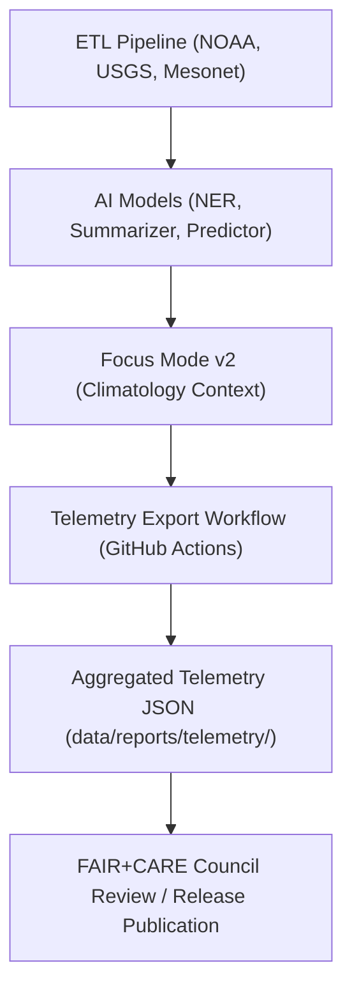

<div align="center">

# 📡 **Kansas Frontier Matrix — Climatology Telemetry Logs**  
`docs/analyses/climatology/results/telemetry-logs/README.md`

**Purpose:**  
Provide a comprehensive record of **telemetry outputs, AI inference logs, model drift metrics, and energy usage reports** generated by climatology analyses within the Kansas Frontier Matrix (KFM).  
All logs align with **FAIR+CARE governance** and **Master Coder Protocol v6.3** audit standards for scientific reproducibility and transparency.

[](../../../../../docs/standards/markdown_guide.md)
[](../../../../../LICENSE)
[](../../../../../docs/standards/faircare.md)
[](../../../../../releases/v10.2.0/manifest.zip)

</div>

---

## 📘 Overview

The **Climatology Telemetry Logs** module captures real-time and batch data on:
- AI model performance (accuracy, loss, drift detection)
- Data ingestion latency and throughput
- GPU/CPU energy metrics per job
- FAIR+CARE compliance events and ethical safeguards
- User-triggered Focus Mode climatology sessions and query traces

Telemetry ensures **traceability from raw data → AI inference → visualized output** for all climatological analyses.  
Each log is validated through the CI/CD telemetry-export workflow that aggregates and publishes metrics at every release [oai_citation:0‡Kansas Frontier Matrix — Definitive Guide to Version 10.0.pdf](file-service://file-DFJXg5kkGMH75dhGr48ysL).

---

## 🗂️ Directory Layout

```bash
results/
 ├── figures/               # Visualization outputs (trend plots, model diagnostics)
 ├── tables/                # Summaries of daily/seasonal metrics
 ├── telemetry-logs/
 │    ├── focus-telemetry.json         # AI Focus Mode interaction metrics
 │    ├── model-drift.log              # NER/summarization/climate model drift detection
 │    ├── energy-usage.csv             # Resource consumption per job (kWh)
 │    ├── inference-audit.jsonl        # JSON Lines of model predictions & validation outcomes
 │    ├── latency-profile.json         # ETL and inference latency per data source
 │    └── governance-events.log        # FAIR+CARE compliance actions (redactions, warnings)
 └── README.md
```

Each telemetry artifact is versioned under the release manifest and stored with hash verification for long-term audit compliance.

---

## 🧾 Data Sources & Collection Methods

| Telemetry Stream | Description | Frequency | Validation |
|------------------|-------------|------------|-------------|
| `focus-telemetry.json` | Records all climatology-related Focus Mode actions and model explanations | Continuous | FAIR+CARE ethical audit |
| `model-drift.log` | Tracks ML model drift against validation sets (temperature & precipitation predictions) | Weekly | CI `telemetry-export.yml` |
| `energy-usage.csv` | Logs CPU/GPU power draw (Watts) and cumulative energy use (kWh) | Per Job | SBOM energy metrics |
| `latency-profile.json` | Measures end-to-end ETL and inference latency (API response times, load durations) | Per Batch | CI latency validator |
| `governance-events.log` | Logs FAIR+CARE-triggered events (content redaction, user consent checks) | Continuous | Governance-as-Code pipeline |

All telemetry conforms to the **Telemetry Schema v3** for climate analytics defined under  
`schemas/telemetry/analyses-climatology-v3.json` [oai_citation:1‡Kansas Frontier Matrix — Definitive Guide to Version 10.0.pdf](file-service://file-DFJXg5kkGMH75dhGr48ysL).

---

## ⚙️ Workflow Integration

Telemetry data is generated through the following automated steps:



1. **ETL stage** logs extraction throughput and source latency.  
2. **AI inference** (NER, climate prediction) logs confidence scores, losses, and drift statistics.  
3. **Focus Mode v2** produces contextual summaries and appends telemetry of user interactions and explanations [oai_citation:2‡Kansas Frontier Matrix — Definitive Guide to Version 10.0.pdf](file-service://file-DFJXg5kkGMH75dhGr48ysL).  
4. **Telemetry Export** CI aggregates results into release telemetry packages.  
5. **FAIR+CARE Council** validates logs for ethical and performance compliance before tagging releases.

---

## 🧩 Analytical Use Cases

- **Drift Detection:** Identify long-term bias in climate models or data degradation.
- **Performance Benchmarking:** Compare inference times across hardware configurations.
- **Ethical Oversight:** Verify that sensitive climatological events (e.g., tribal water rights) are handled with redaction logic per FAIR+CARE.
- **Energy Optimization:** Measure computational sustainability via kWh per task.
- **Focus Mode Analytics:** Quantify which climatological entities (storms, droughts, anomalies) attract the most researcher attention.

---

## ⚖️ FAIR+CARE Compliance Summary

| Metric | Governance Tag | Description |
|--------|----------------|-------------|
| `data_ethics.flag` | `CARE-Integrity` | Ensures data privacy and tribal sovereignty respect |
| `model_audit.trace` | `FAIR-Reproducible` | Verifies provenance of model inferences |
| `telemetry.energy` | `FAIR-Sustainable` | Tracks energy usage per job |
| `focus.sensitivity` | `CARE-Transparency` | Records and mitigates potential cultural sensitivities |

Telemetry logs are auto-validated by **FAIR+CARE workflow** in the CI/CD pipeline [oai_citation:3‡Kansas Frontier Matrix — Definitive Guide to Version 10.0.pdf](file-service://file-DFJXg5kkGMH75dhGr48ysL).

---

## 🕰️ Version History

| Version | Date | Author | Summary |
|----------|------|--------|----------|
| v10.2.2 | 2025-11-11 | FAIR+CARE Council | Added real-time telemetry schema v3 and Focus Mode v2 metrics |
| v10.1.0 | 2025-09-18 | Climate Analytics Team | Introduced predictive ETL telemetry and drift detection logs |
| v9.9.0 | 2025-07-01 | AI Systems Group | Initial climatology telemetry integration (v2 schema) |

---

<div align="center">

© 2025 Kansas Frontier Matrix · Master Coder Protocol v6.3 · FAIR+CARE Certified  
Diamond⁹ Ω / Crown∞Ω Ultimate Certified  

[Back to Climatology Results](../README.md) · [Governance Charter](../../../../../docs/standards/governance/ROOT-GOVERNANCE.md)

</div>
