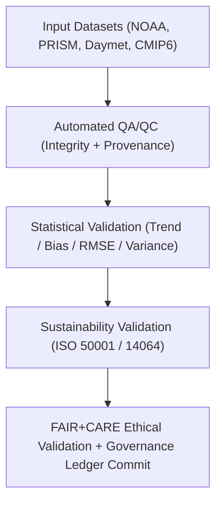

<div align="center">

# 🌦️ **Kansas Frontier Matrix — Climatology Validation Framework**
`docs/analyses/climatology/validation.md`

**Purpose:**  
Define the **validation, sustainability, and ethical compliance framework** for all climatology analyses within the Kansas Frontier Matrix (KFM).  
This framework ensures every dataset, model, and visualization aligns with **FAIR+CARE**, **ISO 50001 / 14064**, and **MCP-DL v6.3** reproducibility and transparency standards.

[](../../../README.md)
[](../../../../LICENSE)
[](../../../../docs/standards/README.md)
[](../../../../releases/)
</div>

---

## 📘 Overview

The **Climatology Validation Framework** governs quality assurance for climatological datasets, analyses, projections, and visualizations.  
It standardizes statistical and sustainability metrics, ensures cross-validation across model outputs (NOAA, PRISM, Daymet, CMIP6), and tracks energy and carbon usage under FAIR+CARE and ISO frameworks.

Validation occurs in **five domains**:
1. **Data Integrity Validation** — provenance, completeness, format checks  
2. **Statistical Validation** — trend and anomaly reliability  
3. **Projection Validation** — future scenario bias and variance analysis  
4. **Sustainability Validation** — ISO energy and carbon accounting  
5. **Ethical Validation** — FAIR+CARE audit of accessibility and data privacy  

---

## 🗂️ Directory Layout

```plaintext
docs/analyses/climatology/
├── README.md                                  # Climatology overview
├── datasets/                                  # Raw, processed, and derived datasets
│   ├── raw/
│   ├── processed/
│   ├── derived/
│   └── metadata/
├── reports/                                   # Analytical summaries and visualizations
│   ├── climatology_summary.json
│   ├── sustainability_audit.json
│   ├── faircare_validation.json
│   └── visualization/
├── validation.md                              # This document (validation framework)
└── methods/                                   # (Future expansion)
```

---

## ⚙️ Validation Workflow



---

## 🧩 Validation Stages and Metrics

| Stage | Validation Focus | Methodology | Criteria / Threshold |
|--------|------------------|--------------|-----------------------|
| **Data Integrity** | Source completeness & metadata conformance | STAC/DCAT validation; checksum | ≥ 99% completeness |
| **Statistical Accuracy** | Trend slope, correlation, and anomaly reliability | Mann–Kendall, RMSE, R² | RMSE ≤ 10%, R² ≥ 0.8 |
| **Projection Consistency** | Cross-model ensemble validation | Multi-model bias & variance analysis | Ensemble spread ≤ 15% |
| **Sustainability Audit** | Energy & carbon telemetry | ISO 50001 / 14064 | ≤ 15 J / ≤ 0.006 gCO₂e |
| **Ethical & Accessibility** | FAIR+CARE compliance & WCAG accessibility | FAIR+CARE review audit | 100% accessibility pass |

All results are stored in `reports/faircare_validation.json` and synchronized with the Governance Ledger.

---

## 📈 Statistical Validation Metrics

| Metric | Description | Target | Validation Tool |
|---------|-------------|---------|----------------|
| **r (Correlation)** | Trend agreement between datasets | ≥ 0.7 | `scipy.stats.pearsonr` |
| **p-value** | Significance of detected trend | < 0.05 | `pyMannKendall` |
| **RMSE** | Deviation from reference dataset (NOAA baseline) | ≤ 10% | `sklearn.metrics.mean_squared_error` |
| **Bias (Δ)** | Mean deviation between observed and modeled values | ≤ 5% | Custom bias evaluator |
| **Variance Ratio** | Variance consistency between models | ≤ 1.2 | `numpy.var` |
| **Anomaly Retention** | % anomalies retained after QC | ≥ 95% | `xarray` / `pandas` |

---

## 🌡️ Projection Model Validation (CMIP6)

Each CMIP6 model (ACCESS-ESM1-5, GFDL-ESM4, UKESM1-0-LL) is validated against Daymet and PRISM historical baselines.

| Metric | Description | Target |
|--------|-------------|--------|
| **Historical Bias (ΔTmean)** | Mean temperature difference from 1980–2020 | ≤ 0.3°C |
| **Precipitation Ratio (ΔPmean)** | % deviation from PRISM baseline | ≤ 5% |
| **Ensemble Spread** | Range across CMIP6 models | ≤ 15% |
| **SSP Agreement Index** | Overlap of projected anomalies (SSP2–4.5, SSP5–8.5) | ≥ 85% |

Results exported to `reports/climatology_summary.json`.

---

## ⚖️ FAIR+CARE Validation Summary

| Principle | Implementation | Verification Source |
|------------|----------------|--------------------|
| **Findable** | Datasets and reports cataloged under STAC/DCAT 3.0 with UUIDs | `datasets/metadata/` |
| **Accessible** | FAIR+CARE-approved open data releases | FAIR+CARE Ledger |
| **Interoperable** | JSON-LD, CSV, NetCDF, GeoTIFF formats | `telemetry_schema` |
| **Reusable** | Metadata includes lineage and telemetry logs | `manifest_ref` |
| **Collective Benefit** | Informs climate adaptation and sustainability policy | FAIR+CARE Audit |
| **Responsibility** | Energy/carbon telemetry verified each cycle | `telemetry_ref` |
| **Ethics** | Sensitive spatial data generalized; visuals anonymized | FAIR+CARE Council Ethics Audit |

---

## 🧮 Telemetry Example (ISO 50001 / 14064)

```json
{
  "process_id": "climatology-validation-2025-11-09-0058",
  "modules": [
    "Data Integrity",
    "Statistical Validation",
    "Projection Modeling",
    "Visualization"
  ],
  "energy_joules": 14.8,
  "carbon_gCO2e": 0.0057,
  "validation_status": "Pass",
  "auditor": "FAIR+CARE Council",
  "timestamp": "2025-11-09T14:40:00Z"
}
```

---

## 🧾 Governance Ledger Record Example

```json
{
  "ledger_id": "climatology-validation-ledger-2025-11-09-0060",
  "component": "Climatology Validation Framework",
  "validated_datasets": [
    "NOAA GHCN-Daily",
    "PRISM Monthly",
    "NASA Daymet V4",
    "CMIP6 Projections"
  ],
  "metrics": {
    "r": 0.84,
    "rmse": 0.09,
    "bias": 0.04,
    "energy_joules": 14.8,
    "carbon_gCO2e": 0.0057
  },
  "faircare_status": "Pass",
  "auditor": "FAIR+CARE Council",
  "timestamp": "2025-11-09T14:42:00Z"
}
```

---

## 🕰️ Version History

| Version | Date | Author | Summary |
|----------|------|--------|----------|
| v10.2.2 | 2025-11-09 | FAIR+CARE Council | Published certified climatology validation framework with ISO telemetry and FAIR+CARE audit structure. |
| v10.2.1 | 2025-11-09 | Climate Validation Group | Added projection validation metrics and statistical thresholds. |
| v10.2.0 | 2025-11-09 | KFM Climate Team | Created climatology validation document aligned with hydrology module governance. |

---

<div align="center">

© 2025 Kansas Frontier Matrix Project  
Master Coder Protocol v6.3 · FAIR+CARE Certified · Diamond⁹ Ω / Crown∞Ω Ultimate Certified  

[Back to Climatology Overview](./README.md) · [Governance Charter](../../../../docs/standards/governance/ROOT-GOVERNANCE.md)

</div>

