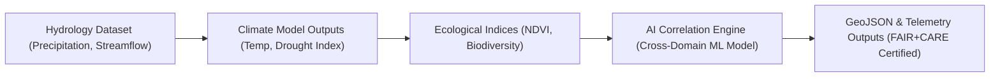

<div align="center">

# 🌐 **Kansas Frontier Matrix — Cross-Domain Analytical Framework**
`docs/analyses/cross-domain/README.md`

**Purpose:**  
Provide a unified analytical layer that integrates findings across **hydrology, climatology, ecology, geology, and historical domains** in the **Kansas Frontier Matrix (KFM)**.  
This section focuses on **multi-domain synthesis**, **AI correlation modeling**, and **FAIR+CARE-certified reproducibility** following **NASA-grade analytical workflows**.

[](../../README.md)
[](../../standards/faircare.md)
[](../../../LICENSE)
[](../../../releases/v10.0.0/manifest.zip)

</div>

---

## 📘 Overview

The **Cross-Domain Analytical Framework** connects KFM’s scientific and historical disciplines to identify complex environmental, social, and geological interactions across time.  
It supports:
- Integrated AI/ML modeling across multiple datasets.  
- FAIR+CARE-aligned ethical synthesis of data involving cultural or ecological significance.  
- Provenance-aware and reproducible pipelines built on standardized metadata schemas.  

---

## 🗂️ Directory Layout

```
docs/analyses/cross-domain/
├── README.md                             # This file
├── climate-ecology-linkages.md           # Correlations between climate trends & ecological diversity
├── hydro-geo-interactions.md             # Relationships between water systems and geologic formations
├── landuse-historical-overlaps.md        # Land cover and ownership changes through time
├── carbon-water-cycles.md                # Joint carbon & hydrologic cycle modeling
└── datasets/                             # Multi-domain input datasets
    ├── cross-domain-catalog.json
└── methods/                              # Analytical and statistical techniques
    ├── cross-correlation-analysis.md
    ├── ai-multivariate-models.md
└── results/                              # Outputs, maps, visualizations
    ├── summary-findings.md
    ├── correlation-matrix.png
```

> Each sub-analysis includes the required `datasets/`, `methods/`, and `results/` directories to maintain NASA-grade reproducibility.

---

## 🧩 Analytical Focus Areas

| Analysis | Description | Primary Data Domains |
|---|---|---|
| **Climate–Ecology Linkages** | Studies how precipitation and temperature influence biodiversity and vegetation resilience. | Climatology + Ecology |
| **Hydro–Geologic Interactions** | Explores aquifer behavior, groundwater recharge, and soil–rock dynamics. | Hydrology + Geology |
| **Land Use & Historical Overlaps** | Identifies changes in settlement, agriculture, and tribal land use over time. | Historical + Ecology + Hydrology |
| **Carbon–Water Cycles** | Integrates biogeochemical carbon flux models with watershed data. | Ecology + Hydrology + Climatology |

---

## ⚙️ Methodological Standards

All analyses under this framework follow the **Master Coder Protocol (MCP-DL v6.3)** and **FAIR+CARE Reproducibility Model**:

| Requirement | Implementation |
|---|---|
| **Structured Workflow** | Each analysis contains `datasets/`, `methods/`, and `results/` subfolders. |
| **Metadata Standardization** | All input and output datasets use STAC/DCAT-compliant metadata. |
| **Version Control** | Analytical steps logged in `analysis-index.json` and `manifest.zip`. |
| **Ethical Alignment** | Sensitive or cultural datasets undergo Indigenous Data Governance Board review. |
| **Transparency** | AI-driven correlations fully documented with model cards and validation results. |

---

## 🧠 FAIR+CARE Integration

| FAIR Principle | Application | CARE Principle | Application |
|---|---|---|---|
| **Findable** | Cross-domain datasets indexed via STAC catalog. | **Collective Benefit** | Results shared openly to support regional sustainability and heritage studies. |
| **Accessible** | Reproducible data under open-access licensing. | **Authority to Control** | Cultural and ecological data require explicit community consent. |
| **Interoperable** | Shared GeoJSON, NetCDF, and CSV formats. | **Responsibility** | Clear provenance and model explainability enforced. |
| **Reusable** | Machine-readable metadata with full lineage. | **Ethics** | Avoid misrepresentation of ecological or historical context. |

---

## 🧾 Example: Integrated Correlation Pipeline (Concept)



**Telemetry Output Example:**
```json
{
  "analysis_id": "crossdomain_hydro_geo_v10",
  "faircare_score": 97.4,
  "datasets_used": ["usgs_streamflow.csv", "noaa_climate_trends.nc", "ecoregions.geojson"],
  "explainability_index": 94.3,
  "consent_verified": true,
  "last_validated": "2025-11-09"
}
```

---

## 📊 Validation & CI Pipelines

| Workflow | Purpose | Artifact |
|---|---|---|
| `analysis-validation.yml` | Ensures reproducibility of analytical notebooks. | `reports/analyses/reproducibility-summary.json` |
| `faircare-audit.yml` | Verifies ethical dataset use and Indigenous consent compliance. | `reports/data/faircare-validation.json` |
| `ai-train.yml` | Cross-domain AI model training telemetry and governance logs. | `releases/v10.0.0/focus-telemetry.json` |
| `docs-lint.yml` | Validates structure and references across domains. | `reports/self-validation/docs/lint_summary.json` |

---

## 📈 Quality Metrics

| Metric | Target | Verified By |
|---|---|---|
| **FAIR+CARE Compliance** | ≥ 95% | Governance Council |
| **Reproducibility Validation** | 100% of pipelines re-runnable | CI Audit |
| **Interoperability** | ≥ 90% schema compatibility across domains | Data Standards Committee |
| **Ethical Consent Compliance** | 100% verified by IDGB | FAIR+CARE Council |
| **Telemetry Linkage** | All analyses linked to `focus-telemetry.json` | Automation Pipeline |

---

## 🕰️ Version History

| Version | Date | Author | Summary |
|---|---|---|---|
| v10.0.0 | 2025-11-10 | FAIR+CARE Data Integration Council | Established Cross-Domain Analytical Framework for multi-domain environmental and historical synthesis under FAIR+CARE reproducibility. |

---

<div align="center">

**© 2025 Kansas Frontier Matrix — CC-BY 4.0**  
Developed under **Master Coder Protocol v6.3** · FAIR+CARE Certified · Diamond⁹ Ω / Crown∞Ω Ultimate Certified  
[⬅ Back to Analyses Index](../README.md) · [Hydrology →](../hydrology/README.md)

</div>