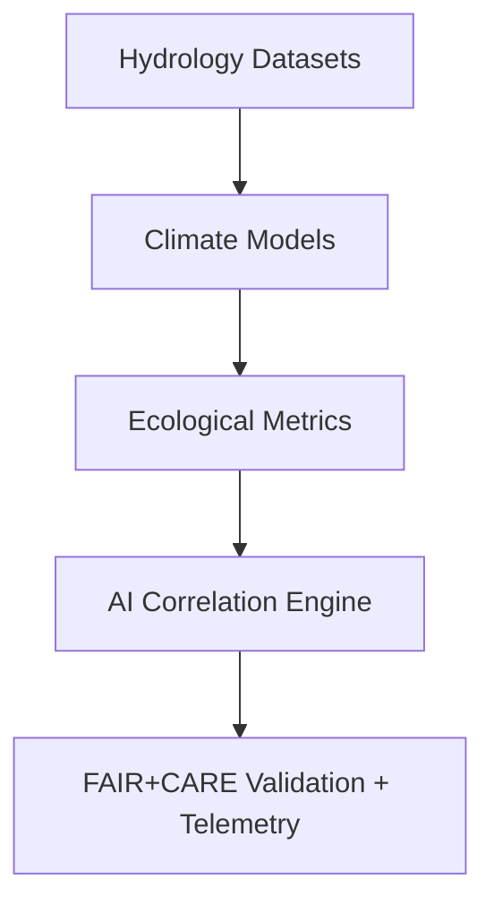

<div align="center">

# 🌐 **Kansas Frontier Matrix — Cross-Domain Analytical Framework**  
`docs/analyses/cross-domain/README.md`

**Purpose:**  
Serve as the central analytical hub integrating insights across **hydrology, climatology, ecology, geology, and historical domains** within the Kansas Frontier Matrix (KFM).  
Implements multi-domain synthesis, **AI-assisted correlation modeling**, and full **FAIR+CARE-certified reproducibility** under **Master Coder Protocol v6.3** and NASA-grade analytical standards.

[](../../README.md)
[](../../standards/faircare.md)
[](../../../LICENSE)
[](../../../releases/v10.2.0/manifest.zip)

</div>

---

## 📘 Overview

The **Cross-Domain Analytical Framework (CDAF)** provides integrated workflows and reproducible pipelines uniting environmental, geological, and socio-historical analyses across Kansas.  
It establishes:
- **AI/ML-driven pattern discovery** across interconnected domains.  
- **FAIR+CARE governance enforcement** across data ingestion, transformation, and visualization stages.  
- **Telemetry-linked provenance** ensuring full transparency for all analytical and ethical operations.

---

## 🗂️ Directory Layout

```bash
docs/analyses/cross-domain/
 ├── README.md
 ├── climate-ecology-linkages.md
 ├── hydro-geo-interactions.md
 ├── landuse-historical-overlaps.md
 ├── carbon-water-cycles.md
 ├── datasets/
 │    ├── cross-domain-catalog.json
 │    └── provenance/
 ├── methods/
 │    ├── cross-correlation-analysis.md
 │    ├── ai-multivariate-models.md
 │    └── governance.md
 ├── results/
 │    ├── summary-findings.md
 │    ├── figures/
 │    ├── tables/
 │    ├── telemetry-logs/
 │    └── governance.md
 └── governance.md
```

Each analysis subdomain maintains the canonical **datasets → methods → results** structure, guaranteeing NASA-grade reproducibility and FAIR+CARE alignment.

---

## 🧩 Analytical Focus Areas

| Focus | Objective | Primary Domains |
|--------|------------|-----------------|
| **Climate–Ecology Linkages** | Correlate climate patterns with vegetation diversity and resilience. | Climatology · Ecology |
| **Hydro–Geologic Interactions** | Model subsurface and aquifer behavior against terrain formations. | Hydrology · Geology |
| **Land Use & Historical Overlaps** | Track human-environmental transformations over time. | Historical · Ecology · Hydrology |
| **Carbon–Water Cycles** | Combine carbon flux and hydrological cycle models to assess biogeochemical interactions. | Ecology · Hydrology · Climatology |

---

## ⚙️ Methodological Standards

All analyses conform to the **Master Coder Protocol (MCP-DL v6.3)**, ensuring structured documentation, auditability, and reproducibility.

| Standard | Implementation |
|-----------|----------------|
| **Workflow Structure** | Each study includes `datasets/`, `methods/`, and `results/` with dedicated READMEs. |
| **Metadata Schema** | Uses STAC/DCAT with embedded telemetry hooks and versioned SBOM references. |
| **Reproducibility** | Automated CI/CD checks enforce reproducible runs through `analysis-validation.yml`. |
| **Governance Integration** | Indigenous and cultural data reviewed by FAIR+CARE Council and IDGB. |
| **Explainability** | All AI models accompanied by model cards and validation summaries. |

---

## 🧠 FAIR+CARE Integration

| FAIR Principle | Implementation | CARE Principle | Implementation |
|----------------|----------------|----------------|----------------|
| **Findable** | Indexed in STAC catalog with persistent IDs. | **Collective Benefit** | Supports sustainable land, water, and heritage research. |
| **Accessible** | Open-access metadata and reproducible pipelines. | **Authority to Control** | Honors Indigenous sovereignty and consent protocols. |
| **Interoperable** | Common schemas (GeoJSON, NetCDF, CSV). | **Responsibility** | Tracks model lineage and ethical review. |
| **Reusable** | Data includes machine-readable provenance. | **Ethics** | Prevents misuse or decontextualization of historical or cultural datasets. |

---

## 🧾 Integrated Correlation Workflow



**Example Telemetry JSON:**
```json
{
  "analysis_id": "crossdomain_ai_correlation_v10",
  "faircare_score": 97.8,
  "datasets": ["noaa_precip.nc", "usgs_groundwater.csv", "epa_biodiversity.geojson"],
  "model_explainability_index": 94.6,
  "bias_mitigation_status": "verified",
  "governance_reviewed": true,
  "last_audit": "2025-11-09T20:41:00Z"
}
```

---

## 📊 CI/CD Validation Pipelines

| Workflow | Function | Output Artifact |
|-----------|-----------|-----------------|
| `analysis-validation.yml` | Tests workflow reproducibility and schema alignment | `reports/analyses/reproducibility-summary.json` |
| `faircare-audit.yml` | Confirms ethical compliance and Indigenous consent validation | `reports/data/faircare-validation.json` |
| `ai-train.yml` | Logs AI model training, performance, and telemetry linkage | `releases/v10.2.0/focus-telemetry.json` |
| `governance-audit.yml` | Reviews data lineage and ethical governance compliance | `reports/governance/audit-summary.json` |

---

## 📈 Key Metrics

| Metric | Target | Verified By |
|--------|---------|-------------|
| FAIR+CARE Compliance | ≥ 95% | FAIR+CARE Council |
| Reproducibility Success | 100% | CI Validation |
| Schema Interoperability | ≥ 90% | Data Standards Committee |
| Consent Verification | 100% | IDGB / Governance Council |
| Telemetry Linkage | 100% | FAIR+CARE Automation Pipeline |

---

## 🕰️ Version History

| Version | Date | Author | Summary |
|----------|------|--------|----------|
| v10.2.2 | 2025-11-11 | FAIR+CARE Data Integration Council | Updated Cross-Domain Analytical Framework for v10.2 schema, telemetry, and governance integration. |

---

<div align="center">

© 2025 Kansas Frontier Matrix · Master Coder Protocol v6.3 · FAIR+CARE Certified  
Diamond⁹ Ω / Crown∞Ω Ultimate Certified  

[Back to Analyses Index](../README.md) · [Governance Charter](../../standards/governance/ROOT-GOVERNANCE.md)

</div>