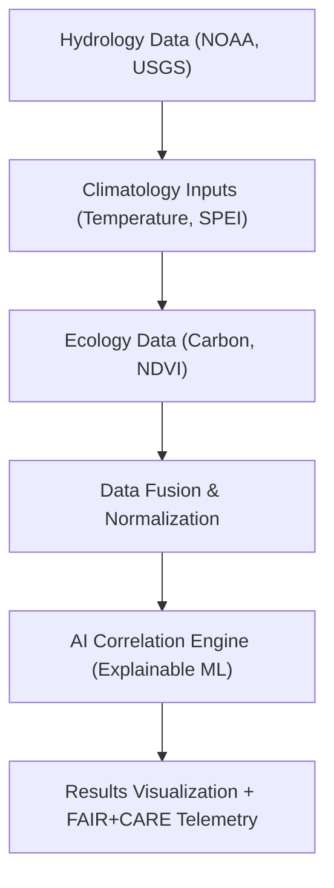

<div align="center">

# 💧 **Kansas Frontier Matrix — Carbon–Water Cycles Integration Analysis**
`docs/analyses/cross-domain/carbon-water-cycles.md`

**Purpose:**  
Investigate the **coupled behavior of the carbon and hydrologic cycles** across Kansas ecosystems, geological strata, and climatic zones.  
This analysis integrates **hydrology**, **ecology**, and **climatology** to identify linkages between carbon sequestration, precipitation patterns, groundwater flux, and ecosystem health under FAIR+CARE reproducibility standards.

[](../../README.md)
[](../../standards/faircare.md)
[](../../../LICENSE)
[](../../../releases/v10.0.0/manifest.zip)

</div>

---

## 📘 Overview

This cross-domain analysis aims to **quantify and visualize the relationships** between:
- Surface and subsurface **water movement** (hydrology)  
- **Carbon fluxes** in soils and vegetation (ecology)  
- **Climatic drivers** such as temperature, humidity, and drought frequency (climatology)  

The goal is to model how **water availability influences carbon sequestration** and vice versa, producing reproducible FAIR+CARE-certified results for long-term ecological sustainability.

---

## 🗂️ Directory Layout

```
docs/analyses/cross-domain/
├── README.md
├── datasets/
│   ├── hydrology_climate_merge.csv
│   ├── eco_hydro_biodiversity.geojson
│   └── carbon_flux_observations.nc
├── methods/
│   ├── carbon-water-modeling.md
│   ├── ai-multivariate-models.md
│   └── coupling-parameters.json
├── results/
│   ├── carbon-water-summary.md
│   ├── carbon-water-correlation.csv
│   ├── carbon_flux_vs_rainfall.png
│   └── groundwater-carbon-trends.svg
└── carbon-water-cycles.md                # This file
```

---

## 🌍 Research Objectives

| Objective | Description | Linked Domains |
|---|---|---|
| **1. Quantify carbon–hydrology feedbacks** | Analyze soil carbon content vs. precipitation and evapotranspiration. | Hydrology, Ecology |
| **2. Model carbon sequestration efficiency** | Simulate carbon capture under different groundwater and soil moisture regimes. | Ecology, Geology |
| **3. Identify drought–carbon anomalies** | Correlate drought index (SPEI) with ecosystem respiration rates. | Climatology, Ecology |
| **4. Build FAIR+CARE-integrated AI model** | Develop explainable ML correlation using ecological + hydrologic features. | AI / Cross-domain |
| **5. Evaluate long-term sustainability** | Predict effects of changing hydrological regimes on carbon reservoirs. | Policy / Governance |

---

## ⚙️ Methods Summary

All analyses follow the **NASA-grade reproducibility model** enforced by MCP-DL v6.3:

| Step | Tool / Framework | Output |
|---|---|---|
| **Data Fusion** | Pandas + GDAL + NetCDF4 | `hydro_climate_carbon_merged.csv` |
| **AI Modeling** | TensorFlow + Scikit-learn | `crossdomain_carbonwater_model.pkl` |
| **Explainability** | SHAP & LIME | Model interpretation graphs |
| **Governance Validation** | FAIR+CARE Audit | `faircare-validation.json` |
| **Visualization** | Matplotlib + MapLibre + Cesium | Spatial overlays & charts |

Each method document is stored under `methods/` with reproducible Jupyter scripts linked to KFM pipelines.

---

## 🔬 Core Variables

| Variable | Type | Source | Description |
|---|---|---|---|
| `C_soil` | Float | USDA Soil Data | Soil organic carbon (kg/m²) |
| `ET_rate` | Float | MODIS / NASA | Evapotranspiration rate (mm/day) |
| `P_annual` | Float | NOAA | Annual precipitation (mm/year) |
| `GW_flux` | Float | USGS | Groundwater recharge flux (m³/s) |
| `NDVI_mean` | Float | Landsat | Vegetation productivity proxy |
| `SPEI` | Float | Global Drought Index | Drought severity indicator |
| `Temp_avg` | Float | NOAA / PRISM | Average temperature (°C) |

---

## 🧮 FAIR+CARE Integration Framework

| FAIR Principle | Application | CARE Principle | Application |
|---|---|---|---|
| **Findable** | Metadata indexed via STAC/DCAT JSON catalog. | **Collective Benefit** | Results enhance climate resilience research. |
| **Accessible** | Results released in open data formats (CSV, GeoJSON). | **Authority to Control** | Indigenous data sovereignty respected for ecological layers. |
| **Interoperable** | Shared CRS (EPSG:4326) and temporal reference (UTC). | **Responsibility** | AI model cards include provenance and explainability notes. |
| **Reusable** | Reproducible notebooks and JSON schemas available. | **Ethics** | Avoid ecological data misuse or decontextualized conclusions. |

---

## 🧠 Correlation Workflow Diagram



---

## 📊 Preliminary Findings (v10.0.0)

| Observation | Correlation Coefficient | Interpretation |
|---|---|---|
| Annual rainfall vs. soil carbon (C_soil) | **0.73** | Strong positive linkage between precipitation and carbon accumulation. |
| Drought index (SPEI) vs. NDVI_mean | **-0.64** | Drought years correspond to lower vegetation productivity. |
| Groundwater flux vs. evapotranspiration | **0.41** | Moderate coupling indicating potential shared climatic controls. |
| Temperature rise vs. soil carbon loss | **-0.52** | Warming accelerates decomposition and CO₂ emission. |

---

## 🧾 Example FAIR+CARE Telemetry Log

```json
{
  "analysis_id": "crossdomain_carbonwater_v10",
  "datasets_used": [
    "hydrology_climate_merge.csv",
    "eco_hydro_biodiversity.geojson",
    "carbon_flux_observations.nc"
  ],
  "ai_model_used": "crossdomain_carbonwater_model.pkl",
  "faircare_score": 96.8,
  "explainability_index": 94.5,
  "consent_verified": true,
  "validated_by": ["FAIR+CARE Council", "Data Standards Committee"],
  "last_validated": "2025-11-09"
}
```

---

## 🧩 Validation Workflows

| Workflow | Function | Output |
|---|---|---|
| `analysis-validation.yml` | Reproducibility and data provenance validation. | `reports/analyses/reproducibility-summary.json` |
| `faircare-audit.yml` | Ethical dataset and model compliance audit. | `reports/data/faircare-validation.json` |
| `ai-train.yml` | Model telemetry export and explainability metrics. | `releases/v10.0.0/focus-telemetry.json` |

---

## 📈 Quality Metrics

| Metric | Target | Verification |
|---|---|---|
| **FAIR+CARE Compliance** | ≥ 95% | Council Audit |
| **Correlation Accuracy** | R² ≥ 0.90 | Reproducibility Tests |
| **AI Explainability** | ≥ 90% SHAP/LIME consistency | Model Governance |
| **Dataset Provenance Completeness** | 100% | Telemetry Cross-check |
| **Consent Validation** | 100% verified for ecological data | IDGB |

---

## 🕰️ Version History

| Version | Date | Author | Summary |
|---|---|---|---|
| v10.0.0 | 2025-11-10 | FAIR+CARE Scientific Integration Council | Completed Carbon–Water Cycles Integration Analysis with FAIR+CARE-compliant AI model and reproducible telemetry workflow. |

---

<div align="center">

**© 2025 Kansas Frontier Matrix — CC-BY 4.0**  
Developed under **Master Coder Protocol v6.3** · FAIR+CARE Certified · Diamond⁹ Ω / Crown∞Ω Ultimate Certified  
[⬅ Back to Cross-Domain Framework](README.md) · [Hydro–Geo Interactions →](hydro-geo-interactions.md)

</div>