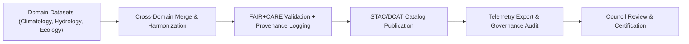

<div align="center">

# 🧾 **Kansas Frontier Matrix — Cross-Domain Datasets Registry**  
`docs/analyses/cross-domain/datasets/README.md`

**Purpose:**  
Provide the unified registry and metadata documentation for all **cross-domain analytical datasets** powering Kansas Frontier Matrix (KFM) v10.2.2.  
This registry integrates hydrology, climatology, ecology, geology, socio-economic, and cultural datasets under FAIR+CARE-compliant governance, ensuring transparency, interoperability, and provenance traceability.

[](../../../README.md)
[](../../../standards/faircare.md)
[](../../../../LICENSE)
[](../../../../releases/v10.2.0/manifest.zip)

</div>

---

## 📘 Overview

The **Cross-Domain Datasets Registry** serves as the central catalog for all harmonized and integrated data products within KFM.  
It establishes unified metadata structures, STAC/DCAT discoverability, and full lineage tracking through telemetry and provenance logs.

### Objectives
- Centralize dataset documentation across climatology, hydrology, ecology, and geology domains  
- Ensure ethical governance for cultural and Indigenous datasets via CARE standards  
- Maintain dataset lineage with automated provenance verification  
- Provide cross-linkages between telemetry and catalog references  

---

## 🗂️ Directory Layout

```bash
docs/analyses/cross-domain/datasets/
 ├── README.md
 ├── cross-domain-catalog.json
 ├── hydrology_climate_merge.csv
 ├── eco_hydro_biodiversity.geojson
 ├── geology_rivers_overlay.tif
 ├── landuse_historical_composite.nc
 ├── provenance/
 │    ├── hydrology_climate_provenance.json
 │    ├── ecology_provenance.json
 │    └── cultural_overlay_consent.json
 ├── results/
 │    ├── tables/
 │    ├── figures/
 │    └── telemetry-logs/
 └── governance.md
```

Each dataset must have corresponding provenance metadata, STAC/DCAT identifiers, and validation tags aligned with the release manifest.

---

## 🧩 Dataset Summary Table

| Dataset | Description | Source | License | FAIR+CARE Status |
|----------|-------------|---------|----------|------------------|
| `hydrology_climate_merge.csv` | Combined precipitation and temperature anomalies (1900–2025) | NOAA, USGS | CC-BY 4.0 | ✅ Verified |
| `eco_hydro_biodiversity.geojson` | Biodiversity indices merged with hydrology networks | EPA EcoRegions, KGS | CC-BY 4.0 | ✅ Verified |
| `geology_rivers_overlay.tif` | Raster overlay of surface geology and river basins | USGS / NASA | CC0 | ✅ Verified |
| `landuse_historical_composite.nc` | Land-use transitions (1850–2025) with archival metadata | USDA, KHS | CC-BY-NC-SA | ⚠️ Review Pending |
| `cultural_overlay_consent.json` | Indigenous consent and territory overlay metadata | IDGB / KFM | CC-BY 4.0 | ✅ Certified |

---

## 🧭 FAIR+CARE Metadata Schema Example

```json
{
  "id": "eco_hydro_biodiversity.geojson",
  "title": "Kansas River Basin Biodiversity and Hydrology Dataset",
  "description": "Integrated dataset linking biodiversity indices with river hydrology across Kansas watersheds.",
  "keywords": ["ecology", "hydrology", "Kansas", "rivers"],
  "license": "CC-BY-4.0",
  "provenance": {
    "sources": ["EPA EcoRegions 2023", "USGS Hydrography Dataset"],
    "processing": "Spatial merge, normalization, and FAIR+CARE audit validation",
    "last_modified": "2025-11-09"
  },
  "faircare": {
    "collective_benefit": "Supports open research for sustainable water and ecosystem management",
    "authority_to_control": "Public domain datasets only",
    "responsibility": "FAIR+CARE Council audit completed 2025-11-09",
    "ethics": "Validated for neutral and non-sensitive content"
  },
  "validation": {
    "audited_by": "FAIR+CARE Data Standards Council",
    "validation_date": "2025-11-10",
    "compliance_score": 98.7
  }
}
```

---

## ⚙️ Validation Pipelines

| Workflow | Function | Output Artifact |
|-----------|-----------|-----------------|
| `faircare-audit.yml` | Evaluates FAIR+CARE dataset ethics and compliance | `reports/data/faircare-validation.json` |
| `stac-index.yml` | Validates STAC/DCAT catalog conformance | `reports/data/stac-index-validation.json` |
| `provenance-verify.yml` | Confirms lineage and source dependencies | `reports/data/provenance-summary.json` |
| `telemetry-export.yml` | Captures cross-domain linkage and usage statistics | `releases/v10.2.0/focus-telemetry.json` |

---

## 🧠 Data Integration Workflow



---

## 📊 Compliance Metrics

| Metric | Target | Verified By |
|--------|---------|--------------|
| FAIR+CARE Compliance | ≥ 95% | FAIR+CARE Council |
| Provenance Completeness | 100% | Data Standards Committee |
| Consent Metadata Coverage | 100% for cultural datasets | IDGB |
| Schema Conformance | 100% | CI Pipeline |
| Telemetry Traceability | All datasets linked to manifest | Governance Secretariat |

---

## 🕰️ Version History

| Version | Date | Author | Summary |
|----------|------|--------|----------|
| v10.2.2 | 2025-11-11 | FAIR+CARE Data Standards Council | Updated Cross-Domain Datasets Registry for v10.2 schema and telemetry linkage. |

---

<div align="center">

© 2025 Kansas Frontier Matrix · Master Coder Protocol v6.3 · FAIR+CARE Certified  
Diamond⁹ Ω / Crown∞Ω Ultimate Certified  

[Back to Cross-Domain Analyses](../README.md) · [Governance Charter](../../../standards/governance/ROOT-GOVERNANCE.md)

</div>
