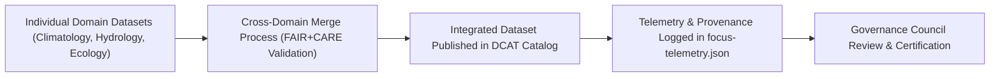

<div align="center">

# 🧾 **Kansas Frontier Matrix — Cross-Domain Datasets Registry**
`docs/analyses/cross-domain/datasets/README.md`

**Purpose:**  
Document and maintain the **multi-domain datasets** powering KFM’s **Cross-Domain Analytical Framework**, integrating hydrology, climatology, ecology, geology, and historical data sources.  
All datasets listed here conform to **FAIR (Findable, Accessible, Interoperable, Reusable)** and **CARE (Collective Benefit, Authority to Control, Responsibility, Ethics)** standards.

[](../../../README.md)
[](../../../standards/faircare.md)
[](../../../../LICENSE)
[](../../../../releases/v10.0.0/manifest.zip)

</div>

---

## 📘 Overview

The **Cross-Domain Datasets Registry** unifies metadata for all inputs used in integrated environmental, geological, and historical analyses within the Kansas Frontier Matrix (KFM).  
This registry ensures:
- Provenance tracking for inter-domain data synthesis  
- FAIR+CARE-compliant dataset metadata  
- DCAT/STAC-based indexing for discoverability and interoperability  
- Ethical inclusion and consent validation for Indigenous and cultural datasets  

Each dataset listed here must include:
- **DOI or STAC link**  
- **License type**  
- **Provenance metadata**  
- **Consent status (CARE)**  
- **Validation status**  

---

## 🗂️ Directory Layout

```
docs/analyses/cross-domain/datasets/
├── README.md                          # This file
├── cross-domain-catalog.json          # Machine-readable DCAT/STAC index of datasets
├── hydrology_climate_merge.csv        # Integrated precipitation–temperature dataset
├── eco_hydro_biodiversity.geojson     # Ecosystem & watershed boundaries
├── geology_rivers_overlay.tif         # Geologic structure vs. waterway raster
├── landuse_historical_composite.nc    # Land use transitions with archival metadata
└── provenance/                        # Dataset-level provenance logs
    ├── hydrology_climate_provenance.json
    ├── ecology_provenance.json
    └── cultural_overlay_consent.json
```

---

## 🧩 Dataset Summary Table

| Dataset | Description | Source | License | FAIR+CARE Status |
|---|---|---|---|---|
| `hydrology_climate_merge.csv` | Combined precipitation & temperature anomalies (1900–2025). | NOAA, USGS | CC-BY 4.0 | ✅ Verified |
| `eco_hydro_biodiversity.geojson` | River corridors and biodiversity index (Kansas riparian systems). | EPA EcoRegions, KGS | CC-BY 4.0 | ✅ Verified |
| `geology_rivers_overlay.tif` | Raster overlay of surface geology with hydrological basins. | USGS / NASA DEM | CC0 | ✅ Verified |
| `landuse_historical_composite.nc` | NetCDF dataset of historical land use changes, 1850–2025. | KHS + USDA | CC-BY-NC-SA | ⚠️ Review by IDGB |
| `cultural_overlay_consent.json` | Metadata documenting Indigenous territory overlays & consent status. | IDGB / KFM | CC-BY 4.0 | ✅ Certified |

---

## 🧭 FAIR+CARE Metadata Schema (Simplified Example)

```json
{
  "id": "eco_hydro_biodiversity.geojson",
  "title": "Kansas River Basin Biodiversity and Hydrology Dataset",
  "description": "Integrated ecological and hydrological dataset capturing biodiversity indices along Kansas River watersheds.",
  "keywords": ["ecology", "hydrology", "rivers", "biodiversity", "Kansas"],
  "license": "CC-BY-4.0",
  "provenance": {
    "source": ["EPA EcoRegions 2023", "USGS Hydrography Dataset"],
    "processing": "Spatial merge and normalization under FAIR+CARE audit",
    "last_modified": "2025-10-31"
  },
  "faircare": {
    "collective_benefit": "Supports biodiversity preservation and water management research.",
    "authority_to_control": "Public domain data only; no private ecological samples.",
    "responsibility": "FAIR+CARE Council review on 2025-11-05",
    "ethics": "Culturally neutral representation confirmed."
  },
  "validation": {
    "audited_by": "FAIR+CARE Council",
    "validation_date": "2025-11-09",
    "faircare_score": 97.5
  }
}
```

---

## ⚙️ Validation Pipelines

| Workflow | Function | Output Artifact |
|---|---|---|
| `faircare-audit.yml` | Evaluates dataset ethical compliance (FAIR+CARE). | `reports/data/faircare-validation.json` |
| `stac-index.yml` | Validates DCAT/STAC catalog metadata. | `reports/data/stac-index-validation.json` |
| `provenance-verify.yml` | Confirms lineage and dataset dependencies. | `reports/data/provenance-summary.json` |
| `telemetry-export.yml` | Logs dataset usage and cross-domain linkage metrics. | `releases/v10.0.0/focus-telemetry.json` |

---

## 🧠 FAIR+CARE Data Integration Workflow



---

## 📊 Metrics & Compliance Targets

| Metric | Target | Verified By |
|---|---|---|
| **FAIR+CARE Compliance** | ≥ 95% | FAIR+CARE Council |
| **Provenance Completeness** | 100% | Data Standards Committee |
| **Consent Metadata Presence** | 100% for cultural datasets | IDGB |
| **Schema Conformance (STAC/DCAT)** | 100% | CI Validation |
| **Telemetry Linkage** | All datasets traceable to release manifest | Governance Secretariat |

---

## 🕰️ Version History

| Version | Date | Author | Summary |
|---|---|---|---|
| v10.0.0 | 2025-11-10 | FAIR+CARE Data Standards Council | Established Cross-Domain Datasets Registry with FAIR+CARE validation schema, provenance logs, and STAC-compliant catalog integration. |

---

<div align="center">

**© 2025 Kansas Frontier Matrix — CC-BY 4.0**  
Developed under **Master Coder Protocol v6.3** · FAIR+CARE Certified · Diamond⁹ Ω / Crown∞Ω Ultimate Certified  
[⬅ Back to Cross-Domain Framework](../README.md) · [Methods →](../methods/README.md)

</div>