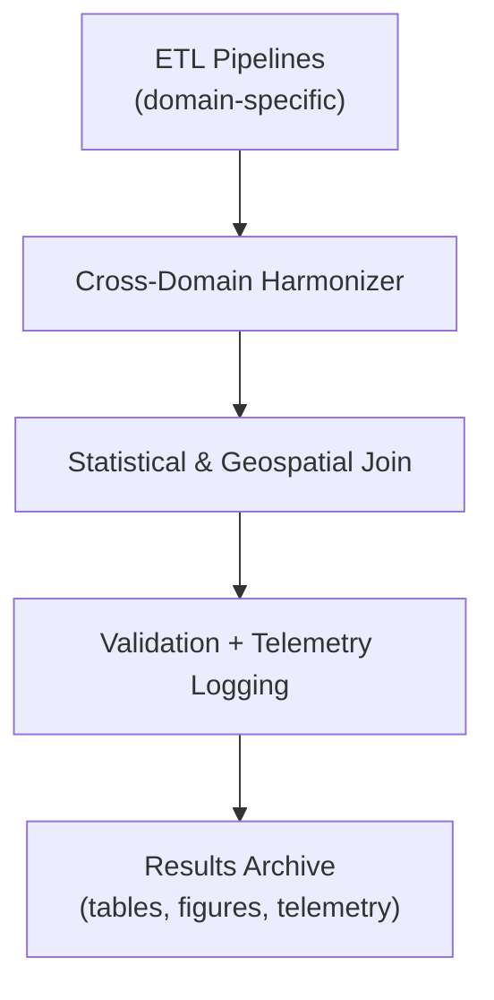

<div align="center">

# 📊 **Kansas Frontier Matrix — Cross-Domain Datasets Results**  
`docs/analyses/cross-domain/datasets/results/README.md`

**Purpose:**  
Provide structured documentation of all **cross-domain dataset integration results**, including tables, figures, and telemetry metrics, ensuring reproducibility, provenance, and FAIR+CARE compliance within Kansas Frontier Matrix (KFM) v10.2.2.

[](../../../../../docs/standards/markdown_guide.md)
[](../../../../../LICENSE)
[](../../../../../docs/standards/faircare.md)
[](../../../../../releases/v10.2.0/manifest.zip)

</div>

---

## 📘 Overview

This directory stores finalized **outputs generated from multi-domain integration workflows** connecting climatology, hydrology, ecology, and demography datasets.  
Each artifact represents harmonized data aligned to shared spatiotemporal schemas, ready for visualization or downstream AI analysis.

Results include:
- Statistical summaries and harmonization tables  
- Visual correlation figures  
- Telemetry and performance metrics for ETL and Focus Mode v2  
- Cross-validation outputs supporting integrated modeling tasks  

---

## 🗂️ Directory Layout

```bash
results/
 ├── tables/                # Cross-domain harmonized tables (.csv/.parquet)
 ├── figures/               # Graphs, correlation matrices, and visualizations
 ├── telemetry-logs/        # JSONL and CSV telemetry metrics from integration runs
 └── README.md              # This file
```

Each subfolder contains structured artifacts validated via CI (`results-validation.yml`) and referenced in the release manifest.

---

## 🧾 Data Summary

| Dataset Integration | Description | Output Format | Validation Method |
|---------------------|-------------|----------------|-------------------|
| Climatology × Hydrology | Combines precipitation & discharge data for drought correlation | CSV / Parquet | Schema conformance test |
| Ecology × Climate | Links biodiversity indices with temperature anomalies | GeoJSON / CSV | FAIR+CARE validator |
| Agriculture × Socio-Economic | Merges crop yield and census data by county/time | CSV | Governance-audit checksum |
| Temporal-Fusion | Aggregates normalized time series across all domains | NetCDF / JSON | Temporal schema alignment |

---

## ⚙️ Workflow Integration



- **ETL Pipelines:** Pull cleaned datasets from domain-specific analyses.  
- **Harmonizer:** Aligns spatial units (county grid, watershed polygons) and temporal intervals.  
- **Join Phase:** Performs multi-domain merges and computes derived metrics (e.g., drought–yield correlation).  
- **Validation:** Runs schema and checksum validation; results logged in telemetry.  
- **Archival:** Validated results are stored here and indexed in `data/stac/`.

---

## 🧩 Analytical Highlights

- Quantitative correlations between **precipitation anomalies** and **groundwater drawdown**  
- Multi-domain PCA (Principal Component Analysis) for detecting environmental–social co-variance  
- Drift detection reports comparing new harmonized datasets against prior releases  
- FAIR+CARE telemetry showing energy consumption, latency, and ethical compliance metrics  

---

## ⚖️ FAIR+CARE Metrics

| Metric | Tag | Description |
|--------|-----|-------------|
| `schema.integrity` | FAIR-Reproducible | Validates schema and ontology mappings |
| `integration.bias` | FAIR-Interoperable | Detects systemic bias introduced during harmonization |
| `telemetry.energy_kWh` | FAIR-Sustainable | Records total compute energy for harmonization |
| `ethics.flag` | CARE-Integrity | Logs corrective actions on sensitive data |

---

## 🕰️ Version History

| Version | Date | Author | Summary |
|----------|------|--------|----------|
| v10.2.2 | 2025-11-11 | FAIR+CARE Council | Initial integration of cross-domain harmonized results following telemetry schema v3 |

---

<div align="center">

© 2025 Kansas Frontier Matrix · Master Coder Protocol v6.3 · FAIR+CARE Certified  
Diamond⁹ Ω / Crown∞Ω Ultimate Certified  

[Back to Cross-Domain Datasets](../README.md) · [Governance Charter](../../../../../docs/standards/governance/ROOT-GOVERNANCE.md)

</div>
