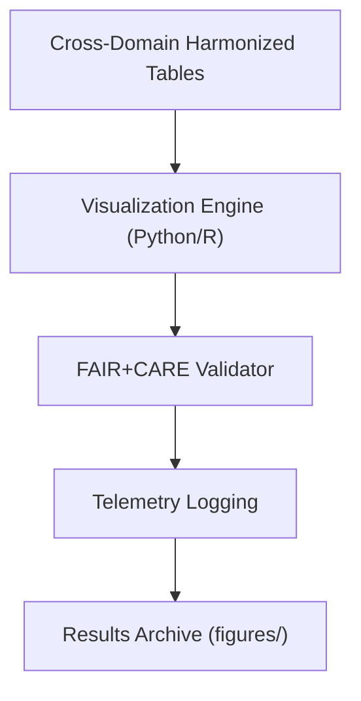

<div align="center">

# 🖼️ **Kansas Frontier Matrix — Cross-Domain Datasets Results: Figures**  
`docs/analyses/cross-domain/datasets/results/figures/README.md`

**Purpose:**  
Provide documentation for **visual outputs and analytical figures** derived from the cross-domain dataset integration workflows of Kansas Frontier Matrix (KFM).  
These figures illustrate harmonization results, statistical relationships, and validation diagnostics under full FAIR+CARE compliance and MCP-DL v6.3 governance.

[](../../../../../../docs/standards/markdown_guide.md)
[](../../../../../../LICENSE)
[](../../../../../../docs/standards/faircare.md)
[](../../../../../../releases/v10.2.0/manifest.zip)

</div>

---

## 📘 Overview

This directory archives **figure-based artifacts** generated from the integration of climatology, hydrology, ecology, and socio-economic datasets.  
Figures serve as visual validation and communication tools for researchers to analyze attribute coverage, domain correlations, temporal fusion, and spatial harmonization.

Each asset includes embedded metadata, ISO 8601 timestamps, and checksum verification hashes.  
All figures are cataloged in the STAC manifest and traceable through telemetry for full reproducibility and provenance.

---

## 🗂️ Directory Layout

```bash
figures/
 ├── metadata_coverage_heatmap.png     # Cross-domain attribute completeness visualization
 ├── domain_pair_scatterplots.pdf      # Scatter-matrix of inter-domain variable relationships
 ├── temporal_trend_comparison.svg     # Harmonized temporal series comparison
 ├── spatial_overlay_maps/             # Subfolder for vector overlays and map snapshots
 └── README.md                         # This document
```

---

## 🧾 Figure Descriptions

| File | Description | Format | Validation |
|------|--------------|---------|-------------|
| `metadata_coverage_heatmap.png` | Heatmap displaying metadata completeness and attribute overlap between domains | PNG | FAIR validator |
| `domain_pair_scatterplots.pdf` | Multipage scatterplot visualizing variable correlations across domains | PDF | Statistical audit |
| `temporal_trend_comparison.svg` | Time-series overlay illustrating multi-domain temporal trends | SVG | Temporal schema test |
| `spatial_overlay_maps/*.svg` | Spatial map layers of harmonized data across shared coordinate grids | SVG | STAC metadata check |

Each figure embeds EXIF metadata fields (`version`, `dataset_ref`, `checksum_sha256`) to guarantee traceability.

---

## ⚙️ Generation Workflow



1. **Input:** Harmonized tables from `results/tables/`  
2. **Visualization:** Scripts render figures using Matplotlib, ggplot2, or D3.js  
3. **Validation:** Each figure undergoes resolution and metadata conformance checks  
4. **Telemetry:** Generation energy and time metrics logged for sustainability audits  
5. **Archival:** Validated figures indexed in manifest and STAC catalog  

---

## 🧩 Analytical Applications

- Visualize **cross-domain metadata coverage** and harmonization gaps  
- Display **correlation matrices** across climatology, hydrology, and ecology datasets  
- Analyze **temporal change patterns** in integrated datasets  
- Produce **spatial overlays** for environmental and socio-economic intersection studies  

---

## ⚖️ FAIR+CARE Compliance Summary

| Metric | Tag | Description |
|--------|-----|-------------|
| `visual_metadata_integrity` | FAIR-Reproducible | Ensures figures contain embedded metadata and valid checksums |
| `render_energy_kWh` | FAIR-Sustainable | Logs energy used during figure generation |
| `visual_bias_score` | FAIR-Interoperable | Detects bias in figure scaling and data representation |
| `user_focus_trace` | CARE-Transparency | Tracks Focus Mode visualizations under ethical governance |

---

## 🕰️ Version History

| Version | Date | Author | Summary |
|----------|------|--------|----------|
| v10.2.2 | 2025-11-11 | Cross-Domain Visualization Council | Initial release for standardized figure documentation |

---

<div align="center">

© 2025 Kansas Frontier Matrix · Master Coder Protocol v6.3 · FAIR+CARE Certified  
Diamond⁹ Ω / Crown∞Ω Ultimate Certified  

[Back to Results](../README.md) · [Governance Charter](../../../../../../docs/standards/governance/ROOT-GOVERNANCE.md)

</div>
