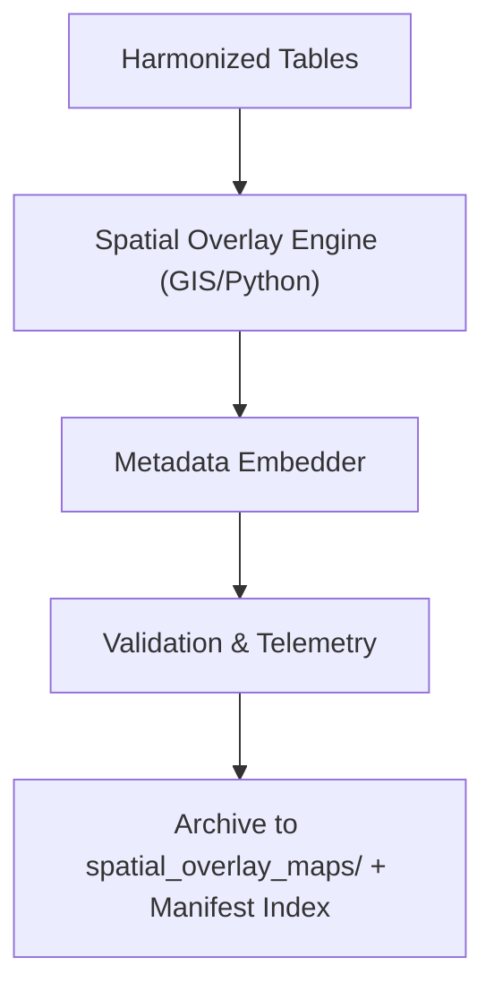

<div align="center">

# 🗺️ **Kansas Frontier Matrix — Cross-Domain Datasets Results: Figures › Spatial Overlay Maps**  
`docs/analyses/cross-domain/datasets/results/figures/spatial_overlay_maps/README.md`

**Purpose:**  
Provide documentation for spatial overlay map outputs created from multi-domain harmonized datasets within the Kansas Frontier Matrix (KFM).  
These maps visualize overlapping geographic layers (climatology, hydrology, ecology, socio-economic) under FAIR+CARE compliance and MCP-DL v6.3 governance.

[](../../../../../../../docs/standards/markdown_guide.md)
[](../../../../../../../LICENSE)
[](../../../../../../../docs/standards/faircare.md)
[](../../../../../../../releases/v10.2.0/manifest.zip)

</div>

---

## 📘 Overview

This directory stores **spatial overlay visualizations** demonstrating alignment and interaction between datasets across domains.  
Each overlay map integrates harmonized layers (e.g., precipitation vs. groundwater, biodiversity vs. temperature) and includes embedded provenance metadata, ISO 8601 timestamps, and checksum validation for reproducibility.

All figures are indexed in the STAC catalog and referenced by telemetry logs in `../../telemetry-logs/`.

---

## 🗂️ Directory Layout

```bash
spatial_overlay_maps/
 ├── overlay_precipitation_groundwater.svg     # Overlay of precipitation anomaly and groundwater decline
 ├── overlay_biodiversity_temperature.png      # Biodiversity index vs. temperature anomaly map
 ├── overlay_crop_yield_population.pdf         # Crop yield and socio-economic overlay
 └── README.md                                 # This file
```

Each file follows the naming pattern `overlay_<domain1>_<domain2>.<ext>` and includes metadata:  
`version`, `dataset_refs`, `projection`, `checksum_sha256`.

---

## 🧾 Map Descriptions

| File | Description | Format | Validation |
|------|--------------|---------|-------------|
| `overlay_precipitation_groundwater.svg` | Vector overlay of precipitation anomalies and groundwater decline regions | SVG | FAIR+CARE schema |
| `overlay_biodiversity_temperature.png` | Raster overlay map correlating biodiversity and temperature anomalies | PNG | STAC integrity check |
| `overlay_crop_yield_population.pdf` | Multi-page visualization of crop yield data vs. population distribution | PDF | Schema compliance audit |

---

## ⚙️ Generation Workflow



1. Source data harmonized across domains.  
2. GIS/Python scripts generate overlay maps using standard projections (EPSG:4326).  
3. Metadata embedder inserts version, dataset references, and checksum.  
4. FAIR+CARE validator audits spatial alignment, projection accuracy, and metadata integrity.  
5. Finalized overlays are stored and indexed.

---

## 🧩 Analytical Applications

- Assess spatial **correlation and overlap** among domain datasets.  
- Identify **integration gaps** or spatial bias across harmonized boundaries.  
- Provide high-resolution visuals for Focus Mode v2 and publications.  
- Support FAIR+CARE governance transparency through reproducible cartography.

---

## ⚖️ FAIR+CARE Compliance Summary

| Metric | Tag | Description |
|--------|-----|-------------|
| `overlay_alignment_accuracy` | FAIR-Interoperable | Ensures spatial units align across domains |
| `metadata_integrity_score` | FAIR-Reproducible | Confirms metadata embedding and checksum validity |
| `render_energy_kWh` | FAIR-Sustainable | Logs energy consumption for rendering processes |
| `map_focus_trace` | CARE-Transparency | Tracks user interactions with maps under Focus Mode |

---

## 🕰️ Version History

| Version | Date | Author | Summary |
|----------|------|--------|----------|
| v10.2.2 | 2025-11-11 | Cross-Domain Visualization Council | Initial compliant README for spatial overlay map outputs |

---

<div align="center">

© 2025 Kansas Frontier Matrix · Master Coder Protocol v6.3 · FAIR+CARE Certified  
Diamond⁹ Ω / Crown∞Ω Ultimate Certified  

[Back to Figures](../README.md) · [Governance Charter](../../../../../../../docs/standards/governance/ROOT-GOVERNANCE.md)

</div>
