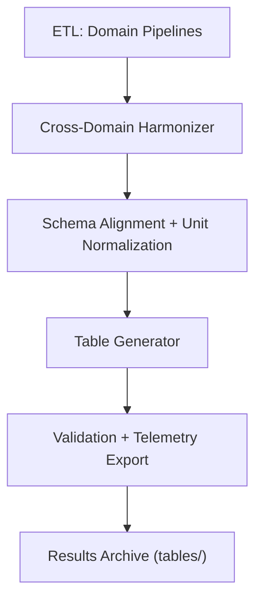

<div align="center">

# 📋 **Kansas Frontier Matrix — Cross-Domain Datasets Results: Tables**  
`docs/analyses/cross-domain/datasets/results/tables/README.md`

**Purpose:**  
Provide structured documentation for all tabular outputs produced by the **Cross-Domain Datasets Integration Workflow**, detailing harmonized metrics, correlation analyses, and validation results under FAIR+CARE compliance.

[](../../../../../../docs/standards/markdown_guide.md)
[](../../../../../../LICENSE)
[](../../../../../../docs/standards/faircare.md)
[](../../../../../../releases/v10.2.0/manifest.zip)

</div>

---

## 📘 Overview

This directory contains finalized tabular data products derived from **cross-domain harmonization** of climatology, hydrology, ecology, and socio-economic datasets.  
Each table provides quantitative summaries supporting integrative analyses, correlation modeling, and AI validation tasks within Kansas Frontier Matrix (KFM) v10.2.2.

Tables are automatically generated by the Cross-Domain ETL pipeline and validated via CI (`results-validation.yml`) to ensure reproducibility and schema conformance.

---

## 🗂️ Directory Layout

```bash
tables/
 ├── harmonised_metadata_summary.csv      # Metadata attribute coverage across domains
 ├── cross_domain_quality_metrics.parquet # Data quality and error metrics
 ├── domain_pair_correlation_table.csv    # Pairwise correlations between domain variables
 ├── temporal_fusion_summary.csv          # Multi-domain temporal aggregation summary
 └── README.md                            # This document
```

Each file includes embedded metadata (ISO 8601 timestamps, commit hash, schema version) and checksum validation against the release manifest.

---

## 🧾 Table Descriptions

| File | Description | Format | Validation |
|------|--------------|---------|-------------|
| `harmonised_metadata_summary.csv` | Attribute completeness and harmonization coverage matrix | CSV | FAIR+CARE Schema v3 |
| `cross_domain_quality_metrics.parquet` | Aggregated error, bias, and missingness statistics | Parquet | Quality metric validator |
| `domain_pair_correlation_table.csv` | Statistical correlation between domain feature pairs | CSV | Statistical audit |
| `temporal_fusion_summary.csv` | Unified time-series summary of all integrated domains | CSV | Temporal schema validator |

All tables are referenced in the STAC catalog (`data/stac/cross-domain-v10.2.2.json`) and linked to their provenance metadata under `../provenance/`.

---

## ⚙️ Generation Workflow



1. **ETL** — Imports domain-specific data (e.g., NOAA, USGS, Census).  
2. **Harmonizer** — Aligns spatial/temporal schemas.  
3. **Generator** — Produces derived statistical tables.  
4. **Validation** — Applies schema, checksum, and drift tests.  
5. **Archival** — Stores validated tables under version control and release manifest.

---

## 🧩 Analytical Applications

- Quantifying **environmental–social relationships** (e.g., drought vs population migration).  
- Benchmarking **cross-domain data quality** and model reproducibility.  
- Supporting Focus Mode v2 summaries and AI correlation modules.  
- Providing standardized CSV/Parquet exports for external FAIR+CARE repositories.

---

## ⚖️ FAIR+CARE Compliance Summary

| Metric | Tag | Description |
|--------|-----|-------------|
| `metadata_coverage_pct` | FAIR-Accessible | Percentage of attributes retained post-harmonization |
| `integration_bias_index` | FAIR-Interoperable | Quantified bias introduced during merging |
| `table_generation_energy_kWh` | FAIR-Sustainable | Energy cost of harmonization jobs |
| `validation_audit_trace` | CARE-Transparency | Verifiable lineage of generation and schema validation |

---

## 🕰️ Version History

| Version | Date | Author | Summary |
|----------|------|--------|----------|
| v10.2.2 | 2025-11-11 | Cross-Domain Integration Council | Initial standardized README for cross-domain tables under schema v3 |

---

<div align="center">

© 2025 Kansas Frontier Matrix · Master Coder Protocol v6.3 · FAIR+CARE Certified  
Diamond⁹ Ω / Crown∞Ω Ultimate Certified  

[Back to Results](../README.md) · [Governance Charter](../../../../../../docs/standards/governance/ROOT-GOVERNANCE.md)

</div>
